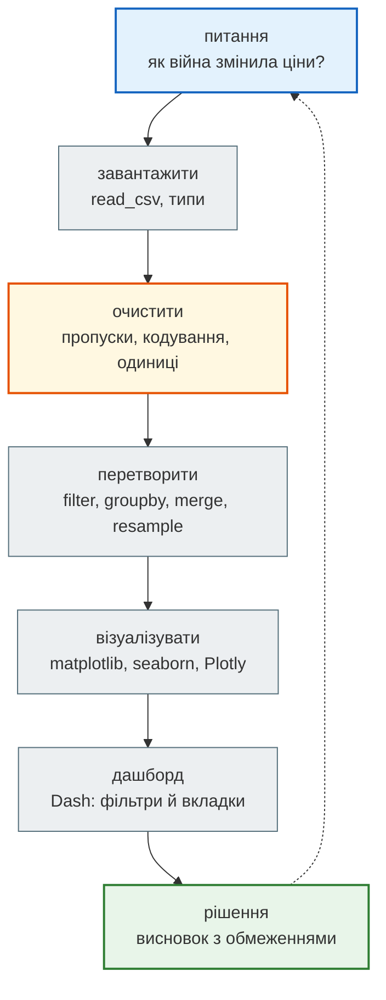
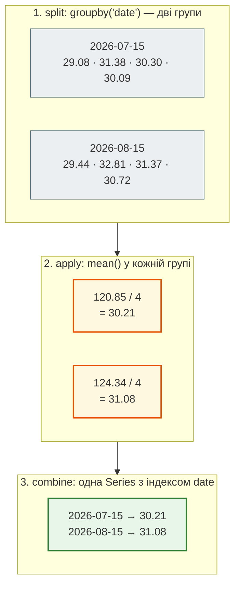
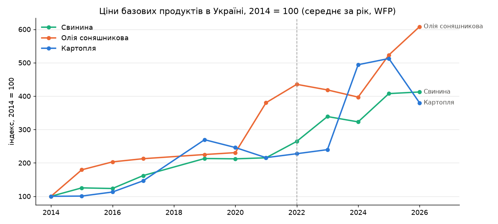
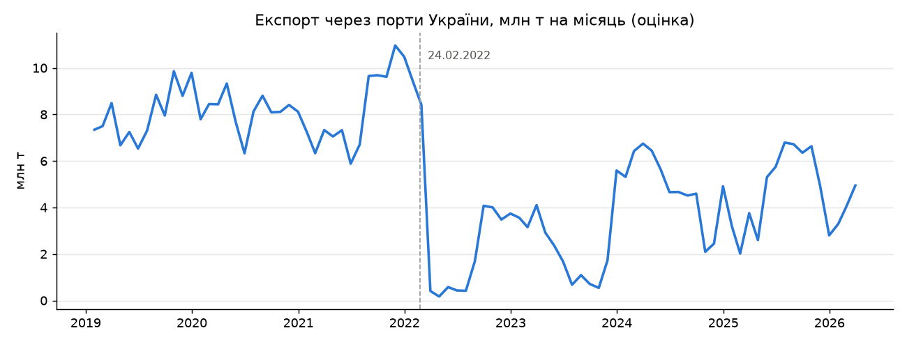
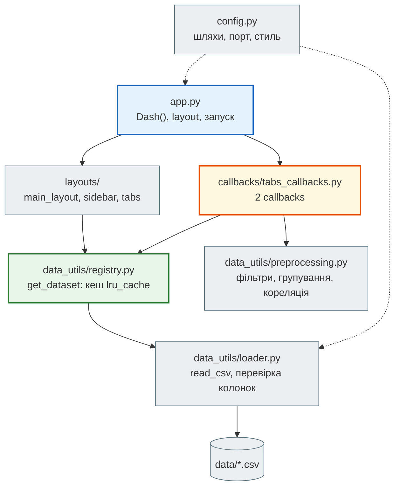
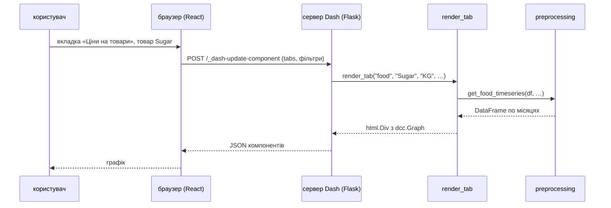
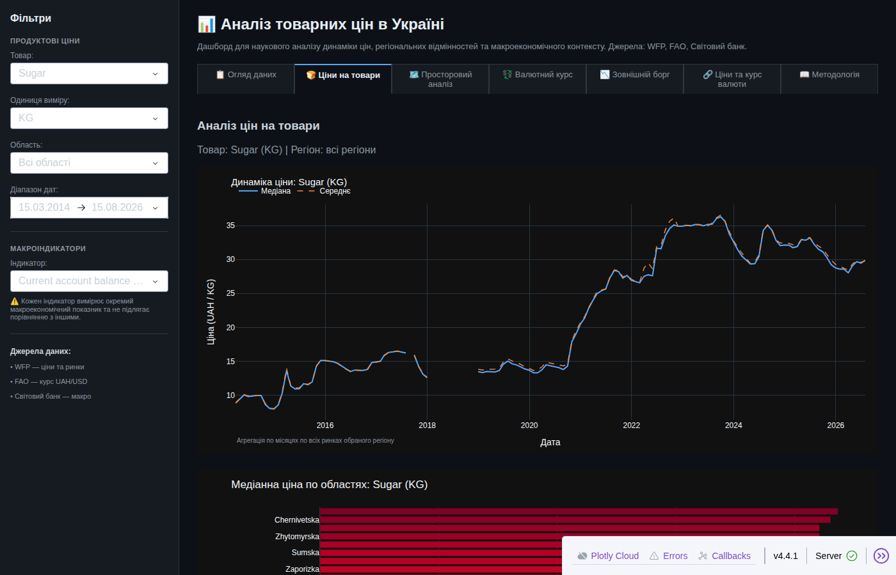
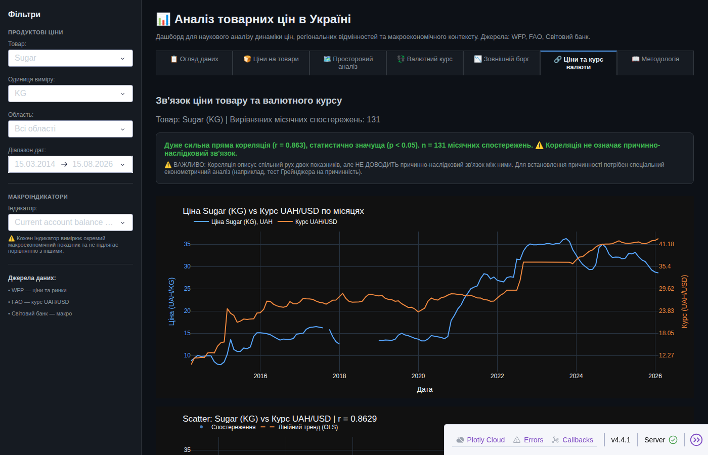

# Бонус. Pandas: аналіз даних, графіки і Dash

Python сьогодні — насамперед **data science**: більшість вакансій і задач, де його обирають, — це аналіз даних, графіки, дашборди й машинне навчання. Тому модуль 3 відкривається бонусним уроком (поза нумерацією 1–52): до того як класти дані в базу (уроки 29–30), навчимося їх **розуміти**.

Урок — на справжніх даних про Україну: ціни на продукти WFP за 2014–2026 роки (112 тис. записів по 27 ринках — обласних центрах і Києву), курс гривні, зовнішній борг, показники Світового банку, зарплати Держстату, щоденна робота портів і ціни у 71 країні. Код — зі старого курсу: три ноутбуки й Dash-застосунок; до них — четвертий ноутбук на додаткових датасетах.

| Крок | Матеріал | Що вчимо |
|---|---|---|
| 1 | [`note_bonus_pandas_foundation.ipynb`](https://github.com/NikoriakViktot/PY-Course-Victor-Nikoriak-22-09-2026/blob/main/module_3/bonus/pandas_data_analysis/note_bonus_pandas_foundation.ipynb) [](https://colab.research.google.com/github/NikoriakViktot/PY-Course-Victor-Nikoriak-22-09-2026/blob/main/module_3/bonus/pandas_data_analysis/note_bonus_pandas_foundation.ipynb) | DataFrame, типи й пам'ять, `read_csv`, `loc`/`query`, `groupby`, дати й `resample`, `merge`/`concat` |
| 2 | [`note_bonus_matplotlib.ipynb`](https://github.com/NikoriakViktot/PY-Course-Victor-Nikoriak-22-09-2026/blob/main/module_3/bonus/pandas_data_analysis/note_bonus_matplotlib.ipynb) [](https://colab.research.google.com/github/NikoriakViktot/PY-Course-Victor-Nikoriak-22-09-2026/blob/main/module_3/bonus/pandas_data_analysis/note_bonus_matplotlib.ipynb) | Figure і Axes, line / bar / histogram, subplots, стилі |
| 3 | [`note_bonus_seaborn_plotly.ipynb`](https://github.com/NikoriakViktot/PY-Course-Victor-Nikoriak-22-09-2026/blob/main/module_3/bonus/pandas_data_analysis/note_bonus_seaborn_plotly.ipynb) [](https://colab.research.google.com/github/NikoriakViktot/PY-Course-Victor-Nikoriak-22-09-2026/blob/main/module_3/bonus/pandas_data_analysis/note_bonus_seaborn_plotly.ipynb) | boxplot, heatmap кореляцій, pairplot «курс ↔ ціни», злам 2022 року, інтерактивний Plotly |
| 4 | [`note_bonus_extra_datasets.ipynb`](https://github.com/NikoriakViktot/PY-Course-Victor-Nikoriak-22-09-2026/blob/main/module_3/bonus/pandas_data_analysis/note_bonus_extra_datasets.ipynb) [](https://colab.research.google.com/github/NikoriakViktot/PY-Course-Victor-Nikoriak-22-09-2026/blob/main/module_3/bonus/pandas_data_analysis/note_bonus_extra_datasets.ipynb) | «брудний» CSV Держстату, зарплата проти хліба, `pivot`, порти й `resample`, ціни у світі |
| 5 | [`dash_API/`](https://github.com/NikoriakViktot/PY-Course-Victor-Nikoriak-22-09-2026/tree/main/module_3/bonus/pandas_data_analysis/dash_API) | дашборд на Dash: 7 вкладок, фільтри, карта ринків, кореляції |

Теорія — у двох довідниках, перенесених зі старого курсу: [**аналіз даних: патерни й мислення**](pandas/data_analytics.md) (рівні аналітики, «дані = інформація + шум», вісім патернів — агрегація, фільтрація, групування, порівняння, час, простір, зв'язки, розподіл — повний цикл, типові помилки, метрики) і [**архітектура Dash**](pandas/dash_architecture.md). На цій сторінці — маршрут уроку й ключові результати на справжніх даних.

**Що потрібно з попередніх уроків:** списки й словники (М1), функції та `lambda` (уроки 7, 18), класи й методи (19–23), файли й CSV (14), модулі й pip (12).

**Після уроку ти зможеш:**

- завантажити CSV у pandas, оглянути (`info`, `describe`) і відфільтрувати дані;
- групувати й агрегувати (`groupby` → Split-Apply-Combine), працювати з датами (`resample`);
- об'єднувати джерела (`merge`, `concat`) і перетворювати форму таблиці (`melt`, `pivot`);
- очистити «брудний» файл: кодування, роздільники, пропуски;
- побудувати графік у matplotlib, seaborn і Plotly й обрати, яку бібліотеку для чого;
- запустити й прочитати Dash-застосунок: layout, callbacks, шар даних.

!!! info "Звідки дані"
    Файли в [`data/`](https://github.com/NikoriakViktot/PY-Course-Victor-Nikoriak-22-09-2026/tree/main/module_3/bonus/pandas_data_analysis/data) завантажив викладач (вересень 2026): **HDX** (Humanitarian Data Exchange) — ціни й ринки WFP, курси FAO, показники Світового банку, активність портів; **data.gov.ua** — зарплати Держстату. Ліцензії й описи — у [`data/README.md`](https://github.com/NikoriakViktot/PY-Course-Victor-Nikoriak-22-09-2026/blob/main/module_3/bonus/pandas_data_analysis/data/README.md). У Colab перша клітинка кожного ноутбука завантажує папку уроку разом із даними.

## Пригадай

1. Як прочитати CSV модулем `csv` і що він повертає для кожного рядка (урок 14)?
2. Як порахувати середнє значень словника «місто → ціна» без pandas?
3. Що робить `sorted(items, key=lambda x: x[1], reverse=True)` (урок 18)?

??? success "Відповіді"

    1. `csv.reader` → список рядків-рядків; `csv.DictReader` → словник на рядок. Усі значення — рядки, числа доводиться перетворювати самому.
    2. `sum(prices.values()) / len(prices)`. На 112 тис. записах і десятках полів таких циклів стає багато — pandas робить це однією операцією над стовпцем.
    3. Сортує пари за другим елементом, від більшого до меншого — у pandas це `sort_values(ascending=False)`.

## Дані уроку { #data }

```python
import os

import pandas as pd

DATA_DIR = "data"
files = {
    "wfp_food_prices_ukr.csv": "ціни WFP, Україна",
    "wfp_markets_ukr.csv": "ринки WFP з координатами",
    "exchange-rates_ukr.csv": "курс UAH/USD (FAO)",
    "external-debt_ukr.csv": "зовнішній борг (Світовий банк)",
    "poverty_ukr.csv": "бідність і соціальні показники (Світовий банк)",
    "global-market-monitor.csv": "Global Market Monitor (WFP)",
    "climate-change_ukr.csv": "показники Світового банку",
    "ukraine-daily-port-activity-data-and-shipment-estimates.csv": "активність портів",
    "wfp_food_prices_global_2026.csv": "ціни WFP, 71 країна, 2026",
}
for name, what in files.items():
    size_mb = os.path.getsize(os.path.join(DATA_DIR, name)) / 1e6
    rows = sum(1 for _ in open(os.path.join(DATA_DIR, name), encoding="utf-8")) - 1
    print(f"{what:48} {rows:>8,} рядків  {size_mb:5.1f} МБ")
```

```text
ціни WFP, Україна                                 112,259 рядків   14.1 МБ
ринки WFP з координатами                              268 рядків    0.0 МБ
курс UAH/USD (FAO)                                    431 рядків    0.1 МБ
зовнішній борг (Світовий банк)                      1,650 рядків    0.2 МБ
бідність і соціальні показники (Світовий банк)        382 рядків    0.0 МБ
Global Market Monitor (WFP)                        11,957 рядків    3.0 МБ
показники Світового банку                           1,405 рядків    0.1 МБ
активність портів                                  42,288 рядків    4.8 МБ
ціни WFP, 71 країна, 2026                         245,288 рядків   32.0 МБ
```

Плюс таблиця зарплат Держстату (`101-…-pr.csv` і `.xlsx`) — з нею працюємо в ноутбуці 4, бо вона «брудна».

## Конвеєр аналітика

Кожен ноутбук — крок одного процесу: від сирого файлу до рішення. Детально, з прикладами кожного кроку — у довіднику [«Аналіз даних»](pandas/data_analytics.md) (розділи «Повний цикл аналізу даних» і «Як мислить аналітик»).



Найдовший крок у реальному житті — **очищення**. У цьому уроці воно трапилось не у вправі, а в самих даних — див. наступний розділ.

## Ноутбук 1. pandas { #pandas }

Ноутбук починається з моделі: **DataFrame** — таблиця, де кожен стовпець — `Series` одного типу, а рядки вирівняні за індексом. Далі — пам'ять і типи (`category`, PyArrow), читання CSV, огляд, фільтрація, групування, дати, об'єднання. Головна операція аналітика — **Split-Apply-Combine**: розбити дані на групи, застосувати функцію до кожної, зібрати результат.

Ось вона в роботі — середня ціна цукру по чотирьох обласних центрах на дві дати:

```python
food = pd.read_csv(os.path.join(DATA_DIR, "wfp_food_prices_ukr.csv"), parse_dates=["date"])

sample = food.query(
    "commodity == 'Sugar' and unit == 'KG' and currency == 'UAH' "
    "and market in ['Kharkiv', 'Kyiv city', 'Lviv', 'Odesa'] "
    "and date in @dates",
    local_dict={"dates": pd.to_datetime(["2026-07-15", "2026-08-15"])},
)[["date", "market", "price"]]
print(sample.sort_values(["date", "market"]).to_string(index=False))
print(sample.groupby("date")["price"].mean().round(2))
```

```text
      date    market  price
2026-07-15   Kharkiv  29.08
2026-07-15 Kyiv city  31.38
2026-07-15      Lviv  30.30
2026-07-15     Odesa  30.09
2026-08-15   Kharkiv  29.44
2026-08-15 Kyiv city  32.81
2026-08-15      Lviv  31.37
2026-08-15     Odesa  30.72
date
2026-07-15    30.21
2026-08-15    31.08
Name: price, dtype: float64
```



`groupby` — ліниве: поки не викликано агрегацію (`mean`, `sum`, `agg`), він лише запам'ятовує, як розбити дані. Докладно — у ноутбуці (розділ 7) і в довіднику, [патерн «Групування»](pandas/data_analytics.md#33-grouping).

### «National Average» після 2017 року

«Ціну по Україні» WFP публікує як ринок **National Average** — це рядки без області, `admin1.isna()`. Подивимось, які роки вони покривають:

```python
national = food[food["admin1"].isna()]
regional = food[food["admin1"].notna()]
print("National Average:", national["date"].min().date(), "—", national["date"].max().date(), f"({len(national)} рядків)")
print("регіональні ринки:", regional["date"].min().date(), "—", regional["date"].max().date(), f"({len(regional):,} рядків)")
print("Bread (wheat) на рівні країни:", (national["commodity"] == "Bread (wheat)").sum())
```

```text
National Average: 2014-03-15 — 2017-12-15 (986 рядків)
регіональні ринки: 2014-03-15 — 2026-08-15 (111,273 рядків)
Bread (wheat) на рівні країни: 0
```

З 2018 року WFP публікує ціни **лише по регіональних ринках**. Графік по рядках National Average обривався б на 2017 році — і «зламу 2022» просто не було б видно.

Тому в ноутбуках 1–3 одразу після завантаження національне середнє дораховується як **просте середнє по всіх ринках** — тим самим Split-Apply-Combine:

```python title="клітинка «🆕 National Average» у ноутбуках 1–3"
def add_national_average(df):
    official_dates = set(df.loc[df["admin1"].isna(), "date"])       # де WFP сам дав National Average
    regional = df[df["admin1"].notna() & ~df["date"].isin(official_dates)]
    computed = (
        regional
        .groupby(["date", "category", "commodity", "unit", "currency"], as_index=False)["price"]
        .mean()
        .assign(market="National Average (розрахунок)")
    )
    return pd.concat([df, computed], ignore_index=True)
```

```python
def add_national_average(df):
    official_dates = set(df.loc[df["admin1"].isna(), "date"])
    regional = df[df["admin1"].notna() & ~df["date"].isin(official_dates)]
    computed = (
        regional
        .groupby(["date", "category", "commodity", "unit", "currency"], as_index=False)["price"]
        .mean()
        .assign(market="National Average (розрахунок)")
    )
    return pd.concat([df, computed], ignore_index=True)


food = add_national_average(food)
national = food[food["admin1"].isna()]
print("National Average:", national["date"].min().date(), "—", national["date"].max().date())
print(national.groupby("market").size().to_dict())
```

```text
National Average: 2014-03-15 — 2026-08-15
{'National Average': 986, 'National Average (розрахунок)': 3787}
```

!!! warning "Обмеження розрахунку"
    **Одиниці.** Офіційний «National Average» житнього хліба (2014–2017) — ціна **буханки** (`Loaf`), регіональні ринки з 2018 — ціна **кілограма** (`KG`). Графіки хліба в ноутбуках, що беруть `commodity.str.contains('Bread')`, після 2017 року порівнюють різні одиниці й різні сорти — перш ніж робити висновок, фільтруй за `unit`. Так само молоко й сметана трапляються і в `L`, і в `KG`.

    **Вага ринків.** Просте середнє по ринках — не те саме, що офіційний індекс: Київ і Чернівці важать однаково, а склад ринків змінюється — для цукру це 27 ринків у 2014, 25 у 2015–2022 і 23 з 2023 року (ряди окупованих і прифронтових областей обриваються). Для навчального аналізу динаміки цього досить; для висновків «на рівні країни» — зважуй ринки або бери дані Держстату. Це і є «Pattern → Модель → Обмеження» з [довідника](pandas/data_analytics.md#24-pattern).

## Ноутбук 2. matplotlib { #matplotlib }

Matplotlib — «низькорівневий рушій»: **Figure** (полотно) містить одну чи кілька **Axes** (систем координат), і все малюється методами `ax.plot`, `ax.bar`, `ax.hist`. Ноутбук проходить line, bar, histogram, subplots і стилі на тих самих цінах.

Приклад з уроку: як змінились ціни трьох базових продуктів відносно 2014 року. Ціни мають різні одиниці (кг, л), тож порівнюємо **індекси** (2014 = 100) — одна вісь, одна шкала. Товари обрано з **незмінною одиницею** за всі роки (про хліб — нижче):

```python
basket = {"Potatoes": "Картопля", "Oil (sunflower)": "Олія соняшникова", "Meat (pork)": "Свинина"}
yearly = (
    food.query("admin1.isna() and currency == 'UAH' and commodity in @basket")
    .assign(рік=lambda d: d["date"].dt.year, місяць=lambda d: d["date"].dt.month)
    .groupby(["commodity", "рік"])
    .agg(ціна=("price", "mean"), місяців=("місяць", "nunique"))
    .query("місяців >= 6")                                    # 2018: лише грудень — пропускаємо
    .reset_index()
)
yearly["індекс"] = yearly["ціна"] / yearly.groupby("commodity")["ціна"].transform("first") * 100
print(yearly.pivot(index="рік", columns="commodity", values="індекс").round(0).to_string())
```

```text
commodity  Meat (pork)  Oil (sunflower)  Potatoes
рік
2014             100.0            100.0     100.0
2015             125.0            179.0     101.0
2016             123.0            203.0     113.0
2017             162.0            213.0     146.0
2019             213.0            225.0     269.0
2020             212.0            231.0     246.0
2021             215.0            380.0     216.0
2022             264.0            435.0     228.0
2023             339.0            419.0     240.0
2024             323.0            397.0     494.0
2025             408.0            523.0     513.0
2026             412.0            608.0     380.0
```

```python title="графік (у ноутбуці — plt.show(), тут — збережено в PNG)"
import matplotlib.pyplot as plt

colors = {"Potatoes": "#2a78d6", "Oil (sunflower)": "#eb6834", "Meat (pork)": "#1baf7a"}
fig, ax = plt.subplots(figsize=(10, 4.5))
for commodity, group in yearly.groupby("commodity"):
    ax.plot(group["рік"], group["індекс"], color=colors[commodity], linewidth=2, marker="o", markersize=5,
            label=basket[commodity])
    ax.annotate(basket[commodity], (group["рік"].iloc[-1], group["індекс"].iloc[-1]),
                xytext=(6, 0), textcoords="offset points", va="center", fontsize=9, color="#52514e")
ax.axvline(2022, color="#9e9e9e", linestyle="--", linewidth=1)
ax.set_title("Ціни базових продуктів в Україні, 2014 = 100 (середнє за рік, WFP)")
ax.set_ylabel("індекс, 2014 = 100")
ax.legend(frameon=False)
ax.grid(axis="y", alpha=0.3)
fig.tight_layout()
```



За 2014–2026 олія подорожчала у 6 разів, свинина — у 4, картопля — у 3,8 (у 2025 — у 5,1: 2026 рік ще неповний, а картопля дешевшає влітку). Прискорення видно після 2021–2022, але різна швидкість — це вже питання для діагностичної аналітики («чому?»), не для графіка. Пропуск 2018 — не збій графіка: того року в даних лише грудень, і фільтр `місяців >= 6` його прибрав.

## Ноутбук 3. seaborn і Plotly { #seaborn-plotly }

Три рівні візуалізації: **matplotlib** — повний контроль, **seaborn** — статистика й стиль одним викликом (boxplot, heatmap, pairplot), **Plotly** — інтерактивність (hover, zoom, RangeSlider). Центральна частина ноутбука — pairplot «ціни ↔ курс UAH/USD» до і після 2022 року. Ось кореляція, яку він показує, на свіжих даних:

```python
rates = pd.read_csv(os.path.join(DATA_DIR, "exchange-rates_ukr.csv"), usecols=["StartDate", "Value"], parse_dates=["StartDate"])
rates = rates.rename(columns={"StartDate": "date", "Value": "uah_per_usd"})
rates["month"] = rates["date"].dt.to_period("M")

monthly = (
    food.query("admin1.isna() and currency == 'UAH' and commodity in ['Meat (pork)', 'Oil (sunflower)']")
    .assign(month=lambda d: d["date"].dt.to_period("M"))
    .pivot_table(index="month", columns="commodity", values="price")
    .reset_index()
    .merge(rates[["month", "uah_per_usd"]], on="month", how="inner")
)
monthly["епоха"] = monthly["month"].dt.year.map(lambda y: "до 2022" if y < 2022 else "з 2022")
corr = {epoch: part[["Meat (pork)", "Oil (sunflower)"]].corrwith(part["uah_per_usd"])
        for epoch, part in monthly.groupby("епоха")}
print(pd.DataFrame(corr).T.round(2))
print(monthly.groupby("епоха").size().to_dict(), "місяців")
```

```text
         Meat (pork)  Oil (sunflower)
до 2022         0.66             0.68
з 2022          0.78             0.43
{'до 2022': 94, 'з 2022': 57} місяців
```

Після 2022 року ціна свинини ходить за курсом тісніше (0,66 → 0,78), а олії — слабше (0,68 → 0,43): на олію сильніше вплинули власні фактори ринку. Кореляція — не причинність: і ціни, і курс ростуть з часом, тож частина зв'язку — спільний тренд (див. довідник, [«Relationship Analysis»](pandas/data_analytics.md#37-relationship-analysis)).

## Ноутбук 4. Додаткові датасети { #extra }

Чотири нових джерела — кожне зі своєю «хворобою» і своїм прийомом pandas:

| Датасет | Проблема | Прийом | Результат на справжніх даних |
|---|---|---|---|
| зарплати Держстату, 2000–2018 | cp1251, `;` навколо рядка, тисячі через пробіл, `…` і `х` | `encoding`, `str.split`, `melt`, `to_numeric(errors="coerce")` | Київ 2018 — 13 542 грн, у 1,94 раза більше за Тернопільську |
| зарплата проти хліба | два джерела, різна частота | `groupby` за роком + `merge` | 2014 — 619 буханок на зарплату, 2015 — 458, 2017 — 595 |
| показники Світового банку | «довгий» формат (показник, рік, значення) | `pivot` | населення: пік 52,35 млн у 1993, 37,86 млн у 2024 |
| порти, щоденно 2019–2026 | 42 тис. рядків по 16 портах | `resample("YE")`, `resample("ME")` | експорт 2022 — на 63% менше за 2021 |
| ціни WFP у 71 країні, 32 МБ | великий файл | `usecols`, фільтр, `median`, рейтинг | цукор: Україна — 4-те місце з 40 за дешевизною ($0,66/кг) |

Дані портів за місяцями — тим самим `resample`:



Остання точка — березень 2026 року неповний: дані закінчуються 27.03.

## Dash-застосунок { #architecture }

**Dash** — фреймворк для аналітичних вебзастосунків на Python: інтерфейс описується Python-об'єктами (`html.Div`, `dcc.Graph`, `dcc.Dropdown`), а реакція на дії користувача — **callbacks**: функції, які Dash викликає, коли змінюється вхід. Під капотом — Flask (сервер) і React (браузер). Теорія — у довіднику [«Архітектура Dash»](pandas/dash_architecture.md).

Запуск:

```text
cd module_3/bonus/pandas_data_analysis
pip install -r requirements.txt
cd dash_API
python app.py            # → http://localhost:8055
```

Структура `dash_API/`:



- **Дані завантажуються один раз** — `get_dataset` кешує DataFrame (`functools.lru_cache`), callbacks лише фільтрують і групують (anti-pattern «читати CSV у callback» розібрано в довіднику, розділ «Data Flow у Dash»).
- **Два callbacks на весь застосунок:** `update_unit_options` (товар → доступні одиниці) і `render_tab` (активна вкладка + усі фільтри → вміст вкладки).



Вкладка «Ціни на товари» — медіана й середнє по всіх ринках, 2014–2026:



Вкладка «Ціни та курс валюти» — ціна товару поруч із курсом UAH/USD і коефіцієнт кореляції:



## Практика { #practice }

### Розібраний приклад: індекс замість двох осей

На вкладці «Ціни та курс валюти» дашборд малює ціну й курс на **двох вертикальних осях**. Такий графік легко «підкрутити»: зсунь масштаб однієї осі — і лінії зійдуться чи розійдуться, хоча дані ті самі. Чесніша альтернатива — звести обидва ряди до спільної бази, як у ноутбуці 2: індекс, 2014 = 100.

```python
sugar = (
    food.query("commodity == 'Sugar' and unit == 'KG' and currency == 'UAH' and admin1.isna()")
    .assign(month=lambda d: d["date"].dt.to_period("M"))
    .groupby("month", as_index=False)["price"].mean()
    .merge(rates[["month", "uah_per_usd"]], on="month", how="inner")
)
base = sugar.iloc[0]
sugar["ціна, індекс"] = sugar["price"] / base["price"] * 100
sugar["курс, індекс"] = sugar["uah_per_usd"] / base["uah_per_usd"] * 100
print("база:", base["month"], f"| ціна {base['price']:.2f} грн/кг | курс {base['uah_per_usd']:.2f}")
print(sugar.iloc[[0, -1]][["month", "ціна, індекс", "курс, індекс"]].round({"ціна, індекс": 0, "курс, індекс": 0}).to_string(index=False))
```

```text
база: 2014-03 | ціна 8.90 грн/кг | курс 9.92
  month  ціна, індекс  курс, індекс
2014-03         100.0         100.0
2026-01         325.0         430.0
```

Тепер обидва ряди — на одній шкалі «у скільки разів від старту», і висновок не залежить від того, як налаштовано осі.

### Зміни приклад

1. У `yearly` (ноутбук 2) заміни кошик на `Milk`, `Eggs`, `Sugar`. Пам'ятай про одиниці: `Eggs` продаються десятками — перевір `unit` перед усередненням.
2. Поріг `місяців >= 6` прибирає 2018 рік (лише грудень). Що покаже графік, якщо поріг прибрати? Чому це неправда?

### Спробуй самостійно

Порахуй, як змінилась **ціна хліба в областях** між 2021 і 2025 роками: середня ціна `Bread (first grade flour)` за рік у кожній області (`admin1`), зміна у відсотках, топ-5 областей за зростанням. Одна область — один рядок; відсортуй через `sort_values`. Підказка: `pivot_table(index="admin1", columns="рік", values="price")`.

**Критерії перевірки:** у таблиці лише області, для яких є обидва роки; відсотки — одним знаком після коми; поясни, чому прифронтові області можуть «випадати» з порівняння.

### Знайди помилку { #find-bug }

Цей фрагмент на даних до 2018 року працював. На свіжому файлі WFP:

```python
key_foods = ["Bread (wheat)", "Potatoes", "Oil (sunflower)", "Milk"]
raw = pd.read_csv(os.path.join(DATA_DIR, "wfp_food_prices_ukr.csv"), parse_dates=["date"])
df_pairplot = (
    raw.query("commodity in @key_foods and admin1.isna() and currency == 'UAH'")
    .pivot_table(index="date", columns="commodity", values="price")
)
print(df_pairplot.columns.tolist(), df_pairplot.index.min().date(), df_pairplot.index.max().date())
try:
    df_pairplot[key_foods]
except KeyError as error:
    print("KeyError:", error)
```

```text
['Milk', 'Oil (sunflower)', 'Potatoes'] 2014-03-15 2017-12-15
KeyError: "['Bread (wheat)'] not in index"
```

Код синтаксично правильний і роками працював. Що змінилося — і чому це найнебезпечніший вид помилки в аналітиці?

??? success "Відповідь"

    Змінились **дані**, а не код: у свіжому файлі WFP «National Average» (`admin1` порожній) є лише за 2014–2017, а `Bread (wheat)` на рівні країни немає взагалі. `query` повертає менше, ніж очікує автор, `pivot_table` мовчки будує таблицю без стовпця, і помилка вибухає далеко від причини — на `df_pairplot[key_foods]`.

    Гірше, коли вибуху немає: графіки з `admin1.isna()` для інших товарів **мовчки** обриваються на 2017 році. Код «працює», висновок «ціни після 2022» — зроблено на даних без 2022 року.

    Захист: перевіряй дані перед аналізом — діапазон дат, наявність потрібних категорій, кількість рядків після кожного фільтра (`assert len(df) > 0`, `df["date"].max()`). У ноутбуках курсу — клітинка «🆕 National Average» і `print` діапазону одразу після завантаження.

## Підсумок

| Поняття | Що запам'ятати |
|---|---|
| DataFrame / Series | таблиця зі стовпцями одного типу, вирівняна за індексом |
| `read_csv` | `usecols`, `parse_dates`, `encoding`, `sep` — читай лише потрібне й одразу з правильними типами |
| Огляд | `head`, `info`, `describe`, `isna().sum()` — спершу зрозумій, потім рахуй |
| Фільтрація | `loc[маска]`, `query("…")`; `@змінна` у `query` |
| Split-Apply-Combine | `groupby(...)` → `mean`/`agg` → нова таблиця; `transform` — результат тієї ж довжини |
| Дати | `.dt.year`, `to_period("M")`, `resample("ME")` на `DatetimeIndex` |
| Об'єднання | `merge` — як SQL JOIN за ключем; `concat` — «поставити одна під одною» |
| Форма таблиці | `melt` — широка → довга; `pivot` / `pivot_table` — довга → широка |
| Очищення | кодування, роздільники, `to_numeric(errors="coerce")`, пропуски — `NaN` |
| Візуалізація | matplotlib — контроль, seaborn — статистика, Plotly — інтерактив; одна вісь, різні одиниці — індекс |
| Dash | layout з Python-об'єктів + callbacks; дані — один раз при старті |
| Дані змінюються | перевіряй діапазон і наявність категорій після кожного фільтра |

### Самоперевірка

1. Чим `groupby(...).mean()` відрізняється від `groupby(...).transform("mean")`?
2. Навіщо `usecols` і `parse_dates` у `read_csv`?
3. Коли `merge(how="inner")` втрачає рядки і як це помітити?
4. Чому для цін з різними одиницями — індекс, а не дві осі?
5. Чому в Dash дані завантажують при старті, а не в callback?
6. Код працював роками і раптом дав «порожні» графіки. Де шукати причину?

??? success "Відповіді"

    1. `mean()` повертає одне значення на групу (коротша таблиця); `transform("mean")` — значення групи для **кожного** рядка (та сама довжина) — зручно для частки від групи чи індексу.
    2. Менше пам'яті й часу (лише потрібні стовпці) і одразу правильний тип дат — без окремого `pd.to_datetime`.
    3. Коли ключ є лише в одній таблиці: рядки без пари зникають. Порівнюй `len` до і після, або `merge(..., indicator=True)` і дивись на `left_only`/`right_only`.
    4. Дві осі мають два незалежні масштаби — їх можна налаштувати так, щоб лінії «збігались» або «розходились». Індекс дає одну шкалу «у скільки разів від бази».
    5. Callback викликається на кожну дію користувача; читати CSV щоразу — повільно й марно. Дані читаються один раз і кешуються, callback лише фільтрує.
    6. У даних: нова версія файлу, змінені категорії, обірваний ряд. Перевір діапазон дат і кількість рядків після кожного фільтра.

### Що далі

- Уроки 29–30 — бази даних (PostgreSQL, Redis): куди класти дані, коли CSV стає замало. `pd.read_sql` поєднує обидва світи.
- Довідники: [аналіз даних — патерни й мислення](pandas/data_analytics.md), [архітектура Dash](pandas/dash_architecture.md).

## Документація і джерела

- Код: [`module_3/bonus/pandas_data_analysis`](https://github.com/NikoriakViktot/PY-Course-Victor-Nikoriak-22-09-2026/tree/main/module_3/bonus/pandas_data_analysis) — ноутбуки 1–3 і `dash_API` зі старого курсу (`module_5/lesson_52_pandas_dash`); ноутбук 4 — новий.
- pandas: [10 minutes to pandas](https://pandas.pydata.org/docs/user_guide/10min.html), [Group by: split-apply-combine](https://pandas.pydata.org/docs/user_guide/groupby.html), [Reshaping and pivot tables](https://pandas.pydata.org/docs/user_guide/reshaping.html), [Time series](https://pandas.pydata.org/docs/user_guide/timeseries.html), [Merge, join, concatenate](https://pandas.pydata.org/docs/user_guide/merging.html)
- [Matplotlib](https://matplotlib.org/stable/users/index.html), [seaborn](https://seaborn.pydata.org/tutorial.html), [Plotly Express](https://plotly.com/python/plotly-express/), [Dash](https://dash.plotly.com/)
- Дані: [HDX — Ukraine Food Prices (WFP)](https://data.humdata.org/dataset/wfp-food-prices-for-ukraine), [HDX — Ukraine](https://data.humdata.org/group/ukr), [data.gov.ua — середньомісячна заробітна плата за регіонами](https://data.gov.ua/)
