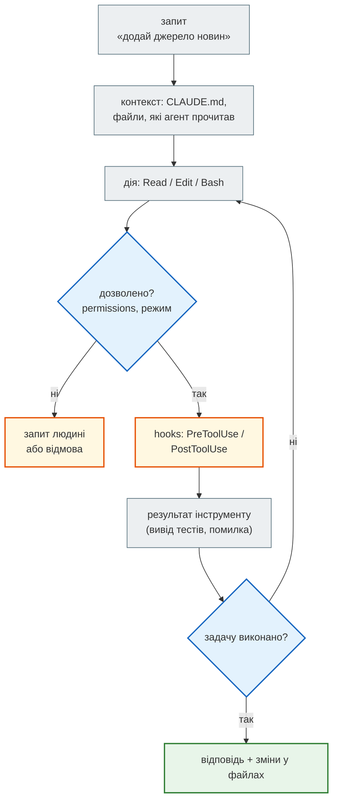

# Довідник: Claude Code

Довідник до [уроку 42](../lesson_42.md). Основа — `module_5/lesson_53_claude_code/CLAUDE_DOC.md` зі старого курсу. Кожне твердження звірено з установленим `claude` (версія 2.1.283, `claude --help`) і з [офіційною документацією](https://code.claude.com/docs/en/overview) станом на 27.09.2026.

Інструмент змінюється щомісяця. Якщо команда з цієї сторінки не працює, джерело правди — `claude --help`, `/help` і документація.

## 1. Що таке Claude Code

**Claude Code** — AI-агент для розробки. Він читає код проєкту, редагує файли, запускає команди (тести, лінтер, git) і сам вирішує, що робити далі, доки задачу не виконано. Від чату він відрізняється тим, що **діє** у твоєму репозиторії, а не лише пише текст.

| Де | Як |
|---|---|
| Термінал | `claude` у папці проєкту |
| VS Code, JetBrains | розширення (PyCharm, IntelliJ …) |
| Desktop | застосунок для macOS, Windows, Linux (beta) |
| Браузер | [claude.ai/code](https://claude.ai/code) — сесії в хмарі, з доступом до GitHub-репозиторію |
| Телефон | застосунок Claude (iOS, Android): керувати хмарними сесіями |



Головне в цій схемі — **цикл**: агент сам запускає тести, читає помилку й виправляє. Тому якість результату визначають не лише промпт, а й те, чим агент може себе перевірити: тести, типи, хуки.

## 2. Встановлення

| Що | Вимога |
|---|---|
| ОС | macOS 13+, Windows 10 1809+ (або WSL), Ubuntu 20.04+, Debian 10+, Alpine 3.19+ |
| Залізо | 4 ГБ+ RAM, x64 або ARM64; інтернет |
| Акаунт | Pro, Max, Team, Enterprise або Console (ключ API); безкоштовний план claude.ai Claude Code не включає |

```bash
# macOS / Linux / WSL — рекомендовано: нативна збірка, оновлюється сама
curl -fsSL https://claude.ai/install.sh | bash
```

```powershell
# Windows PowerShell
irm https://claude.ai/install.ps1 | iex
```

Інші способи: `brew install --cask claude-code`, `winget install Anthropic.ClaudeCode`, `npm install -g @anthropic-ai/claude-code` (Node.js 22+); apt, dnf, apk — після підключення репозиторію Anthropic ([інструкція](https://code.claude.com/docs/en/setup#install-with-linux-package-managers)). Нативна збірка оновлюється сама (канал `latest`; `"autoUpdatesChannel": "stable"` — версія тижневої давності без регресій), Homebrew і WinGet — вручну. У Windows для інструмента Bash бажано встановити Git for Windows; без нього Claude Code виконує команди через PowerShell.

```bash
claude --version     # версія
claude doctor        # діагностика встановлення й налаштувань
```

## 3. Перший запуск

```bash
cd news_hub          # завжди з кореня проєкту: звідси агент бачить код і CLAUDE.md
claude               # інтерактивна сесія; перший раз — вхід у акаунт
```

Перший запуск у новій папці питає, чи **довіряєш** ти їй. Це не формальність: доки папку не довірено, `allow`-правила з її `.claude/settings.json` не діють (див. [розділ 11](#settings)).

```bash
claude "поясни структуру проєкту"   # сесія з першим запитом
claude -p "знайди непротестовані функції"   # один запит без інтерфейсу, вивід у stdout
claude -c                            # продовжити останню розмову в цій папці
claude -r                            # вибрати розмову зі списку
```

У сесії:

```text
/init      створити CLAUDE.md з опису проєкту
/help      усі команди
/memory    які CLAUDE.md і пам'ять завантажено
/model     обрати модель
/compact   стиснути довгу розмову
/clear     почати з чистого контексту
```

## 4. CLI — команди й прапорці

| Команда | Що робить |
|---|---|
| `claude` / `claude "запит"` | інтерактивна сесія |
| `claude -p "запит"` | один запит, вивід у stdout (скрипти, CI) |
| `cat log.txt \| claude -p "поясни"` | вхід через pipe |
| `claude -c`, `claude -r [id]` | продовжити / відновити розмову |
| `claude --bg "запит"` | фонова сесія; `claude agents` — список, `attach`, `logs`, `stop`, `rm <id>` |
| `claude -w назва` | сесія в окремому git worktree |
| `claude mcp …` | MCP-сервери (розділ 9) |
| `claude auth login` / `status` / `logout` | акаунт |
| `claude setup-token` | довготривалий токен підписки (для CI) |
| `claude update` | оновити |

| Прапорець | Для чого |
|---|---|
| `--model sonnet` | модель: аліас (`fable`, `opus`, `sonnet`, `haiku`) або повна назва; поточний список — `/model` |
| `--effort high` | рівень зусиль: `low`, `medium`, `high`, `xhigh`, `max` |
| `--permission-mode plan` | режим дозволів (розділ 11) |
| `--allowedTools "Bash(pytest *)" Edit` | дозволити інструменти без запиту на цю сесію |
| `--disallowedTools "Bash(git push *)"` | заборонити |
| `--add-dir ../shared` | дати доступ ще до однієї папки |
| `--output-format json` | з `-p`: JSON з результатом, вартістю, списком відмов (`permission_denials`) |
| `--json-schema '{…}'` | з `-p`: відповідь за JSON Schema |
| `--max-budget-usd 2` | з `-p`: ліміт витрат на запуск |
| `--append-system-prompt "…"` | додати інструкцію до системного промпту |
| `-n назва` | назва сесії |
| `--debug hooks` | журнал налагодження |

Моделі змінюються частіше, ніж цей довідник: у прикладах лише аліаси, конкретні назви — у [Model configuration](https://code.claude.com/docs/en/model-config).

## 5. Як ставити задачу

Агент не знає того, чого немає в репозиторії та в запиті. Найсильніший «промпт» — **перевірний критерій готовності**: тест, який має пройти, команда, яка має дати нуль помилок.

```text
❌ «Додай джерело новин Українська правда».
✅ «Додай джерело "Українська правда" (RSS). Специфікація — tests/unit/test_pravda.py,
   зразок стрічки — tests/fixtures/pravda_rss.xml. Зроби, щоб проходили pytest і
   mypy --strict news_hub, тести не змінюй. Наприкінці перелічи рішення, які ухвалив сам.»
```

Урок 42 порівнює саме ці два запити на одному проєкті — з реальним результатом.

| Прийом | Навіщо |
|---|---|
| Спершу план: `--permission-mode plan` або «не пиши код, лише план» | побачити підхід до того, як змінено 10 файлів |
| Обмеж простір: «лише `news_hub/rss.py` і `models.py`» | менший діф — легше рецензувати |
| Встав помилку повністю (traceback) | агент бачить те саме, що й ти |
| «Перелічи рішення, які ухвалив сам» | неявні рішення стають видимими для рецензії |
| Великі задачі — частинами | кожен крок перевіряєш тестами до наступного |

## 6. CLAUDE.md — інструкції проєкту

`CLAUDE.md` — Markdown-файл, який Claude Code читає на початку **кожної** сесії: команди, структура, правила проєкту.

| Файл | Для кого |
|---|---|
| `/etc/claude-code/CLAUDE.md` (Linux), `/Library/Application Support/ClaudeCode/CLAUDE.md` (macOS) | організація (адміністратор) |
| `~/.claude/CLAUDE.md` | ти, усі проєкти |
| `./CLAUDE.md` або `./.claude/CLAUDE.md` | команда, у git |
| `./CLAUDE.local.md` | ти, цей проєкт; додай у `.gitignore` |

Файли не перекривають один одного, а **додаються** в контекст: від кореня файлової системи до папки, де запущено `claude`. `CLAUDE.md` у підпапках завантажуються, коли агент читає файли в них. Якщо в репозиторії є лише `AGENTS.md` (спільний формат кількох AI-інструментів), Claude Code прочитає його.

```markdown
# news_hub — новинний агрегатор курсу

## Команди
- `pytest -m unit` — швидкі тести; запускати після кожної зміни
- `mypy --strict news_hub` — має бути чисто

## Правила
- Домени — лише точний збіг або піддомен, ніколи `endswith(d)`.
- Не змінюй наявні тести, щоб вони пройшли. Якщо тест здається хибним — зупинись і поясни.
- Нових залежностей не додавай без пояснення.
```

Повний файл проєкту — [`news_hub/CLAUDE.md`](https://github.com/NikoriakViktot/PY-Course-Victor-Nikoriak-22-09-2026/blob/main/module_4/lessons/lesson_42_ai_dev_tools/news_hub/CLAUDE.md).

- **Імпорти:** `@README.md` або `@docs/deploy.md` у тексті CLAUDE.md підключає файл (до 4 рівнів вкладеності). У бектиках (`` `@README` ``) — просто текст.
- **Правила для частини файлів:** `.claude/rules/*.md` з полем `paths:` у frontmatter — завантажуються, лише коли агент працює з відповідними файлами:

```markdown
---
paths:
  - "news_hub/api.py"
  - "tests/integration/**"
---
- Кожен новий ендпоінт — тест у tests/integration/
```

- **Розмір:** до ~200 рядків. Конкретне («4 пробіли», «`pytest -m unit`») краще за загальне («пиши якісно»).
- **Це контекст, а не замок.** Агент зазвичай виконує CLAUDE.md, але не гарантовано. Те, що *мусить* виконатися, — у `permissions` і hooks.

Поглиблено: [Memory](https://code.claude.com/docs/en/memory).

## 7. Auto memory — нотатки агента

Крім CLAUDE.md (пишеш ти), агент веде власні нотатки: твої виправлення, вподобання, команди збірки. Вони лежать у `~/.claude/projects/<проєкт>/memory/`, індекс — `MEMORY.md`; на старті сесії завантажуються перші 200 рядків (або 25 КБ).

| | CLAUDE.md | Auto memory |
|---|---|---|
| Хто пише | ти (і команда через git) | агент |
| Що | правила, команди, архітектура | навчене в роботі: «у цьому проєкті тести — через `pytest -m unit`» |
| Видно команді | так | ні, лише тобі |

`/memory` — переглянути й вимкнути. Вимкнути для проєкту — `"autoMemoryEnabled": false` у його `.claude/settings.json`; змінна середовища — `CLAUDE_CODE_DISABLE_AUTO_MEMORY=1`.

## 8. Slash-команди та skills { #skills }

Вбудовані: `/help`, `/init`, `/memory`, `/model`, `/effort`, `/config`, `/permissions`, `/hooks`, `/mcp`, `/skills`, `/compact`, `/clear`, `/review`, `/security-review`, `/rename`.

**Skill** — власна команда: папка з `SKILL.md`.

| Де | Для кого |
|---|---|
| `~/.claude/skills/<назва>/SKILL.md` | ти, усі проєкти |
| `.claude/skills/<назва>/SKILL.md` | проєкт, у git |
| плагін | там, де встановлено плагін |

Старий формат `.claude/commands/<назва>.md` працює так само, але skill може мати поруч допоміжні файли (скрипти, шаблони).

```markdown
---
name: add-news-source
description: Додати нове джерело новин у news_hub за правилами проєкту.
argument-hint: "[назва джерела] [URL стрічки]"
disable-model-invocation: true
---

Додаємо джерело новин $ARGUMENTS.

1. Спершу збережи зразок стрічки у tests/fixtures/. Якщо зразка немає — зупинись і попроси.
2. Тести-специфікація в tests/unit/test_<джерело>.py. Запусти — вони мають ВПАСТИ.
3. …

Поточний стан:
!`git status --short`
```

`$ARGUMENTS` — усе, що написано після `/add-news-source`; `$0`, `$1` — окремі аргументи. `` !`команда` `` виконується **до** того, як skill потрапить до агента: у текст підставляється її вивід.

| Поле frontmatter | Що робить |
|---|---|
| `name`, `description` | назва в меню `/`; опис, за яким агент вирішує, коли skill доречний |
| `argument-hint`, `arguments` | підказка аргументів; іменовані аргументи (`$component`) |
| `disable-model-invocation: true` | лише ти викликаєш skill, агент — ні |
| `user-invocable: false` | навпаки: лише агент |
| `allowed-tools`, `disallowed-tools` | інструменти без запиту / заборонені, поки skill активний |
| `model`, `effort` | модель і зусилля для цього skill |
| `context: fork`, `agent` | виконати в окремому субагенті |
| `paths` | активувати лише для відповідних файлів |

Повний skill проєкту — [`.claude/skills/add-news-source/SKILL.md`](https://github.com/NikoriakViktot/PY-Course-Victor-Nikoriak-22-09-2026/blob/main/module_4/lessons/lesson_42_ai_dev_tools/news_hub/.claude/skills/add-news-source/SKILL.md). Поглиблено: [Skills](https://code.claude.com/docs/en/skills).

## 9. MCP — зовнішні інструменти

**Model Context Protocol** — відкритий стандарт, через який агент отримує інструменти й дані ззовні: GitHub, базу даних, Sentry, Figma, пошту.

```bash
# віддалений HTTP-сервер (авторизація OAuth — через /mcp у сесії)
claude mcp add --transport http sentry https://mcp.sentry.dev/mcp

# з заголовком
claude mcp add --transport http corridor https://app.corridor.dev/api/mcp --header "Authorization: Bearer $TOKEN"

# локальний stdio-сервер; усе після -- — команда запуску
claude mcp add postgres -- npx -y @bytebase/dbhub --dsn "postgresql://readonly@localhost/news_hub"

claude mcp list          # список і стан
claude mcp get sentry    # деталі
claude mcp remove sentry
```

Прапорці (`--transport`, `--header`, `-e`, `--scope`) пишуться **до** назви сервера.

| `--scope` | Де діє | Де записано |
|---|---|---|
| `local` (за замовчуванням) | ти, цей проєкт | `~/.claude.json` |
| `project` | усі, хто клонував | `.mcp.json` у корені, у git |
| `user` | ти, усі проєкти | `~/.claude.json` |

```json
{
  "mcpServers": {
    "sentry": {"type": "http", "url": "https://mcp.sentry.dev/mcp"},
    "postgres": {"type": "stdio", "command": "npx",
                 "args": ["-y", "@bytebase/dbhub", "--dsn", "${DATABASE_URL}"]}
  }
}
```

Сервери з `.mcp.json` чужого репозиторію не запускаються, доки ти їх не схвалиш (`claude mcp list` показує їх як «Pending approval»). Секрети — лише через `${ЗМІННА}`, не текстом у файлі. MCP-сервер виконує код на твоїй машині й бачить те, що йому передає агент: підключай лише ті, яким довіряєш.

Поглиблено: [MCP](https://code.claude.com/docs/en/mcp).

## 10. Hooks — автоматизація подій { #hooks }

**Hook** — команда (або HTTP-запит, MCP-інструмент, промпт), яку Claude Code запускає сам у певний момент. На відміну від CLAUDE.md, hook виконується **завжди** — агент не може «забути» про нього.

| Подія | Коли | Приклад |
|---|---|---|
| `PreToolUse` | перед інструментом; може **заблокувати** | не давати редагувати `migrations/versions/` |
| `PostToolUse` | після інструменту | тести / лінтер після кожної зміни файлу |
| `UserPromptSubmit` | користувач надіслав запит | додати контекст |
| `Stop` | агент закінчив відповідь | остаточна перевірка |
| `SessionStart`, `SessionEnd` | початок / кінець сесії | підготувати середовище |

Подій понад 30 (`PermissionRequest`, `SubagentStop`, `PreCompact`, `FileChanged` …) — повний список у [Hooks reference](https://code.claude.com/docs/en/hooks).

```json
{
  "hooks": {
    "PostToolUse": [
      {
        "matcher": "Edit|Write",
        "hooks": [
          {"type": "command", "command": "python \"$CLAUDE_PROJECT_DIR/.claude/hooks/unit_tests.py\""}
        ]
      }
    ]
  }
}
```

Hook отримує на stdin JSON: `tool_name`, `tool_input` (для файлів — `tool_input.file_path`), `cwd` тощо.

| Код виходу | `PreToolUse` | `PostToolUse` |
|---|---|---|
| `0` | продовжити (stdout може містити JSON-рішення) | продовжити |
| `2` | **заблокувати** виклик; stderr — причина для агента | дію вже виконано; stderr іде агенту як помилка, яку треба виправити |
| інший | некритична помилка, продовжуємо | те саме |

```python title=".claude/hooks/unit_tests.py (news_hub, урок 42)"
import json
import subprocess
import sys

event = json.load(sys.stdin)
path = event.get("tool_input", {}).get("file_path", "")
if not path.endswith(".py"):
    sys.exit(0)

result = subprocess.run([sys.executable, "-m", "pytest", "-m", "unit", "-q", "-p", "no:cacheprovider", "-x"],
                        capture_output=True, text=True)
if result.returncode != 0:
    print("pytest -m unit впав після зміни", path, file=sys.stderr)
    print("\n".join(result.stdout.splitlines()[-25:]), file=sys.stderr)
    sys.exit(2)
```

!!! warning "Hook-«чорний список» — не захист"
    Типовий приклад — hook, що блокує `rm -rf` регулярним виразом `^rm -rf`. Агент (або промпт-ін'єкція в прочитаному файлі) обходить його командою `cd / && rm -rf …`, `/bin/rm -rf …` чи `python -c "…"`. Небезпечні дії закривають `permissions.deny` і sandbox (розділ 11). Hook — для перевірок якості, а не як межа безпеки.

## 11. Налаштування, дозволи, sandbox { #settings }

Налаштування — JSON-файли; якщо один ключ задано в кількох, діє вищий рівень:

1. **managed** — організація (`managed-settings.json`, MDM); не перевизначається;
2. **командний рядок** — `--settings`, `--model`, `--permission-mode` …;
3. **`.claude/settings.local.json`** — ти, цей проєкт (не в git);
4. **`.claude/settings.json`** — проєкт, у git;
5. **`~/.claude/settings.json`** — ти, усі проєкти.

```json title="news_hub/.claude/settings.json (урок 42)"
{
  "permissions": {
    "allow": ["Bash(pytest *)", "Bash(python -m pytest *)", "Bash(mypy *)",
              "Bash(git diff *)", "Bash(git status *)"],
    "ask": ["Edit(./tests/**)"],
    "deny": ["Read(./.env)", "Read(./.env.*)", "Bash(pip install *)", "Bash(git push *)",
             "Bash(alembic downgrade *)", "WebFetch"]
  }
}
```

- **`deny` сильніший за `allow`**: широке `Bash(git *)` у `allow` не відкриє `git push`, якщо його заборонено.
- `Bash(pytest *)` — `*` після пробілу покриває й саме `pytest`. Правило перевіряє **кожну** частину складеної команди (`&&`, `|`, `;`): `Bash(pytest *)` не дозволить `pytest && rm -rf .`.
- Шляхи: `Read(./.env)` — відносно поточної папки; `Edit(/src/**)` — відносно кореня проєкту; `Read(~/…)` — домашня папка.
- **Довіра до папки.** `allow`-правила з `.claude/settings.json` діють лише після того, як ти довірив папку (діалог при першому запуску). Інакше будь-який клонований репозиторій сам собі дозволив би команди. `deny` і `ask` діють одразу. `claude -p` діалог пропускає — і в недовіреній папці `allow` з файлу мовчки ігнорує (урок 42 на це натрапив).

| Режим (`--permission-mode`) | Поведінка |
|---|---|
| `default` (у CLI — Manual) | питає перед першим використанням кожного інструменту |
| `acceptEdits` | правки файлів — без запиту; команди — як завжди |
| `plan` | лише читає й складає план, нічого не змінює |
| `auto` | виконує сам; окремий класифікатор перевіряє дії на відповідність запиту |
| `dontAsk` | усе, що вимагало б запиту, — відхиляє; працює лише дозволене правилами |
| `bypassPermissions` | без жодних перевірок — лише в ізольованому контейнері без доступу до секретів і мережі |

**Sandbox** (`/sandbox`; macOS, Linux, WSL2 — у «рідному» Windows його немає) обмежує команди Bash на рівні ОС — файли й мережеві домени, до яких вони мають доступ:

```json
{
  "sandbox": {
    "enabled": true,
    "filesystem": {"allowWrite": ["/tmp/build"], "denyRead": ["~/.aws", "./.env"]},
    "network": {"allowedDomains": ["github.com", "pypi.org", "files.pythonhosted.org"]}
  }
}
```

Змінні середовища: `ANTHROPIC_API_KEY` (ключ API для `-p` і CI), `ANTHROPIC_MODEL` (модель за замовчуванням), `CLAUDE_CODE_DISABLE_AUTO_MEMORY=1`, `MAX_MCP_OUTPUT_TOKENS`. У `settings.json` їх задають ключем `"env": {…}`.

Поглиблено: [Settings](https://code.claude.com/docs/en/settings), [Permissions](https://code.claude.com/docs/en/permissions), [Permission modes](https://code.claude.com/docs/en/permission-modes), [Sandboxing](https://code.claude.com/docs/en/sandboxing).

## 12. Автоматизація: `-p`, CI, Agent SDK

**Скрипти.** `claude -p` — той самий агент без інтерфейсу:

```bash
git diff main | claude -p "рецензія діфу: баги й безпека, коротко"

claude -p "Додай джерело …" \
  --permission-mode acceptEdits \
  --allowedTools "Bash(pytest *)" "Bash(mypy *)" \
  --max-budget-usd 5 --output-format json > run.json
```

`--output-format json` повертає результат, кількість кроків, вартість і `permission_denials` — перелік дій, які агентові не дозволили. Саме так проведено експеримент уроку 42.

**GitHub Actions** — офіційна дія `anthropics/claude-code-action@v1`. Найпростіше налаштувати командою `/install-github-app` у сесії:

```yaml
name: Claude Code
on:
  issue_comment:
    types: [created]
jobs:
  claude:
    if: contains(github.event.comment.body, '@claude')
    runs-on: ubuntu-latest
    permissions:
      contents: write
      pull-requests: write
      issues: write
      id-token: write
    steps:
      - uses: actions/checkout@v6
        with:
          fetch-depth: 1
      - uses: anthropics/claude-code-action@v1
        with:
          anthropic_api_key: ${{ secrets.ANTHROPIC_API_KEY }}
```

Дія сама перевіряє, що той, хто згадав `@claude`, має право запису в репозиторій. Ключ — лише в GitHub Secrets. Не запускай агента в режимі `bypassPermissions` на вмісті чужих PR: текст PR — це чужий промпт.

**Agent SDK** — той самий агент (інструменти, дозволи, хуки, CLAUDE.md) як бібліотека Python або TypeScript:

```python
# pip install claude-agent-sdk
import asyncio

from claude_agent_sdk import ClaudeAgentOptions, query


async def main() -> None:
    options = ClaudeAgentOptions(allowed_tools=["Read", "Grep", "Bash(pytest *)"], permission_mode="acceptEdits")
    async for message in query(prompt="Знайди непротестовані функції в news_hub/", options=options):
        print(message)

asyncio.run(main())
```

Це не те саме, що **Client SDK** (`pip install anthropic`): там ти сам викликаєш модель і сам пишеш цикл інструментів — це тема уроку 43. Поглиблено: [Agent SDK overview](https://code.claude.com/docs/en/agent-sdk/overview).

**Паралельна робота.** `claude --bg "…"` — фонова сесія (`claude agents` — список, `claude attach <id>` — під'єднатися); `claude -w назва` — сесія в окремому git worktree, щоб дві задачі не заважали одна одній.

## 13. Безпека: чекліст

| Ризик | Що робити |
|---|---|
| Агент прочитав `.env` і вставив ключ у код або лог | `deny: Read(./.env)`; секрети — лише в змінних середовища |
| Промпт-ін'єкція: інструкції в прочитаному файлі, issue, вебсторінці | не давати агенту одночасно чужий вміст, секрети й мережу; `WebFetch` — у `deny` або `ask` |
| Чужий репозиторій з `.claude/settings.json`, hooks, `.mcp.json` | не довіряй папці, доки не переглянув ці файли |
| «Тести проходять», бо агент змінив тести | `ask: Edit(./tests/**)`; рецензія діфу тестів — окремо |
| Вигадані залежності або API | `deny: Bash(pip install *)`; кожну нову залежність — перевірити на PyPI |
| Повний автопілот | `bypassPermissions` лише в одноразовому контейнері |

Поглиблено: [Security](https://code.claude.com/docs/en/security), [Best practices](https://code.claude.com/docs/en/best-practices).

## Посилання

- [Overview](https://code.claude.com/docs/en/overview), [Quickstart](https://code.claude.com/docs/en/quickstart), [CLI reference](https://code.claude.com/docs/en/cli-reference), [Common workflows](https://code.claude.com/docs/en/common-workflows)
- [Memory (CLAUDE.md)](https://code.claude.com/docs/en/memory), [Skills](https://code.claude.com/docs/en/skills), [Hooks](https://code.claude.com/docs/en/hooks), [MCP](https://code.claude.com/docs/en/mcp)
- [Settings](https://code.claude.com/docs/en/settings), [Permissions](https://code.claude.com/docs/en/permissions), [Sandboxing](https://code.claude.com/docs/en/sandboxing), [Security](https://code.claude.com/docs/en/security)
- [Headless (`-p`)](https://code.claude.com/docs/en/headless), [GitHub Actions](https://code.claude.com/docs/en/github-actions), [Agent SDK](https://code.claude.com/docs/en/agent-sdk/overview)
- [Model Context Protocol](https://modelcontextprotocol.io)
