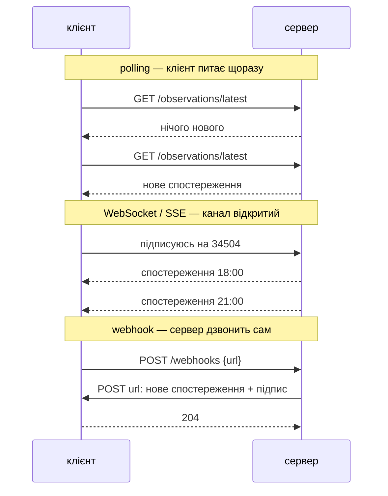
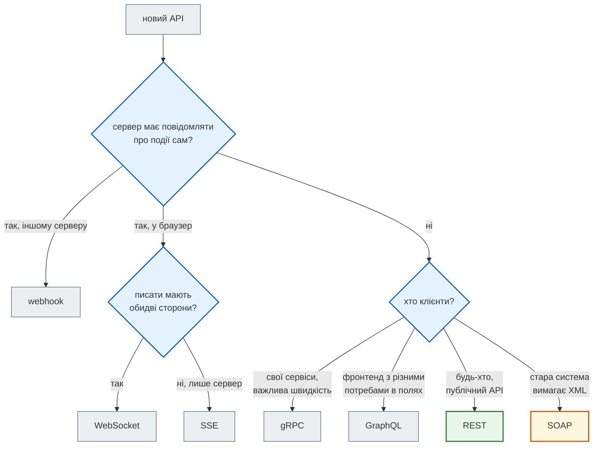
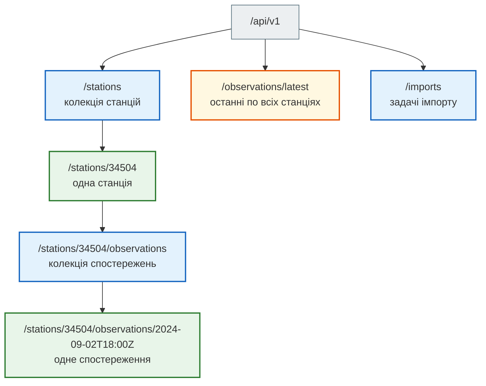
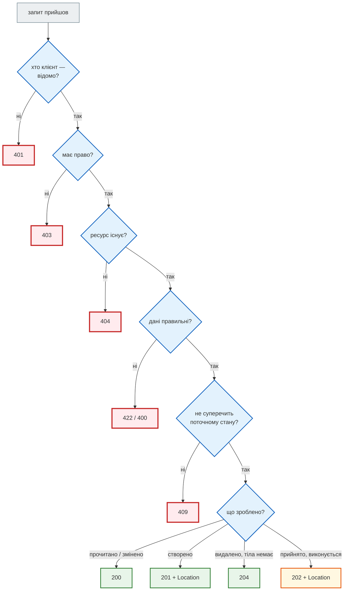
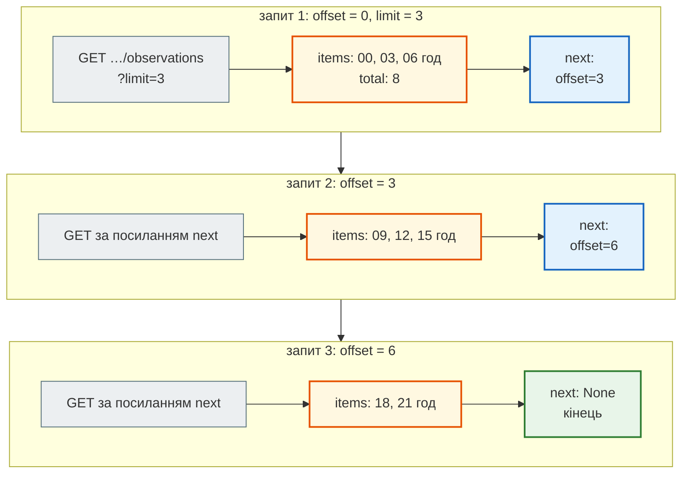
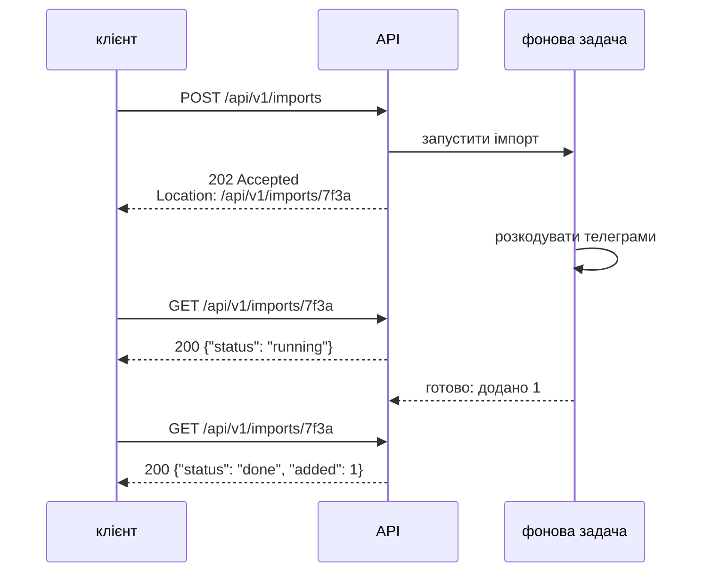
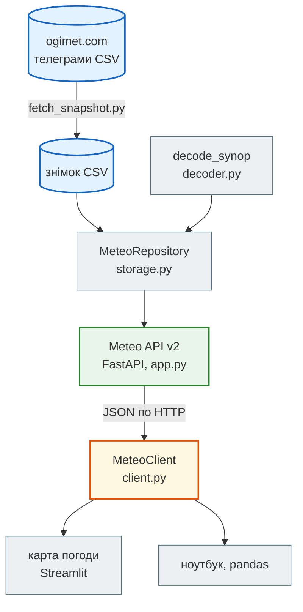

# Урок 32. REST: принципи дизайну API

В уроці 31 ми були **клієнтом**: надсилали запити до чужого API і розбирались із його відповідями. Сьогодні — інша роль: ми **проєктуємо** API, яким користуватимуться інші.

Приклад — справжній проєкт викладача. Кожні три години метеостанції України передають **синоптичні телеграми** — короткі рядки цифр на кшталт `AAXX 02181 34504 32975 51106 10251 …`. Сервіс завантажує їх із сайту [ogimet.com](https://www.ogimet.com/), розкодовує в температуру, тиск і вітер, зберігає в базі й віддає через API: для Streamlit-дашборду, для аналізу в pandas, для інших програм.

Перша версія цього API працює. Але подивимось на її адреси: `/download_telegrams`, `POST /filter_telegrams/`, `/telegram/ua/3450420249218` — і на відповідь «даних немає» з кодом **200 OK**. Клієнтам таким API користуватися важко. Сьогодні розберемо, як це зробити правильно (REST), перепроєктуємо API у версію 2 і побудуємо до неї карту погоди. А ще подивимось, якими бувають API взагалі: RPC, GraphQL, gRPC, SOAP, WebSocket, webhook.

**Що потрібно з попередніх уроків:** класи (урок 19), pytest (урок 25), репозиторій (урок 29), HTTP-методи й статус-коди, `requests`, клієнт-клас (урок 31).

**Після уроку ти зможеш:**

- розрізнити типи API — REST, RPC, GraphQL, gRPC, SOAP, WebSocket, SSE, webhook — і обрати тип під задачу;
- спроєктувати REST API: ресурси-іменники, методи за призначенням, чесні статус-коди, формат помилок;
- додати фільтри, вибір полів і пагінацію;
- обробити довгу операцію через `202 Accepted`;
- знайти порушення REST у чужому API і запропонувати виправлення;
- написати клієнт до свого API й дашборд поверх нього.

**Задача розділу.** Meteo API v2 і Streamlit-карта погоди. Повний приклад — у розділі [«Практика»](#practice).

**Ноутбук заняття:** [`note_lesson_32_rest.ipynb`](https://github.com/NikoriakViktot/PY-Course-Victor-Nikoriak-22-09-2026/blob/main/module_4/lessons/lesson_32_rest_api_design/note_lesson_32_rest.ipynb) [](https://colab.research.google.com/github/NikoriakViktot/PY-Course-Victor-Nikoriak-22-09-2026/blob/main/module_4/lessons/lesson_32_rest_api_design/note_lesson_32_rest.ipynb) — сервер запускається прямо в ноутбуці.

## Пригадай

1. Який метод ідемпотентний: `POST` чи `DELETE`? Що це означає (урок 31)?
2. Чим відповідь `404` відрізняється від `422`?
3. Навіщо клієнт-клас (`SmachnoClient`), якщо є `requests`?

??? success "Відповіді"

    1. `DELETE`: повторний запит лишає сервер у тому самому стані — ресурсу немає. `POST` при повторі створює ще один ресурс.
    2. `404` — такого ресурсу немає. `422` — запит зрозумілий, але дані не пройшли перевірку (наприклад, від'ємна сума).
    3. Адреса, тайм-аут, повтори й перетворення кодів на винятки — в одному місці, а не в кожному виклику.

## Метеотелеграма: які дані віддає API

Уся робота — у папці уроку [`lesson_32_rest_api_design`](https://github.com/NikoriakViktot/PY-Course-Victor-Nikoriak-22-09-2026/tree/main/module_4/lessons/lesson_32_rest_api_design). Встанови залежності (у Colab це робить ноутбук):

```bash
pip install fastapi uvicorn pymetdecoder strawberry-graphql grpcio grpcio-tools websockets httpx requests
```

Телеграма SYNOP (код КН-01) — рядок груп по п'ять цифр. Розкодовує її бібліотека [`pymetdecoder`](https://pypi.org/project/pymetdecoder/); обгортка з проєкту викладача — у `meteo_api/decoder.py`:

```python
from meteo_api.decoder import decode_synop

telegram = "AAXX 02181 34504 32975 51106 10251 20129 39989 40151 52027 80001 333 10330"
for key, value in decode_synop(telegram).items():
    print(f"{key:19} {value}")
```

```text
temperature         25.1
dew_point           12.9
relative_humidity   47
wind_dir            110
wind_speed          6
pressure            998.9
sea_level_pressure  1015.1
max_temperature     33.0
min_temperature     None
```

| Група | Що означає |
|---|---|
| `AAXX` | телеграма з наземної станції |
| `02181` | день `02`, строк `18` UTC, вітер у м/с (`1`) |
| `34504` | номер станції за каталогом WMO: `34` — район, `504` — Дніпро |
| `51106` | хмарність, вітер: напрямок `11` → 110°, швидкість `06` м/с |
| `10251` | `1` — температура, `0` — плюс, `251` → 25.1 °C |
| `20129` | `2` — точка роси: 12.9 °C |
| `39989` | `3` — тиск на станції: 998.9 гПа |
| `40151` | `4` — тиск на рівні моря: 1015.1 гПа |
| `333 10330` | розділ 3: максимальна температура за день 33.0 °C |

Відносну вологість (47 %) телеграма не передає — її обчислюємо з температури й точки роси.

Ця телеграма — справжня: станція Дніпро, 2 вересня 2024 року, 18:00 UTC, з документації API викладача. Вона ж — фікстура для тестів, і поки що API працює саме на ній. Знімок телеграм 12 обласних центрів за кілька діб робить скрипт `meteo_api/fetch_snapshot.py` (код викладача, що завантажує телеграми з ogimet.com): щойно файли знімка з'являться в `meteo_api/data/`, API підхопить їх автоматично.

## Які бувають API

**API** (Application Programming Interface) — домовленість, як одна програма просить іншу щось зробити. Функції модуля `math` — теж API: **бібліотечний**, у межах однієї програми. Сьогодні говоримо про **мережеві** API, де програми — на різних комп'ютерах.

Запустимо навчальний сервер: він віддає ті самі метеодані через усі типи API одразу.

```python
from meteo_api.app import start_server

BASE = start_server()
print(BASE)
```

```text
http://127.0.0.1:8032
```

| Тип | Хто починає розмову | Формат | Контракт | Де зустрінеш |
|---|---|---|---|---|
| HTTP + файл (CSV) | клієнт | CSV, текст | документація сайту | ogimet, старі державні й наукові сервіси |
| **REST** | клієнт | JSON | OpenAPI (необов'язково) | більшість публічних API: GitHub, Stripe, Telegram Bot API |
| JSON-RPC | клієнт | JSON | список методів | блокчейн-вузли, LSP (редактори коду) |
| GraphQL | клієнт | JSON, мова запитів | схема (обов'язково) | GitHub API v4, Shopify, мобільні застосунки |
| gRPC | клієнт; можливі потоки в обидва боки | Protobuf (двійковий) | `.proto` (обов'язково) | зв'язок мікросервісів усередині компанії |
| SOAP | клієнт | XML-конверт | WSDL (обов'язково) | банки, державні реєстри, старі корпоративні системи |
| WebSocket | будь-хто, канал відкритий | будь-який, частіше JSON | домовленість | чати, біржові котирування, ігри (урок 45) |
| SSE | сервер після запиту клієнта | текстові події | домовленість | стрічки новин, прогрес задач, відповіді LLM по слову |
| Webhook | **сервер** — сам дзвонить клієнту | JSON | документація | оплати (Stripe), GitHub, Telegram-боти (урок 47) |

### HTTP + CSV: так працює ogimet

Сайт ogimet.com віддає телеграми за звичайним GET-запитом з параметрами — без JSON і без ресурсів. Наш сервер має двійника цього ендпоінта з тим самим форматом:

```python
import requests

params = {"block": "34504", "begin": "202409020000", "end": "202409022359"}
response = requests.get(f"{BASE}/cgi-bin/getsynop", params=params, timeout=5)
print(response.headers["Content-Type"])
print(response.text)
```

```text
text/plain; charset=utf-8
34504,2024,09,02,18,00,AAXX 02181 34504 32975 51106 10251 20129 39989 40151 52027 80001 333 10330=
```

Це теж API: адреса, параметри, формат відповіді. Але клієнт має знати формат рядка напам'ять: немає назв полів, немає статус-кодів для «станції немає» — лише порожня відповідь. Так виглядають багато старих наукових і державних сервісів. Тому проєкт викладача й загортає ogimet у власний API.

### RPC: виклик функції через мережу

**RPC** (Remote Procedure Call) — «виклич функцію на іншому комп'ютері». Один URL, а **назва методу** й аргументи — у тілі запиту. Найпростіший стандарт — [JSON-RPC 2.0](https://www.jsonrpc.org/specification):

```python
call = {"jsonrpc": "2.0", "method": "temperature.latest", "params": {"wmo": "34504"}, "id": 1}
print(requests.post(f"{BASE}/rpc", json=call, timeout=5).json())

call = {"jsonrpc": "2.0", "method": "temperature.forecast", "params": {"wmo": "34504"}, "id": 2}
print(requests.post(f"{BASE}/rpc", json=call, timeout=5).json())
```

```text
{'jsonrpc': '2.0', 'result': {'time': '2024-09-02T18:00Z', 'temperature': 25.1}, 'id': 1}
{'jsonrpc': '2.0', 'error': {'code': -32601, 'message': "метод 'temperature.forecast' не існує"}, 'id': 2}
```

- Усі виклики — `POST /rpc`, статус HTTP завжди 200; помилка — в полі `error` з кодом зі стандарту (`-32601` — «метод не існує»).
- RPC природний, коли операція — справді **дія**, а не ресурс: «перерахувати», «надіслати», «запустити». Але кеші, проксі й браузер не знають, що `temperature.latest` лише читає дані: для них це просто `POST`.

### GraphQL: клієнт сам обирає поля

[GraphQL](https://graphql.org/learn/) — мова запитів до API. Один URL `/graphql`; клієнт описує, **які саме поля** і **які пов'язані дані** хоче, — і отримує рівно це, одним запитом:

```python
query = """
{
  station(wmo: "34504") {
    name
    observations(last: 1) { time temperature }
  }
}
"""
print(requests.post(f"{BASE}/graphql", json={"query": query}, timeout=5).json())
```

```text
{'data': {'station': {'name': 'Дніпро', 'observations': [{'time': '2024-09-02T18:00Z', 'temperature': 25.1}]}}}
```

- Відповідь повторює форму запиту: `station → name, observations → time, temperature`. Тиску немає, бо ми його не просили.
- У REST для цього знадобилося б два запити (станція, потім спостереження). GraphQL зручний мобільним застосункам: менше запитів і менше зайвих байтів.
- Платимо складністю: сервер має схему типів, а один «важкий» запит може навантажити базу. Кешувати GraphQL важче, ніж `GET`.

### SOAP: XML-конверт

SOAP — старший за REST стандарт (кінець 1990-х). Запит і відповідь — XML-«конверт», а контракт описаний у файлі **WSDL**. Досі живе в банках і державних реєстрах:

```python
envelope = """<?xml version="1.0" encoding="utf-8"?>
<soap:Envelope xmlns:soap="http://schemas.xmlsoap.org/soap/envelope/" xmlns:m="urn:meteo">
  <soap:Body>
    <m:GetLatestTemperature><m:Station>34504</m:Station></m:GetLatestTemperature>
  </soap:Body>
</soap:Envelope>"""
response = requests.post(f"{BASE}/soap", data=envelope.encode(), timeout=5,
                         headers={"Content-Type": "text/xml; charset=utf-8"})
print(response.status_code)
print(response.text)
```

```text
200
<?xml version="1.0" encoding="utf-8"?>
<soap:Envelope xmlns:soap="http://schemas.xmlsoap.org/soap/envelope/" xmlns:m="urn:meteo"><soap:Body><m:GetLatestTemperatureResponse><m:Station>34504</m:Station><m:Time>2024-09-02T18:00Z</m:Time><m:Temperature>25.1</m:Temperature></m:GetLatestTemperatureResponse></soap:Body></soap:Envelope>
```

Той самий виклик «дай температуру», що й у JSON-RPC, але в кілька разів довший. Для SOAP є бібліотека [`zeep`](https://docs.python-zeep.org/): вона читає WSDL і створює Python-методи, щоб XML не писати руками.

### gRPC: двійковий контракт

[gRPC](https://grpc.io/docs/what-is-grpc/introduction/) — RPC від Google поверх HTTP/2. Контракт пишуть у файлі `.proto`:

```text
service Meteo {
  rpc GetLatest (StationRequest) returns (Observation);
  rpc StreamObservations (StationRequest) returns (stream Observation);
}
message StationRequest { string wmo = 1; }
message Observation { string station = 1; string time = 2; double temperature = 3; double pressure = 4; }
```

З нього `grpcio-tools` генерує класи і для сервера, і для клієнта. Клієнт викликає методи сервера як звичайні функції:

```python
import grpc

from meteo_api.grpc_meteo import connect, start_grpc_server

stub, pb2 = connect(start_grpc_server())
reply = stub.GetLatest(pb2.StationRequest(wmo="34504"), timeout=5)
print(type(reply).__name__, reply.station, reply.time, reply.temperature)
print(len(reply.SerializeToString()), "байтів у двійковому вигляді")

try:
    stub.GetLatest(pb2.StationRequest(wmo="99999"), timeout=5)
except grpc.RpcError as error:
    print(error.code(), error.details())
```

```text
Observation 34504 2024-09-02T18:00Z 25.1
44 байтів у двійковому вигляді
StatusCode.NOT_FOUND станцію 99999 не знайдено
```

- Повідомлення — двійкові (Protocol Buffers): коротші за JSON і розбираються швидше. Людині їх не прочитати — для налагодження потрібні спеціальні інструменти.
- Помилки — власні коди gRPC (`NOT_FOUND`, `UNAVAILABLE`…), а не HTTP-статуси.
- З браузера gRPC напряму не викликати. Тому його обирають для зв'язку **сервісів між собою**, а не для публічних API.

### WebSocket і SSE: сервер надсилає сам

У всіх попередніх типах розмову починає клієнт: «запитав — отримав». А якщо клієнт хоче дізнатися про нове спостереження **одразу**, як воно з'явиться? Питати сервер щосекунди (**polling**) — марна робота для обох.

**WebSocket** — постійний двосторонній канал: після рукостискання по HTTP з'єднання лишається відкритим, і писати в нього може будь-яка сторона.

```python
import asyncio
import json

import websockets


async def listen(wmo):
    async with websockets.connect(BASE.replace("http", "ws") + "/ws/observations") as ws:
        await ws.send(json.dumps({"subscribe": wmo}))
        async for message in ws:
            print("отримано:", message)


asyncio.run(listen("34504"))
```

```text
отримано: {"time":"2024-09-02T18:00Z","temperature":25.1}
отримано: {"done":true}
```

**SSE** (Server-Sent Events) — простіше: звичайна HTTP-відповідь з типом `text/event-stream`, яку сервер не закриває й дописує подію за подією. Канал односторонній — лише від сервера. Так ChatGPT і Claude показують відповідь по словах.

```python
import httpx

with httpx.stream("GET", f"{BASE}/events/observations", params={"station": "34504"}, timeout=5) as response:
    print(response.headers["content-type"])
    for line in response.iter_lines():
        print(repr(line))
```

```text
text/event-stream; charset=utf-8
'event: observation'
'data: {"time": "2024-09-02T18:00Z", "temperature": 25.1}'
''
'event: done'
'data: {}'
''
```

### Webhook: «не дзвоніть нам — ми подзвонимо»

**Webhook** перевертає ролі: клієнт один раз реєструє **свою** адресу, а сервер сам робить `POST` на неї, коли стається подія. Так платіжні системи повідомляють про оплату, а GitHub — про новий коміт.

Для прикладу піднімемо маленький «приймач» — сервер одержувача на порту 8099:

```python
import threading
from http.server import BaseHTTPRequestHandler, HTTPServer

received = []


class Receiver(BaseHTTPRequestHandler):
    def do_POST(self):
        body = self.rfile.read(int(self.headers["Content-Length"]))
        received.append((self.headers["X-Meteo-Signature"], body))
        self.send_response(204)
        self.end_headers()

    def log_message(self, *args):
        pass


threading.Thread(target=HTTPServer(("127.0.0.1", 8099), Receiver).serve_forever, daemon=True).start()

print(requests.post(f"{BASE}/webhooks", json={"url": "http://127.0.0.1:8099/meteo"}, timeout=5).json())
print(requests.post(f"{BASE}/webhooks/test-event", json={"station": "34504"}, timeout=5).json())
signature, body = received[0]
print(body.decode())
```

```text
{'url': 'http://127.0.0.1:8099/meteo', 'events': ['observation.created']}
{'delivered': 1, 'subscribers': 1}
{"event": "observation.created", "station": "34504", "time": "2024-09-02T18:00Z", "temperature": 25.1}
```

Адресу одержувача знає кожен, хто її побачив, тому будь-хто може надіслати туди підробку. Захист — **підпис**: сервер рахує HMAC-SHA256 від тіла зі спільним секретом (урок 16) і кладе його в заголовок. Одержувач перераховує підпис сам:

```python
import hashlib
import hmac

from meteo_api.api_types import WEBHOOK_SECRET

expected = hmac.new(WEBHOOK_SECRET, body, hashlib.sha256).hexdigest()
print("підпис справжній:", hmac.compare_digest(signature, expected))
print("підробка пройде:", hmac.compare_digest(signature, hmac.new(b"guess", body, hashlib.sha256).hexdigest()))
```

```text
підпис справжній: True
підробка пройде: False
```

`hmac.compare_digest`, а не `==`: звичайне порівняння зупиняється на першій різниці, і за часом відповіді можна підбирати підпис посимвольно.



### Як обрати тип API



Для публічного API і для більшості вебзастосунків вибір за замовчуванням — **REST**: його розуміють усі інструменти, від браузера до `curl`. Решта цього уроку — про REST.

## REST: принципи

**REST** (Representational State Transfer) — архітектурний стиль, який описав Рой Філдінг у 2000 році у своїй дисертації. Не протокол і не бібліотека, а набір обмежень. Головні з них:

| Обмеження | Що означає для API |
|---|---|
| **Ресурси** | API — це набір «речей» з адресами: станції, спостереження. URL — іменник, дія — метод HTTP |
| **Єдиний інтерфейс** | однакові правила для всіх ресурсів: ті самі методи, ті самі коди, той самий формат помилок |
| **Представлення** | клієнт отримує не сам об'єкт з бази, а його представлення — JSON |
| **Stateless** | кожен запит несе все потрібне: сервер не пам'ятає попередніх (урок 31). Токен — у кожному запиті |
| **Кешованість** | `GET` можна кешувати — проксі, браузер, CDN; `POST` — ні |
| **Шари** | клієнт не знає, чи відповідає сам сервер, балансувальник, чи кеш (nginx — урок 49) |

### Ресурси й URL

Ресурси Meteo API v2 утворюють дерево: станція містить свої спостереження.



Правила адрес:

- **іменники в множині**: `/stations`, а не `/getStations` чи `/station_list`;
- **ідентифікатор — у шляху**: `/stations/34504`; фільтри — у параметрах: `?hour=18`;
- **вкладеність** показує належність: спостереження живуть «всередині» станції. Глибше двох рівнів не йдемо;
- **ідентифікатор читається**: `2024-09-02T18:00Z` (формат ISO 8601), а не склеєне `3450420249218`;
- **версія** на початку: `/api/v1/…`. Коли зміни зламають старих клієнтів, з'явиться `/api/v2/…`, а `v1` ще якийсь час житиме.

### Методи

| Запит | Що робить | Ідемпотентний |
|---|---|---|
| `GET /stations` | список станцій | так |
| `GET /stations/34504` | одна станція | так |
| `GET /stations/34504/observations` | спостереження станції | так |
| `POST /stations/34504/observations` | додати спостереження | **ні** |
| `PATCH …/observations/2024-09-02T18:00Z` | виправити частину полів | так (у нашому API) |
| `DELETE …/observations/2024-09-02T18:00Z` | видалити | так |

Прочитаємо станцію і одне спостереження:

```python
print(requests.get(f"{BASE}/api/v1/stations/34504", timeout=5).json())
obs = requests.get(f"{BASE}/api/v1/stations/34504/observations/2024-09-02T18:00Z", timeout=5).json()
print(obs["temperature"], obs["pressure"], obs["wind_speed"])
```

```text
{'wmo': '34504', 'name': 'Дніпро', 'lat': None, 'lon': None, 'elevation': None}
25.1 998.9 6
```

### Статус-коди і формат помилок

Код відповіді — перше, що дивиться клієнт (урок 31: `raise_for_status`). Тому код має казати правду.

Створимо **умовне** спостереження (значення вигадані для прикладу — наприкінці розділу ми його видалимо), спробуємо створити його вдруге, надішлемо неправильні дані й попросимо неіснуючу станцію:

```python
url = f"{BASE}/api/v1/stations/34504/observations"
new = {"time": "2024-09-02T21:00Z", "temperature": 21.4, "pressure": 999.6}

created = requests.post(url, json=new, timeout=5)
print(created.status_code, created.headers["Location"])
print(created.json()["temperature"])

again = requests.post(url, json=new, timeout=5)
print(again.status_code, again.json())

bad = requests.post(url, json={"time": "2024-09-03T00:00Z", "temperature": 95}, timeout=5)
print(bad.status_code, bad.json()["detail"][0]["loc"], bad.json()["detail"][0]["msg"])

missing = requests.get(f"{BASE}/api/v1/stations/99999", timeout=5)
print(missing.status_code, missing.json())
```

```text
201 /api/v1/stations/34504/observations/2024-09-02T21:00Z
21.4
409 {'detail': 'спостереження 34504 на 2024-09-02T21:00Z вже є'}
422 ['body', 'temperature'] Input should be less than or equal to 60
404 {'detail': 'станцію 99999 не знайдено'}
```

- `201 Created` + заголовок `Location` — адреса нового ресурсу: клієнту не треба її вгадувати.
- `409 Conflict` — спостереження на цей строк уже є. Повторний `POST` не створив дубль.
- `422` — дані не пройшли перевірку: FastAPI сам перевіряє тіло за моделлю Pydantic (урок 36) і пояснює, яке поле і чому.
- `404` — станції немає. Тіло помилки завжди має однакову форму `{"detail": …}`: клієнт розбирає її одним кодом.



### PATCH, PUT і DELETE

`PATCH` змінює **лише передані поля**; `PUT` замінює ресурс **цілком** — поля, яких немає в тілі, зникнуть. Для виправлення однієї температури правильний метод — `PATCH`:

```python
url = f"{BASE}/api/v1/stations/34504/observations/2024-09-02T21:00Z"
fixed = requests.patch(url, json={"temperature": 21.1}, timeout=5).json()
print(fixed["temperature"], fixed["pressure"])

print(requests.patch(url, json={"temperature": -300}, timeout=5).status_code)

first = requests.delete(url, timeout=5)
second = requests.delete(url, timeout=5)
print(first.status_code, repr(first.text), "|", second.status_code, second.json())
```

```text
21.1 999.6
422
204 '' | 404 {'detail': 'спостереження 34504 на 2024-09-02T21:00Z немає'}
```

- Тиск `999.6` залишився: `PATCH` торкнувся лише температури.
- `DELETE` ідемпотентний за **станом сервера**: після першого й другого запиту спостереження однаково немає. Код відповіді при цьому може відрізнятися: `204 No Content`, потім `404`.

### Фільтри, поля і пагінація

Колекція може бути великою: 12 станцій × 8 строків × 365 днів — понад 35 тисяч спостережень за рік. Віддавати все одним шматком не можна: відповідь довга, клієнт чекає, пам'ять сервера забивається. Тому колекції віддають **сторінками**, а клієнт може попросити **лише потрібні поля**.

Щоб було що гортати, додамо **умовну** станцію «Навчальна» з вісьмома спостереженнями за добу (значення вигадані для прикладу). Станцію додаємо прямо в сховище — у нашому API немає `POST /stations`, — а спостереження вже через API:

```python
from meteo_api.app import app

app.state.repo.add_station("99001", "Навчальна")
url = f"{BASE}/api/v1/stations/99001/observations"
for hour, temperature in zip(range(0, 24, 3), [11.2, 10.4, 12.9, 17.5, 20.1, 19.3, 15.8, 13.0]):
    requests.post(url, json={"time": f"2026-09-20T{hour:02d}:00Z", "temperature": temperature}, timeout=5)

page = requests.get(url, params={"fields": "time,temperature", "limit": 3}, timeout=5).json()
print("total:", page["total"], "| limit:", page["limit"], "| offset:", page["offset"])
for item in page["items"]:
    print(item)
print("next:", page["next"])

print(requests.get(url, params={"fields": "time,colour"}, timeout=5).json())
```

```text
total: 8 | limit: 3 | offset: 0
{'time': '2026-09-20T00:00Z', 'temperature': 11.2}
{'time': '2026-09-20T03:00Z', 'temperature': 10.4}
{'time': '2026-09-20T06:00Z', 'temperature': 12.9}
next: http://127.0.0.1:8032/api/v1/stations/99001/observations?fields=time%2Ctemperature&offset=3&limit=3
{'detail': 'невідомі поля: colour'}
```

Конверт сторінки: `items` — дані, `total` — скільки всього, `next` — готове посилання на наступну сторінку або `None`, якщо сторінка остання. Невідоме поле у `fields` — помилка клієнта `400`, а не мовчазне ігнорування. Клієнт іде за `next`, поки воно не стане `None`, — так робить `MeteoClient` у розділі «Архітектура»:



```python
params = {"fields": "time", "limit": 3}
while url:
    page = requests.get(url, params=params, timeout=5).json()
    print(page["offset"], [item["time"][11:16] for item in page["items"]], "next:", page["next"] is not None)
    url, params = page["next"], None
```

```text
0 ['00:00', '03:00', '06:00'] next: True
3 ['09:00', '12:00', '15:00'] next: True
6 ['18:00', '21:00'] next: False
```

`offset` / `limit` — найпростіша пагінація. Великі API (GitHub, Stripe) використовують **курсор** — «дай 100 записів після запису X»: це стабільніше, коли нові записи з'являються посеред гортання.

### Довга операція: 202 Accepted

У першій версії `POST /download_telegrams` завантажував телеграми з ogimet 1–5 хвилин, і весь цей час клієнт чекав відповіді — поки не спрацює тайм-аут. REST-відповідь на довгу роботу — **`202 Accepted`**: «прийняв, виконую». Клієнт отримує адресу задачі й перевіряє її стан пізніше:

```python
import time

csv_line = "34504,2024,09,02,18,00,AAXX 02181 34504 32975 51106 10251 20129 39989 40151 52027 80001 333 10330="
job = requests.post(f"{BASE}/api/v1/imports", json={"csv": csv_line}, timeout=5)
print(job.status_code, job.json()["status"])
status_url = BASE + job.headers["Location"]
while (state := requests.get(status_url, timeout=5).json())["status"] not in ("done", "failed"):
    time.sleep(0.1)
print(state["status"], "| додано:", state["added"], "| пропущено:", state["skipped"])
```

```text
202 queued
done | додано: 1 | пропущено: 0
```



Імпорт того самого рядка вдруге не створює дубль: спостереження з таким строком просто перезаписується. Тут фонова задача живе в тому самому процесі (`BackgroundTasks` FastAPI). У production її віддають черзі — Redis з уроку 30 і Celery (уроки 48–49).

### OpenAPI: контракт, який пише сам код

FastAPI будує опис API за стандартом **OpenAPI** з самого коду: шляхи, методи, моделі даних. На ньому працює інтерактивна документація `/docs` (Swagger UI). Подивимось, що в ньому є:

```python
spec = requests.get(f"{BASE}/openapi.json", timeout=5).json()
print(spec["info"]["title"], spec["info"]["version"])
for path, methods in spec["paths"].items():
    if path.startswith("/api/v1"):
        print(f"{' '.join(m.upper() for m in methods):12} {path}")
```

```text
Meteo API 2.0.0
GET          /api/v1/stations
GET          /api/v1/stations/{wmo}
GET POST     /api/v1/stations/{wmo}/observations
GET PATCH DELETE /api/v1/stations/{wmo}/observations/{moment}
GET          /api/v1/observations/latest
POST         /api/v1/imports
GET          /api/v1/imports/{job_id}
```

З цього файла інструменти генерують клієнтів для різних мов, а Postman імпортує всі запити одним кліком. Докладно — в уроці 37.

## Кейс: API v1 → v2

Порівняймо першу версію API (файл `legacy/main.py`, код викладача) з версією 2:

| Було (v1) | Проблема | Стало (v2) |
|---|---|---|
| `POST /filter_telegrams/` з тілом-фільтром | дієслово в URL; `POST` для читання — не кешується, не ідемпотентний | `GET /api/v1/stations/{wmo}/observations?hour=18&fields=…` |
| `POST /download_telegrams` — чекає хвилини | клієнт висить до тайм-ауту | `POST /api/v1/imports` → `202` + адреса статусу |
| `GET /telegram/ua/3450420249218` | склеєний id: `2024`+`9`+`2`+`18` — чи це `9`+`21`+`8`? Ще й назва колекції MongoDB з URL | `GET /api/v1/stations/34504/observations/2024-09-02T18:00Z` |
| `{"message": "Дані за цей період відсутні"}` з кодом **200** | `raise_for_status()` мовчить, клієнт падає пізніше з `KeyError` | `404` + `{"detail": …}` |
| `{"error": str(e)}` з кодом **200** | помилка сервера виглядає як успіх | виняток → `500`, `404`, `409`, `422` |
| `PUT` з довільним `dict` | `PUT` мав би замінити ресурс цілком; поля без перевірки | `PATCH` з моделлю Pydantic: лише дозволені поля, з межами |
| `DELETE` → 200 `{"message": …}` в обох випадках | клієнт не відрізнить успіх від «не знайдено» | `204` / `404` |
| увесь результат одним списком | тисячі записів в одній відповіді | `limit` / `offset` / `total` / `next` |

Друга версія **не складніша** за першу — вона послідовніша. Кожне рішення вище — одне з правил цього уроку.

## Архітектура: API, клієнт і карта { #architecture }



- **Шари, як в уроці 29.** `MeteoRepository` приховує, звідки дані. Перейти зі знімка CSV на MongoDB чи PostgreSQL — це заміна одного класу, а ендпоінти лишаються тими самими.
- **API не знає про Streamlit.** Карта — лише один із клієнтів. Ноутбук, Telegram-бот чи інший сервіс ходять тими самими запитами.
- **Клієнт-клас, як в уроці 31.** `MeteoClient` (файл [`weather_map/client.py`](https://github.com/NikoriakViktot/PY-Course-Victor-Nikoriak-22-09-2026/blob/main/module_4/lessons/lesson_32_rest_api_design/weather_map/client.py)) знає адресу, тайм-аут, пагінацію і перетворює `404` на `StationNotFound`. Streamlit-код не містить жодного URL.
- **Дані із зовнішнього сайту — знімком.** API не ходить в ogimet на кожен запит клієнта: окремий скрипт раз на кілька годин завантажує телеграми. Якщо ogimet «ляже», карта продовжить працювати на останніх даних.

**Карта погоди** — [`weather_map/app.py`](https://github.com/NikoriakViktot/PY-Course-Victor-Nikoriak-22-09-2026/blob/main/module_4/lessons/lesson_32_rest_api_design/weather_map/app.py), на основі дашборду викладача: вкладки «Карта» (температура на станціях: синій — мороз, червоний — тепло), «Станція» (графіки температури й тиску) та «HTTP-інспектор» (останній запит клієнта). Запуск — два термінали:

```bash
uvicorn meteo_api.app:app --port 8032          # API: http://127.0.0.1:8032/docs
streamlit run weather_map/app.py               # карта: http://localhost:8501
```

Або обидва одразу через Docker Compose ([`docker-compose.yml`](https://github.com/NikoriakViktot/PY-Course-Victor-Nikoriak-22-09-2026/blob/main/module_4/lessons/lesson_32_rest_api_design/docker-compose.yml); Docker — урок 48):

```bash
docker compose up --build
```

У Compose карта звертається до API за адресою `http://api:8032`, а не `localhost`: кожен контейнер — окремий «комп'ютер» у спільній мережі, а `api` — ім'я сервісу.

## Практика { #practice }

### Розібраний приклад: середньодобова температура через API

У курсі Data Science викладача клієнт `TelegramDataLoader` завантажував спостереження з API і рахував середньодобові значення в pandas. Зробимо те саме через `MeteoClient` — з пагінацією і лише потрібними полями:

```python
import sys

import pandas as pd

sys.path.insert(0, "weather_map")
from client import MeteoClient, StationNotFound

client = MeteoClient(BASE)
observations = pd.DataFrame(client.observations("34504", fields="time,temperature"))
observations["time"] = pd.to_datetime(observations["time"])
daily = observations.set_index("time")["temperature"].resample("D").agg(["mean", "min", "max", "count"])
print(daily.round(1))
print(client.last_exchange["request"])

try:
    client.observations("99999")
except StationNotFound as error:
    print("StationNotFound:", error)
```

```text
                           mean   min   max  count
time
2024-09-02 00:00:00+00:00  25.1  25.1  25.1      1
GET http://127.0.0.1:8032/api/v1/stations/34504/observations?fields=time%2Ctemperature&limit=200&offset=0
StationNotFound: станцію 99999 не знайдено
```

- `client.observations` сам гортає сторінки: логіка пагінації — в одному місці.
- `fields="time,temperature"` — з сервера не йдуть зайві тиск і вітер.
- `resample("D")` групує строки по днях (бонусний урок pandas); `count` показує, скільки строків було за добу.
- 404 перетворився на `StationNotFound`: код аналізу нічого не знає про HTTP.

### Зміни приклад: лише денні строки

Додай у `MeteoClient.observations` параметр `hour=None` і передавай його API як фільтр `?hour=`. Порахуй середню температуру лише о 12:00 UTC.

**Критерії перевірки:**

- без `hour` поведінка не змінилася;
- з `hour=12` усі отримані записи мають час `…T12:00Z`;
- фільтрує **сервер**, а не pandas: у `client.last_exchange["request"]` видно `hour=12`.

### Спробуй самостійно: ресурс «попередження»

Спроєктуй (спершу на папері) ресурс **попереджень** про небезпечну погоду для станції: «спека понад 35 °C», «вітер понад 20 м/с». Попередження створює синоптик, переглядають усі, закриває синоптик.

**Критерії перевірки:**

- адреси — іменники, вкладені в станцію; є і колекція, і один елемент;
- для кожної дії обрано метод і код успіху; «закрити попередження» — це `PATCH` зі статусом, а не `POST /close_alert`;
- описано 404, 409 (закрити вже закрите) і 422 (невідомий тип попередження);
- список попереджень має фільтр за статусом і пагінацію.

??? tip "Підказка"
    `GET/POST /api/v1/stations/{wmo}/alerts`, `GET/PATCH /api/v1/stations/{wmo}/alerts/{id}`, фільтр `?status=active`. Реалізувати в `app.py` можна за зразком спостережень.

### Знайди помилку

Колега додав ендпоінт «середня температура станції»:

```python
from fastapi import FastAPI
from fastapi.testclient import TestClient

from meteo_api.storage import MeteoRepository

repo = MeteoRepository.default()
buggy = FastAPI()


@buggy.post("/get_mean_temperature")
def get_mean_temperature(wmo: str):
    try:
        items = repo.list_observations(wmo)
        return {"mean": sum(o["temperature"] for o in items) / len(items)}
    except Exception as e:
        return {"error": str(e)}


test = TestClient(buggy)
response = test.post("/get_mean_temperature", params={"wmo": "99999"})
print(response.status_code, response.json())
```

```text
200 {'error': 'станцію 99999 не знайдено'}
```

Знайди **три** порушення REST.

??? success "Відповідь"
    1. **Дієслово в URL і `POST` для читання.** Нічого не створюється — це `GET` ресурсу: `GET /api/v1/stations/{wmo}/temperature/mean` або поле в `GET /api/v1/stations/{wmo}`.
    2. **Помилка з кодом 200.** Клієнт з `raise_for_status()` вирішить, що все добре, і впаде далі на `response.json()["mean"]` з `KeyError`. Неіснуюча станція — `404`.
    3. **`except Exception` ховає все.** Навіть справжній збій у коді (ділення на нуль для станції без спостережень) стає «успішною» відповіддю. Ловимо лише очікуваний `NotFoundError`; решту хай FastAPI перетворить на `500` і запише в лог.

## Підсумок

| Поняття | Що запам'ятати |
|---|---|
| Типи API | REST, RPC, GraphQL, gRPC, SOAP — клієнт питає; WebSocket, SSE — сервер шле сам; webhook — сервер дзвонить клієнту |
| REST | ресурси з адресами + методи HTTP + чесні коди; stateless, кешованість |
| URL | іменники в множині, id у шляху, фільтри в параметрах, версія `/api/v1` |
| Методи | `GET` читає, `POST` створює, `PATCH` змінює частину, `PUT` замінює цілком, `DELETE` видаляє |
| Коди | `201` + `Location`, `204`, `202` + `Location`; `400`/`422`, `401`, `403`, `404`, `409` |
| Помилки | один формат `{"detail": …}`; ніколи не 200 з `{"error": …}` |
| Колекції | `limit` / `offset` / `total` / `next`; `fields` — лише потрібне |
| Довгі операції | `202 Accepted` + адреса задачі, клієнт перевіряє стан |
| OpenAPI | опис API з коду; `/docs` у FastAPI |
| Webhook | підпис HMAC + `hmac.compare_digest` |
| Архітектура | репозиторій ↔ API ↔ клієнт-клас ↔ UI; зовнішні дані — знімком |

### Самоперевірка

1. Чим REST відрізняється від RPC? Коли RPC доречніший?
2. Чому `POST /filter_telegrams/` — погана ідея для пошуку? Як це виправити?
3. Який код повернути: створено спостереження; таке вже є; температура 95 °C; станції немає; імпорт почався, але не закінчився?
4. Навіщо в конверті сторінки поле `next`?
5. Чим `PATCH` відрізняється від `PUT`?
6. Коли обрати GraphQL, gRPC, WebSocket, webhook?
7. Навіщо підписувати webhook і чому `compare_digest`, а не `==`?

??? success "Відповіді"

    1. REST оперує ресурсами (іменник + метод HTTP), RPC — викликами функцій (назва дії в тілі, один URL). RPC доречний, коли операція — справжня дія без очевидного ресурсу, і для внутрішніх сервісів (gRPC).
    2. Пошук — читання: має бути `GET` з параметрами. Тоді він ідемпотентний, кешується, його можна відкрити в браузері й покласти в закладки: `GET /api/v1/stations/34504/observations?hour=18`.
    3. `201` + `Location`; `409`; `422`; `404`; `202` + адреса задачі.
    4. Клієнт не рахує `offset` сам, а йде за готовим посиланням. Сервер може змінити спосіб пагінації (наприклад, на курсор), і клієнти не зламаються.
    5. `PATCH` змінює лише передані поля; `PUT` замінює ресурс цілком — поля, яких немає в тілі, зникають.
    6. GraphQL — фронтенду з різними потребами в полях і зв'язаних даних. gRPC — швидкий зв'язок власних сервісів. WebSocket — двосторонній канал у реальному часі (чат). Webhook — повідомити інший сервер про подію без опитування.
    7. Адресу webhook може дізнатися будь-хто й надіслати підробку; підпис HMAC зі спільним секретом доводить, що лист від справжнього сервера. `==` зупиняється на першій різниці, тож за часом відповіді можна підбирати підпис; `compare_digest` порівнює за однаковий час.

### Що далі

- Ноутбук заняття: [`note_lesson_32_rest.ipynb`](https://github.com/NikoriakViktot/PY-Course-Victor-Nikoriak-22-09-2026/blob/main/module_4/lessons/lesson_32_rest_api_design/note_lesson_32_rest.ipynb) [](https://colab.research.google.com/github/NikoriakViktot/PY-Course-Victor-Nikoriak-22-09-2026/blob/main/module_4/lessons/lesson_32_rest_api_design/note_lesson_32_rest.ipynb) — ресурси, коди, пагінація, `PATCH`, GraphQL і клієнт з перевірками.
- Наступний урок — 33, «Django intro: MVT, ORM, admin»: перший повноцінний вебфреймворк.
- FastAPI зсередини — уроки 36–38 (Pydantic, FastAPI + OpenAPI + Postman, CRUD з базою даних). Автентифікація — урок 40, тестування API — урок 41, WebSocket-чат — урок 45, Telegram Bot API з webhook — урок 47.

## Документація і джерела

- REST: Roy Fielding, [Architectural Styles and the Design of Network-based Software Architectures](https://ics.uci.edu/~fielding/pubs/dissertation/rest_arch_style.htm), розділ 5 (2000); [RFC 9110 — HTTP Semantics](https://www.rfc-editor.org/rfc/rfc9110) (методи, коди, `Location`); [RFC 5789 — PATCH](https://www.rfc-editor.org/rfc/rfc5789)
- Настанови з дизайну API: [Microsoft REST API Guidelines](https://github.com/microsoft/api-guidelines), [Google API Design Guide](https://cloud.google.com/apis/design)
- Інші типи: [JSON-RPC 2.0](https://www.jsonrpc.org/specification), [GraphQL](https://graphql.org/learn/), [gRPC](https://grpc.io/docs/what-is-grpc/introduction/) і [Protocol Buffers](https://protobuf.dev/), [WebSocket — RFC 6455](https://www.rfc-editor.org/rfc/rfc6455), [Server-Sent Events — стандарт HTML](https://html.spec.whatwg.org/multipage/server-sent-events.html)
- Бібліотеки: [FastAPI](https://fastapi.tiangolo.com/), [Strawberry GraphQL](https://strawberry.rocks/docs), [grpcio](https://grpc.io/docs/languages/python/quickstart/), [websockets](https://websockets.readthedocs.io/), [pymetdecoder](https://pypi.org/project/pymetdecoder/), [Streamlit](https://docs.streamlit.io/), [OpenAPI](https://spec.openapis.org/oas/latest.html)
- Дані: [ogimet.com](https://www.ogimet.com/) — телеграми SYNOP; код КН-01 / WMO FM 12 SYNOP
- Проєкт викладача: [`NikoriakViktot/ogimet`](https://github.com/NikoriakViktot/ogimet) (перша версія API) і його розвиток — `ogimet-main` у старому курсі та клієнт у курсі Data Science
