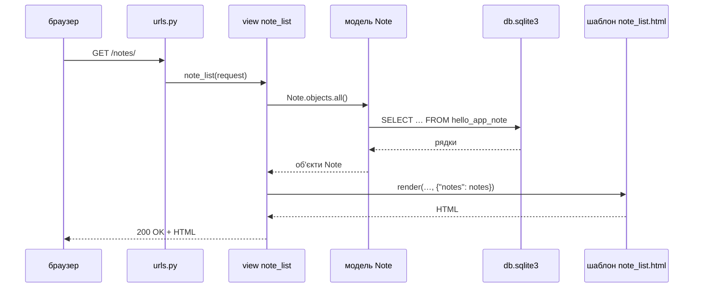
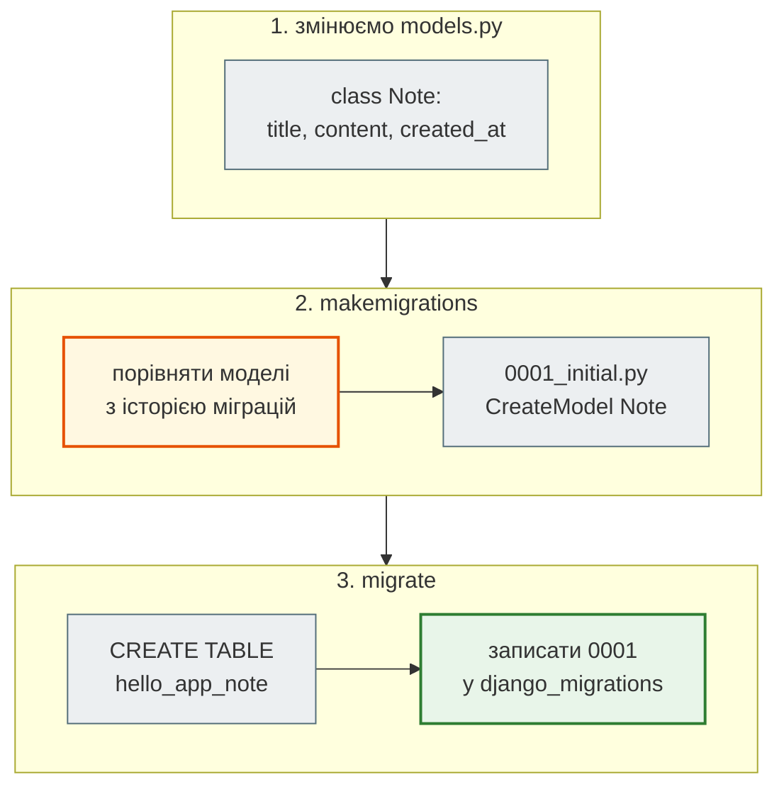
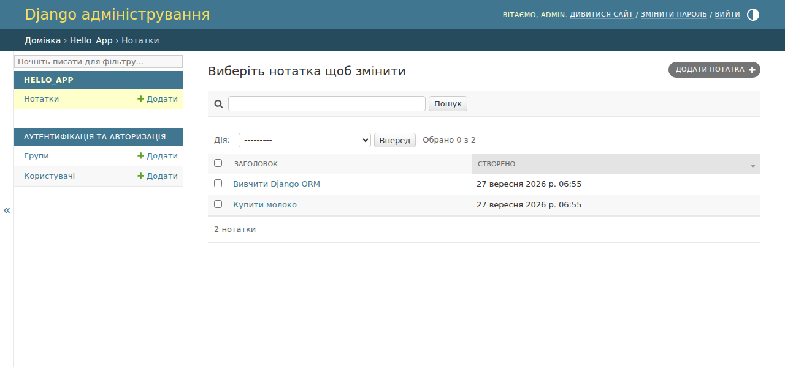
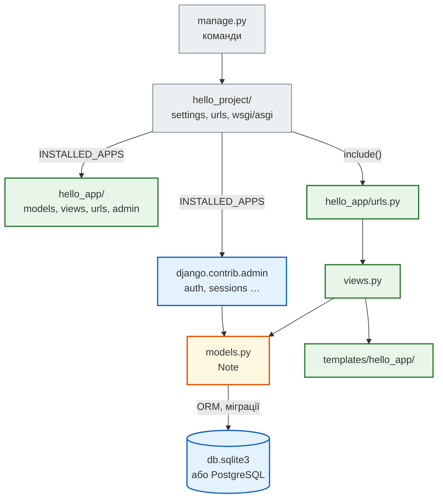
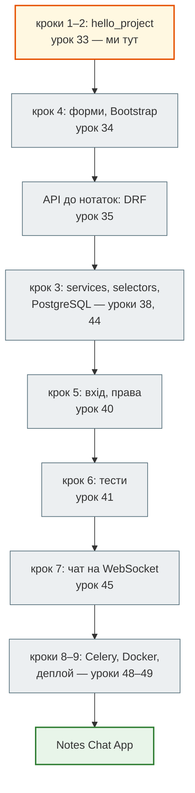
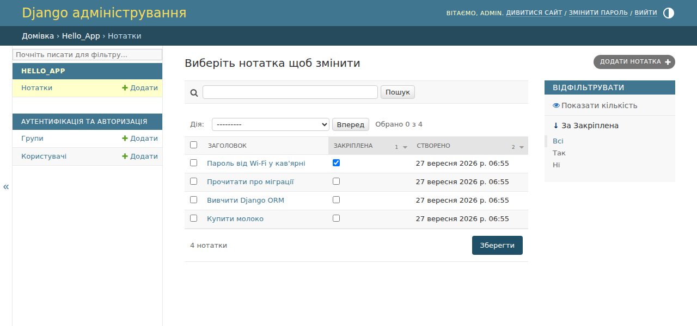

# Урок 33. Django intro: MVT, ORM, admin

За два попередні уроки ми написали два сервери. `smachno_api.py` (урок 31) — на голому `http.server`: самі розбирали шлях, самі перевіряли токен, самі збирали JSON. Meteo API (урок 32) — на FastAPI: маршрути й перевірку даних узяв на себе фреймворк. Обидва сервери віддавали **дані** іншим програмам.

А якщо потрібен **сайт для людей**: сторінки з HTML, база даних, вхід для адміністратора, панель, де можна додати чи виправити запис без жодного SQL? Писати все це самому — тижні роботи. Для цього є **Django** — вебфреймворк «з батарейками в комплекті»: ORM для бази даних, міграції, шаблони, адмін-панель, авторизація, захист від типових атак — усе в одному пакеті.

З цього уроку ми будуємо **застосунок нотаток**. Він ростиме з уроку в урок: форми й Bootstrap (урок 34), API (урок 35), вхід і права (урок 40), тести (урок 41), чат на WebSocket (урок 45), Docker і деплой (уроки 48–49) — аж до повного [**Notes Chat App**](https://github.com/NikoriakViktot/notes_chat_app) викладача. Сьогодні — перший крок: проєкт, сторінки, модель `Note`, ORM і адмінка.

**Що потрібно з попередніх уроків:** віртуальне середовище й `pip` (урок 2), класи (урок 19), SQL: таблиці, ключі, `SELECT … WHERE` (урок 29), HTTP-запит і відповідь (урок 31), REST (урок 32).

**Після уроку ти зможеш:**

- створити Django-проєкт і застосунок, пояснити їхню структуру й `settings.py`;
- пояснити шлях запиту в Django: URL → view → модель → шаблон → відповідь (MVT);
- написати view-функцію, маршрут і HTML-шаблон;
- описати модель, створити й застосувати міграцію, прочитати її SQL;
- працювати з даними через ORM: `create`, `filter`, `get`, `order_by`, `update`, `delete`;
- зареєструвати модель в адмін-панелі й налаштувати список записів.

**Задача розділу.** Сайт нотаток `hello_project` з адмін-панеллю, а в практиці — «закріплені» нотатки. Повний приклад — у розділі [«Практика»](#practice).

**Ноутбук заняття:** [`note_lesson_33_django.ipynb`](https://github.com/NikoriakViktot/PY-Course-Victor-Nikoriak-22-09-2026/blob/main/module_4/lessons/lesson_33_django_intro/note_lesson_33_django.ipynb) [](https://colab.research.google.com/github/NikoriakViktot/PY-Course-Victor-Nikoriak-22-09-2026/blob/main/module_4/lessons/lesson_33_django_intro/note_lesson_33_django.ipynb) — Django, ORM і адмінка прямо в ноутбуці.

!!! info "Книга Django"
    Цей урок — стислий вхід у тему. Кожен розділ має посилання **«Поглиблено»** на [Django-книгу викладача](https://nikoriakviktot.github.io/notes_chat_app/): там той самий проєкт розібрано детальніше, а маршрут [Zero to Hero](https://nikoriakviktot.github.io/notes_chat_app/tutorials/) веде від цього уроку до готового застосунку з чатом. Урок 33 — це кроки 1–2 цього маршруту.

## Пригадай

1. Як у SQL вибрати нотатки, в заголовку яких є слово «Django», від найновішої (урок 29)?
2. Що таке клас і екземпляр (урок 19)? Чим `Note` відрізняється від `Note(title="…")`?
3. Що має повернути сервер на запит неіснуючої сторінки (урок 32)?

??? success "Відповіді"

    1. `SELECT * FROM note WHERE title LIKE '%Django%' ORDER BY created_at DESC;` Сьогодні той самий запит напишемо на Python — і побачимо, що Django згенерує майже такий самий SQL.
    2. Клас — опис (креслення), екземпляр — конкретний об'єкт. У Django клас-модель описує **таблицю**, а екземпляр — **рядок** у ній.
    3. `404 Not Found`. Django робить це сам для адрес, яких немає в маршрутах.

## Встановлення і перший проєкт

Django — звичайний пакет з PyPI. Встановлюємо у віртуальне середовище проєкту (урок 2):

```bash
python -m venv venv
source venv/bin/activate            # Windows: venv\Scripts\activate
pip install "Django>=5.2,<6"
```

Версія 5.2 — **LTS** (довгострокова підтримка до квітня 2028), на ній побудована книга й Notes Chat App.

Приклад виводу (номер патч-версії у тебе може бути новішим):

```text
$ python -m django --version
5.2.17
```

Django-сайт складається з **проєкту** — налаштувань усього сайту — і **застосунків** (apps): окремих частин за змістом. Нотатки — один застосунок; згодом додамо інші (наприклад, чат). Створимо проєкт `hello_project` у поточній папці (крапка в кінці!) і застосунок `hello_app`:

```text
$ django-admin startproject hello_project .
$ python manage.py startapp hello_app
$ find . -name "*.py" | sort
./hello_app/__init__.py
./hello_app/admin.py
./hello_app/apps.py
./hello_app/migrations/__init__.py
./hello_app/models.py
./hello_app/tests.py
./hello_app/views.py
./hello_project/__init__.py
./hello_project/asgi.py
./hello_project/settings.py
./hello_project/urls.py
./hello_project/wsgi.py
./manage.py
```

| Файл | Навіщо |
|---|---|
| `manage.py` | командний рядок проєкту: запуск сервера, міграції, shell |
| `hello_project/settings.py` | налаштування: застосунки, база даних, мова, часовий пояс |
| `hello_project/urls.py` | головна таблиця маршрутів: яка адреса — яка функція |
| `hello_project/wsgi.py`, `asgi.py` | вхідні точки для production-серверів (уроки 45, 49) |
| `hello_app/models.py` | моделі — таблиці бази даних |
| `hello_app/views.py` | view-функції: запит → відповідь |
| `hello_app/admin.py` | що показувати в адмін-панелі |
| `hello_app/migrations/` | історія змін структури бази |

Новий застосунок треба **зареєструвати** в налаштуваннях — інакше Django його не бачить. Заодно — українська мова й київський час:

```python title="hello_project/settings.py (фрагмент)"
INSTALLED_APPS = [
    "django.contrib.admin",
    "django.contrib.auth",
    "django.contrib.contenttypes",
    "django.contrib.sessions",
    "django.contrib.messages",
    "django.contrib.staticfiles",
    "hello_app",
]

LANGUAGE_CODE = "uk"

TIME_ZONE = "Europe/Kyiv"
```

Вбудовані застосунки (`admin`, `auth`, `sessions` …) вже мають свої таблиці. Створимо їх у базі — за замовчуванням це файл SQLite `db.sqlite3` поруч з `manage.py`:

```text
$ python manage.py migrate
Operations to perform:
  Apply all migrations: admin, auth, contenttypes, sessions
Running migrations:
  Applying contenttypes.0001_initial... OK
  Applying auth.0001_initial... OK
  Applying admin.0001_initial... OK
  Applying admin.0002_logentry_remove_auto_add... OK
  Applying admin.0003_logentry_add_action_flag_choices... OK
  Applying contenttypes.0002_remove_content_type_name... OK
  Applying auth.0002_alter_permission_name_max_length... OK
  Applying auth.0003_alter_user_email_max_length... OK
  Applying auth.0004_alter_user_username_opts... OK
  Applying auth.0005_alter_user_last_login_null... OK
  Applying auth.0006_require_contenttypes_0002... OK
  Applying auth.0007_alter_validators_add_error_messages... OK
  Applying auth.0008_alter_user_username_max_length... OK
  Applying auth.0009_alter_user_last_name_max_length... OK
  Applying auth.0010_alter_group_name_max_length... OK
  Applying auth.0011_update_proxy_permissions... OK
  Applying auth.0012_alter_user_first_name_max_length... OK
  Applying sessions.0001_initial... OK
```

!!! tip "Поглиблено"
    Книга: [Середовище та запуск](https://nikoriakviktot.github.io/notes_chat_app/tutorials/01_hello_django/environment/), [Структура проєкту](https://nikoriakviktot.github.io/notes_chat_app/02_django_core/project_structure_full/), [Команди manage.py](https://nikoriakviktot.github.io/notes_chat_app/02_django_core/management_commands_full/).

## MVT: як Django відповідає на запит

Django побудований за схемою **MVT** — Model, View, Template:

- **Model** — дані і робота з базою (`models.py`);
- **View** — логіка: отримує запит, бере дані з моделі, повертає відповідь (`views.py`);
- **Template** — як дані виглядають у HTML (`templates/`).

А хто вирішує, яку view викликати? **URLconf** — таблиця маршрутів (`urls.py`).



!!! note "MVT і MVC"
    В інших фреймворках схожу схему називають MVC (Model–View–Controller). Назви зсунуті: те, що в MVC «контролер», у Django — **view**, а те, що в MVC «view» (відображення), у Django — **template**.

### Перші сторінки: view і маршрут

View — звичайна функція: приймає об'єкт запиту `request` і повертає `HttpResponse`.

```python title="hello_app/views.py"
from django.http import HttpResponse


def index(request):
    return HttpResponse("Hello, Django!")


def about(request):
    return HttpResponse("Це моя перша сторінка на Django!")
```

Маршрути застосунку — у його власному `urls.py`. `name` дає маршруту ім'я, щоб посилатися на нього без жорстко прописаної адреси:

```python title="hello_app/urls.py"
from django.urls import path

from . import views

app_name = "hello_app"

urlpatterns = [
    path("", views.index, name="index"),
    path("about/", views.about, name="about"),
]
```

І підключаємо їх до головного `urls.py` проєкту через `include`:

```python title="hello_project/urls.py"
from django.contrib import admin
from django.urls import include, path

urlpatterns = [
    path("admin/", admin.site.urls),
    path("", include("hello_app.urls")),
]
```

Запускаємо сервер розробки (в окремому терміналі — він працює, доки не натиснеш `Ctrl+C`) і заходимо на сторінки через `curl` (урок 31) або браузер:

Приклад виводу (дата й час у тебе інші):

```text
$ python manage.py runserver
Watching for file changes with StatReloader
Performing system checks...

System check identified no issues (0 silenced).
September 27, 2026 - 06:55:37
Django version 5.2.17, using settings 'hello_project.settings'
Starting development server at http://127.0.0.1:8000/
Quit the server with CONTROL-C.
```

```text
$ curl -s http://127.0.0.1:8000/
Hello, Django!
$ curl -s http://127.0.0.1:8000/about/
Це моя перша сторінка на Django!
$ curl -s -o /dev/null -w "%{http_code}\n" http://127.0.0.1:8000/weather/
404
```

- `127.0.0.1:8000` — наш комп'ютер, порт 8000 (урок 31).
- На `/weather/` маршруту немає — Django сам відповідає `404`. Поки `DEBUG = True`, у браузері буде ще й жовта сторінка з переліком маршрутів — підказка для розробника. На production `DEBUG` вимикають (урок 49).
- `runserver` сам перезапускається, коли ти змінюєш `.py`-файли, — перезапускати вручну не треба.

!!! tip "Поглиблено"
    Книга: [URLs та Views](https://nikoriakviktot.github.io/notes_chat_app/tutorials/01_hello_django/urls_and_views/), [URL routing](https://nikoriakviktot.github.io/notes_chat_app/02_django_core/url_routing_full/), [Views](https://nikoriakviktot.github.io/notes_chat_app/02_django_core/views_full/), [Життєвий цикл запиту](https://nikoriakviktot.github.io/notes_chat_app/02_django_core/request_lifecycle/).

## Модель і міграції

**Модель** — Python-клас, який описує таблицю. Кожен атрибут-поле — колонка:

```python title="hello_app/models.py"
from django.db import models


class Note(models.Model):
    title = models.CharField("Заголовок", max_length=200)
    content = models.TextField("Текст", blank=True)
    created_at = models.DateTimeField("Створено", auto_now_add=True)

    class Meta:
        verbose_name = "нотатка"
        verbose_name_plural = "нотатки"
        ordering = ["-created_at"]

    def __str__(self):
        return self.title
```

| Поле | Колонка SQL | Що означає |
|---|---|---|
| `id` (додається сам) | `integer PRIMARY KEY` | первинний ключ (урок 29) |
| `CharField(max_length=200)` | `varchar(200) NOT NULL` | короткий рядок з обмеженням довжини |
| `TextField(blank=True)` | `text NOT NULL` | довгий текст; `blank=True` — можна лишити порожнім у формі |
| `DateTimeField(auto_now_add=True)` | `datetime NOT NULL` | Django сам запише час створення |

`Meta.ordering = ["-created_at"]` — порядок за замовчуванням: мінус означає «за спаданням», нові зверху. `__str__` — як нотатку показувати людям: в адмінці й у shell.

Таблиці ще немає. Django порівнює моделі з попереднім станом і створює **міграцію** — Python-файл з описом змін:

```text
$ python manage.py makemigrations
Migrations for 'hello_app':
  hello_app/migrations/0001_initial.py
    + Create model Note
```

Яку SQL-команду виконає ця міграція? Подивимось — це той самий `CREATE TABLE` з уроку 29:

```text
$ python manage.py sqlmigrate hello_app 0001
BEGIN;
--
-- Create model Note
--
CREATE TABLE "hello_app_note" ("id" integer NOT NULL PRIMARY KEY AUTOINCREMENT, "title" varchar(200) NOT NULL, "content" text NOT NULL, "created_at" datetime NOT NULL);
COMMIT;
```

І застосовуємо:

```text
$ python manage.py migrate hello_app
Operations to perform:
  Apply all migrations: hello_app
Running migrations:
  Applying hello_app.0001_initial... OK
```



- **`makemigrations`** — лише створює файл. База не змінюється.
- **`migrate`** — виконує ще не застосовані міграції й записує їх у службову таблицю `django_migrations`. Тому повторний `migrate` нічого не зробить.
- Файли міграцій **комітять у git**: з ними база кожного розробника й сервера має ту саму структуру.

!!! tip "Поглиблено"
    Книга: [Моделі і міграції](https://nikoriakviktot.github.io/notes_chat_app/tutorials/02_first_model/models_and_migrations/), [Django models](https://nikoriakviktot.github.io/notes_chat_app/03_database_and_orm/django_models/), [Міграції детально](https://nikoriakviktot.github.io/notes_chat_app/03_database_and_orm/django_migrations_full/).

## ORM: SQL мовою Python

**ORM** (Object-Relational Mapping) перетворює роботу з рядками таблиці на роботу з Python-об'єктами. Запускаємо інтерактивну консоль з уже налаштованим Django:

```bash
python manage.py shell
```

Усі приклади нижче — введені в цю консоль. Створюємо нотатки:

```python
from hello_app.models import Note

Note.objects.create(title="Купити молоко", content="2 л, 2.5%")
Note.objects.create(title="Вивчити Django ORM", content="filter, get, order_by")
note = Note(title="Ідеї для проєкту")
note.save()
print(note.id, note)
print(Note.objects.count())
```

```text
3 Ідеї для проєкту
3
```

- `Note.objects` — **менеджер**: вхідна точка до таблиці. `create` = створити об'єкт і одразу `save()`.
- `Note(...)` без `save()` існує лише в пам'яті Python — в базі його ще немає.

### Читання: QuerySet

```python
for note in Note.objects.all():
    print(note.id, note.title)

django_notes = Note.objects.filter(title__icontains="django")
print(django_notes)
print(Note.objects.exclude(content="").count())
print(Note.objects.order_by("title").first())
```

```text
3 Ідеї для проєкту
2 Вивчити Django ORM
1 Купити молоко
<QuerySet [<Note: Вивчити Django ORM>]>
2
Ідеї для проєкту
```

`filter` повертає **QuerySet** — набір записів, з яким можна працювати далі. Умови пишуть як `поле__умова=значення`:

| ORM | SQL |
|---|---|
| `title="Купити молоко"` | `title = 'Купити молоко'` |
| `title__icontains="django"` | `title LIKE '%django%'` без урахування регістру |
| `title__startswith="Ку"` | `title LIKE 'Ку%'` |
| `id__gte=2` | `id >= 2` |
| `id__in=[1, 3]` | `id IN (1, 3)` |
| `content=""` в `exclude` | `NOT (content = '')` |

Який SQL Django насправді надішле? Кожен QuerySet має атрибут `query`:

```python
print(django_notes.query)
```

```text
SELECT "hello_app_note"."id", "hello_app_note"."title", "hello_app_note"."content", "hello_app_note"."created_at" FROM "hello_app_note" WHERE "hello_app_note"."title" LIKE %django% ESCAPE '\' ORDER BY "hello_app_note"."created_at" DESC
```

!!! warning "SQLite і кирилиця"
    У SQLite `icontains` не враховує регістр лише для **латинських** літер: `filter(title__icontains="купити")` не знайде «Купити молоко». PostgreSQL порівнює без регістру будь-які літери — ще одна причина використовувати його в production (урок 38). Те саме стосується пошуку в адмінці.

Порівняй з першим питанням з «Пригадай»: той самий `SELECT … WHERE … LIKE … ORDER BY created_at DESC`. `ORDER BY` з'явився сам — з `Meta.ordering`.

### Один запис: get

`get` повертає **один** об'єкт і суворо перевіряє, що він рівно один:

```python
note = Note.objects.get(id=2)
print(note.title, "|", note.content)

try:
    Note.objects.get(id=99)
except Note.DoesNotExist as error:
    print("DoesNotExist:", error)

try:
    Note.objects.get(id__gte=1)
except Note.MultipleObjectsReturned as error:
    print("MultipleObjectsReturned:", error)
```

```text
Вивчити Django ORM | filter, get, order_by
DoesNotExist: Note matching query does not exist.
MultipleObjectsReturned: get() returned more than one Note -- it returned 3!
```

### QuerySet лінивий

QuerySet не йде в базу, доки не знадобляться дані: під час `for`, `print`, `len`, `list`, індексування. Тому ланцюжок `filter(...).exclude(...).order_by(...)` — це **один** SQL-запит, а не три. Перевіримо, рахуючи запити:

```python
from django.db import connection, reset_queries
from django.conf import settings

settings.DEBUG = True               # у режимі DEBUG Django запам'ятовує виконані запити
reset_queries()
chain = Note.objects.filter(id__gte=1).exclude(content="").order_by("title")
print("запитів після побудови:", len(connection.queries))
titles = [note.title for note in chain]
print("запитів після циклу:", len(connection.queries))
print(titles)
```

```text
запитів після побудови: 0
запитів після циклу: 1
['Вивчити Django ORM', 'Купити молоко']
```

### Зміна і видалення

```python
note = Note.objects.get(title="Купити молоко")
note.content = "2 л, 2.5%, і хліб"
note.save()

updated = Note.objects.filter(title__icontains="django").update(content="QuerySet, lookups")
print("оновлено:", updated)

deleted = Note.objects.filter(title="Ідеї для проєкту").delete()
print("видалено:", deleted)
print(list(Note.objects.values_list("title", "content")))
```

```text
оновлено: 1
видалено: (1, {'hello_app.Note': 1})
[('Вивчити Django ORM', 'QuerySet, lookups'), ('Купити молоко', '2 л, 2.5%, і хліб')]
```

- `note.save()` — змінити **один** об'єкт: прочитали, змінили атрибут, зберегли.
- `QuerySet.update()` — один `UPDATE … WHERE …` для всіх відповідних рядків, без завантаження об'єктів у Python.
- `delete()` повертає кількість видалених рядків і розбивку за моделями.
- `values_list` — лише потрібні колонки, кортежами, без створення об'єктів `Note`.

!!! tip "Поглиблено"
    Книга: [Django ORM](https://nikoriakviktot.github.io/notes_chat_app/03_database_and_orm/django_orm_full/), [ORM у схемах](https://nikoriakviktot.github.io/notes_chat_app/03_database_and_orm/orm_mermaid_full/), [Оптимізація запитів](https://nikoriakviktot.github.io/notes_chat_app/03_database_and_orm/query_optimization/).

## Шаблон: дані з бази на сторінці

View для списку нотаток бере дані з моделі й передає їх у **шаблон** — HTML з мовою шаблонів Django (DTL):

```python title="hello_app/views.py"
from django.http import HttpResponse
from django.shortcuts import render

from .models import Note


def index(request):
    return HttpResponse("Hello, Django!")


def about(request):
    return HttpResponse("Це моя перша сторінка на Django!")


def note_list(request):
    notes = Note.objects.all()
    return render(request, "hello_app/note_list.html", {"notes": notes})
```

```python title="hello_app/urls.py"
from django.urls import path

from . import views

app_name = "hello_app"

urlpatterns = [
    path("", views.index, name="index"),
    path("about/", views.about, name="about"),
    path("notes/", views.note_list, name="note_list"),
]
```

Шаблони Django шукає в папці `templates/` кожного застосунку. Вкладена папка з назвою застосунку (`templates/hello_app/`) захищає від конфлікту однакових імен між застосунками:

```html title="hello_app/templates/hello_app/note_list.html"
<!doctype html>
<html lang="uk">
<head><meta charset="utf-8"><title>Нотатки</title></head>
<body>
  <h1>Нотатки ({{ notes|length }})</h1>
  <ul>
    
      <li><strong>{{ note.title }}</strong> — {{ note.content|default:"без тексту" }}</li>
    
      <li>Нотаток ще немає.</li>
    
  </ul>
</body>
</html>
```

- `{{ … }}` — вставити значення; `|length`, `|default:"…"` — **фільтри**.
- ` …  … ` — цикл; гілка `empty` — коли список порожній.
- Django **екранує** HTML у значеннях: нотатка з заголовком `<script>` покажеться як текст, а не виконається (захист від XSS — урок 40).

```text
$ curl -s http://127.0.0.1:8000/notes/
<!doctype html>
<html lang="uk">
<head><meta charset="utf-8"><title>Нотатки</title></head>
<body>
  <h1>Нотатки (2)</h1>
  <ul>

      <li><strong>Вивчити Django ORM</strong> — QuerySet, lookups</li>

      <li><strong>Купити молоко</strong> — 2 л, 2.5%, і хліб</li>

  </ul>
</body>
</html>
```

!!! tip "Поглиблено"
    Книга: [Шаблони](https://nikoriakviktot.github.io/notes_chat_app/tutorials/01_hello_django/templates/), [Django templates](https://nikoriakviktot.github.io/notes_chat_app/05_frontend_and_templates/django_templates_full/). Base-шаблон, Bootstrap і форми — урок 34.

## Адмін-панель

Django **сам** будує адмін-панель для моделей: список, пошук, фільтри, форми додавання й редагування. Потрібно лише зареєструвати модель:

```python title="hello_app/admin.py"
from django.contrib import admin

from .models import Note


@admin.register(Note)
class NoteAdmin(admin.ModelAdmin):
    list_display = ("title", "created_at")
    search_fields = ("title", "content")
```

- `list_display` — колонки таблиці-списку;
- `search_fields` — поля, за якими шукає рядок пошуку (`icontains`, як у ORM).

Увійти може лише **суперкористувач**. Створюємо його (інтерактивно команда попросить пароль; тут пароль передано змінною середовища `DJANGO_SUPERUSER_PASSWORD`, щоб команду можна було виконати в скрипті):

```text
$ python manage.py createsuperuser --noinput --username admin --email admin@example.com
Superuser created successfully.
$ curl -s -o /dev/null -w "%{http_code} -> %{redirect_url}\n" http://127.0.0.1:8000/admin/
302 -> http://127.0.0.1:8000/admin/login/?next=/admin/
```

Без входу адмінка перенаправляє (`302`) на сторінку логіну. Після входу `admin` бачить нотатки — ті самі, що створили через ORM:



Пароль у базі не зберігається — лише його хеш (урок 16):

```python
from django.contrib.auth.models import User

admin_user = User.objects.get(username="admin")
print(admin_user.is_superuser, admin_user.is_staff)
print(admin_user.password.split("$")[0])
print(admin_user.check_password("lesson33-pass"), admin_user.check_password("qwerty"))
```

```text
True True
pbkdf2_sha256
True False
```

`pbkdf2_sha256` — алгоритм: сотні тисяч раундів хешування із сіллю, щоб підбирати паролі було дорого. Докладно — в уроці 40.

!!! tip "Поглиблено"
    Книга: [Django Admin (крок 1)](https://nikoriakviktot.github.io/notes_chat_app/tutorials/01_hello_django/admin/), [Кастомний ModelAdmin (крок 2)](https://nikoriakviktot.github.io/notes_chat_app/tutorials/02_first_model/django_admin/), [Django Admin детально](https://nikoriakviktot.github.io/notes_chat_app/05_frontend_and_templates/django_admin_full/).

## Архітектура: проєкт, застосунки і шлях до Notes Chat App { #architecture }



- **Проєкт — один, застосунків — багато.** Проєкт тримає налаштування й головні маршрути; застосунок — одну частину сайту зі своїми моделями, view й шаблонами. У Notes Chat App застосунок `notes_app` містить нотатки, списки, групи й чат; великі проєкти ділять таке на кілька застосунків.
- **База даних — налаштування, а не код.** Моделі й ORM однакові для SQLite і PostgreSQL: змінюється лише `DATABASES` у `settings.py`. Розробляємо на SQLite, у production — PostgreSQL (уроки 38, 48).
- **Адмінка — для персоналу, не для користувачів.** Вона швидко дає робочий інструмент власникові сервісу, але сторінки для відвідувачів пишемо самі (урок 34).

Звідки й куди рухається цей проєкт — маршрут [Zero to Hero](https://nikoriakviktot.github.io/notes_chat_app/tutorials/) Django-книги й уроки курсу:



!!! tip "Поглиблено"
    Книга: [Архітектура Django](https://nikoriakviktot.github.io/notes_chat_app/02_django_core/django_architecture_full/), [Notes Chat App: архітектура](https://nikoriakviktot.github.io/notes_chat_app/12_final_project/architecture/), [Domain model](https://nikoriakviktot.github.io/notes_chat_app/12_final_project/domain_model/).

## Практика { #practice }

### Розібраний приклад: закріплені нотатки

У Notes Chat App важливі нотатки можна **закріпити** — вони завжди зверху. Додамо поле `is_pinned` у модель:

```python title="hello_app/models.py"
from django.db import models


class Note(models.Model):
    title = models.CharField("Заголовок", max_length=200)
    content = models.TextField("Текст", blank=True)
    is_pinned = models.BooleanField("Закріплена", default=False)
    created_at = models.DateTimeField("Створено", auto_now_add=True)

    class Meta:
        verbose_name = "нотатка"
        verbose_name_plural = "нотатки"
        ordering = ["-is_pinned", "-created_at"]

    def __str__(self):
        return self.title
```

Модель змінилась — потрібна нова міграція:

```text
$ python manage.py makemigrations
Migrations for 'hello_app':
  hello_app/migrations/0002_alter_note_options_note_is_pinned.py
    ~ Change Meta options on note
    + Add field is_pinned to note
$ python manage.py migrate hello_app
Operations to perform:
  Apply all migrations: hello_app
Running migrations:
  Applying hello_app.0002_alter_note_options_note_is_pinned... OK
```

`default=False` важливий: у таблиці вже є рядки, і міграція має знати, що записати в нову колонку для них. Без `default` `makemigrations` спитав би значення інтерактивно.

Модель змінилась, тож shell треба перезапустити (`exit()` і знову `python manage.py shell`) — старий пам'ятає стару модель:

```python
from hello_app.models import Note

Note.objects.create(title="Пароль від Wi-Fi у кав'ярні", content="coffee2026", is_pinned=True)
Note.objects.create(title="Прочитати про міграції")
for note in Note.objects.all():
    print("📌" if note.is_pinned else "  ", note.title)
print("закріплених:", Note.objects.filter(is_pinned=True).count())
```

```text
📌 Пароль від Wi-Fi у кав'ярні
   Прочитати про міграції
   Вивчити Django ORM
   Купити молоко
закріплених: 1
```

- `ordering = ["-is_pinned", "-created_at"]`: спершу закріплені (`True` > `False`), усередині — нові зверху.
- Закріплена нотатка — нагорі, хоч створена раніше за «Прочитати про міграції».

І в адмінці — колонка й фільтр:

```python title="hello_app/admin.py"
from django.contrib import admin

from .models import Note


@admin.register(Note)
class NoteAdmin(admin.ModelAdmin):
    list_display = ("title", "is_pinned", "created_at")
    list_filter = ("is_pinned",)
    list_editable = ("is_pinned",)
    search_fields = ("title", "content")
```

`list_filter` додає праворуч фільтр «Закріплена: так / ні», `list_editable` — прапорець прямо в списку, без відкриття нотатки.



### Зміни приклад: пріоритет

У Notes Chat App у нотатки є **пріоритет** від 1 до 4. Додай поле `priority` з варіантами вибору:

```python
PRIORITY_CHOICES = [(1, "Низький"), (2, "Звичайний"), (3, "Високий"), (4, "Терміновий")]
priority = models.PositiveSmallIntegerField("Пріоритет", choices=PRIORITY_CHOICES, default=2)
```

**Критерії перевірки:**

- нова міграція `0003_…` створена й застосована;
- в адмінці пріоритет — випадний список з чотирма назвами, є колонка й фільтр;
- `note.get_priority_display()` повертає назву, наприклад `"Звичайний"` для нової нотатки;
- `Note.objects.filter(priority__gte=3)` знаходить лише високі й термінові.

### Спробуй самостійно: блокноти

У Notes Chat App нотатки лежать у **блокнотах**. Створи модель `Notebook` (`title`, `description`) і зв'язок «блокнот — нотатки» — зовнішній ключ з уроку 29:

```python
notebook = models.ForeignKey(Notebook, on_delete=models.SET_NULL, null=True, blank=True, related_name="notes")
```

**Критерії перевірки:**

- міграція створює таблицю `hello_app_notebook` і колонку `notebook_id` у нотатках — перевір через `sqlmigrate`;
- `notebook.notes.all()` повертає нотатки блокнота (це дав `related_name`);
- `Note.objects.filter(notebook__title="Робота")` — фільтр через зв'язок (подвійне підкреслення переходить по зовнішньому ключу, як `JOIN`);
- видалення блокнота **не** видаляє нотатки — у них `notebook` стає `None` (`SET_NULL`);
- `Notebook` зареєстровано в адмінці.

??? tip "Підказка"
    `ForeignKey` тримай у моделі `Note`, а клас `Notebook` оголоси **вище** за `Note` у `models.py`. Для `on_delete` порівняй `CASCADE`, `SET_NULL` і `PROTECT` у [документації](https://docs.djangoproject.com/en/5.2/ref/models/fields/#django.db.models.ForeignKey.on_delete).

### Знайди помилку

Колега додав у модель пріоритет, одразу відкрив shell — і отримав помилку:

```python title="hello_app/models.py"
from django.db import models


class Note(models.Model):
    PRIORITY_CHOICES = [(1, "Низький"), (2, "Звичайний"), (3, "Високий"), (4, "Терміновий")]

    title = models.CharField("Заголовок", max_length=200)
    content = models.TextField("Текст", blank=True)
    is_pinned = models.BooleanField("Закріплена", default=False)
    priority = models.PositiveSmallIntegerField("Пріоритет", choices=PRIORITY_CHOICES, default=2)
    created_at = models.DateTimeField("Створено", auto_now_add=True)

    class Meta:
        verbose_name = "нотатка"
        verbose_name_plural = "нотатки"
        ordering = ["-is_pinned", "-created_at"]

    def __str__(self):
        return self.title
```

```python
from hello_app.models import Note

print(Note.objects.filter(priority__gte=3).count())
```

```text
OperationalError: no such column: hello_app_note.priority
```

??? success "Відповідь"
    Модель змінили, а **міграцію не створили й не застосували**. Клас `Note` знає про поле `priority`, і ORM будує SQL з колонкою `hello_app_note.priority`, але в таблиці бази її ще немає. Звідси `no such column`.

    Виправлення — завжди пара команд після зміни моделі:

    ```text
    $ python manage.py makemigrations
    Migrations for 'hello_app':
      hello_app/migrations/0003_note_priority.py
        + Add field priority to note
    $ python manage.py migrate hello_app
    Operations to perform:
      Apply all migrations: hello_app
    Running migrations:
      Applying hello_app.0003_note_priority... OK
    ```

    І перезапустити shell. Якщо `makemigrations` відповідає «No changes detected» — перевір, чи застосунок є в `INSTALLED_APPS`.

Після міграції той самий запит працює:

```python
from hello_app.models import Note

print(Note.objects.filter(priority__gte=3).count())
print(Note.objects.first().get_priority_display())
```

```text
0
Звичайний
```

## Підсумок

| Поняття | Що запам'ятати |
|---|---|
| Django | вебфреймворк «з батарейками»: ORM, міграції, шаблони, адмінка, auth |
| Проєкт / застосунок | `startproject` — налаштування сайту; `startapp` — частина за змістом; застосунок — в `INSTALLED_APPS` |
| MVT | URLconf → view → model → template → `HttpResponse` |
| View | функція `request → HttpResponse` / `render(...)` |
| URL | `path("notes/", views.note_list, name="note_list")`, `include()`, `app_name` |
| Модель | клас = таблиця, поле = колонка, екземпляр = рядок; `Meta.ordering`, `__str__` |
| Міграції | `makemigrations` створює файл, `migrate` змінює базу; `sqlmigrate` показує SQL; файли — в git |
| ORM | `create`, `all`, `filter`, `exclude`, `get`, `order_by`, `update`, `delete`, `values_list` |
| Lookups | `поле__icontains`, `__gte`, `__in`, `зв'язок__поле` |
| QuerySet | лінивий: SQL — лише коли потрібні дані; `.query` показує SQL |
| Шаблони | `{{ змінна|фільтр }}`, `…`, автоекранування HTML |
| Адмінка | `@admin.register`, `list_display`, `search_fields`, `list_filter`, `list_editable`; суперкористувач |

### Самоперевірка

1. Чим проєкт відрізняється від застосунку? Що буде, якщо забути додати застосунок в `INSTALLED_APPS`?
2. Опиши шлях запиту `GET /notes/` у Django.
3. Навіщо дві команди — `makemigrations` і `migrate`?
4. Чим `get()` відрізняється від `filter()`? Які винятки може кинути `get()`?
5. Скільки SQL-запитів виконає `Note.objects.filter(...).exclude(...).order_by(...)`, якщо результат ніде не використати?
6. Чим `note.save()` відрізняється від `Note.objects.filter(...).update(...)`?
7. Навіщо `default=False` у новому полі `is_pinned`?

??? success "Відповіді"

    1. Проєкт — налаштування й маршрути всього сайту; застосунок — окрема частина з моделями, view й шаблонами. Без `INSTALLED_APPS` Django не бачить моделей застосунку: `makemigrations` нічого не знайде, адмінка й шаблони застосунку не працюватимуть.
    2. `urls.py` проєкту → `include` → `urls.py` застосунку → `note_list(request)` → `Note.objects.all()` → SQL до бази → `render` шаблону з контекстом → `HttpResponse` з HTML.
    3. `makemigrations` описує зміну у файлі (його переглядають і комітять), `migrate` виконує її на конкретній базі. Одна міграція застосовується на базах усіх розробників і сервера.
    4. `filter()` повертає QuerySet — 0, 1 чи багато записів. `get()` повертає один об'єкт і кидає `DoesNotExist` (немає) або `MultipleObjectsReturned` (більше одного).
    5. Жодного: QuerySet лінивий. SQL піде, коли дані знадобляться — у циклі, `list`, `print`, `len`.
    6. `save()` зберігає один завантажений об'єкт; `update()` — один `UPDATE` для всіх рядків QuerySet, без завантаження об'єктів у Python.
    7. У таблиці вже є рядки; міграції треба знати, що записати в нову колонку для них.

### Що далі

- Ноутбук заняття: [`note_lesson_33_django.ipynb`](https://github.com/NikoriakViktot/PY-Course-Victor-Nikoriak-22-09-2026/blob/main/module_4/lessons/lesson_33_django_intro/note_lesson_33_django.ipynb) [](https://colab.research.google.com/github/NikoriakViktot/PY-Course-Victor-Nikoriak-22-09-2026/blob/main/module_4/lessons/lesson_33_django_intro/note_lesson_33_django.ipynb) — ORM, view, шаблон і адмінка з перевірками.
- Готовий проєкт уроку — [`hello_project`](https://github.com/NikoriakViktot/PY-Course-Victor-Nikoriak-22-09-2026/tree/main/module_4/lessons/lesson_33_django_intro/hello_project) у папці уроку.
- Наступний урок — 34, «Django: forms, HTML practice»: base-шаблон, Bootstrap, `ModelForm` і повний CRUD нотаток — крок 4 маршруту Zero to Hero.
- Книга: контрольні точки [кроку 1](https://nikoriakviktot.github.io/notes_chat_app/tutorials/01_hello_django/checkpoint/) і [кроку 2](https://nikoriakviktot.github.io/notes_chat_app/tutorials/02_first_model/checkpoint/) — чеклисти й типові помилки.

## Документація і джерела

- Django: [Tutorial part 1 — Requests and responses](https://docs.djangoproject.com/en/5.2/intro/tutorial01/), [part 2 — Models and the admin site](https://docs.djangoproject.com/en/5.2/intro/tutorial02/), [Models](https://docs.djangoproject.com/en/5.2/topics/db/models/), [Making queries](https://docs.djangoproject.com/en/5.2/topics/db/queries/), [QuerySet API](https://docs.djangoproject.com/en/5.2/ref/models/querysets/), [Migrations](https://docs.djangoproject.com/en/5.2/topics/migrations/), [Templates](https://docs.djangoproject.com/en/5.2/topics/templates/), [The admin site](https://docs.djangoproject.com/en/5.2/ref/contrib/admin/), [FAQ: MTV](https://docs.djangoproject.com/en/5.2/faq/general/#django-appears-to-be-a-mvc-framework-but-you-call-the-controller-the-view-and-the-view-the-template-how-come-you-don-t-use-the-standard-names), [версії й підтримка](https://www.djangoproject.com/download/#supported-versions)
- Книга викладача: [Django-книга і маршрут Zero to Hero](https://nikoriakviktot.github.io/notes_chat_app/) — репозиторій [`NikoriakViktot/notes_chat_app`](https://github.com/NikoriakViktot/notes_chat_app)
