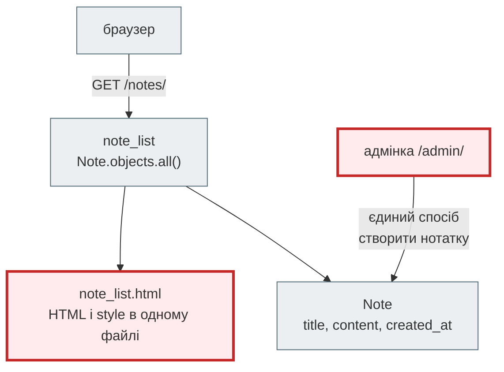
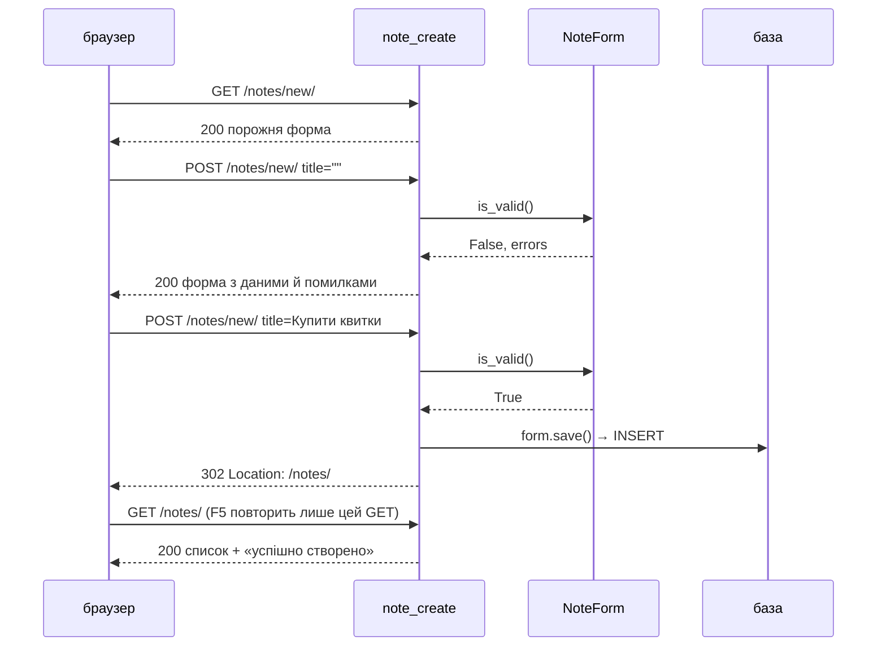
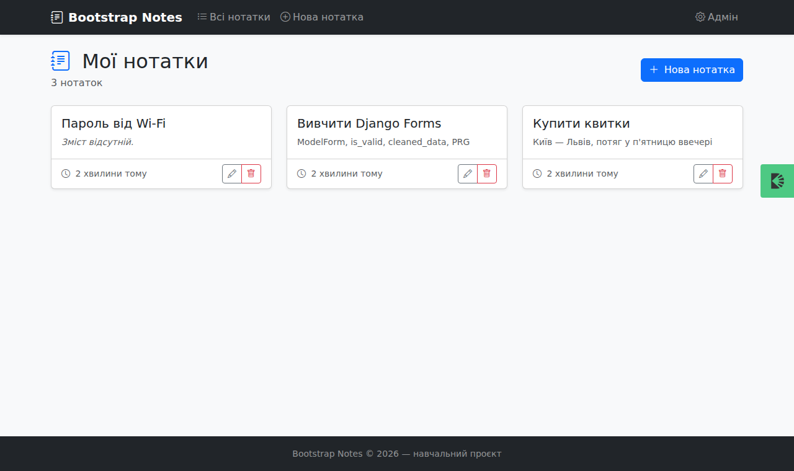
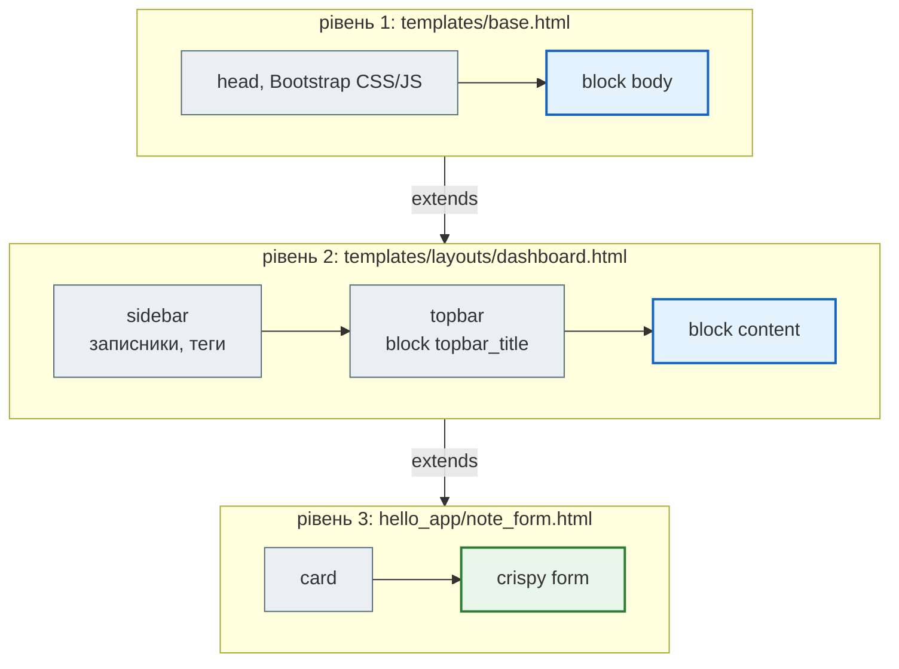
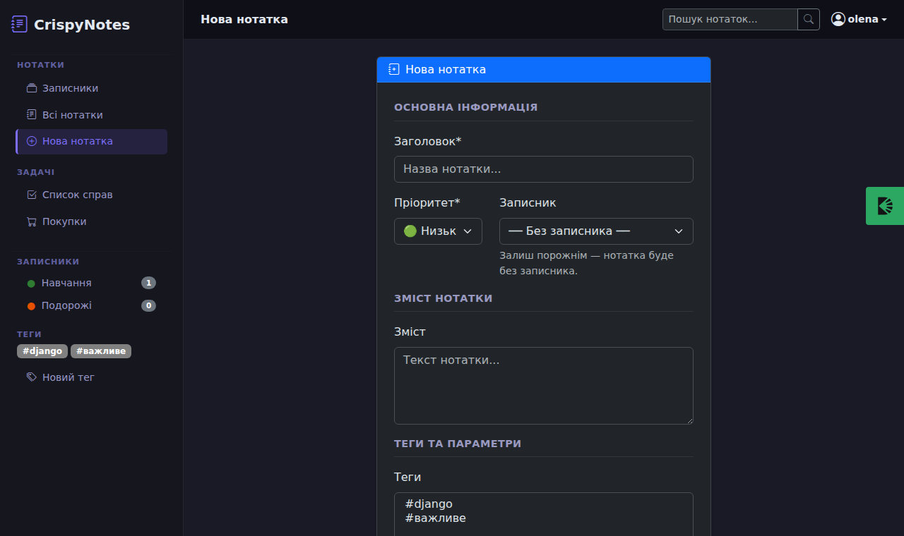
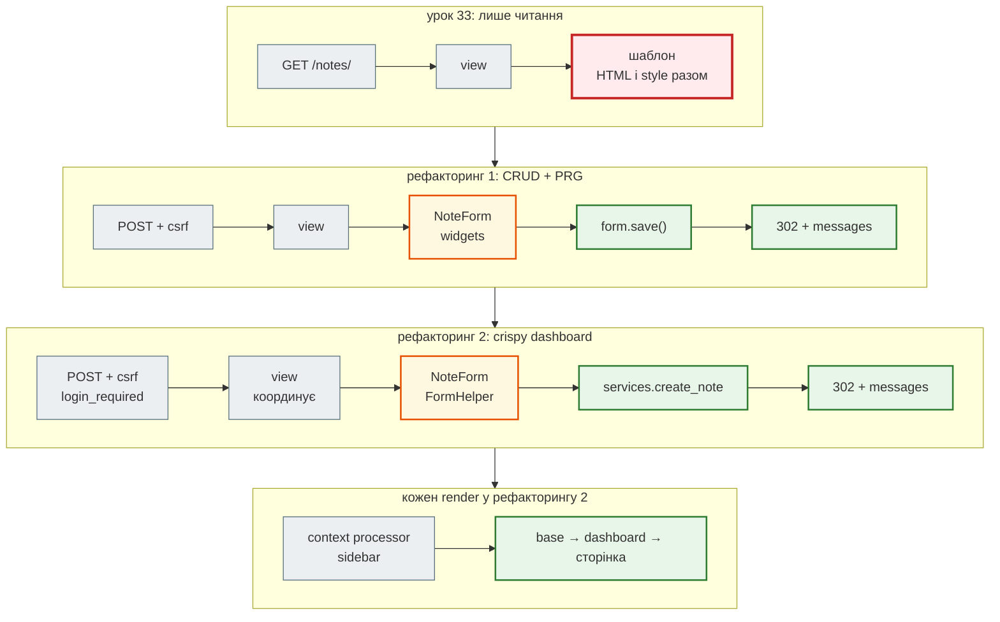

# Урок 34. Django: forms, HTML practice

Після уроку 33 у нас є робочий Django-проєкт: модель `Note`, адмінка і сторінка `/notes/` на голому HTML. Створювати нотатки можна лише в адмінці, а сторінка виглядає як документ 1995 року. Сьогодні **рефакторимо** цей проєкт у два кроки — так, як він ріс у Django-книзі:

| Етап | Проєкт у папці уроку | Що змінюємо | Крок книги |
|---|---|---|---|
| 0. Старт | `hello_project` уроку 33 | — | 1–2 |
| 1. Bootstrap CRUD | [`django_bootstrap_project`](https://github.com/NikoriakViktot/PY-Course-Victor-Nikoriak-22-09-2026/tree/main/module_4/lessons/lesson_34_django_forms/django_bootstrap_project) | ModelForm, CRUD-views, PRG, повідомлення, `base.html` + Bootstrap 5 | [2](https://nikoriakviktot.github.io/notes_chat_app/tutorials/02_first_model/) |
| 2. Crispy Dashboard | [`crispy_notes_project`](https://github.com/NikoriakViktot/PY-Course-Victor-Nikoriak-22-09-2026/tree/main/module_4/lessons/lesson_34_django_forms/crispy_notes_project) | 3-рівневі шаблони, ``, context processor, компоненти | [4](https://nikoriakviktot.github.io/notes_chat_app/tutorials/04_templates_and_forms/) |

Обидва проєкти — готовий код зі старого курсу; у кожного є покроковий `README.md` (фази А–З і кроки 0–9). На цій сторінці — **що саме змінилося, навіщо і як перевірити**. Теорія HTML, CSS, Bootstrap і форм — у розділах книги за посиланнями «Поглиблено».

**Що потрібно з попередніх уроків:** проєкт уроку 33 (модель, view, маршрут, шаблон, адмінка), HTTP-методи `GET`/`POST`, статус-коди, перенаправлення (уроки 31–32).

**Після уроку ти зможеш:**

- прочитати рефакторинг як diff: які файли додалися, які змінилися і чому;
- описати `ModelForm`, `is_valid()`, `cleaned_data`, `errors`;
- написати CRUD-view за шаблоном GET → POST → **redirect** (PRG) з `messages`;
- винести спільну розмітку в `base.html` і `layouts/dashboard.html` через `` / ``;
- перенести розмітку форми з шаблону в `FormHelper` + `Layout` (``);
- пояснити, навіщо context processor і що таке CSRF.

**Ноутбук заняття:** [`note_lesson_34_forms.ipynb`](https://github.com/NikoriakViktot/PY-Course-Victor-Nikoriak-22-09-2026/blob/main/module_4/lessons/lesson_34_django_forms/note_lesson_34_forms.ipynb) [](https://colab.research.google.com/github/NikoriakViktot/PY-Course-Victor-Nikoriak-22-09-2026/blob/main/module_4/lessons/lesson_34_django_forms/note_lesson_34_forms.ipynb) — форми, CRUD і PRG на `django_bootstrap_project` з перевірками.

## Пригадай

1. Чим `GET` відрізняється від `POST`? Який з них можна безпечно повторити (урок 32)?
2. Що означає відповідь `302` і заголовок `Location` (урок 31)?
3. Де шукає шаблон `render(request, "hello_app/note_list.html", ...)` (урок 33)?

??? success "Відповіді"

    1. `GET` читає і нічого не змінює — його можна повторювати й класти в закладки. `POST` змінює дані; повтор створить дубль.
    2. «Шукай за іншою адресою»: браузер сам зробить `GET` на адресу з `Location`. Сьогодні це основа шаблону PRG.
    3. У папках `templates/` застосунків (`APP_DIRS: True`) → `hello_app/templates/hello_app/note_list.html`.

## Старт: що маємо після уроку 33



Дві проблеми, які розв'язує цей урок:

- **немає форм** — користувач сайту не може створити, змінити чи видалити нотатку (адмінка — для персоналу);
- **немає спільної розмітки** — кожна нова сторінка копіюватиме `<head>`, стилі й навігацію.

## Рефакторинг 1. Голий HTML → Bootstrap CRUD { #refactor-1 }

Проєкт: [`django_bootstrap_project`](https://github.com/NikoriakViktot/PY-Course-Victor-Nikoriak-22-09-2026/tree/main/module_4/lessons/lesson_34_django_forms/django_bootstrap_project), покрокова інструкція — його [`README.md`](https://github.com/NikoriakViktot/PY-Course-Victor-Nikoriak-22-09-2026/blob/main/module_4/lessons/lesson_34_django_forms/django_bootstrap_project/README.md) (фази А–З).

### Що змінилося

| Файл | Зміна | Навіщо |
|---|---|---|
| `requirements.txt` | + `django-bootstrap5`, `django-unfold` | Bootstrap-теги в шаблонах; стилізована адмінка |
| `hello_project/settings.py` | + `unfold`, `django_bootstrap5` в `INSTALLED_APPS`; `MESSAGE_TAGS` | підключити пакети; рівні повідомлень = класи Bootstrap |
| `hello_app/forms.py` | **новий** — `NoteForm(ModelForm)` | поля форми й перевірка — з моделі |
| `hello_app/views.py` | + `note_detail`, `note_create`, `note_edit`, `note_delete` | повний CRUD |
| `hello_app/urls.py` | + 4 маршрути з `<int:pk>` | адреса кожної дії |
| `templates/hello_app/base.html` | **новий** — `<head>`, Bootstrap CDN, navbar, повідомлення, footer | спільна розмітка в одному місці |
| `templates/hello_app/note_*.html` | `note_list` переписаний на `` + картки; + `note_detail`, `note_form`, `note_confirm_delete` | сторінки заповнюють лише свій `` |
| `hello_app/admin.py` | `ModelAdmin` від Unfold, колонка `short_content` | зручніша адмінка |
| `hello_app/tests.py` | **новий** — 8 тестів | перевірка CRUD, PRG, CSRF (додано в курсі) |

Модель `Note` **не змінилася** — міграцій немає. Це і є рефакторинг: дані ті самі, змінився спосіб з ними працювати.

### Маршрути: чотири нові дії

```diff title="hello_app/urls.py"
 urlpatterns = [
     path('', views.index, name='index'),
-    path('about/', views.about, name='about'),
     path('notes/', views.note_list, name='note_list'),
+    path('notes/new/', views.note_create, name='note_create'),
+    path('notes/<int:pk>/', views.note_detail, name='note_detail'),
+    path('notes/<int:pk>/edit/', views.note_edit, name='note_edit'),
+    path('notes/<int:pk>/delete/', views.note_delete, name='note_delete'),
 ]
```

`<int:pk>` — конвертер: `/notes/5/` → `note_detail(request, pk=5)`, а `/notes/abc/` не збігається з жодним маршрутом → `404`.

### Форма з моделі: `forms.py`

```diff title="hello_app/forms.py — новий файл (без коментарів)"
+from django import forms
+from .models import Note
+
+
+class NoteForm(forms.ModelForm):
+    class Meta:
+        model = Note
+        fields = ['title', 'content']
+        widgets = {
+            'title': forms.TextInput(attrs={
+                'class': 'form-control',
+                'placeholder': 'Введіть назву нотатки...',
+                'autofocus': True,
+            }),
+            'content': forms.Textarea(attrs={
+                'class': 'form-control',
+                'rows': 6,
+                'placeholder': 'Текст нотатки...',
+            }),
+        }
+        labels = {
+            'title': 'Заголовок',
+            'content': 'Зміст',
+        }
```

`ModelForm` бере поля з моделі: `CharField(max_length=200)` → `<input maxlength="200">` і перевірка довжини, `blank=True` у `content` → поле необов'язкове. `fields` — завжди явний список: поля, якого немає у списку, користувач не змінить навіть підробленим запитом. `widgets` додають класи Bootstrap (`form-control`) — у рефакторингу 2 цей блок зникне.

Підготуй базу (`-v 0` — без довгого списку міграцій) і відкрий Django shell (`python manage.py shell`):

```text
$ python manage.py migrate -v 0
```

```python
from hello_app.forms import NoteForm

form = NoteForm(data={"title": "", "content": "без заголовка"})
print(form.is_valid())
print(form.errors.get_json_data())

form = NoteForm(data={"title": "  Купити квитки  ", "content": ""})
print(form.is_valid(), form.cleaned_data)
```

```text
False
{'title': [{'message': "Це поле обов'язкове.", 'code': 'required'}]}
True {'title': 'Купити квитки', 'content': ''}
```

- `is_valid()` запускає перевірки; до нього `cleaned_data` немає;
- `errors` — помилки **для кожного поля**, шаблон покаже їх поруч із полем;
- `cleaned_data` — очищені дані: `CharField` сам обрізає пробіли на краях.

### CRUD-view за шаблоном PRG

Нове у `views.py` — чотири функції. Головна з них — створення:

```diff title="hello_app/views.py — note_create (без коментарів)"
+def note_create(request):
+    if request.method == 'POST':
+        form = NoteForm(request.POST)
+        if form.is_valid():
+            note = form.save()
+            messages.success(request, f'Нотатку "{note.title}" успішно створено!')
+            return redirect('hello_app:note_list')
+    else:
+        form = NoteForm()
+
+    return render(request, 'hello_app/note_form.html', {
+        'form': form,
+        'action': 'Створити',
+        'title': 'Нова нотатка',
+    })
```

Три гілки одного view:

1. `GET` → порожня форма;
2. `POST` з помилками → **та сама** сторінка з формою, введеними даними й помилками (статус `200`);
3. `POST` без помилок → `form.save()` (INSERT) і **перенаправлення** `302`.

Третій пункт — шаблон **PRG** (Post / Redirect / Get): після успішного `POST` браузер отримує `302` і робить `GET` на список. Оновлення сторінки (F5) повторить лише цей `GET` — дубля нотатки не буде.



Решта views — варіації того самого:

| View | Що нового |
|---|---|
| `note_detail(request, pk)` | `get_object_or_404(Note, pk=pk)` — `404` замість `500` для неіснуючої нотатки |
| `note_edit(request, pk)` | `NoteForm(request.POST, instance=note)` — `save()` робить UPDATE, а не INSERT; після успіху — redirect на деталі |
| `note_delete(request, pk)` | `GET` — сторінка підтвердження; видалення **лише на `POST`** |

Перевіримо весь цикл тестовим клієнтом Django — він надсилає запити без сервера й браузера (у новому shell):

```python
from django.contrib.messages import get_messages
from django.test import Client
from django.test.utils import setup_test_environment

from hello_app.models import Note

setup_test_environment()          # дозволяє хост testserver
client = Client()

r = client.post("/notes/new/", {"title": ""})
print("порожній заголовок →", r.status_code, dict(r.context["form"].errors))

r = client.post("/notes/new/", {"title": "Купити квитки", "content": "Київ — Львів"})
print("правильні дані     →", r.status_code, r["Location"])
print("повідомлення       →", [str(m) for m in get_messages(r.wsgi_request)])

note = Note.objects.get(title="Купити квитки")
r = client.post(f"/notes/{note.pk}/edit/", {"title": "Купити квитки на потяг", "content": ""})
print("редагування        →", r.status_code, r["Location"])

r = client.get(f"/notes/{note.pk}/delete/")
print("delete GET         →", r.status_code, Note.objects.filter(pk=note.pk).exists())
r = client.post(f"/notes/{note.pk}/delete/")
print("delete POST        →", r.status_code, r["Location"], Note.objects.filter(pk=note.pk).exists())
print("неіснуюча          →", client.get("/notes/999/").status_code)
```

```text
порожній заголовок → 200 {'title': ["Це поле обов'язкове."]}
правильні дані     → 302 /notes/
повідомлення       → ['Нотатку "Купити квитки" успішно створено!']
редагування        → 302 /notes/1/
delete GET         → 200 True
delete POST        → 302 /notes/ False
Not Found: /notes/999/
неіснуюча          → 404
```

Рядок `Not Found: /notes/999/` — не `print`, а журнал Django (logger `django.request`): кожну відповідь 4xx/5xx він записує в термінал. `GET` на адресу видалення нічого не видаляє: посилання відкривають пошукові роботи й попереднє завантаження браузера, тому зміни — лише `POST`.

### Шаблони: `base.html` і ``

Спільна частина сторінки — `<head>` з Bootstrap, navbar, блок повідомлень і footer — тепер в одному файлі `base.html`. Сторінка лише заповнює свої блоки:

```diff title="templates/hello_app/note_list.html (початок, скорочено)"
-<!DOCTYPE html>
-<html lang="uk">
-<head>
-    <meta charset="UTF-8">
-    <title>Мої нотатки</title>
-    <style>
-        body { font-family: Arial, sans-serif; max-width: 600px; margin: 40px auto; }
-        .note { border: 1px solid #ddd; padding: 15px; margin: 10px 0; border-radius: 4px; }
-    </style>
-</head>
-<body>
-    <h1>Нотатки</h1>
+
+
+
+Мої нотатки — Bootstrap Notes
+
+
+<div class="d-flex justify-content-between align-items-center mb-4">
+    <h1 class="h2 mb-1"><i class="bi bi-journal-text me-2 text-primary"></i>Мої нотатки</h1>
+    <a href="" class="btn btn-primary">Нова нотатка</a>
+</div>
```

Посилання — через ``, а не рядком `/notes/5/edit/`: змінимо адресу в `urls.py` — шаблони не зламаються.

Форма в `note_form.html` — **ручний Bootstrap HTML**: цикл по полях, `label`, поле, `help_text`, помилки й кнопки — 84 рядки разом з коментарями. І обов'язковий ``:

```html title="templates/hello_app/note_form.html (ядро форми, скорочено)"
<form method="post" novalidate>
    
    
    <div class="mb-3">
        <label for="{{ field.id_for_label }}" class="form-label fw-semibold">{{ field.label }}</label>
        {{ field }}
        
            <div class="invalid-feedback d-block">{{ error }}</div>
        
    </div>
    
    <button type="submit" class="btn btn-primary">{{ action }}</button>
</form>
```

**CSRF** (Cross-Site Request Forgery) — атака, коли чужий сайт змушує твій браузер надіслати `POST` на наш сайт від твого імені. `` вставляє у форму секретний токен; `CsrfViewMiddleware` відхиляє `POST` без нього відповіддю `403`. Тестовий клієнт за замовчуванням CSRF не перевіряє — увімкнемо:

```python
csrf_client = Client(enforce_csrf_checks=True)
r = csrf_client.post("/notes/new/", {"title": "Без токена"})
print(r.status_code)
```

```text
Forbidden (CSRF cookie not set.): /notes/new/
403
```

Журнал знову пояснює причину: CSRF-cookie не встановлено, бо запит прийшов не зі сторінки нашої форми.

Результат рефакторингу 1 — список нотаток на Bootstrap-картках (зелена кнопка праворуч — згорнутий Django Debug Toolbar):



Тести проєкту (додані в курсі) перевіряють форму, PRG, `instance=`, видалення лише через `POST`, `404` і CSRF:

Приклад виводу (час залежить від машини):

```text
$ python manage.py test
Found 8 test(s).
System check identified no issues (0 silenced).
Creating test database for alias 'default'...
........
----------------------------------------------------------------------
Ran 8 tests in 0.038s

OK
Destroying test database for alias 'default'...
```

!!! tip "Поглиблено"
    - Книга, крок 2: [ModelForm і CRUD](https://nikoriakviktot.github.io/notes_chat_app/tutorials/02_first_model/modelform_and_crud/), [контрольна точка](https://nikoriakviktot.github.io/notes_chat_app/tutorials/02_first_model/checkpoint/)
    - Теорія: [HTML](https://nikoriakviktot.github.io/notes_chat_app/05_frontend_and_templates/html_basics_full/), [CSS](https://nikoriakviktot.github.io/notes_chat_app/05_frontend_and_templates/css_basics_full/), [Bootstrap 5](https://nikoriakviktot.github.io/notes_chat_app/05_frontend_and_templates/bootstrap_5_full/), [Django Templates + Bootstrap](https://nikoriakviktot.github.io/notes_chat_app/05_frontend_and_templates/django_templates_bootstrap_full/), [Django Forms](https://nikoriakviktot.github.io/notes_chat_app/04_forms_and_validation/django_forms_full/), [Unfold Admin](https://nikoriakviktot.github.io/notes_chat_app/05_frontend_and_templates/django_admin_unfold_full/)

## Рефакторинг 2. Bootstrap → Crispy Dashboard { #refactor-2 }

Проєкт: [`crispy_notes_project`](https://github.com/NikoriakViktot/PY-Course-Victor-Nikoriak-22-09-2026/tree/main/module_4/lessons/lesson_34_django_forms/crispy_notes_project), покрокова інструкція — його [`README.md`](https://github.com/NikoriakViktot/PY-Course-Victor-Nikoriak-22-09-2026/blob/main/module_4/lessons/lesson_34_django_forms/crispy_notes_project/README.md) (розділи 01–05 і кроки 0–9).

Що муляє після рефакторингу 1:

- розмітка форми **дублюється** в кожному шаблоні форми: нотатки, записника, тегу, списку справ…;
- Bootstrap-класи розкидані по `widgets` у `forms.py` **і** по шаблону;
- sidebar з записниками й тегами довелося б передавати в `context` **кожного** view.

### Що змінилося

| Файл | Зміна | Навіщо |
|---|---|---|
| `requirements.txt` | − `django-bootstrap5`, `django-unfold`; + `django-crispy-forms`, `crispy-bootstrap5` | форми рендерить crispy |
| `settings.py` | + `crispy_forms`, `crispy_bootstrap5`, `CRISPY_TEMPLATE_PACK`; `TEMPLATES["DIRS"] = [BASE_DIR / "templates"]`; + context processor; `LOGIN_URL` | підключити crispy; спільні шаблони поза застосунком; sidebar у кожному шаблоні |
| `templates/base.html` → `templates/layouts/dashboard.html` → сторінка | **3 рівні** замість 2 | HTML-оболонка, каркас dashboard (sidebar + topbar), вміст сторінки |
| `templates/components/` | **нові** — `empty_state`, `pagination`, `confirm_modal` | повторювані шматки через `` |
| `forms.py` | `widgets` → `FormHelper` + `Layout` | розмітка форми описана в Python |
| `note_form.html` | ручний HTML форми → `` | один тег замість циклу по полях |
| `context_processors.py` | **новий** — `sidebar_context` | записники й теги — у кожному шаблоні без участі view |
| `models.py`, `views.py`, `services.py`, `selectors.py` | + `Notebook`, `Tag`, `TodoList`, `ShoppingList`, `Reminder`; `user` у кожній моделі; `@login_required`; логіка — у `services`/`selectors` | застосунок виріс до записників, тегів і списків |
| `hello_app/tests.py` | **новий** — 6 тестів | вхід, crispy-форма, фільтр за користувачем, context processor (додано в курсі) |

!!! note "Домен теж виріс"
    Між кроками 2 і 4 книги лежить крок 3: нові моделі, зв'язки `ForeignKey`/`ManyToMany`, шари **services** (зміни даних) і **selectors** (читання). Тут вони вже є в коді — view викликає `services.create_note(...)` замість `form.save()`. Докладно цей рефакторинг — в уроці 44 («Архітектура застосунків і патерни»); зараз достатньо знати, що view лише координує: форма перевіряє, сервіс зберігає.

### Шаблони: три рівні



Рівень 2 заповнює `` рівня 1 каркасом dashboard і відкриває свій ``; сторінка заповнює лише його. Змінити sidebar — один файл на весь застосунок.

### Форма: `widgets` → `FormHelper` + `Layout`

```diff title="hello_app/forms.py — NoteForm (скорочено)"
 class NoteForm(forms.ModelForm):
     class Meta:
         model = Note
-        fields = ['title', 'content']
-        widgets = {
-            'title': forms.TextInput(attrs={'class': 'form-control', ...}),
-            'content': forms.Textarea(attrs={'class': 'form-control', 'rows': 6, ...}),
-        }
+        fields = ['title', 'content', 'priority', 'notebook', 'tags', 'is_pinned']
+        # widgets немає: класи Bootstrap додає crispy (CRISPY_TEMPLATE_PACK = "bootstrap5")
+
+    def __init__(self, *args, user=None, **kwargs):
+        super().__init__(*args, **kwargs)
+        # безпека: у списках лише записники й теги цього користувача
+        self.fields['notebook'].queryset = Notebook.objects.filter(user=user)
+        self.fields['tags'].queryset = Tag.objects.filter(user=user)
+
+        self.helper = FormHelper()
+        self.helper.form_method = 'post'
+        self.helper.form_id = 'note-form'
+        self.helper.layout = Layout(
+            Fieldset('Основна інформація',
+                Field('title', placeholder='Назва нотатки...', autofocus=True),
+                Row(Column('priority', css_class='col-md-4'),
+                    Column('notebook', css_class='col-md-8')),
+            ),
+            Fieldset('Зміст нотатки', Field('content', rows=4)),
+            Fieldset('Теги та параметри', Field('tags', size=3), Div(Field('is_pinned'))),
+            Submit('submit', 'Зберегти нотатку', css_class='btn btn-primary me-2'),
+        )
```

```diff title="hello_app/templates/hello_app/note_form.html (ядро)"
-<form method="post" novalidate>
-    
-    
-    <div class="mb-3">
-        <label ...>{{ field.label }}</label>
-        {{ field }}
-        <div class="invalid-feedback d-block">{{ error }}</div>
-    </div>
-    
-    <button type="submit" class="btn btn-primary">{{ action }}</button>
-</form>
+
+
```

`` сам генерує `<form>`, ``, `fieldset`, сітку `row`/`col`, класи `form-control`/`form-select`, помилки й кнопку — за описом у `Layout`. Перевірка даних (`is_valid()`, `cleaned_data`) не змінилася: `FormHelper` впливає лише на **вигляд**.

Три рівні рендерингу форми — від `{{ form.as_p }}` (без стилів) через ручний Bootstrap HTML (рефакторинг 1) до crispy — детально порівняно в [`README.md` проєкту, розділ 03](https://github.com/NikoriakViktot/PY-Course-Victor-Nikoriak-22-09-2026/blob/main/module_4/lessons/lesson_34_django_forms/crispy_notes_project/README.md#03--forms-evolution).

### Context processor: sidebar без участі view

```python title="hello_app/context_processors.py (скорочено)"
def sidebar_context(request):
    if not request.user.is_authenticated:
        return {'sidebar_notebooks': [], 'sidebar_tags': [], ...}
    return {
        'sidebar_notebooks': get_user_notebooks(request.user),
        'sidebar_tags': get_user_tags(request.user),
        ...
    }
```

```diff title="hello_project/settings.py — TEMPLATES"
         "OPTIONS": {
             "context_processors": [
+                "django.template.context_processors.debug",
                 "django.template.context_processors.request",
                 "django.contrib.auth.context_processors.auth",
                 "django.contrib.messages.context_processors.messages",
+                "hello_app.context_processors.sidebar_context",
             ],
```

Django викликає `sidebar_context(request)` для **кожного** `render()` і додає словник до контексту шаблону. Views про sidebar нічого не знають.

### Перевірка

Спершу — база, користувачі й записники (у папці `crispy_notes_project`):

```text
$ python manage.py migrate -v 0
```

```python
from django.contrib.auth.models import User
from hello_app.models import Notebook

olena = User.objects.create_user("olena", password="pass-12345")
bob = User.objects.create_user("bob", password="pass-12345")
Notebook.objects.create(user=olena, title="Навчання", color="#2e7d32")
Notebook.objects.create(user=olena, title="Подорожі", color="#e65100")
Notebook.objects.create(user=bob, title="Записник Боба")
print(Notebook.objects.count())
```

```text
3
```

Тепер запити — тестовим клієнтом (новий shell):

```python
from django.test import Client
from django.test.utils import setup_test_environment

from hello_app.models import Note

setup_test_environment()
client = Client()

r = client.get("/notes/")
print("анонім        →", r.status_code, r["Location"])

client.login(username="olena", password="pass-12345")
r = client.get("/notes/new/")
html = r.content.decode()
print("форма         →", r.status_code, 'id="note-form"' in html, html.count("<fieldset"), "fieldset")
print("записники     →", [nb.title for nb in r.context["form"].fields["notebook"].queryset])
print("sidebar       →", [nb.title for nb in r.context["sidebar_notebooks"]])

r = client.post("/notes/new/", {"title": "", "priority": "2"})
print("помилка       →", r.status_code, dict(r.context["form"].errors))

r = client.post("/notes/new/", {"title": "Здати проєкт", "priority": "3", "is_pinned": "on"})
note = Note.objects.get(title="Здати проєкт")
print("створено      →", r.status_code, r["Location"], note.user, note.is_pinned)
```

```text
анонім        → 302 /accounts/login/?next=/notes/
форма         → 200 True 3 fieldset
записники     → ['Навчання', 'Подорожі']
sidebar       → ['Навчання', 'Подорожі']
помилка       → 200 {'title': ["Це поле обов'язкове."]}
створено      → 302 /notes/1/ olena True
```

- анонім отримує `302` на сторінку входу — це `@login_required`; сам вхід, реєстрація й права — урок 40;
- у списку записників форми — **лише** записники Олени: `NoteForm(user=...)` фільтрує `queryset`, записник Боба не підставиш навіть підробленим `POST`;
- `sidebar_notebooks` є в контексті, хоча view його не передавав, — це context processor;
- помилки валідації ті самі, що в рефакторингу 1: змінився лише вигляд.

Сторінка створення нотатки: sidebar (записники й теги Олени — з context processor) і topbar з `layouts/dashboard.html`, форма — з `Layout`: три `fieldset`, пріоритет і записник в одному рядку. Зелена кнопка праворуч — згорнутий Django Debug Toolbar.



!!! tip "Поглиблено"
    - Книга, крок 4: [Template Inheritance](https://nikoriakviktot.github.io/notes_chat_app/tutorials/04_templates_and_forms/template_inheritance/), [Forms Evolution](https://nikoriakviktot.github.io/notes_chat_app/tutorials/04_templates_and_forms/forms_evolution/), [Crispy Forms](https://nikoriakviktot.github.io/notes_chat_app/tutorials/04_templates_and_forms/crispy_forms/), [Dashboard Architecture](https://nikoriakviktot.github.io/notes_chat_app/tutorials/04_templates_and_forms/dashboard_architecture/), [Context Processor](https://nikoriakviktot.github.io/notes_chat_app/tutorials/04_templates_and_forms/context_processor/), [Компоненти](https://nikoriakviktot.github.io/notes_chat_app/tutorials/04_templates_and_forms/components/), [контрольна точка](https://nikoriakviktot.github.io/notes_chat_app/tutorials/04_templates_and_forms/checkpoint/)
    - Теорія: [Crispy Forms](https://nikoriakviktot.github.io/notes_chat_app/04_forms_and_validation/crispy_forms_full/), [Advanced Templates](https://nikoriakviktot.github.io/notes_chat_app/05_frontend_and_templates/advanced_templates_full/)

## Архітектура: як змінився запит { #architecture }



| | Урок 33 | Рефакторинг 1 | Рефакторинг 2 |
|---|---|---|---|
| Хто створює нотатку | адмін | користувач, форма | користувач після входу |
| Де перевірка даних | — | `NoteForm` | `NoteForm` (+ фільтр за `user`) |
| Хто зберігає | адмінка | `form.save()` у view | `services.create_note()` |
| Розмітка форми | — | цикл по полях у шаблоні | `Layout` у `forms.py`, 1 тег у шаблоні |
| Спільна розмітка | немає | `base.html` | `base.html` → `dashboard.html` → сторінка |
| Дані для кожної сторінки | через `context` view | через `context` view | context processor |

Правило, яке тримається на всіх етапах: **view координує** — бере запит, віддає дані формі, передає перевірене далі, повертає відповідь. Перевірка — у формі, збереження — у моделі чи сервісі, розмітка — у шаблонах.

## Практика { #practice }

### Розібраний приклад: форма записника

У `crispy_notes_project` форма записника вже на crispy. Прочитаймо її як результат рефакторингу: раніше тут був би словник `widgets` з `form-control` для кожного поля і ручний HTML у шаблоні, тепер:

```python title="hello_app/forms.py — NotebookForm (без коментарів)"
class NotebookForm(forms.ModelForm):
    class Meta:
        model = Notebook
        fields = ['title', 'description', 'color', 'is_default']
        widgets = {
            'color': forms.TextInput(attrs={'type': 'color'}),
        }

    def __init__(self, *args, **kwargs):
        super().__init__(*args, **kwargs)
        self.helper = FormHelper()
        self.helper.form_method = 'post'
        self.helper.layout = Layout(
            Field('title', placeholder='Назва записника...', autofocus=True),
            Row(
                Column(Field('color'), css_class='col-md-3'),
                Column('description', css_class='col-md-9'),
            ),
            Div(
                Field('is_default'),
                css_class='form-check my-2',
            ),
            HTML('<hr class="my-4">'),
            Submit('submit', 'Зберегти', css_class='btn btn-primary me-2'),
            HTML('<a href="javascript:history.back()" class="btn btn-outline-secondary">Скасувати</a>'),
        )
```

- `widgets` лишився **один**: не для класу Bootstrap, а щоб змінити тип поля на `<input type="color">` — crispy додасть класи сам;
- `Row` + `Column` — сітка Bootstrap: колір і опис в одному рядку (3 + 9 колонок з 12);
- `HTML(...)` вставляє довільну розмітку — роздільник і кнопку «Скасувати»;
- шаблон `notebook_form.html` — 19 рядків, форма в ньому — ``.

### Зміни приклад

1. У `NoteForm` рефакторингу 2 перенеси `is_pinned` у перший `Fieldset`: `Row(Column('priority', css_class='col-md-4'), Column('notebook', css_class='col-md-6'), Column('is_pinned', css_class='col-md-2'))` і прибери `Div(Field('is_pinned'), ...)` з третього. Відкрий `/notes/new/` — поле перемістилося, а `views.py` і шаблон ти не чіпав.
2. У `django_bootstrap_project` зміни повідомлення після створення на `messages.info(...)`. Якого кольору стане alert і чому (підказка: `MESSAGE_TAGS` у `settings.py`)?

### Спробуй самостійно: перенеси рефакторинг 2 у проєкт 1

У `django_bootstrap_project` переведи форму нотатки на crispy:

1. `pip install django-crispy-forms crispy-bootstrap5`, додай `crispy_forms`, `crispy_bootstrap5` в `INSTALLED_APPS` і `CRISPY_ALLOWED_TEMPLATE_PACKS = CRISPY_TEMPLATE_PACK = "bootstrap5"` у `settings.py`;
2. у `NoteForm` прибери `widgets`, додай `__init__` з `FormHelper` і `Layout` (поля `title`, `content`, кнопка `Submit`);
3. у `note_form.html` заміни `<form>…</form>` на `` + ``;
4. запусти `python manage.py test` — усі 8 тестів мають пройти: поведінка не змінилася, змінився лише вигляд. Це і є перевірка рефакторингу.

??? success "Розв'язок (forms.py)"

    ```python
    from crispy_forms.helper import FormHelper
    from crispy_forms.layout import Field, Layout, Submit
    from django import forms

    from .models import Note


    class NoteForm(forms.ModelForm):
        class Meta:
            model = Note
            fields = ['title', 'content']
            labels = {'title': 'Заголовок', 'content': 'Зміст'}

        def __init__(self, *args, **kwargs):
            super().__init__(*args, **kwargs)
            self.helper = FormHelper()
            self.helper.form_method = 'post'
            self.helper.layout = Layout(
                Field('title', placeholder='Введіть назву нотатки...', autofocus=True),
                Field('content', rows=6, placeholder='Текст нотатки...'),
                Submit('submit', 'Зберегти', css_class='btn btn-primary'),
            )
    ```

### Знайди помилку

Це `note_create` з `crispy_notes_project` у тому вигляді, як він був у старому курсі. Користувачка ставить прапорець «Закріпити нотатку», натискає «Зберегти» — нотатка створюється, але **не закріплена**. Форма валідна, помилок немає. Чому?

```python title="hello_app/views.py — note_create (фрагмент)"
if form.is_valid():
    tags = form.cleaned_data.get('tags')
    tag_ids = [t.id for t in tags] if tags else None
    note = services.create_note(
        user=request.user,
        title=form.cleaned_data['title'],
        content=form.cleaned_data.get('content', ''),
        priority=form.cleaned_data.get('priority', 1),
        notebook=form.cleaned_data.get('notebook'),
        tag_ids=tag_ids,
    )
```

??? success "Відповідь"

    View збирає аргументи для `services.create_note` **вручну**, поле за полем, — і пропустив `is_pinned`. Форма його прийняла (`cleaned_data["is_pinned"] == True`), але до сервісу воно не дійшло, а сам `create_note` такого параметра й не мав. Тихий баг: помилки немає, дані втрачено.

    Правильно — параметр `is_pinned=False` у `services.create_note` і `is_pinned=form.cleaned_data.get('is_pinned', False)` у view. Тест `test_is_pinned_is_saved_on_create` у `hello_app/tests.py` перевіряє саме це.

    Урок ширший за один прапорець: коли view перекладає `cleaned_data` у сервіс, кожне нове поле форми треба додати у **трьох** місцях — `Meta.fields`, виклик сервісу, сигнатура сервісу. Тест на кожне поле — надійний захист (урок 41).

## Підсумок

| Поняття | Що запам'ятати |
|---|---|
| Рефакторинг | змінюємо структуру коду, не змінюючи поведінки; тести до й після мають проходити |
| `ModelForm` | поля й перевірки з моделі; `Meta.fields` — явно; `is_valid()` → `cleaned_data` або `errors` |
| PRG | після успішного `POST` — `redirect`; F5 повторює лише `GET` |
| CRUD-views | `get_object_or_404`; `instance=` для редагування; видалення лише `POST` |
| `messages` | повідомлення на одну наступну сторінку; рівні → класи Bootstrap через `MESSAGE_TAGS` |
| CSRF | `` у кожній `POST`-формі; без токена — `403` |
| Наслідування шаблонів | `base.html` → `layouts/dashboard.html` → сторінка; сторінка заповнює `` |
| crispy-forms | `FormHelper` + `Layout` у `forms.py`, `` у шаблоні; валідацію не змінює |
| Context processor | функція `(request) → dict`; дані в кожному шаблоні без участі view |

### Самоперевірка

1. Які три гілки має `note_create` і який статус повертає кожна?
2. Що станеться, якщо після успішного `POST` повернути `render(...)` замість `redirect(...)`, а користувач натисне F5?
3. Чому видалення — лише через `POST`?
4. Що зникає з `forms.py` і з шаблону при переході на crispy, а що лишається незмінним?
5. Навіщо `NoteForm(user=request.user)` у рефакторингу 2?
6. Як sidebar потрапляє в шаблон, якщо view його не передає?

??? success "Відповіді"

    1. `GET` → порожня форма (`200`); `POST` з помилками → форма з помилками (`200`); `POST` без помилок → збереження й `302`.
    2. Браузер повторить `POST` — друга однакова нотатка.
    3. `GET` не має змінювати дані: посилання відкривають роботи, попереднє завантаження, розширення. `POST` захищений CSRF-токеном.
    4. Зникають `widgets` з класами Bootstrap і ручний HTML форми; лишаються поля, `labels`, перевірка (`is_valid()`, `cleaned_data`) і views.
    5. Щоб у списках записників і тегів були лише об'єкти цього користувача — і підставити чужий не вийшло навіть підробленим запитом.
    6. Context processor `sidebar_context` зареєстрований у `TEMPLATES["OPTIONS"]["context_processors"]`; Django викликає його для кожного `render()`.

### Що далі

- Ноутбук заняття: [`note_lesson_34_forms.ipynb`](https://github.com/NikoriakViktot/PY-Course-Victor-Nikoriak-22-09-2026/blob/main/module_4/lessons/lesson_34_django_forms/note_lesson_34_forms.ipynb) [](https://colab.research.google.com/github/NikoriakViktot/PY-Course-Victor-Nikoriak-22-09-2026/blob/main/module_4/lessons/lesson_34_django_forms/note_lesson_34_forms.ipynb).
- Урок 35 — наступний рефакторинг того самого застосунку: нотатки віддаємо як REST API (DRF), не чіпаючи моделей.
- Урок 40 — вхід, реєстрація, власник і спільний доступ (крок 5 книги); урок 44 — services/selectors і CBV (крок 3).

## Документація і джерела

- Код: [`django_bootstrap_project`](https://github.com/NikoriakViktot/PY-Course-Victor-Nikoriak-22-09-2026/tree/main/module_4/lessons/lesson_34_django_forms/django_bootstrap_project) і [`crispy_notes_project`](https://github.com/NikoriakViktot/PY-Course-Victor-Nikoriak-22-09-2026/tree/main/module_4/lessons/lesson_34_django_forms/crispy_notes_project) — зі старого курсу (`module_5/lesson_HTML_CSS_Bootstrap`); у курсі додано тести.
- Django-книга: [крок 2](https://nikoriakviktot.github.io/notes_chat_app/tutorials/02_first_model/), [крок 4](https://nikoriakviktot.github.io/notes_chat_app/tutorials/04_templates_and_forms/), [Django Forms](https://nikoriakviktot.github.io/notes_chat_app/04_forms_and_validation/django_forms_full/), [Crispy Forms](https://nikoriakviktot.github.io/notes_chat_app/04_forms_and_validation/crispy_forms_full/), [Bootstrap 5](https://nikoriakviktot.github.io/notes_chat_app/05_frontend_and_templates/bootstrap_5_full/)
- Django: [Working with forms](https://docs.djangoproject.com/en/5.2/topics/forms/), [ModelForm](https://docs.djangoproject.com/en/5.2/topics/forms/modelforms/), [The messages framework](https://docs.djangoproject.com/en/5.2/ref/contrib/messages/), [Template inheritance](https://docs.djangoproject.com/en/5.2/ref/templates/language/#template-inheritance), [Context processors](https://docs.djangoproject.com/en/5.2/ref/templates/api/#writing-your-own-context-processors), [CSRF protection](https://docs.djangoproject.com/en/5.2/ref/csrf/)
- [Bootstrap 5.3](https://getbootstrap.com/docs/5.3/getting-started/introduction/), [django-crispy-forms](https://django-crispy-forms.readthedocs.io/), [crispy-bootstrap5](https://github.com/django-crispy-forms/crispy-bootstrap5), [Post/Redirect/Get](https://en.wikipedia.org/wiki/Post/Redirect/Get)
