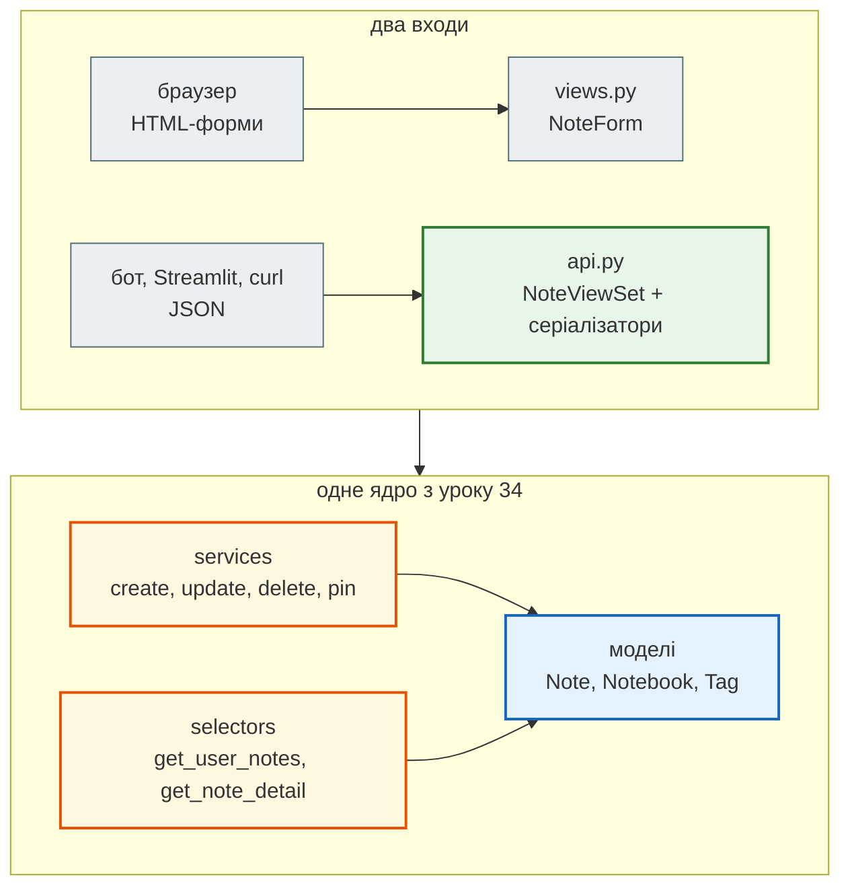
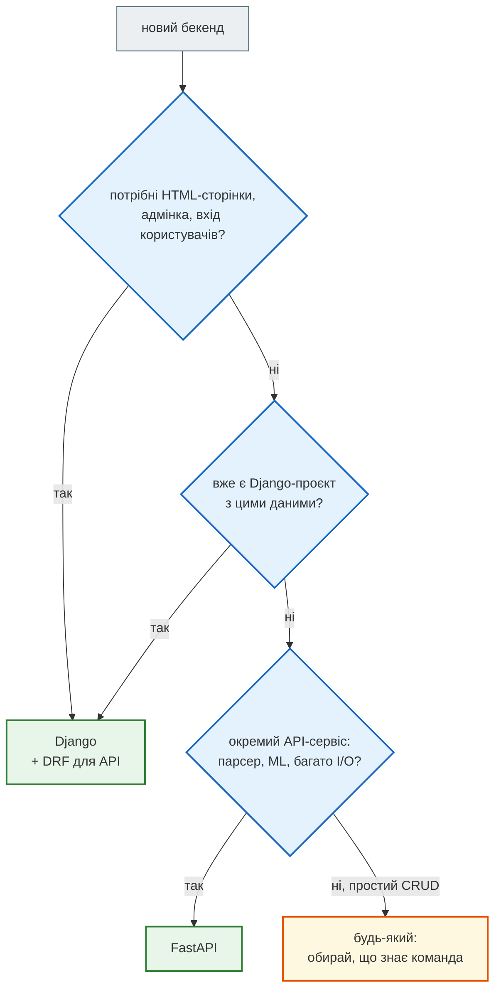

# Урок 35. DRF overview + Django vs FastAPI

Після уроку 34 застосунок нотаток уміє все для людей: сторінки, форми, dashboard, вхід. Але нотатки потрібні й **програмам** — мобільному застосунку, Streamlit-дашборду, Telegram-боту (урок 47). Їм не потрібен HTML, їм потрібен JSON і REST API, як у метео-сервісу з уроку 32.

Сьогодні — **третій рефакторинг** того самого проєкту: додаємо REST API на Django REST Framework (DRF), **не змінюючи** ні моделей, ні сторінок. Наприкінці порівнюємо Django + DRF із FastAPI, яким далі піде FastAPI-гілка курсу.

| Етап | Проєкт | Що змінюємо |
|---|---|---|
| урок 33 | `hello_project` | модель, адмінка, сторінка списку |
| урок 34, рефакторинг 1 | `django_bootstrap_project` | форми, CRUD, PRG, Bootstrap |
| урок 34, рефакторинг 2 | `crispy_notes_project` | crispy, dashboard, services/selectors, вхід |
| **урок 35, рефакторинг 3** | [`crispy_notes_project` + API](https://github.com/NikoriakViktot/PY-Course-Victor-Nikoriak-22-09-2026/tree/main/module_4/lessons/lesson_35_drf_fastapi/crispy_notes_project) | **DRF: `/api/notes/` поверх тих самих services і selectors** |

Код API — з Django-книги ([`notes_app/api.py`](https://github.com/NikoriakViktot/notes_chat_app/blob/main/notes_app/api.py) застосунку Notes Chat App), доповнений до повного CRUD; теорія DRF — у главі книги [REST API: Django REST Framework](https://nikoriakviktot.github.io/notes_chat_app/06_application_architecture/drf_rest_api_full/).

**Що потрібно з попередніх уроків:** проєкт `crispy_notes_project` (урок 34: форми, services/selectors, `@login_required`), REST: ресурси, методи, коди (урок 32), `requests` і `curl` (урок 31).

**Після уроку ти зможеш:**

- прочитати рефакторинг «+ API» як diff: що додалося, що лишилося незмінним;
- описати **серіалізатор**: вхідний (що клієнт може надіслати) і вихідний (що клієнт бачить);
- побудувати `ViewSet` і роутер поверх наявних services/selectors;
- закрити API для анонімів і не віддавати чужі нотатки (IDOR);
- отримати OpenAPI-схему API;
- порівняти Django + DRF і FastAPI і обрати інструмент під задачу.

**Ноутбук заняття:** [`note_lesson_35_drf.ipynb`](https://github.com/NikoriakViktot/PY-Course-Victor-Nikoriak-22-09-2026/blob/main/module_4/lessons/lesson_35_drf_fastapi/note_lesson_35_drf.ipynb) [](https://colab.research.google.com/github/NikoriakViktot/PY-Course-Victor-Nikoriak-22-09-2026/blob/main/module_4/lessons/lesson_35_drf_fastapi/note_lesson_35_drf.ipynb) — серіалізатори й API з перевірками.

## Пригадай

1. Який код повертає REST API, коли створено ресурс? Коли видалено? Коли дані не пройшли перевірку (урок 32)?
2. Навіщо в уроці 34 `NoteForm(user=request.user)`?
3. Що робить view `note_create` з перевіреними даними форми в `crispy_notes_project`?

??? success "Відповіді"

    1. `201 Created`, `204 No Content`; для неправильних даних Meteo API повертав `422`, DRF за замовчуванням повертає `400` — головне, однаково в усьому API.
    2. Щоб у списку записників були лише записники цього користувача — чужий не підставиш навіть підробленим `POST`.
    3. Передає їх у `services.create_note(...)`: view лише координує, зберігає сервіс.

## Рефакторинг 3. Сторінки → сторінки + JSON API { #refactor-3 }

### Що змінилося

| Файл | Зміна | Навіщо |
|---|---|---|
| `requirements.txt` | + `djangorestframework`, `drf-spectacular` | DRF і OpenAPI-схема |
| `settings.py` | + `rest_framework`, `drf_spectacular` в `INSTALLED_APPS`; словник `REST_FRAMEWORK` | автентифікація й права API за замовчуванням |
| `hello_project/urls.py` | + `DefaultRouter`, `/api/`, `/api/schema/` | адреси API |
| `hello_app/api.py` | **новий** — `NoteOutputSerializer`, `NoteInputSerializer`, `NoteViewSet` | увесь API в одному файлі |
| `hello_app/tests_api.py` | **новий** — 10 тестів | права, IDOR, валідація, CRUD, схема |
| `hello_app/services.py` | `update_note` зберігає й `updated_at` | баг, який показав API — див. [«Знайди помилку»](#find-bug) |
| `models.py`, `views.py`, `forms.py`, шаблони | **без змін** | сторінки працюють як раніше; 6 тестів уроку 34 проходять |

Останній рядок — головне: API додався **поруч** зі сторінками, бо логіка вже живе в services і selectors. Views сторінок і ViewSet API — два «входи» до тих самих функцій.



### Налаштування

```diff title="hello_project/settings.py"
 INSTALLED_APPS = [
     ...
     "crispy_forms",
     "crispy_bootstrap5",
+    "rest_framework",     # Django REST Framework: серіалізатори, ViewSet, роутер
+    "drf_spectacular",    # OpenAPI-схема з ViewSet і серіалізаторів
     "debug_toolbar",
     "hello_app",
 ]
+
+REST_FRAMEWORK = {
+    "DEFAULT_AUTHENTICATION_CLASSES": [
+        "rest_framework.authentication.SessionAuthentication",
+        "rest_framework.authentication.BasicAuthentication",
+    ],
+    "DEFAULT_PERMISSION_CLASSES": ["rest_framework.permissions.IsAuthenticated"],
+    "DEFAULT_SCHEMA_CLASS": "drf_spectacular.openapi.AutoSchema",
+}
+SPECTACULAR_SETTINGS = {"TITLE": "CrispyNotes API", "VERSION": "1.0.0"}
```

- **Автентифікація** — хто робить запит: `SessionAuthentication` бере вхід із cookie сесії (той самий вхід, що на сторінках), `BasicAuthentication` — логін і пароль у заголовку (для `curl` і скриптів). Токени для мобільних застосунків — урок 40.
- **Права** — що йому можна: `IsAuthenticated` — без входу API не віддає нічого, нотатки приватні.

```diff title="hello_project/urls.py"
+from drf_spectacular.views import SpectacularAPIView
+from rest_framework.routers import DefaultRouter
+
+from hello_app.api import NoteViewSet
+
+router = DefaultRouter()
+router.register("notes", NoteViewSet, basename="note")

 urlpatterns = [
     path("admin/", admin.site.urls),
     path("accounts/", include("django.contrib.auth.urls")),
+    path("api/", include(router.urls)),
+    path("api/schema/", SpectacularAPIView.as_view(), name="schema"),
     path("", include("hello_app.urls", namespace="hello_app")),
 ] + debug_toolbar_urls()
```

### Серіалізатори: що бачить клієнт і що може надіслати

**Серіалізатор** для API — те саме, що форма для сторінки: перетворює дані й перевіряє їх. Лише замість HTML — JSON. Беремо **два**:

```python title="hello_app/api.py — серіалізатори"
class NoteOutputSerializer(serializers.ModelSerializer):
    """Що бачить клієнт: явний список полів, без user."""
    priority_label = serializers.CharField(source="get_priority_display", read_only=True)
    notebook = serializers.CharField(source="notebook.title", default=None, read_only=True)
    tags = serializers.SlugRelatedField(many=True, read_only=True, slug_field="name")

    class Meta:
        model = Note
        fields = ["id", "title", "content", "priority", "priority_label", "is_pinned",
                  "notebook", "tags", "updated_at"]


class NoteInputSerializer(serializers.Serializer):
    """Що клієнт може надіслати. Власника задає сервер, а не клієнт."""
    title = serializers.CharField(max_length=200)
    content = serializers.CharField(required=False, allow_blank=True, default="")
    priority = serializers.ChoiceField(choices=Note.PRIORITY_CHOICES, default=Note.PRIORITY_LOW)
    is_pinned = serializers.BooleanField(required=False, default=False)
    notebook = serializers.PrimaryKeyRelatedField(queryset=Notebook.objects.none(), required=False,
                                                  allow_null=True, default=None)

    def __init__(self, *args, **kwargs):
        super().__init__(*args, **kwargs)
        # як NoteForm(user=...): записник можна вибрати лише зі своїх
        request = self.context.get("request")
        if request is not None:
            self.fields["notebook"].queryset = Notebook.objects.filter(user=request.user)
```

| | `NoteForm` (урок 34) | `NoteInputSerializer` | `NoteOutputSerializer` |
|---|---|---|---|
| Напрям | браузер → сервер | клієнт → сервер | сервер → клієнт |
| Формат | поля HTML-форми | JSON | JSON |
| Перевірка | `is_valid()` → `cleaned_data` | `is_valid()` → `validated_data` | — |
| Чужий записник | `queryset` за `user` | `queryset` за `user` | — |
| `user` | немає в `fields` | немає в полях | немає в `fields` |

Чому два, а не один `ModelSerializer` на все: вихід показує більше, ніж клієнт може змінити (`id`, `priority_label`, назву записника, теги, `updated_at`), а вхід приймає лише дозволене. Поле `user` не з'являється **ніде** — власника бере сервер з `request.user`.

### ViewSet: один клас — усі дії

```python title="hello_app/api.py — NoteViewSet (без list і опису схеми)"
class NoteViewSet(viewsets.ViewSet):
    permission_classes = [permissions.IsAuthenticated]
    queryset = Note.objects.none()   # лише для схеми: тип {id} у шляху; дані беруть selectors

    def _get_note(self, request, pk):
        try:
            return selectors.get_note_detail(request.user, pk)
        except Note.DoesNotExist:
            raise NotFound("Нотатку не знайдено.")

    def _input(self, request, **kwargs):
        data = NoteInputSerializer(data=request.data, context={"request": request}, **kwargs)
        data.is_valid(raise_exception=True)
        return data.validated_data

    def retrieve(self, request, pk=None):
        return Response(NoteOutputSerializer(self._get_note(request, pk)).data)

    def create(self, request):
        note = services.create_note(user=request.user, **self._input(request))
        return Response(NoteOutputSerializer(note).data, status=status.HTTP_201_CREATED)

    def partial_update(self, request, pk=None):
        note = self._get_note(request, pk)
        note = services.update_note(note, **self._input(request, partial=True))
        return Response(NoteOutputSerializer(note).data)

    def destroy(self, request, pk=None):
        services.delete_note(self._get_note(request, pk))
        return Response(status=status.HTTP_204_NO_CONTENT)

    @action(detail=True, methods=["post"])
    def pin(self, request, pk=None):
        note = services.toggle_pin_note(self._get_note(request, pk))
        return Response(NoteOutputSerializer(note).data)
```

Роутер перетворює методи класу на адреси:

| Запит | Метод ViewSet | Виклик ядра | Успіх |
|---|---|---|---|
| `GET /api/notes/` | `list` | `selectors.get_user_notes` | `200` |
| `POST /api/notes/` | `create` | `services.create_note` | `201` |
| `GET /api/notes/{id}/` | `retrieve` | `selectors.get_note_detail` | `200` |
| `PATCH /api/notes/{id}/` | `partial_update` | `services.update_note` | `200` |
| `DELETE /api/notes/{id}/` | `destroy` | `services.delete_note` | `204` |
| `POST /api/notes/{id}/pin/` | `pin` (`@action`) | `services.toggle_pin_note` | `200` |

- **ViewSet, а не ModelViewSet.** `ModelViewSet` сам робить `Note.objects…` і `serializer.save()` — він обійшов би services. Тут ViewSet лише координує, як view сторінок.
- **IDOR** (Insecure Direct Object Reference) — отримати чужий об'єкт, підставивши його `id`. `get_note_detail(request.user, pk)` шукає нотатку **серед нотаток користувача**; чужа — `404`, ніби її немає.
- `raise_exception=True` — помилки валідації одразу стають відповіддю `400` з помилками за полями.
- Над класом у файлі стоїть `@extend_schema_view(...)`: звичайний `ViewSet` не знає, які серіалізатори в нього на вході й виході, тож для OpenAPI-схеми їх описано явно (`request=NoteInputSerializer`, `responses=NoteOutputSerializer`). Без цього drf-spectacular попереджає «unable to guess serializer» і будує схему без тіл запитів.

### API в роботі

База, двоє користувачів, записник і нотатки — через ті самі services (у папці `crispy_notes_project`):

```text
$ python manage.py migrate -v 0
```

```python
from django.contrib.auth.models import User
from hello_app import services
from hello_app.models import Notebook

olena = User.objects.create_user("olena", password="pass-12345")
bob = User.objects.create_user("bob", password="pass-12345")
study = Notebook.objects.create(user=olena, title="Навчання")
services.create_note(user=olena, title="Вивчити DRF", content="serializers, viewsets", priority=3, notebook=study)
services.create_note(user=olena, title="Купити квитки", priority=2)
services.create_note(user=bob, title="Нотатка Боба")
print(olena.notes.count(), bob.notes.count())
```

```text
2 1
```

Запити — тестовим клієнтом DRF `APIClient` (новий shell). `force_authenticate` — «увійти» без пароля, лише для тестів:

```python
from django.test.utils import setup_test_environment
from rest_framework.test import APIClient

from hello_app.models import Note, Notebook

setup_test_environment()
api = APIClient()

r = api.get("/api/notes/")
print("анонім        →", r.status_code, r.data)

olena = Note.objects.get(title="Вивчити DRF").user
api.force_authenticate(olena)
r = api.get("/api/notes/")
print("список        →", r.status_code, [(n["title"], n["priority_label"], n["notebook"]) for n in r.data])

r = api.post("/api/notes/", {"title": "Здати проєкт", "priority": 4, "user": 999}, format="json")
created = r.data
print("створено      →", r.status_code, {k: v for k, v in created.items() if k != "updated_at"})
print("власник       →", Note.objects.get(pk=created["id"]).user)

r = api.post("/api/notes/", {"title": "", "priority": 9}, format="json")
print("помилки       →", r.status_code, {field: [str(e) for e in errors] for field, errors in r.data.items()})

bob_notebook = Notebook.objects.create(user=Note.objects.get(title="Нотатка Боба").user, title="Записник Боба")
r = api.post("/api/notes/", {"title": "Чужий записник", "notebook": bob_notebook.pk}, format="json")
print("чужий записник→", r.status_code, [str(e) for e in r.data["notebook"]])

bob_note = Note.objects.get(title="Нотатка Боба")
print("чужа нотатка  →", api.get(f"/api/notes/{bob_note.pk}/").status_code, api.delete(f"/api/notes/{bob_note.pk}/").status_code)

r = api.patch(f"/api/notes/{created['id']}/", {"title": "Здати проєкт до п'ятниці"}, format="json")
print("PATCH         →", r.status_code, r.data["title"], r.data["priority"])
r = api.post(f"/api/notes/{created['id']}/pin/")
print("pin           →", r.status_code, r.data["is_pinned"])
r = api.delete(f"/api/notes/{created['id']}/")
print("DELETE        →", r.status_code, Note.objects.filter(pk=created["id"]).exists())
```

```text
Forbidden: /api/notes/
анонім        → 403 {'detail': ErrorDetail(string='Реквізити перевірки достовірності не надані.', code='not_authenticated')}
список        → 200 [('Вивчити DRF', '🟠 Високий', 'Навчання'), ('Купити квитки', '🟡 Середній', None)]
створено      → 201 {'id': 4, 'title': 'Здати проєкт', 'content': '', 'priority': 4, 'priority_label': '🔴 Терміново', 'is_pinned': False, 'notebook': None, 'tags': []}
власник       → olena
Bad Request: /api/notes/
помилки       → 400 {'title': ['Це поле не може бути порожнім.'], 'priority': ['"9" не є коректним вибором.']}
Bad Request: /api/notes/
чужий записник→ 400 ['Недопустимий первинний ключ "2" - об\'єкт не існує.']
Not Found: /api/notes/3/
Not Found: /api/notes/3/
чужа нотатка  → 404 404
PATCH         → 200 Здати проєкт до п'ятниці 4
pin           → 200 True
DELETE        → 204 False
```

- рядки `Forbidden: …`, `Bad Request: …`, `Not Found: …` — журнал Django, не `print` (урок 34): кожна відповідь 4xx потрапляє в термінал;
- анонім — `403`: перший клас автентифікації, `SessionAuthentication`, не вміє «попросити» облікові дані. Якби першим стояв `BasicAuthentication`, відповідь була б `401` із заголовком `WWW-Authenticate`;
- `"user": 999` у тілі проігноровано: такого поля у вхідному серіалізаторі немає, власника задав сервер;
- чужий записник — `400`, чужа нотатка — `404` і на читання, і на видалення;
- `PATCH` змінив лише `title`, `priority` лишився `4`: `partial=True` не підставляє значень за замовчуванням;
- `pin` — власна дія (`@action`), роутер сам додав адресу `/api/notes/{id}/pin/`.

### Browsable API і OpenAPI-схема

Відкрий `http://127.0.0.1:8000/api/notes/` у **браузері** після входу на сайт — DRF замість сирого JSON покаже HTML-сторінку з відповіддю й заголовками (він дивиться на заголовок `Accept` браузера). Вхід — той самий, що на сторінках, завдяки `SessionAuthentication`:


drf-spectacular будує опис API за стандартом OpenAPI з ViewSet і серіалізаторів — те, що FastAPI робить сам (урок 32):

```python
r = api.get("/api/schema/")
schema = r.content.decode()
print(r.status_code, r["Content-Type"])
print([line.strip() for line in schema.splitlines() if line.startswith("  /api/")])
```

```text
200 application/vnd.oai.openapi; charset=utf-8
['/api/notes/:', '/api/notes/{id}/:', '/api/notes/{id}/pin/:', '/api/schema/:']
```

Зі схеми Swagger UI будує інтерактивну документацію, а Postman імпортує всі запити (урок 37).

### Тести

`tests_api.py` перевіряє права (анонім, чужа нотатка, чужий записник), валідацію, створення з власником від сервера, `PATCH`, `DELETE`, `pin`, фільтр за записником і схему. Разом з тестами сторінок уроку 34 — це доказ, що рефакторинг нічого не зламав:

Приклад виводу (час залежить від машини):

```text
$ python manage.py test
Found 16 test(s).
System check identified no issues (0 silenced).
Creating test database for alias 'default'...
................
----------------------------------------------------------------------
Ran 16 tests in 8.687s

OK
Destroying test database for alias 'default'...
```

!!! tip "Поглиблено"
    - Django-книга: [REST API: Django REST Framework](https://nikoriakviktot.github.io/notes_chat_app/06_application_architecture/drf_rest_api_full/) — `APIView.dispatch()` зсередини, об'єктні права, Input/Output-серіалізатори; [Serializers — Transport Layer](https://nikoriakviktot.github.io/notes_chat_app/06_application_architecture/django_serializers_full/); [Services і Selectors](https://nikoriakviktot.github.io/notes_chat_app/06_application_architecture/services_selectors_full/)
    - DRF: [Serializers](https://www.django-rest-framework.org/api-guide/serializers/), [ViewSets](https://www.django-rest-framework.org/api-guide/viewsets/), [Routers](https://www.django-rest-framework.org/api-guide/routers/), [Permissions](https://www.django-rest-framework.org/api-guide/permissions/); [drf-spectacular](https://drf-spectacular.readthedocs.io/)

## Django + DRF чи FastAPI { #architecture }

Той самий API нотаток на FastAPI — [`fastapi_notes.py`](https://github.com/NikoriakViktot/PY-Course-Victor-Nikoriak-22-09-2026/blob/main/module_4/lessons/lesson_35_drf_fastapi/fastapi_notes.py) у папці уроку: ті самі поля, обмеження й адреси. Дані тут у словнику в пам'яті — база для FastAPI (SQLAlchemy) — урок 38.

```python title="fastapi_notes.py (скорочено)"
class NoteIn(BaseModel):
    title: str = Field(min_length=1, max_length=200)
    content: str = ""
    priority: int = Field(1, ge=1, le=4)
    is_pinned: bool = False


class NoteOut(NoteIn):
    id: int


@app.post("/api/notes/", status_code=201, response_model=NoteOut)
def create_note(body: NoteIn):
    note_id = max(NOTES, default=0) + 1
    NOTES[note_id] = {"id": note_id, **body.model_dump()}
    return NOTES[note_id]


@app.get("/api/notes/{note_id}/", response_model=NoteOut)
def get_note(note_id: int):
    if note_id not in NOTES:
        raise HTTPException(404, "Нотатку не знайдено.")
    return NOTES[note_id]
```

Ті самі запити тестовим клієнтом FastAPI (у папці уроку `lesson_35_drf_fastapi`, де лежить `fastapi_notes.py`):

```python
from fastapi.testclient import TestClient

from fastapi_notes import app

fast = TestClient(app)
r = fast.post("/api/notes/", json={"title": "Вивчити FastAPI", "priority": 4})
print("створено  →", r.status_code, r.json())
bad = fast.post("/api/notes/", json={"title": "", "priority": 9})
print("помилки   →", bad.status_code, [(e["loc"][-1], e["msg"]) for e in bad.json()["detail"]])
print("pin       →", fast.post("/api/notes/1/pin/").json()["is_pinned"], "| немає →", fast.get("/api/notes/7/").status_code)
print("схема     →", sorted(app.openapi()["paths"]))
```

```text
створено  → 201 {'title': 'Вивчити FastAPI', 'content': '', 'priority': 4, 'is_pinned': False, 'id': 1}
помилки   → 422 [('title', 'String should have at least 1 character'), ('priority', 'Input should be less than or equal to 4')]
pin       → True | немає → 404
схема     → ['/api/notes/', '/api/notes/{note_id}/', '/api/notes/{note_id}/pin/']
```

| | Django + DRF | FastAPI |
|---|---|---|
| Що це | повний вебфреймворк + пакет для API | мікрофреймворк для API |
| База даних | вбудований ORM + міграції | обираєш сам: SQLAlchemy + Alembic (урок 38) |
| Валідація | серіалізатори | Pydantic-моделі за анотаціями типів (урок 36) |
| Помилка валідації | `400`, помилки за полями | `422`, список `detail` з `loc` |
| Адмінка, вхід, сесії, форми | є з коробки | немає: окремі пакети або свій код |
| Документація API | drf-spectacular (пакет) | `/docs` з коробки |
| Async | частково (урок 45) | від початку async (урок 27) |
| Коли обрати | сайт + адмінка + API над однією базою — як наші нотатки | окремий API-сервіс, парсер, ML-модель за API, багато I/O |



**Куди далі.** Django-гілка курсу продовжує нотатки: вхід і спільний доступ (урок 40), тести (41), архітектура services/selectors (44), чат на WebSocket (45). FastAPI-гілка з уроку 36 будує **новинний агрегатор** — парсер новин зі старого курсу, який крок за кроком обростає Pydantic-моделями, FastAPI, базою, кешем, підсумками від Gemini і Telegram-ботом.

## Практика { #practice }

### Розібраний приклад: фільтр за записником

Клієнту потрібні нотатки одного записника: `GET /api/notes/?notebook=<id>`. Писати новий ORM-запит не треба — `selectors.get_user_notes` уже вміє фільтр `notebook=` (ним користується sidebar сторінок). У `list` лише перевіряємо параметр:

```diff title="hello_app/api.py — list"
     def list(self, request):
-        notes = selectors.get_user_notes(request.user, search=request.query_params.get("search"))
+        params = request.query_params
+        notebook = None
+        if "notebook" in params:                       # ?notebook=<id> — лише свій записник
+            if params["notebook"].isdigit():
+                notebook = Notebook.objects.filter(user=request.user, pk=params["notebook"]).first()
+            if notebook is None:
+                raise NotFound("Записник не знайдено.")
+        notes = selectors.get_user_notes(request.user, notebook=notebook, search=params.get("search"))
         return Response(NoteOutputSerializer(notes, many=True).data)
```

```python
study = Notebook.objects.get(title="Навчання")
for query in ({"notebook": study.pk}, {"notebook": bob_notebook.pk}, {"notebook": "abc"}, {"search": "квитки"}):
    r = api.get("/api/notes/", query)
    print(query, "→", r.status_code, [n["title"] for n in r.data] if r.status_code == 200 else r.data)
```

```text
{'notebook': 1} → 200 ['Вивчити DRF']
Not Found: /api/notes/
{'notebook': 2} → 404 {'detail': ErrorDetail(string='Записник не знайдено.', code='not_found')}
Not Found: /api/notes/
{'notebook': 'abc'} → 404 {'detail': ErrorDetail(string='Записник не знайдено.', code='not_found')}
{'search': 'квитки'} → 200 ['Купити квитки']
```

- записник шукаємо **серед своїх** — чужий `id` дає `404`, як чужа нотатка;
- `"abc"` не падає з `500`: `isdigit()` відсікає нечислове значення до запиту в базу;
- `search` уже був у selector — у API він з'явився одним рядком.

### Зміни приклад: архівні нотатки

`selectors.get_user_notes` має й параметр `archived=`. Додай у `list` параметр `?archived=true`: без нього — звичайні нотатки, з ним — архівні. Перевір: нотатка, архівована через `services.archive_note(note)`, зникає зі списку й з'являється за `?archived=true`.

### Спробуй самостійно: API записників

Зроби `/api/notebooks/` за тим самим рецептом: `NotebookOutputSerializer` (`id`, `title`, `color`, `is_default`, кількість нотаток), `NotebookInputSerializer`, `NotebookViewSet` з `list` і `create`.

**Критерії перевірки:**

- читання — через `selectors.get_user_notebooks`, створення — через `services.create_notebook`;
- `GET /api/notebooks/` показує лише свої записники; анонім — `403`;
- другий записник з `"is_default": true` знімає прапорець з першого (це вже робить сервіс);
- тест у `tests_api.py` на кожен пункт.

### Знайди помилку { #find-bug }

API повертає поле `updated_at`. Перевіримо, як воно оновлюється, коли модель зберігають з `update_fields` (у shell, де вже є `olena`):

```python
import time

from hello_app.models import Note

note = Note.objects.create(user=olena, title="Стара назва")
before = note.updated_at
time.sleep(0.01)

note.title = "Нова назва"
note.save(update_fields=["title"])                 # зберегти лише title
note.refresh_from_db()
print("лише title        → змінився updated_at?", note.updated_at != before)

note.title = "Ще новіша назва"
note.save(update_fields=["title", "updated_at"])   # title разом з updated_at
note.refresh_from_db()
print("title + updated_at → змінився updated_at?", note.updated_at != before)
```

```text
лише title        → змінився updated_at? False
title + updated_at → змінився updated_at? True
```

Чому `updated_at = models.DateTimeField(auto_now=True)` не оновився в першому випадку і чим це шкодить застосунку?

??? success "Відповідь"

    `auto_now` виставляє час у `pre_save()` — але Django викликає `pre_save()` і записує в базу **лише поля з `update_fields`**. Якщо `update_note` збирає `changed_fields` (`title`, `content`, …) і не додає `updated_at`, час зміни назавжди лишається часом створення.

    Шкода реальна: `selectors.get_user_notes` сортує за `-updated_at` — щойно відредагована нотатка не піднімається вгору списку, а клієнт API отримує неправдивий час зміни. Помилка тиха: жодного винятку, лише неправильні дані.

    Правильно — одне слово: `note.save(update_fields=changed_fields + ['updated_at'])`. Тест `test_patch_changes_only_sent_fields_and_updated_at` у `tests_api.py` це перевіряє.

## Підсумок

| Поняття | Що запам'ятати |
|---|---|
| Рефакторинг «+ API» | новий вхід до тих самих services/selectors; моделі й сторінки не змінюються, старі тести проходять |
| DRF | пакет для REST API на Django: серіалізатори, ViewSet, роутер, auth, permissions |
| `REST_FRAMEWORK` | автентифікація (хто) і права (що можна) за замовчуванням |
| Серіалізатор | для API те саме, що форма для сторінки: JSON ↔ дані + перевірка |
| Input / Output | вхід приймає лише дозволене; вихід показує більше; `user` задає сервер |
| `fields` | завжди явний список; `"__all__"` відкриває приховані колонки |
| ViewSet + роутер | методи `list`, `create`, `retrieve`, `partial_update`, `destroy` → адреси; `@action` → власна дія |
| IDOR | шукати об'єкт серед об'єктів користувача → чужий `id` дає `404` |
| Коди DRF | `200`, `201`, `204`, `400`, `403` (або `401`), `404` |
| OpenAPI | drf-spectacular: `/api/schema/` |
| DRF vs FastAPI | «батарейки» й одна база для сайту, адмінки й API — проти легкого async API-сервісу з Pydantic |

### Самоперевірка

1. Що змінилося в проєкті в рефакторингу 3, а що — ні? Як це перевірити?
2. Навіщо два серіалізатори замість одного `ModelSerializer`?
3. Що станеться з `"user": 999` у тілі `POST`?
4. Чому `ViewSet`, а не `ModelViewSet`?
5. Чому чужа нотатка — `404`, а не `403`?
6. Чому без входу `403`, а не `401`?
7. Коли обрати Django + DRF, а коли FastAPI?

??? success "Відповіді"

    1. Додалися DRF, налаштування, `api.py`, адреси `/api/…` і тести API; моделі, views, форми й шаблони — без змін. Перевірка — усі тести, і старі (сторінки), і нові (API), проходять.
    2. Клієнт бачить більше, ніж може змінити (`id`, `priority_label`, `updated_at`, назву записника). Окремий вхідний серіалізатор приймає лише дозволені поля.
    3. Нічого: поля `user` у вхідному серіалізаторі немає, його проігноровано; власника задає `request.user`.
    4. `ModelViewSet` сам робить ORM-запити й `save()` і обійшов би services/selectors — правила застосунку довелося б дублювати.
    5. `404` не підтверджує, що об'єкт з таким `id` взагалі існує, — зловмисник не може перебирати чужі `id`.
    6. Перший клас автентифікації — сесійний — не вміє попросити облікові дані (`WWW-Authenticate`), тому `403`. З `BasicAuthentication` першим було б `401`.
    7. Django + DRF — коли потрібні сайт, адмінка, користувачі й API над однією базою. FastAPI — окремий API-сервіс: парсер, мікросервіс, ML-модель, багато I/O.

### Що далі

- Ноутбук заняття: [`note_lesson_35_drf.ipynb`](https://github.com/NikoriakViktot/PY-Course-Victor-Nikoriak-22-09-2026/blob/main/module_4/lessons/lesson_35_drf_fastapi/note_lesson_35_drf.ipynb) [](https://colab.research.google.com/github/NikoriakViktot/PY-Course-Victor-Nikoriak-22-09-2026/blob/main/module_4/lessons/lesson_35_drf_fastapi/note_lesson_35_drf.ipynb).
- Урок 36 — типізація й Pydantic на першому кроці новинного агрегатора; урок 37 — FastAPI, Postman і OpenAPI.
- Урок 40 — вхід за токенами для API й спільний доступ до нотаток.

## Документація і джерела

- Код: [`crispy_notes_project`](https://github.com/NikoriakViktot/PY-Course-Victor-Nikoriak-22-09-2026/tree/main/module_4/lessons/lesson_35_drf_fastapi/crispy_notes_project) — проєкт уроку 34 (старий курс, `module_5/lesson_HTML_CSS_Bootstrap`) + `api.py` з Django-книги ([`notes_app/api.py`](https://github.com/NikoriakViktot/notes_chat_app/blob/main/notes_app/api.py)), доповнений до CRUD. Порівняльний [`fastapi_notes.py`](https://github.com/NikoriakViktot/PY-Course-Victor-Nikoriak-22-09-2026/blob/main/module_4/lessons/lesson_35_drf_fastapi/fastapi_notes.py).
- Django-книга: [REST API: Django REST Framework](https://nikoriakviktot.github.io/notes_chat_app/06_application_architecture/drf_rest_api_full/), [Serializers — Transport Layer](https://nikoriakviktot.github.io/notes_chat_app/06_application_architecture/django_serializers_full/)
- DRF: [Quickstart](https://www.django-rest-framework.org/tutorial/quickstart/), [Serializers](https://www.django-rest-framework.org/api-guide/serializers/), [ViewSets](https://www.django-rest-framework.org/api-guide/viewsets/), [Routers](https://www.django-rest-framework.org/api-guide/routers/), [Authentication](https://www.django-rest-framework.org/api-guide/authentication/), [Permissions](https://www.django-rest-framework.org/api-guide/permissions/), [Testing](https://www.django-rest-framework.org/api-guide/testing/), [Browsable API](https://www.django-rest-framework.org/topics/browsable-api/)
- Django: [`Model.save(update_fields=…)`](https://docs.djangoproject.com/en/5.2/ref/models/instances/#specifying-which-fields-to-save), [`DateField.auto_now`](https://docs.djangoproject.com/en/5.2/ref/models/fields/#django.db.models.DateField.auto_now)
- [drf-spectacular](https://drf-spectacular.readthedocs.io/); FastAPI: [Tutorial](https://fastapi.tiangolo.com/tutorial/), [Alternatives, Inspiration and Comparisons](https://fastapi.tiangolo.com/alternatives/)
