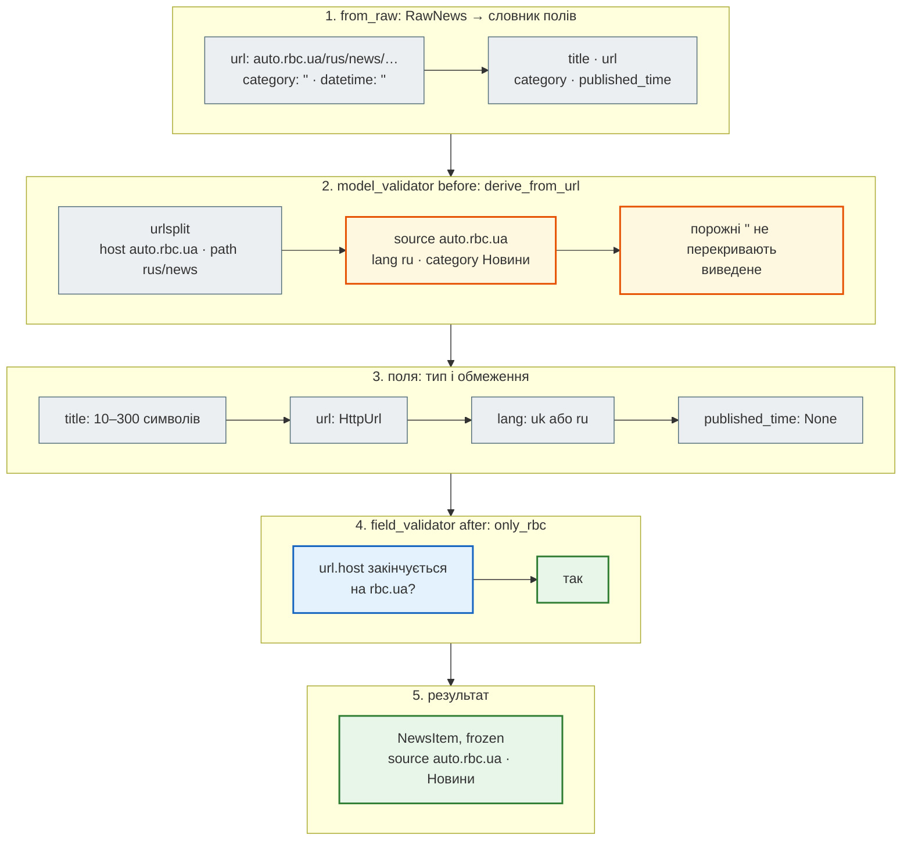
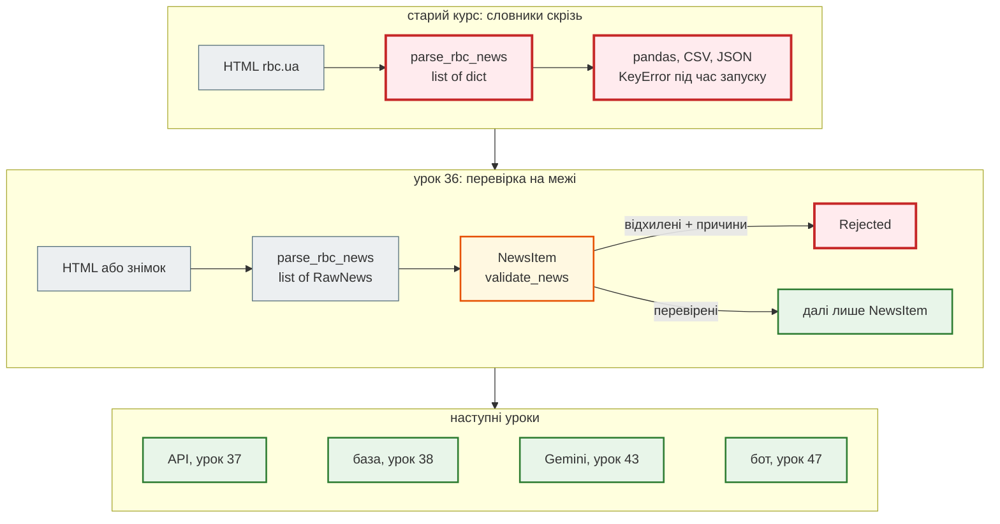

# Урок 36. Typing + Pydantic

З цього уроку FastAPI-гілка курсу будує **новинний агрегатор**: парсер стрічки новин, який крок за кроком обростає API, базою, кешем, підсумками від Gemini й Telegram-ботом. Починаємо не з нуля: у старому курсі вже є робочий парсер rbc.ua — функція `parse_rbc_news` з уроку про web scraping — і 168 новин, які вона зібрала.

Парсер повертає `list[dict]`. Словник нічого не гарантує: ключ може бути з одруківкою, значення — порожнім рядком, «дата» — лише `"14:19"`, URL — з чужого домену. Сьогодні два рефакторинги цього коду: **анотації типів** (їх перевіряє `mypy` до запуску) і **Pydantic-модель** `NewsItem` (вона перевіряє дані під час роботи). Pydantic — фундамент FastAPI: у наступному уроці ця сама модель стане відповіддю API.

| Урок | Крок агрегатора |
|---|---|
| **36** | **парсер з типами; `NewsItem` на Pydantic** |
| 37 | FastAPI: `GET /api/news`, `POST /api/scrape`, `/docs`, Postman |
| 38 | SQLAlchemy: новини в базі |
| 39 | middleware, кеш і rate limit на Redis |
| 41 | тести API |
| 43 | Gemini: підсумок, категорія, тональність |
| 47 | Telegram-бот |
| 48–50 | Docker, Compose, CI/CD |

Проєкт: [`news_hub`](https://github.com/NikoriakViktot/PY-Course-Victor-Nikoriak-22-09-2026/tree/main/module_4/lessons/lesson_36_typing_pydantic/news_hub).

**Що потрібно з попередніх уроків:** функції й словники (М1), класи й `@classmethod` (уроки 19–23), винятки (13), pytest (25), HTTP і парсинг відповіді (31), серіалізатори DRF (35) — Pydantic робить для FastAPI те саме.

**Після уроку ти зможеш:**

- анотувати функції: `list[str]`, `dict[str, int]`, `X | None`, `Literal`, `TypedDict`;
- перевірити код `mypy` і прочитати його помилки;
- описати Pydantic-модель з обмеженнями полів (`Field`), валідаторами (`field_validator`, `model_validator`) і незмінністю (`frozen`);
- відділити «сирі» дані з інтернету від перевірених і не губити відхилені мовчки;
- отримати з моделі JSON і JSON Schema.

**Ноутбук заняття:** [`note_lesson_36_pydantic.ipynb`](https://github.com/NikoriakViktot/PY-Course-Victor-Nikoriak-22-09-2026/blob/main/module_4/lessons/lesson_36_typing_pydantic/note_lesson_36_pydantic.ipynb) [](https://colab.research.google.com/github/NikoriakViktot/PY-Course-Victor-Nikoriak-22-09-2026/blob/main/module_4/lessons/lesson_36_typing_pydantic/note_lesson_36_pydantic.ipynb) — типи й моделі на справжніх новинах з перевірками.

!!! note "Звідки дані"
    Сайт `www.rbc.ua` зараз недоступний із середовища, де збирався курс, тому агрегатор працює на **знімку** — 168 новинах, які `parse_rbc_news` зібрала в старому курсі (`data/rbc_news_snapshot.json`). Код парсера той самий; як запустити його на свіжій сторінці — у [`README.md`](https://github.com/NikoriakViktot/PY-Course-Victor-Nikoriak-22-09-2026/blob/main/module_4/lessons/lesson_36_typing_pydantic/news_hub/README.md) проєкту.

## Пригадай

1. Що поверне `{"title": "x"}["titel"]` і коли ти про це дізнаєшся?
2. Що робить `@classmethod` і чим він відрізняється від звичайного методу (урок 23)?
3. Що перевіряв `NoteInputSerializer` в уроці 35 і що повертав для неправильних даних?

??? success "Відповіді"

    1. `KeyError: 'titel'` — лише коли рядок виконається, тобто в найгірший момент: у роботі, на справжніх даних.
    2. Отримує клас (`cls`), а не об'єкт — типовий спосіб написати «альтернативний конструктор», як `NewsItem.from_raw(...)` сьогодні.
    3. Типи й обмеження полів; `is_valid()` → `False`, помилки за полями, API — `400`. Pydantic робить те саме, FastAPI поверне `422`.

## Старт: що дає парсер зі старого курсу

Функція `parse_rbc_news(html) -> list[dict]` шукає на сторінці контейнери новин, а якщо їх немає — посилання `/news/` з текстом «14:19 Заголовок». Кожна новина — словник з п'ятьма рядками. Подивимось на те, що вона насправді зібрала (у папці `news_hub`):

```python
import json
from collections import Counter
from urllib.parse import urlsplit

news = json.loads(open("data/rbc_news_snapshot.json", encoding="utf-8").read())
print("новин:", len(news), "| ключі:", list(news[0]))
print("перша:", news[1])
print("порожніх category:", sum(not n["category"] for n in news),
      "| description:", sum(not n["description"] for n in news),
      "| datetime:", sum(not n["datetime"] for n in news))
print("формати datetime:", Counter(len(n["datetime"]) for n in news))
print("домени:", Counter(urlsplit(n["url"]).hostname for n in news))
print("шляхи:", Counter("/".join(urlsplit(n["url"]).path.split("/")[1:3]) for n in news))
```

```text
новин: 168 | ключі: ['title', 'url', 'category', 'description', 'datetime']
перша: {'title': 'У Путіна заявили, що вихід на мирну угоду з Україною "займе багато часу"', 'url': 'https://www.rbc.ua/rus/news/putina-zayavili-shcho-vihid-mirnu-ugodu-ukrayinoyu-1778325455.html', 'category': '', 'description': '', 'datetime': '14:19'}
порожніх category: 168 | description: 168 | datetime: 31
формати datetime: Counter({5: 137, 0: 31})
домени: Counter({'www.rbc.ua': 167, 'auto.rbc.ua': 1})
шляхи: Counter({'rus/news': 138, 'ukr/news': 30})
```

Висновки з реальних даних:

- `category` і `description` **порожні завжди** — стрічка їх не містить; категорію й мову доведеться виводити з URL (`/rus/news/…`);
- `datetime` — або `""`, або лише час `"HH:MM"` без дати;
- одна новина — з піддомену `auto.rbc.ua`: код, що «ріже» URL рядком, на ній помилиться (див. [«Знайди помилку»](#find-bug)).

Із `list[dict]` усе це з'ясовується лише під час запуску. Рефакторимо.

## Рефакторинг 1. Анотації типів і TypedDict { #refactor-1 }

**Анотація типу** — підказка в коді, якого типу змінна, параметр чи результат: `def headline(item: RawNews) -> str`. Python її **не перевіряє** під час роботи; перевіряє окрема програма — **mypy** — до запуску, як лінтер.

| Запис | Що означає | Приклад з агрегатора |
|---|---|---|
| `str`, `int`, `bool` | простий тип | `title: str` |
| `list[str]` | список рядків | `ITEM_SELECTORS: list[tuple[str, str]]` |
| `dict[str, str]` | словник: ключ → значення | `CATEGORIES: dict[str, str]` |
| `set[str]` | множина | `seen_urls: set[str]` |
| `X \| None` | або `X`, або `None` | `published_time: time \| None` |
| `Literal["uk", "ru"]` | лише ці значення | `lang` |
| `TypedDict` | словник з **відомими** ключами й типами | `RawNews` |
| `Callable[[Tag], bool]` | функція: аргументи → результат | фільтр тегів у парсері |

### Що змінилося

| Файл | Зміна | Навіщо |
|---|---|---|
| `news_hub/parser.py` | `parse_rbc_news` з ноутбука старого курсу: анотації всіх функцій, `list[dict]` → `list[RawNews]`, дві стратегії — окремі функції | mypy бачить ключі новини; функцію легше тестувати |
| `news_hub/models.py` | **новий** — `NewsItem`, `validate_news` (рефакторинг 2) | перевірка даних |
| `news_hub/snapshot.py` | **новий** — завантаження знімка через `TypeAdapter` | знімок теж перевірений |
| `tests/` | **нові** — 12 тестів | парсер, моделі, знімок |

```diff title="news_hub/parser.py (фрагмент)"
+class RawNews(TypedDict):
+    """Одна новина так, як її дає HTML: лише рядки, ще не перевірені."""
+    title: str
+    url: str
+    category: str
+    description: str
+    datetime: str
+
+
-def parse_rbc_news(html: str) -> list[dict]:
+def parse_rbc_news(html: str) -> list[RawNews]:
     """HTML сторінки rbc.ua → список сирих новин."""
     soup = BeautifulSoup(html, "html.parser")
-    news_list = []
-    seen_urls = set()
+    seen_urls: set[str] = set()
+    # Стратегія 2 — якщо контейнерів немає або вони нічого не дали
+    return _parse_containers(soup, seen_urls) or _parse_links(soup, seen_urls)
```

!!! warning "`TypedDict` і Pydantic на Python 3.10–3.11"
    `RawNews` імпортується з `typing_extensions`, а не з `typing`. Pydantic перевіряє `TypedDict` з `typing` лише на Python 3.12+; на 3.10 тест упав з `PydanticUserError: Please use typing_extensions.TypedDict instead of typing.TypedDict on Python < 3.12`. `typing_extensions` встановлюється разом із Pydantic.

Логіка розбору не змінилася — змінилися підписи. Два приклади в `examples/` показують, що це дає. «Було» — функції, що працюють зі звичайним `dict`:

```python title="examples/before_dict.py"
def parse() -> list[dict]:
    return [{"title": "Реформа ЗСУ", "url": "https://www.rbc.ua/rus/news/reforma-zsu", "datetime": ""}]


def headline(item: dict) -> str:
    return item["titel"].upper()          # одруківка в ключі


def hour(item: dict) -> int:
    return int(item["datetime"][:2])      # "" → ValueError, але mypy мовчить
```

«Стало» — ті самі помилки з типами `RawNews` і `NewsItem`:

```python title="examples/after_typed.py"
from news_hub.models import NewsItem
from news_hub.parser import RawNews


def headline(item: RawNews) -> str:
    return item["titel"].upper()          # та сама одруківка


def hour(item: NewsItem) -> int:
    return item.published_time.hour       # у 31 новини часу немає (None)
```

```text
$ mypy examples/before_dict.py
Success: no issues found in 1 source file
$ mypy examples/after_typed.py
examples/after_typed.py:7: error: TypedDict "RawNews" has no key "titel"  [typeddict-item]
examples/after_typed.py:7: note: Did you mean "title"?
examples/after_typed.py:11: error: Item "None" of "time | None" has no attribute "hour"  [union-attr]
Found 2 errors in 1 file (checked 1 source file)
```

- для `dict` будь-який ключ «правильний» — mypy мовчить, помилка чекає на запуск;
- з `TypedDict` mypy знає ключі й навіть підказує `Did you mean "title"?`;
- `time | None` змушує обробити `None` — саме той випадок, який у реальних даних трапляється 31 раз.

Анотації — лише підказки. Під час роботи Python їх не перевіряє:

```python
from news_hub.parser import RawNews

item: RawNews = {"title": 42, "url": None, "category": "", "description": "", "datetime": ""}  # type: ignore
print(type(item), item["title"], item["url"])
```

```text
<class 'dict'> 42 None
```

Дані з інтернету не прочитали нашого коду — їх треба **перевіряти під час роботи**. Це робить Pydantic.

!!! tip "Поглиблено"
    [typing — Support for type hints](https://docs.python.org/3/library/typing.html), [mypy: Type hints cheat sheet](https://mypy.readthedocs.io/en/stable/cheat_sheet_py3.html), [TypedDict](https://docs.python.org/3/library/typing.html#typing.TypedDict), [PEP 604 (`X | None`)](https://peps.python.org/pep-0604/).

## Рефакторинг 2. Pydantic: модель `NewsItem` { #refactor-2 }

**Pydantic** — бібліотека, яка перетворює анотації типів на **перевірку**: клас-модель описує поля й типи, а створення об'єкта або перевіряє й приводить дані, або кидає `ValidationError` з поясненням за полями.

```python title="news_hub/models.py — NewsItem"
class NewsItem(BaseModel):
    model_config = ConfigDict(str_strip_whitespace=True, frozen=True)

    title: str = Field(min_length=10, max_length=300)
    url: HttpUrl
    source: str                      # домен без www: rbc.ua, auto.rbc.ua
    lang: Literal["uk", "ru"]        # з першої частини шляху: /ukr/ або /rus/
    category: str                    # з розділу в шляху: /ukr/news/ → «Новини»
    published_time: time | None = None

    @model_validator(mode="before")
    @classmethod
    def derive_from_url(cls, data: Any) -> Any:
        """source, lang і category, яких немає в HTML, беремо з URL — розбираючи його, а не рядком."""
        if not isinstance(data, dict) or not isinstance(data.get("url"), str):
            return data
        parts = urlsplit(data["url"])
        path = [segment for segment in parts.path.split("/") if segment]
        derived: dict[str, Any] = {"source": (parts.hostname or "").removeprefix("www.")}
        if path and path[0] in LANGS:
            derived["lang"] = LANGS[path[0]]
        if len(path) > 1:
            derived["category"] = CATEGORIES.get(path[1], path[1].capitalize())
        return derived | {key: value for key, value in data.items() if value not in (None, "")}

    @field_validator("url")
    @classmethod
    def only_rbc(cls, url: HttpUrl) -> HttpUrl:
        if not (url.host or "").endswith("rbc.ua"):
            raise ValueError("очікуємо новину з rbc.ua")
        return url

    @classmethod
    def from_raw(cls, raw: RawNews) -> "NewsItem":
        """Сирий рядок парсера → модель. Поле datetime зі стрічки — це лише «HH:MM»."""
        return cls.model_validate({"title": raw["title"], "url": raw["url"],
                                   "category": raw["category"], "published_time": raw["datetime"]})
```

| Інструмент | Що робить у `NewsItem` |
|---|---|
| анотація поля | тип і приведення: `"14:19"` → `time(14, 19)`, рядок → `HttpUrl` |
| `Field(min_length=10, max_length=300)` | обмеження значення |
| `Literal["uk", "ru"]` | лише дозволені значення |
| `field_validator("url")` | власне правило для одного поля — після перевірки типу |
| `model_validator(mode="before")` | обробка **сирих** даних до перевірки полів: виводимо `source`, `lang`, `category` з URL |
| `str_strip_whitespace=True` | обрізати пробіли в усіх рядках |
| `frozen=True` | модель не можна змінити після створення |

Як це працює покроково — на справжній новині зі знімка, тій самій з піддомену `auto.rbc.ua`:



Будь-яка помилка на кроках 3–4 додається до однієї `ValidationError`; модель створюється, лише якщо помилок немає.

Перевіримо на справжній новині зі знімка й на зіпсованих даних:

```python
from pydantic import ValidationError

from news_hub.models import NewsItem
from news_hub.snapshot import load_snapshot

raw_news = load_snapshot()
item = NewsItem.from_raw(raw_news[1])
print(repr(item))
print(item.model_dump_json())

broken = {"title": "Коротко", "url": "https://example.com/ukr/news/x.html",
          "category": "", "description": "", "datetime": "25:99"}
try:
    NewsItem.from_raw(broken)
except ValidationError as error:
    print(error.error_count(), "помилки:")
    for e in error.errors():
        print("  ", e["loc"][0], "→", e["msg"])

try:
    item.title = "Інший заголовок новини"
except ValidationError as error:
    print("frozen →", error.errors()[0]["msg"])
```

```text
NewsItem(title='У Путіна заявили, що вихід на мирну угоду з Україною "займе багато часу"', url=HttpUrl('https://www.rbc.ua/rus/news/putina-zayavili-shcho-vihid-mirnu-ugodu-ukrayinoyu-1778325455.html'), source='rbc.ua', lang='ru', category='Новини', published_time=datetime.time(14, 19))
{"title":"У Путіна заявили, що вихід на мирну угоду з Україною \"займе багато часу\"","url":"https://www.rbc.ua/rus/news/putina-zayavili-shcho-vihid-mirnu-ugodu-ukrayinoyu-1778325455.html","source":"rbc.ua","lang":"ru","category":"Новини","published_time":"14:19:00"}
3 помилки:
   title → String should have at least 10 characters
   url → Value error, очікуємо новину з rbc.ua
   published_time → Input should be in a valid time format, hour value is outside expected range of 0-23
frozen → Instance is frozen
```

- `published_time` — справжній `datetime.time`, у JSON — `"14:19:00"`; `source`, `lang` і `category` Pydantic вивів з URL;
- одна `ValidationError` зібрала **всі** три помилки, а не лише першу — для клієнта API це список, що виправити;
- `frozen=True`: перевірений об'єкт уже не зіпсуєш випадковим присвоєнням.

### Перевірка всього знімка: нічого не губиться мовчки

Парсер відсіює лише посилання, що точно не новини (текст коротший за 10 символів — пункти меню на кшталт «Новини»). Усе інше перевіряє `NewsItem`, а `validate_news` розділяє **перевірені** й **відхилені** з причинами — відхилене можна показати, записати в журнал чи порахувати:

```python title="news_hub/models.py — validate_news"
def validate_news(raw_items: list[RawNews]) -> tuple[list[NewsItem], list[Rejected]]:
    """Розділяє сирі новини на перевірені й відхилені — нічого не губиться мовчки."""
    valid: list[NewsItem] = []
    rejected: list[Rejected] = []
    for raw in raw_items:
        try:
            valid.append(NewsItem.from_raw(raw))
        except ValidationError as error:
            messages = [f"{'.'.join(map(str, e['loc'])) or 'item'}: {e['msg']}" for e in error.errors()]
            rejected.append(Rejected(raw=raw, errors=messages))
    return valid, rejected
```

```python
from collections import Counter

from news_hub.models import validate_news

valid, rejected = validate_news(raw_news)
print("перевірених:", len(valid), "| відхилених:", len(rejected))
print(Counter((n.source, n.lang, n.category) for n in valid))
print("без часу публікації:", sum(n.published_time is None for n in valid))

valid, rejected = validate_news(raw_news[:2] + [broken])
print(len(valid), "перевірених;", rejected[0].errors)
```

```text
перевірених: 168 | відхилених: 0
Counter({('rbc.ua', 'ru', 'Новини'): 137, ('rbc.ua', 'uk', 'Новини'): 30, ('auto.rbc.ua', 'ru', 'Новини'): 1})
без часу публікації: 31
2 перевірених; ['title: String should have at least 10 characters', 'url: Value error, очікуємо новину з rbc.ua', 'published_time: Input should be in a valid time format, hour value is outside expected range of 0-23']
```

Увесь знімок пройшов перевірку — парсер старого курсу збирав коректні новини. Але тепер це **доведено** кодом і тестом `test_snapshot_is_valid`, а не припущено.

### JSON Schema: опис моделі для інших програм

З моделі Pydantic будує **JSON Schema** — машинний опис полів і обмежень. FastAPI вставить його у `/docs` і OpenAPI-схему (урок 37), клієнт на іншій мові згенерує з нього свої класи:

```python
schema = NewsItem.model_json_schema()
print(schema["required"])
print(schema["properties"]["title"])
print(schema["properties"]["lang"])
print(schema["properties"]["published_time"])
```

```text
['title', 'url', 'source', 'lang', 'category']
{'maxLength': 300, 'minLength': 10, 'title': 'Title', 'type': 'string'}
{'enum': ['uk', 'ru'], 'title': 'Lang', 'type': 'string'}
{'anyOf': [{'format': 'time', 'type': 'string'}, {'type': 'null'}], 'default': None, 'title': 'Published Time'}
```

`TypedDict` Pydantic теж уміє перевірити — через `TypeAdapter`. Так `snapshot.py` перевіряє структуру файлу знімка, перш ніж віддати його далі:

```python title="news_hub/snapshot.py (фрагмент)"
_RAW_LIST = TypeAdapter(list[RawNews])       # TypedDict теж можна перевірити Pydantic-ом


def load_snapshot(path: Path = SNAPSHOT) -> list[RawNews]:
    """JSON-файл → список RawNews; неправильна структура файлу — ValidationError."""
    return _RAW_LIST.validate_python(json.loads(path.read_text(encoding="utf-8")))
```

!!! tip "Поглиблено"
    Pydantic: [Models](https://docs.pydantic.dev/latest/concepts/models/), [Fields](https://docs.pydantic.dev/latest/concepts/fields/), [Validators](https://docs.pydantic.dev/latest/concepts/validators/), [Type Adapter](https://docs.pydantic.dev/latest/concepts/type_adapter/), [JSON Schema](https://docs.pydantic.dev/latest/concepts/json_schema/). Pydantic-схеми в Django — глава книги [Django Ninja](https://nikoriakviktot.github.io/notes_chat_app/06_application_architecture/django_ninja_templates_full/).

## Архітектура: межа довіри { #architecture }



- **Межа довіри.** Усе, що прийшло ззовні (HTML, файл, тіло запиту), — «сире» (`RawNews`, лише рядки). Перевірка відбувається **один раз** — у `NewsItem`. Далі код працює з гарантіями: `url` — справжній URL з rbc.ua, `lang` — `"uk"` або `"ru"`, `published_time` — `time` або `None`.
- **Два інструменти — два моменти.** `mypy` ловить помилки в *коді* до запуску; Pydantic — помилки в *даних* під час роботи. Одне не замінює інше.
- **Модель — контракт.** API (37), база (38), Gemini (43) і бот (47) отримуватимуть `NewsItem`, а не словник: змінимо модель — mypy і тести покажуть усі місця, які це зачепило.

### Тести і mypy

Приклад виводу (час залежить від машини):

```text
$ pytest -q -p no:cacheprovider
............                                                                                 [100%]
12 passed in 0.10s
$ mypy --strict news_hub
Success: no issues found in 4 source files
```

`--strict` вмикає найсуворіші перевірки: кожна функція має анотації, жодного неявного `Any`.

## Практика { #practice }

### Розібраний приклад: `model_validator(mode="before")`

HTML не містить ні мови, ні категорії — але вони є в URL: `https://www.rbc.ua/ukr/news/…`. `derive_from_url` отримує **сирий** словник до перевірки полів і доповнює його:

1. `urlsplit(url)` ділить URL на частини: `hostname` → `www.rbc.ua`, `path` → `/ukr/news/…`;
2. `source` — домен без `www.`;
3. перша частина шляху → `lang` через `LANGS = {"ukr": "uk", "rus": "ru"}`;
4. друга → `category` через словник `CATEGORIES` зі старого `news_dashboard`;
5. `derived | {…}` — значення, які прийшли непорожніми, мають пріоритет над виведеними.

```python
for url in ["https://www.rbc.ua/ukr/news/budget-1.html",
            "https://auto.rbc.ua/rus/news/speka-1778085857.html",
            "https://www.rbc.ua/ukr/economic/hryvnia-2.html"]:
    news = NewsItem.model_validate({"title": "Заголовок для перевірки", "url": url})
    print(news.source, news.lang, news.category)
```

```text
rbc.ua uk Новини
auto.rbc.ua ru Новини
rbc.ua uk Економіка
```

`mode="before"` — бо на цьому етапі полів `source`, `lang`, `category` ще немає: після перевірки полів (`mode="after"`) модель без них просто не створилася б.

### Зміни приклад

1. На rbc.ua є й англомовні сторінки (`/eng/news/…`). Додай `"eng": "en"` у `LANGS` і `"en"` у `Literal`. Перевір, що `mypy --strict` не скаржиться, а новина з `/eng/` отримує `lang="en"`.
2. Заголовок з одних великих літер — клікбейт. Додай `field_validator("title")`, який відхиляє заголовок, де `title.isupper()`. Допиши тест у `tests/test_models.py`.

### Спробуй самостійно: модель звіту парсингу

Опиши модель `ScrapeReport` — відповідь майбутнього `POST /api/scrape` (урок 37):

- `source: HttpUrl` — яку сторінку парсили;
- `scraped_at: datetime` — коли; за замовчуванням — зараз (`Field(default_factory=…)`);
- `items: list[NewsItem]`, `rejected: list[Rejected]`;
- `@computed_field` `total` — скільки всього новин (перевірених + відхилених).

**Критерії перевірки:** `ScrapeReport(source=…, items=valid, rejected=rejected).model_dump()` містить `total`; неправильний `source` — `ValidationError`; `mypy --strict` чистий.

### Знайди помилку { #find-bug }

Так визначають категорію новини, розбираючи URL рядком:

```python
url = "https://auto.rbc.ua/rus/news/speka-pislya-holodiv-ryatuemo-vid-rizikiv-1778085857.html"

url_parts = [p for p in url.replace("https://www.rbc.ua", "").split("/") if p]
category_map = {"news": "Новини", "economic": "Економіка", "politics": "Політика"}
raw_cat = url_parts[1] if len(url_parts) > 1 else (url_parts[0] if url_parts else "")
print(url_parts[:3], "→", category_map.get(raw_cat, raw_cat.capitalize() or "Загальні"))
```

```text
['https:', 'auto.rbc.ua', 'rus'] → Auto.rbc.ua
```

URL — справжній, зі знімка. Чому категорія «Auto.rbc.ua»?

??? success "Відповідь"

    `url.replace("https://www.rbc.ua", "")` — розбір URL **рядком**: він працює лише для одного точного домену. Для піддомену `auto.rbc.ua` заміна нічого не прибирає, `split("/")` дає `['https:', 'auto.rbc.ua', 'rus', …]`, і «категорією» стає домен. Помилка тиха — жодного винятку, лише неправильні дані в дашборді.

    `NewsItem` розбирає URL як URL: `urlsplit` окремо дає `hostname` і `path`, тож піддомен ні на що не впливає — див. розібраний приклад: `auto.rbc.ua ru Новини`. Тест `test_subdomain_is_parsed_not_replaced` закріплює поведінку.

    Правило: структуровані дані (URL, дати, JSON) розбирай бібліотекою, а не `replace`/`split`.

## Підсумок

| Поняття | Що запам'ятати |
|---|---|
| Анотації типів | підказки: `def f(x: int) -> str`; Python їх не перевіряє під час роботи |
| `mypy` | перевіряє типи **до запуску**; `--strict` — найсуворіше |
| `X \| None` | змушує обробити `None` |
| `Literal[...]` | лише дозволені значення |
| `TypedDict` | словник з відомими ключами: mypy ловить одруківки |
| Pydantic `BaseModel` | перевірка й приведення даних **під час роботи**; помилка — `ValidationError` з усіма полями |
| `Field(...)` | обмеження: `min_length`, `max_length`, `ge`, `le`, `default_factory` |
| `field_validator` / `model_validator` | правило для поля / для всього об'єкта; `mode="before"` — до перевірки полів |
| `model_config` | `str_strip_whitespace`, `frozen` |
| `model_dump()` / `model_dump_json()` | модель → словник / JSON |
| `model_json_schema()` | опис моделі для інших програм — основа `/docs` у FastAPI |
| `TypeAdapter` | перевірка типів без моделі: `list[RawNews]` |
| Межа довіри | дані ззовні — «сирі»; перевіряй один раз на вході, далі — лише моделі |

### Самоперевірка

1. Чим відрізняється перевірка `mypy` від перевірки Pydantic? Чи можна обійтися чимось одним?
2. Що дає `TypedDict` порівняно з `dict`?
3. Чому `published_time: time | None`, а не `time`?
4. Навіщо `model_validator(mode="before")` у `NewsItem`, а не `mode="after"`?
5. Чому `validate_news` повертає відхилені новини, а не просто пропускає їх?
6. Чим небезпечний розбір URL через `replace`/`split`?

??? success "Відповіді"

    1. `mypy` перевіряє **код** до запуску; Pydantic — **дані** під час роботи. Код може бути бездоганно типізований, а дані з інтернету — будь-якими, і навпаки — тож потрібні обидва.
    2. mypy знає ключі й типи значень: одруківка `"titel"` — помилка до запуску, а не `KeyError` у роботі.
    3. У 31 новини зі знімка часу немає. `time | None` чесно це описує, і mypy змусить обробити `None`.
    4. `source`, `lang`, `category` не приходять з HTML — їх треба вивести з URL **до** перевірки полів, інакше модель не створиться без обов'язкових полів.
    5. Щоб нічого не губилося мовчки: відхилене можна порахувати, показати й виправити парсер.
    6. Він працює лише для точного збігу рядка: піддомен, `http://` замість `https://`, параметри запиту — і результат тихо стає неправильним. `urlsplit` розбирає URL за стандартом.

### Що далі

- Ноутбук заняття: [`note_lesson_36_pydantic.ipynb`](https://github.com/NikoriakViktot/PY-Course-Victor-Nikoriak-22-09-2026/blob/main/module_4/lessons/lesson_36_typing_pydantic/note_lesson_36_pydantic.ipynb) [](https://colab.research.google.com/github/NikoriakViktot/PY-Course-Victor-Nikoriak-22-09-2026/blob/main/module_4/lessons/lesson_36_typing_pydantic/note_lesson_36_pydantic.ipynb).
- Урок 37 — FastAPI над `NewsItem`: `GET /api/news`, `POST /api/scrape`, `/docs` з JSON Schema, Postman. Основа — `news_dashboard` старого курсу.

## Документація і джерела

- Код: [`news_hub`](https://github.com/NikoriakViktot/PY-Course-Victor-Nikoriak-22-09-2026/tree/main/module_4/lessons/lesson_36_typing_pydantic/news_hub); `parse_rbc_news` і знімок — з уроку про web scraping старого курсу (`module_4/lessons/lesson_31_http_requests`), словник категорій — з `news_dashboard` (`module_4/lessons/lesson_34_asyncio`).
- Python: [typing](https://docs.python.org/3/library/typing.html), [Type hints cheat sheet (mypy)](https://mypy.readthedocs.io/en/stable/cheat_sheet_py3.html), [urllib.parse.urlsplit](https://docs.python.org/3/library/urllib.parse.html#urllib.parse.urlsplit)
- Pydantic: [Models](https://docs.pydantic.dev/latest/concepts/models/), [Fields](https://docs.pydantic.dev/latest/concepts/fields/), [Validators](https://docs.pydantic.dev/latest/concepts/validators/), [Computed fields](https://docs.pydantic.dev/latest/concepts/fields/#the-computed_field-decorator), [Type Adapter](https://docs.pydantic.dev/latest/concepts/type_adapter/), [JSON Schema](https://docs.pydantic.dev/latest/concepts/json_schema/)
- FastAPI: [Python Types Intro](https://fastapi.tiangolo.com/python-types/) — навіщо FastAPI анотації
