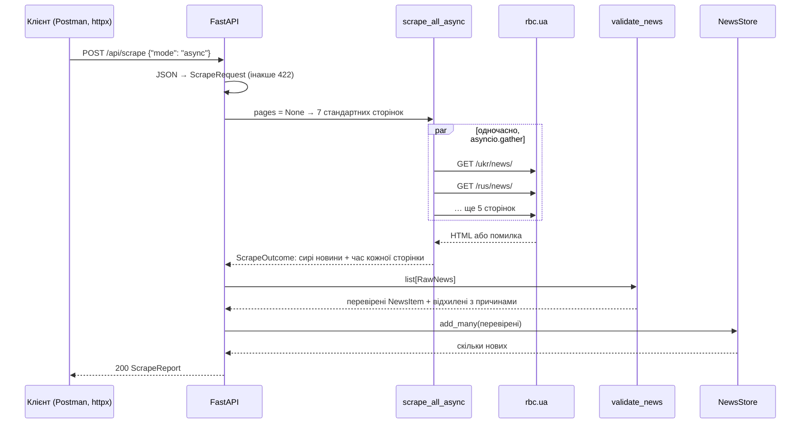
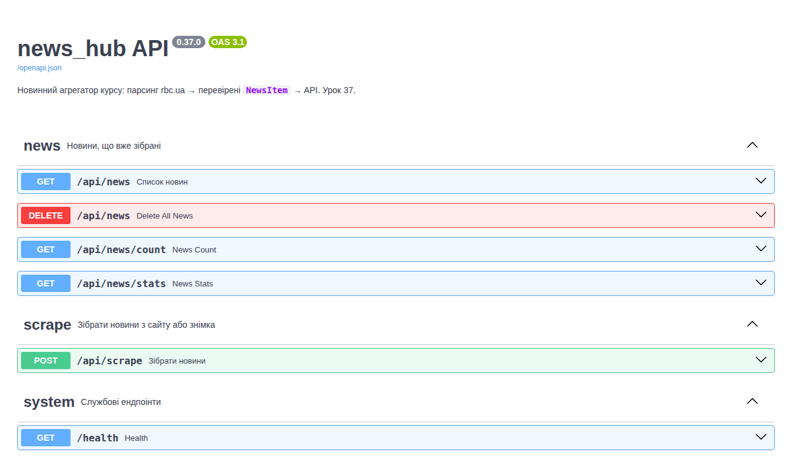
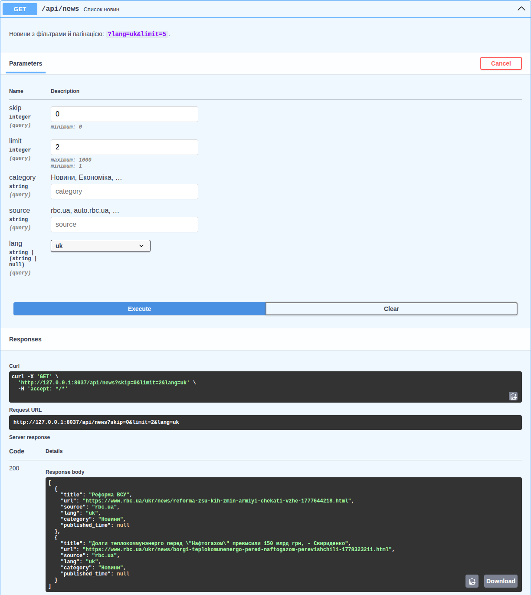
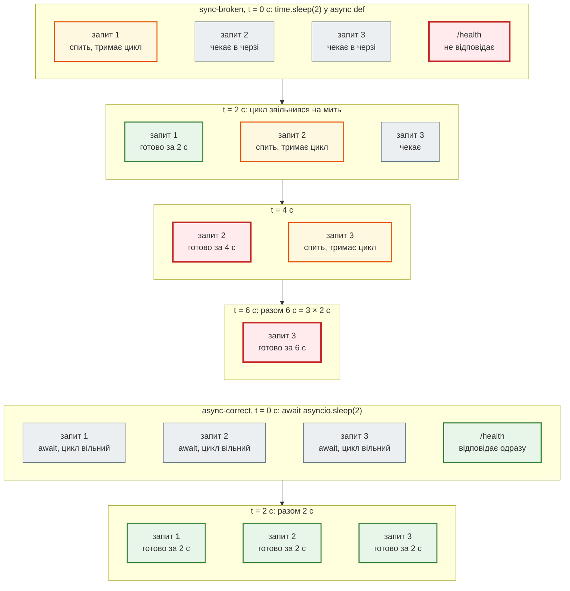
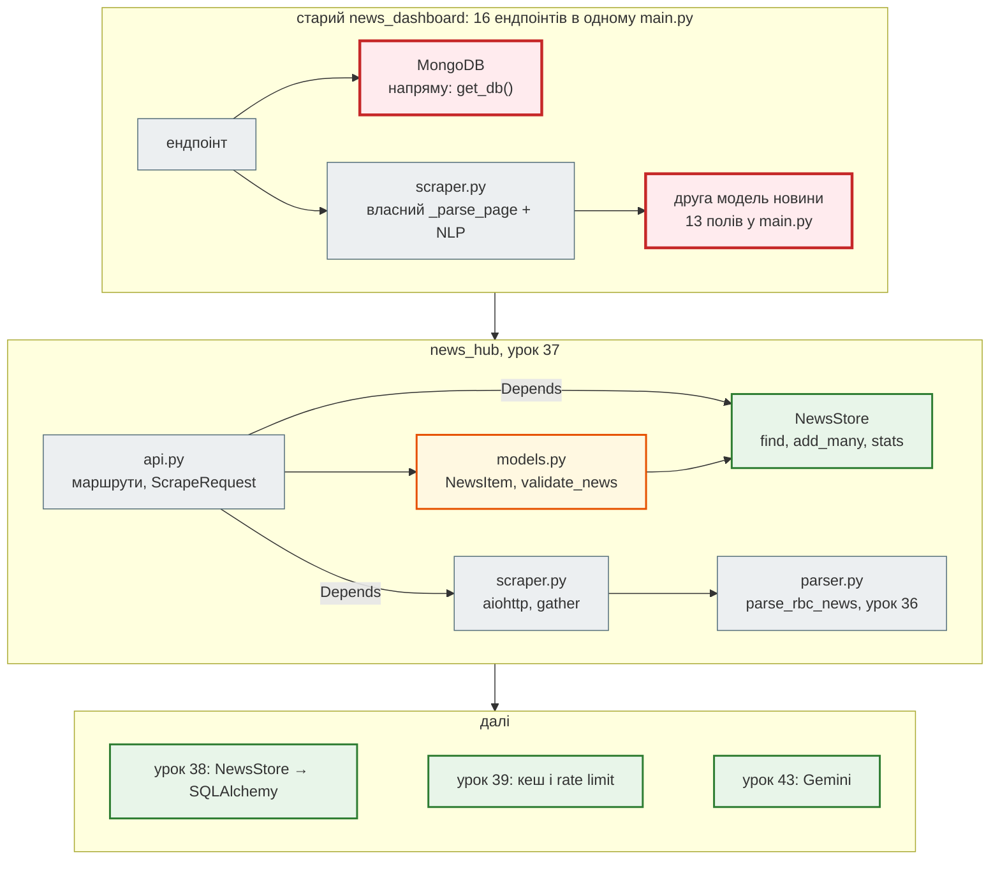

# Урок 37. FastAPI basics + Postman + OpenAPI

В уроці 36 агрегатор навчився **перевіряти** новини: парсер `parse_rbc_news` дає сирі рядки, модель `NewsItem` пропускає лише правильні. Але все це живе в Python-процесі: скористатися агрегатором може лише той, хто імпортує модуль. Сьогодні агрегатор стає **сервісом** — HTTP API, який можна викликати з браузера, Postman, іншої програми чи (в уроці 47) Telegram-бота.

Знову не з нуля: у старому курсі вже є FastAPI-застосунок агрегатора — `news_dashboard/app/main.py` (618 рядків, 16 ендпоінтів, MongoDB, NLP, архівний парсер). Беремо з нього ядро й робимо три рефакторинги проєкту `news_hub` з уроку 36.

| Урок | Крок агрегатора |
|---|---|
| 36 | парсер з типами; `NewsItem` на Pydantic |
| **37** | **FastAPI: `GET /api/news`, `POST /api/scrape`, `/docs`, Postman** |
| 38 | SQLAlchemy: новини в базі |
| 39 | middleware, кеш і rate limit на Redis |
| 41 | тести API |
| 43 | Gemini: підсумок, категорія, тональність |
| 47 | Telegram-бот |
| 48–50 | Docker, Compose, CI/CD |

Проєкт: [`news_hub`](https://github.com/NikoriakViktot/PY-Course-Victor-Nikoriak-22-09-2026/tree/main/module_4/lessons/lesson_37_fastapi_basics/news_hub). Поруч — [`fastapi_demo`](https://github.com/NikoriakViktot/PY-Course-Victor-Nikoriak-22-09-2026/tree/main/module_4/lessons/lesson_37_fastapi_basics/fastapi_demo) зі старого курсу: шість ендпоінтів, на яких видно, що з сервером робить блокуючий код.

**Що потрібно з попередніх уроків:** `async`/`await` і `asyncio.gather` (27, 31), REST — ресурси, методи, статус-коди, OpenAPI (32), FastAPI-версія API нотаток (35), `NewsItem` і `validate_news` (36).

**Після уроку ти зможеш:**

- написати FastAPI-застосунок: маршрути, параметри шляху й запиту з обмеженнями, тіло запиту — Pydantic-модель, `response_model`;
- пояснити, звідки береться `422` і як його прочитати;
- винести ресурс (сховище, клієнт) у залежність `Depends` і підмінити її в тестах;
- ініціалізувати ресурси в `lifespan`;
- прочитати `/docs` і `/openapi.json`, зібрати колекцію Postman з перевірками й запустити її з консолі;
- відрізнити ендпоінт, що блокує сервер, від того, що не блокує, — і довести це вимірами.

**Ноутбук заняття:** [`note_lesson_37_fastapi.ipynb`](https://github.com/NikoriakViktot/PY-Course-Victor-Nikoriak-22-09-2026/blob/main/module_4/lessons/lesson_37_fastapi_basics/note_lesson_37_fastapi.ipynb) [](https://colab.research.google.com/github/NikoriakViktot/PY-Course-Victor-Nikoriak-22-09-2026/blob/main/module_4/lessons/lesson_37_fastapi_basics/note_lesson_37_fastapi.ipynb) — API агрегатора через `TestClient`, без запуску сервера.

**Довідник:** [FastAPI: архітектура, async і production-патерни](fastapi/fastapi_documentation.md) — документ зі старого курсу; розділи 1–5 — до цього уроку.

## Пригадай

1. Що поверне `NewsItem.from_raw(...)` для новини з заголовком «Коротко» (урок 36)?
2. Чим `await asyncio.sleep(2)` відрізняється від `time.sleep(2)` усередині `async def` (урок 27)?
3. Який статус-код відповідає на `POST`, що створює ресурс, і який — на неправильні дані (урок 32)?

??? success "Відповіді"

    1. Нічого — кине `ValidationError` (`title`: мінімум 10 символів). `validate_news` не губить такі новини, а складає в `rejected` з причинами.
    2. `await asyncio.sleep` віддає керування циклу подій — поки корутина спить, виконуються інші. `time.sleep` зупиняє весь потік разом із циклом подій. Сьогодні побачимо це на сервері в цифрах.
    3. `201 Created`; неправильні дані — `400` або `422`. FastAPI для помилок перевірки завжди повертає `422`.

## Старт: що дає `news_dashboard` старого курсу

`news_dashboard/app/main.py` — застосунок, що вміє все одразу: парсить rbc.ua (разом або по черзі), зберігає в MongoDB, рахує тональність і ключові слова (spaCy), збирає архів за роки у фоні, будує тренди. Для першого кроку це забагато — беремо ядро, решту переносимо в уроки, де для неї з'явиться основа:

| Ендпоінти старого `main.py` | Що з ними | Коли повернуться |
|---|---|---|
| `/health`, `GET /api/news`, `/api/news/count`, `/api/news/stats`, `POST /api/scrape`, `DELETE /api/news` | **беремо** — ядро агрегатора | урок 37 |
| MongoDB (`motor`) у кожному ендпоінті | → `NewsStore` через `Depends` | урок 38 — SQLAlchemy |
| `POST /api/scrape/archive`, `/api/scrape/jobs` (`BackgroundTasks`) | фоновий збір | урок 39 |
| `/keywords`, `/entities`, `/entity-trend`, `/reanalyze`, `/purge-russian` (spaCy, langdetect) | аналіз тексту | урок 43 — Gemini |
| `/trends`, `/timeline` (`$regex` з рядка користувача) | пошук і агрегація | урок 38 (SQL), безпека regex — урок 46 |
| CORS `allow_origins=["*"]` + `allow_credentials=True` | прибрано: у 37 немає браузерного клієнта | з фронтендом |

Старий застосунок описував новину **другою** моделлю — 13 полів у `main.py`, окремо від парсера, і власним `_parse_page` у `scraper.py` зі своїм словником категорій. У `news_hub` модель одна — `NewsItem` з уроку 36 — і вона ж стане відповіддю API.

## Рефакторинг 1. FastAPI над `NewsItem` { #refactor-1 }

FastAPI будує API з **анотацій типів**: параметр функції стає параметром запиту, його тип і `Query(...)` — правилами перевірки, `response_model` — формою відповіді. Той самий Pydantic, що в уроці 36, тільки тепер на вході й виході HTTP.

```python title="news_hub/api.py (фрагмент)"
app = FastAPI(title="news_hub API", version="0.37.0", lifespan=lifespan, openapi_tags=[...])


@app.get("/api/news", response_model=list[NewsItem], tags=["news"], summary="Список новин")
async def list_news(
    store: StoreDep,
    skip: int = Query(0, ge=0),
    limit: int = Query(50, ge=1, le=1000),
    category: str = Query("", description="Новини, Економіка, …"),
    source: str = Query("", description="rbc.ua, auto.rbc.ua, …"),
    lang: Literal["uk", "ru"] | None = Query(None),
) -> list[NewsItem]:
    """Новини з фільтрами й пагінацією: `?lang=uk&limit=5`."""
    return store.find(skip=skip, limit=limit, category=category, source=source, lang=lang or "")
```

Що тут робить FastAPI без жодного рядка нашого коду:

| Запис | Що відбувається з запитом `GET /api/news?limit=abc&lang=en` |
|---|---|
| `limit: int = Query(50, ge=1, le=1000)` | `"abc"` → не число → `422`; `0` → менше `ge=1` → `422`; немає → `50` |
| `lang: Literal["uk", "ru"] \| None` | `"en"` → не зі списку → `422` |
| `response_model=list[NewsItem]` | відповідь перетворюється на JSON за моделлю: `url` → рядок, `published_time` → `"14:19:00"` |
| `tags`, `summary`, docstring | потрапляють в OpenAPI → `/docs` |

### Запуск і перші запити

У папці `news_hub`:

```bash
pip install -r requirements.txt
uvicorn news_hub.api:app --reload      # INFO: Uvicorn running on http://127.0.0.1:8000
```

`news_hub.api:app` — «модуль `news_hub/api.py`, змінна `app`»; `--reload` перезапускає сервер, коли змінюється код. У другому терміналі (або в Python-консолі) — запити клієнтом `httpx` з уроку 31:

```python
import httpx

api = httpx.Client(base_url="http://127.0.0.1:8000")
print(api.get("/health").json())
print(api.get("/api/news").json(), api.get("/api/news/count").json())
```

```text
{'status': 'ok'}
[] {'count': 0}
```

Сховище порожнє: новин ще ніхто не збирав. Збираємо зі знімка (168 новин, урок 36) — рефакторинг 3 розбере цей ендпоінт докладно:

```python
report = api.post("/api/scrape", json={"source": "snapshot"}).json()
print({key: report[key] for key in ("news_found", "news_valid", "news_saved", "news_total")})

response = api.get("/api/news", params={"lang": "uk", "limit": 2})
print(response.status_code, response.headers["content-type"])
for news in response.json():
    print(news)
print(api.get("/api/news/stats").json())
```

```text
{'news_found': 168, 'news_valid': 168, 'news_saved': 168, 'news_total': 168}
200 application/json
{'title': 'Реформа ВСУ', 'url': 'https://www.rbc.ua/ukr/news/reforma-zsu-kih-zmin-armiyi-chekati-vzhe-1777644218.html', 'source': 'rbc.ua', 'lang': 'uk', 'category': 'Новини', 'published_time': None}
{'title': 'Долги теплокоммунэнерго перед "Нафтогазом" превысили 150 млрд грн, - Свириденко', 'url': 'https://www.rbc.ua/ukr/news/borgi-teplokomunenergo-pered-naftogazom-perevishchili-1778323211.html', 'source': 'rbc.ua', 'lang': 'uk', 'category': 'Новини', 'published_time': None}
{'total': 168, 'category': {'Новини': 168}, 'lang': {'ru': 138, 'uk': 30}, 'source': {'rbc.ua': 167, 'auto.rbc.ua': 1}}
```

Два спостереження:

- `published_time` у JSON — `null`: у цих двох новин у стрічці не було часу. Для інших — рядок `"HH:MM:SS"`: `response_model` перетворює `time` на JSON сам;
- обидві новини лежать під `/ukr/`, тож `lang="uk"`, а заголовки — російською («Реформа ВСУ», «Долги …»). Мову ми **виводимо з URL**, а не з тексту, — і сайт не завжди кладе текст туди, куди обіцяє адреса. Визначати мову за змістом навчимо агрегатор з Gemini в уроці 43.

### 422: помилка перевірки { #errors }

Неправильні параметри до нашої функції навіть не доходять — FastAPI відповідає `422 Unprocessable Content` з переліком помилок:

```python
for params in ({"limit": 0}, {"limit": "abc"}, {"lang": "en"}):
    response = api.get("/api/news", params=params)
    error = response.json()["detail"][0]
    print(response.status_code, params, "→", error["loc"], error["msg"])
```

```text
422 {'limit': 0} → ['query', 'limit'] Input should be greater than or equal to 1
422 {'limit': 'abc'} → ['query', 'limit'] Input should be a valid integer, unable to parse string as an integer
422 {'lang': 'en'} → ['query', 'lang'] Input should be 'uk' or 'ru'
```

`loc` — де помилка: `["query", "limit"]` — параметр запиту `limit`; для тіла запиту буде `["body", …]`. Той самий формат отримає і Postman, і фронтенд, і бот — один раз навчився читати, читаєш скрізь.

### Що змінилося

| Було (`news_dashboard/app/main.py`) | Стало (`news_hub/news_hub/api.py`) | Навіщо |
|---|---|---|
| `class NewsItem(BaseModel)` — 13 полів у `main.py`, окремо від парсера | `response_model=list[NewsItem]` — модель з уроку 36 | одна модель на весь проєкт |
| `lang: str = Query(default="", description="uk \| ru \| unknown")` | `lang: Literal["uk", "ru"] \| None` | `?lang=en` — `422`, а не порожній список |
| `mode: str = Field(pattern="^(async\|sequential)$")` | `mode: Literal["async", "sequential"]` | те саме без regex; mypy знає значення |
| `from fastapi import HTTPException` усередині функцій | імпорти вгорі модуля | читабельність |
| 16 ендпоінтів | 6 + `openapi_tags` | ядро, згруповане в `/docs` |

## Рефакторинг 2. Сховище через `Depends` і `lifespan` { #refactor-2 }

У старому коді кожен ендпоінт сам діставав базу: `db = get_db()` → `db.news.find(query)`. Ендпоінт знає про MongoDB, а протестувати його без MongoDB неможливо. Виносимо «де лежать новини» в клас з тим самим контрактом:

```diff title="GET /api/news: було → стало"
 @app.get("/api/news", response_model=list[NewsItem])
-async def list_news(skip: int = Query(default=0, ge=0), limit: int = ..., category: str = ..., ...):
-    db = get_db()
-    query: dict = {}
-    if category:
-        query["category"] = category
-    ...
-    cursor = db.news.find(query).sort("scraped_at", -1).skip(skip).limit(limit)
-    docs = await cursor.to_list(length=limit)
-    return [_doc_to_item(d) for d in docs]
+async def list_news(store: StoreDep, skip: int = Query(0, ge=0), limit: int = ..., ...) -> list[NewsItem]:
+    return store.find(skip=skip, limit=limit, category=category, source=source, lang=lang or "")
```

```python title="news_hub/store.py (скорочено)"
class NewsStore:
    def __init__(self) -> None:
        self._items: dict[str, NewsItem] = {}      # url → новина: той самий url двічі не збережеться

    def add_many(self, items: Iterable[NewsItem]) -> int:
        """Додає лише нові (як `$setOnInsert` + `upsert` у Mongo); повертає, скільки додано."""

    def find(self, *, skip=0, limit=50, category="", source="", lang="") -> list[NewsItem]: ...
    def count(self) -> int: ...
    def stats(self) -> dict[str, dict[str, int]]: ...
    def clear(self) -> int: ...
```

Урок 38 замінить `NewsStore` на SQLAlchemy **з тими самими методами** — ендпоінти не зміняться.

### `Depends`: ендпоінт просить, FastAPI дає

```python title="news_hub/api.py (фрагмент)"
@asynccontextmanager
async def lifespan(app: FastAPI) -> AsyncIterator[None]:
    app.state.store = NewsStore()        # до першого запиту
    yield                                # тут сервер працює
    app.state.store.clear()              # після зупинки


def get_store(request: Request) -> NewsStore:
    store: NewsStore = request.app.state.store
    return store


StoreDep = Annotated[NewsStore, Depends(get_store)]
```

- **`Depends(get_store)`** — «перед викликом ендпоінта виклич `get_store` і передай результат». Ендпоінт оголошує, *що* йому потрібно, а не *звідки* це взяти. Докладніше — розділ 5 [довідника](fastapi/fastapi_documentation.md#s5).
- **`Annotated[NewsStore, Depends(...)]`** — тип для mypy і `/docs` плюс інструкція для FastAPI в одному записі; `StoreDep` — щоб не повторювати його в кожному ендпоінті.
- **`lifespan`** — код до `yield` виконується один раз при старті, після `yield` — при зупинці. Старий `@app.on_event("startup")` у FastAPI застарів; `lifespan` тримає старт і зупинку поруч. У уроці 38 тут з'явиться пул з'єднань з базою (розділ 6 довідника).

### Підміна залежності в тестах

Живий скрапінг ходить у мережу — у тестах він не потрібен. `app.dependency_overrides` підміняє залежність на час тесту:

```python title="tests/test_api.py (фрагмент)"
async def fake_scraper(pages: list[str] | None) -> ScrapeOutcome:
    page = PageResult(url=(pages or ["https://www.rbc.ua/ukr/news/"])[0], start=0.0, end=0.1, count=2)
    return ScrapeOutcome(pages=[page], news=FAKE_NEWS, total_time=0.1)


@pytest.fixture
def client() -> Iterator[TestClient]:
    app.dependency_overrides[get_scrapers] = lambda: {"async": fake_scraper, "sequential": fake_scraper}
    with TestClient(app) as c:          # with → спрацює lifespan: нове порожнє сховище
        yield c
    app.dependency_overrides.clear()
```

`TestClient` надсилає запити прямо в застосунок — без uvicorn і мережі. Так само працює ноутбук заняття. Повністю тестування API — урок 41.

## Рефакторинг 3. `POST /api/scrape`: парсинг через API { #refactor-3 }

Тепер головне: агрегатор збирає новини за HTTP-запитом. Тіло запиту — Pydantic-модель:

```python title="news_hub/api.py (фрагмент)"
class ScrapeRequest(BaseModel):
    source: Literal["live", "snapshot"] = Field("live", description="live — сайт; snapshot — збережений знімок")
    mode: Literal["async", "sequential"] = Field("async", description="сторінки одночасно чи по черзі")
    pages: list[HttpUrl] | None = Field(None, max_length=20, description="порожньо — стандартний список сторінок")

    @field_validator("pages")
    @classmethod
    def only_rbc(cls, pages: list[HttpUrl] | None) -> list[HttpUrl] | None:
        for url in pages or []:
            if not (url.host or "").endswith("rbc.ua"):
                raise ValueError(f"сервер завантажує лише сторінки rbc.ua, а не {url.host}")
        return pages


@app.post("/api/scrape", response_model=ScrapeReport, tags=["scrape"], summary="Зібрати новини")
async def scrape(request: ScrapeRequest, store: StoreDep,
                 scrapers: Annotated[dict[str, Scraper], Depends(get_scrapers)]) -> ScrapeReport:
    if request.source == "snapshot":
        outcome = ScrapeOutcome(pages=[], news=load_snapshot(), total_time=0.0)
    else:
        pages = [str(url) for url in request.pages] if request.pages else None
        outcome = await scrapers[request.mode](pages)

    valid, rejected = validate_news(outcome.news)       # урок 36: нічого не губиться мовчки
    saved = store.add_many(valid)
    return ScrapeReport(...)
```

Як FastAPI розрізняє, звідки брати параметр: простий тип (`int`, `str`, `Literal`) — з рядка запиту (`?limit=5`), Pydantic-модель — з тіла запиту (JSON), `Depends(...)` — із залежності.



### Знімок, повторний збір і чужий сайт

```python
first = api.post("/api/scrape", json={"source": "snapshot"}).json()
print("вдруге:", {key: first[key] for key in ("news_found", "news_saved", "news_total")})

response = api.post("/api/scrape", json={"pages": ["https://example.com/admin"]})
print(response.status_code, response.json()["detail"][0]["msg"])

response = api.post("/api/scrape", json={"mode": "fast"})
print(response.status_code, response.json()["detail"][0]["loc"], response.json()["detail"][0]["msg"])
```

```text
вдруге: {'news_found': 168, 'news_saved': 0, 'news_total': 168}
422 Value error, сервер завантажує лише сторінки rbc.ua, а не example.com
422 ['body', 'mode'] Input should be 'async' or 'sequential'
```

Повторний збір не дублює новин (`news_saved: 0`): ключ сховища — `url`, як `upsert` зі `$setOnInsert` у старому коді.

Обмеження `pages` лише сайтом rbc.ua — не формальність. Старий `ScrapeRequest` приймав будь-які URL: хто завгодно міг змусити сервер завантажити довільну адресу — зокрема внутрішню, недоступну ззовні (`http://localhost:…`, адреси хмарної інфраструктури). Це **SSRF** (Server-Side Request Forgery) — розберемо в уроці 46.

### Живий збір

`scraper.py` — `scrape_all_async` і `scrape_sequential` старого курсу: `aiohttp`, `asyncio.gather`, час початку й кінця кожної сторінки (у `news_dashboard` з них будувалась діаграма Ганта «разом vs по черзі»). Змінилося: розбір — `parse_rbc_news` з уроку 36 замість другої копії парсера; сторінка з кодом помилки (`403`, `503`) — помилка, а не «0 новин»:

```python
report = api.post("/api/scrape", json={"pages": ["https://www.rbc.ua/ukr/news/"]}).json()
for page in report["pages"]:
    print(page["url"], "→ новин:", page["count"], "| помилка:", page["error"])
print({key: report[key] for key in ("news_found", "news_saved", "news_total")})
```

Приклад виводу (у середовищі, де збирався курс, rbc.ua недоступний; з доступом до сайту тут буде кількість новин і `помилка: None`):

```text
https://www.rbc.ua/ukr/news/ → новин: 0 | помилка: ClientResponseError: 403, message='Forbidden', url='https://www.rbc.ua/ukr/news/'
{'news_found': 0, 'news_saved': 0, 'news_total': 168}
```

Старий `fetch_one` не перевіряв статус: сторінку «403 Forbidden» він розбирав як стрічку новин і повідомляв «0 новин, помилки немає». Тепер `resp.raise_for_status()` — і причина видна у звіті.

## OpenAPI і `/docs` { #openapi }

FastAPI сам описує API за стандартом **OpenAPI** (урок 32) — з маршрутів, типів параметрів, моделей і docstring-ів:

```python
schema = api.get("/openapi.json").json()
print(schema["openapi"], "|", schema["info"]["title"], schema["info"]["version"])
for path, methods in schema["paths"].items():
    for method, operation in methods.items():
        print(f"{method.upper():6} {path:18} {operation['tags']} {operation['summary']}")
print(sorted(schema["components"]["schemas"]))
```

```text
3.1.0 | news_hub API 0.37.0
GET    /health            ['system'] Health
GET    /api/news          ['news'] Список новин
DELETE /api/news          ['news'] Delete All News
GET    /api/news/count    ['news'] News Count
GET    /api/news/stats    ['news'] News Stats
POST   /api/scrape        ['scrape'] Зібрати новини
['HTTPValidationError', 'NewsItem', 'PageResult', 'ScrapeReport', 'ScrapeRequest', 'Stats', 'ValidationError']
```

- `http://127.0.0.1:8000/docs` — **Swagger UI**: інтерактивна документація з цього опису;
- `http://127.0.0.1:8000/redoc` — ReDoc: той самий опис для читання;
- `/openapi.json` — сам опис: з нього генерують клієнтів, його імпортує Postman.



**Try it out** → параметри → **Execute**: Swagger UI надсилає справжній запит і показує команду `curl`, URL, відповідь і заголовки:



Опис моделі `NewsItem` у розділі **Schemas** — та сама JSON Schema, яку в уроці 36 ми отримували через `NewsItem.model_json_schema()`.

## Postman: колекція запитів з перевірками { #postman }

`/docs` зручний, щоб спробувати один запит. **Postman** — щоб зберегти набір запитів, передати його команді й перевіряти відповіді автоматично. У проєкті є колекція [`postman/news_hub.postman_collection.json`](https://github.com/NikoriakViktot/PY-Course-Victor-Nikoriak-22-09-2026/blob/main/module_4/lessons/lesson_37_fastapi_basics/news_hub/postman/news_hub.postman_collection.json): 7 запитів, у кожного — вкладка **Tests** з перевірками на JavaScript:

```javascript
// 2. зібрати знімок — POST {{baseUrl}}/api/scrape, тіло {"source": "snapshot"}
const report = pm.response.json();
pm.test("200", () => pm.response.to.have.status(200));
pm.test("усі 168 новин зі знімка перевірені", () => pm.expect(report.news_valid).to.eql(168));
pm.collectionVariables.set("total", report.news_total);   // запам'ятали для запитів 4 і 7
```

- `{{baseUrl}}` — змінна колекції (`http://127.0.0.1:8000`): змінив раз — змінилося в усіх запитах;
- `pm.collectionVariables.set` — передати значення з одного запиту в інший.

**Як працювати:** Postman → **Import** → файл колекції → **Run collection**. Або **Import** → `http://127.0.0.1:8000/openapi.json`: Postman сам створить запит на кожен ендпоінт (без перевірок).

Ту саму колекцію запускає з консолі **newman** — так її можна проганяти в CI (урок 50). Приклад виводу (сервер запущено на порту 8000; час запитів залежить від машини):

```text
$ npx newman run postman/news_hub.postman_collection.json
newman

news_hub — урок 37

→ 1. health
  GET http://127.0.0.1:8000/health [200 OK, 140B, 24ms]
  ✓  200 і status ok

→ 2. зібрати знімок
  POST http://127.0.0.1:8000/api/scrape [200 OK, 270B, 14ms]
  ✓  200
  ✓  усі 168 новин зі знімка перевірені

→ 3. українські новини
  GET http://127.0.0.1:8000/api/news?lang=uk&limit=5 [200 OK, 1.69kB, 4ms]
  ✓  200
  ✓  не більше limit
  ✓  усі lang = uk

→ 4. статистика
  GET http://127.0.0.1:8000/api/news/stats [200 OK, 237B, 6ms]
  ✓  total = кількості після збору
  ✓  є мови uk і ru

→ 5. помилка: lang=en
  GET http://127.0.0.1:8000/api/news?lang=en [422 Unprocessable Content, 289B, 3ms]
  ✓  422 — FastAPI перевірив параметр
  ✓  помилка в полі lang

→ 6. помилка: чужий сайт
  POST http://127.0.0.1:8000/api/scrape [422 Unprocessable Content, 364B, 3ms]
  ✓  422 — сервер не завантажує чужі URL

→ 7. очистити
  DELETE http://127.0.0.1:8000/api/news [200 OK, 140B, 3ms]
  ✓  видалено стільки, скільки було

┌─────────────────────────┬─────────────────┬─────────────────┐
│                         │        executed │          failed │
├─────────────────────────┼─────────────────┼─────────────────┤
│              iterations │               1 │               0 │
├─────────────────────────┼─────────────────┼─────────────────┤
│                requests │               7 │               0 │
├─────────────────────────┼─────────────────┼─────────────────┤
│            test-scripts │               7 │               0 │
├─────────────────────────┼─────────────────┼─────────────────┤
│      prerequest-scripts │               0 │               0 │
├─────────────────────────┼─────────────────┼─────────────────┤
│              assertions │              12 │               0 │
├─────────────────────────┴─────────────────┴─────────────────┤
│ total run duration: 187ms                                   │
├─────────────────────────────────────────────────────────────┤
│ total data received: 2.22kB (approx)                        │
├─────────────────────────────────────────────────────────────┤
│ average response time: 8ms [min: 3ms, max: 24ms, s.d.: 7ms] │
└─────────────────────────────────────────────────────────────┘
```

## Async чи blocking: виміри { #measure }

FastAPI приймає і `async def`, і звичайний `def`. Різниця — у тому, **хто** виконує функцію:

- `async def` — виконується в **циклі подій** (один потік на всі запити). Поки корутина чекає на `await`, цикл обслуговує інші запити;
- `def` — FastAPI запускає в **пулі потоків** (за замовчуванням 40), щоб блокуючий код не зупиняв цикл подій.

Небезпечне поєднання — `async def` + блокуючий виклик (`time.sleep`, `requests.get`, синхронний драйвер бази): функція займає цикл подій, і **весь сервер** чекає. Саме тому скрапер агрегатора — на `aiohttp` з `await`, а не на `requests`.

Покроково — три одночасні запити до ендпоінта, що «чекає 2 секунди», у двох варіантах:



Перевіримо на [`fastapi_demo`](https://github.com/NikoriakViktot/PY-Course-Victor-Nikoriak-22-09-2026/tree/main/module_4/lessons/lesson_37_fastapi_basics/fastapi_demo) зі старого курсу. Сервер — `uvicorn app.main:app --port 8001`, навантаження — `python load_test.py` (одночасні запити, загальний час). Результати з машини, де збирався курс (4 ядра, один процес uvicorn; числа на іншій машині будуть трохи інші, співвідношення — ті самі):

| Ендпоінт | Як написаний | Одночасних запитів | Загальний час |
|---|---|---:|---:|
| `/sync-broken` | `async def` + `time.sleep(2)` | 10 | 20.57 с |
| `/sync-broken` | те саме | 20 | 40.03 с |
| `/sync-safe` | `def` + `time.sleep(2)` | 20 | 2.03 с |
| `/async-correct` | `async def` + `await asyncio.sleep(2)` | 20 | 2.01 с |
| `/async-correct` | те саме | 500 | 2.21 с |
| `/db-sync-broken/1` | `async def` + синхронний «драйвер бази» (1.5 с) | 8 | 12.01 с |
| `/db-async-correct/1` | те саме через `run_in_executor` | 8 | 1.51 с |

Поки йшли 10 запитів до `/sync-broken`, тест щосекунди питав `/health` — і шість разів поспіль не дочекався відповіді за 2 с: сервер не відповідав **нікому**.

!!! warning "Спершу виміряй вимірювач"
    Клієнт навантажувального тесту — теж частина досліду. `httpx.AsyncClient` на сотнях одночасних з'єднань сам стає вузьким місцем: 500 запитів до миттєвого `/health` через httpx тривають 5.66 с, через aiohttp — 0.22 с. І тайм-аут клієнта має бути більшим за тривалість тесту (20 × 2 = 40 с): інакше клієнт обриває запити, а сервер їх усе одно виконує й гальмує наступний вимір. Тому `load_test.py` — на aiohttp без ліміту з'єднань, з тайм-аутом 60 с.

    Правило: коли вимір дивує, перевір, що ти вимірюєш. Клієнт, мережа й тайм-аути — теж частина досліду.

Для CPU-задач (`/cpu-broken` → `/cpu-fixed` через `ProcessPoolExecutor`) і пулу з'єднань з базою — розділи 3–6 [довідника](fastapi/fastapi_documentation.md#s3).

## Архітектура: було → стало { #architecture }



- **Шари.** `api.py` знає HTTP (маршрути, коди, моделі запитів), `scraper.py` — мережу, `parser.py` — HTML, `models.py` — правила даних, `store.py` — зберігання. Кожен можна замінити, не чіпаючи інших: урок 38 змінить лише `store.py`.
- **Залежності через `Depends`.** Ендпоінт не створює сховище і не вибирає скрапер — отримує їх. Тому тест підмінює скрапер одним рядком, а урок 38 підставить сесію бази.
- **Одна модель.** `NewsItem` перевіряє дані з парсера (урок 36) і описує відповідь API й схему в `/docs` (урок 37) — змінимо модель, і все це зміниться узгоджено.

### Тести і mypy

Приклад виводу (час залежить від машини):

```text
$ pytest -q -p no:cacheprovider
.......................                                                                      [100%]
23 passed in 0.64s
$ mypy --strict news_hub
Success: no issues found in 7 source files
```

Додалось 11 тестів API: порожнє сховище, збір зі знімка й фільтри, повторний збір, відхилені новини зі «скрапера»-заглушки, чотири випадки `422`, очищення, перелік шляхів в OpenAPI.

## Практика { #practice }

### Розібраний приклад: ендпоінт `GET /api/news/sources`

Задача: список джерел з кількістю новин — `{"rbc.ua": 167, "auto.rbc.ua": 1}`.

1. **Шлях і метод.** Читаємо — `GET`; ресурс — джерела новин → `/api/news/sources`.
2. **Звідки дані.** `store.stats()["source"]` уже рахує джерела — нової логіки не треба.
3. **Що повертаємо.** `dict[str, int]` — анотація результату одразу стає схемою в `/docs`.

```python
from fastapi.testclient import TestClient
from news_hub.api import StoreDep, app


@app.get("/api/news/sources", tags=["news"])
async def news_sources(store: StoreDep) -> dict[str, int]:
    """Джерела новин і скільки новин з кожного."""
    return store.stats()["source"]


with TestClient(app) as client:
    client.post("/api/scrape", json={"source": "snapshot"})
    print(client.get("/api/news/sources").json())
    print("/api/news/sources" in client.get("/openapi.json").json()["paths"])
```

```text
{'rbc.ua': 167, 'auto.rbc.ua': 1}
True
```

Порядок має значення: якби в застосунку був маршрут `/api/news/{news_id}`, оголошений **раніше**, запит `/api/news/sources` потрапив би в нього з `news_id="sources"`. Конкретні шляхи оголошуй перед шляхами з параметрами.

### Зміни приклад

1. Додай до `/api/news/sources` параметр `min_count: int = Query(1, ge=1)` — повертати лише джерела, де новин не менше `min_count`. Перевір `422` для `min_count=0`.
2. Додай у колекцію Postman запит «8. джерела» з перевіркою, що сума значень дорівнює `total` зі збору.

### Спробуй самостійно: пошук за словом

Ендпоінт `GET /api/news/search?q=…`:

- `q` — обов'язковий, 2–60 символів (`Query(min_length=2, max_length=60)`);
- шукає `q` у заголовку без урахування регістру (`q.lower() in item.title.lower()`), повертає `list[NewsItem]`;
- пошук — метод `NewsStore.search(q, limit)`, а не код в ендпоінті.

**Критерії перевірки:** `?q=Зеленськ` на знімку повертає лише новини з цим словом у заголовку; `?q=а` — `422`; тест у `tests/test_api.py`; `mypy --strict` чистий. Старий `/api/news/trends` робив те саме через `$regex` з рядка користувача — чому так не варто, розберемо в уроці 46.

### Знайди помилку { #find-bug }

Студент додав ендпоінт «зібрати одну сторінку» — через `requests`, як в уроці 31:

```python title="news_hub/api.py"
import requests

@app.post("/api/scrape/page")
async def scrape_page(url: str, store: StoreDep) -> dict[str, int]:
    html = requests.get(url, timeout=15).text
    valid, _ = validate_news(parse_rbc_news(html))
    return {"saved": store.add_many(valid)}
```

Локально з одним користувачем усе працює. Що станеться, коли rbc.ua відповідатиме 10 секунд, а до агрегатора прийде ще кілька запитів? Знайди дві проблеми.

??? success "Відповідь"

    1. **`requests.get` у `async def` блокує цикл подій.** Поки сторінка вантажиться (до 15 с), сервер не відповідає нікому — навіть `/health`. Це `/sync-broken` з [вимірів](#measure): 10 таких запитів — 10 × час сторінки. Виправлення: асинхронний клієнт з `await` (`aiohttp`, як у `scraper.py`, або `httpx.AsyncClient`) — або `def` замість `async def`, щоб FastAPI виконав функцію в пулі потоків.
    2. **`url: str` без перевірки — SSRF.** Будь-хто може попросити сервер завантажити `http://localhost:…` чи внутрішню адресу. Виправлення: `HttpUrl` і перевірка домену, як у `ScrapeRequest.only_rbc`.

    Бонус: `url: str` без моделі — це параметр **рядка запиту** (`POST /api/scrape/page?url=…`), а не тіла; для `POST` з даними краще модель у тілі.

## Підсумок

| Поняття | Що запам'ятати |
|---|---|
| `FastAPI()` + `@app.get/post/delete` | маршрут = метод + шлях → функція |
| Параметри | простий тип — з рядка запиту; Pydantic-модель — з тіла; `Depends` — із залежності |
| `Query(..., ge=, le=)`, `Literal` | правила перевірки параметрів; порушення → `422` |
| `422` | `detail[i].loc` — де помилка, `msg` — що не так |
| `response_model` | форма відповіді й JSON з моделі |
| `Depends`, `Annotated` | ендпоінт просить ресурс, FastAPI дає; у тестах — `dependency_overrides` |
| `lifespan` | код при старті й зупинці сервера (замість `on_event`) |
| `/docs`, `/redoc`, `/openapi.json` | опис API, який FastAPI будує сам |
| Postman / newman | збережені запити з перевірками; newman — те саме з консолі й CI |
| `async def` vs `def` | `async def` — у циклі подій, лише з `await`; блокуючий код — у `def` (пул потоків) або через async-бібліотеку |
| Вимір | перевір клієнт і тайм-аути, перш ніж робити висновки про сервер |

### Самоперевірка

1. Звідки FastAPI бере значення параметра `limit: int = Query(50)`, а звідки — `request: ScrapeRequest`?
2. Що поверне `GET /api/news?limit=0` і де в відповіді шукати причину?
3. Навіщо сховище в `Depends`, якщо можна створити глобальну змінну `store = NewsStore()`?
4. Що робить код до і після `yield` у `lifespan`?
5. Чим відрізняються `/docs` і колекція Postman? Коли що використовувати?
6. `async def` + `time.sleep(2)`, 20 одночасних запитів — скільки чекатиме останній і чому? А з `def`?
7. Чому `POST /api/scrape` приймає сторінки лише з rbc.ua?

??? success "Відповіді"

    1. `limit` — з рядка запиту (`?limit=5`), бо це простий тип; `ScrapeRequest` — Pydantic-модель, тому з JSON-тіла.
    2. `422`, `detail[0].loc == ["query", "limit"]`, `msg` — «Input should be greater than or equal to 1».
    3. Залежність можна підмінити в тестах (`dependency_overrides`) і замінити реалізацію (SQLAlchemy в уроці 38), не змінюючи ендпоінтів. Глобальна змінна жорстко зв'язує код з однією реалізацією і живе між тестами.
    4. До `yield` — один раз при старті (створити сховище, пул з'єднань), після — при зупинці (закрити, прибрати).
    5. `/docs` — спробувати запит тут і зараз, прочитати контракт. Postman — зберегти набір запитів із перевірками, поділитися з командою, проганяти в CI через newman.
    6. ~40 с: `time.sleep` займає цикл подій, запити виконуються по черзі (виміряно: 40.03 с). З `def` — ~2 с: FastAPI виконує функції в пулі потоків (виміряно: 2.03 с).
    7. Інакше будь-хто змусить сервер завантажити довільну адресу, зокрема внутрішню (SSRF).

### Що далі

- Ноутбук заняття: [`note_lesson_37_fastapi.ipynb`](https://github.com/NikoriakViktot/PY-Course-Victor-Nikoriak-22-09-2026/blob/main/module_4/lessons/lesson_37_fastapi_basics/note_lesson_37_fastapi.ipynb) [](https://colab.research.google.com/github/NikoriakViktot/PY-Course-Victor-Nikoriak-22-09-2026/blob/main/module_4/lessons/lesson_37_fastapi_basics/note_lesson_37_fastapi.ipynb).
- Урок 38 — `NewsStore` → SQLAlchemy: новини переживають перезапуск сервера, унікальний `url` — обмеження бази, `GET /api/news` — SQL-запит з фільтрами. Довідник: розділи 6–8 (пул з'єднань, Repository, Unit of Work).

## Документація і джерела

- Код: [`news_hub`](https://github.com/NikoriakViktot/PY-Course-Victor-Nikoriak-22-09-2026/tree/main/module_4/lessons/lesson_37_fastapi_basics/news_hub) — API й скрапер з `news_dashboard/app/main.py` і `scraper.py` старого курсу (`module_4/lessons/lesson_34_asyncio`); [`fastapi_demo`](https://github.com/NikoriakViktot/PY-Course-Victor-Nikoriak-22-09-2026/tree/main/module_4/lessons/lesson_37_fastapi_basics/fastapi_demo) — там само.
- Довідник курсу: [FastAPI: архітектура, async і production-патерни](fastapi/fastapi_documentation.md).
- FastAPI: [First Steps](https://fastapi.tiangolo.com/tutorial/first-steps/), [Query Parameters and String Validations](https://fastapi.tiangolo.com/tutorial/query-params-str-validations/), [Request Body](https://fastapi.tiangolo.com/tutorial/body/), [Response Model](https://fastapi.tiangolo.com/tutorial/response-model/), [Handling Errors](https://fastapi.tiangolo.com/tutorial/handling-errors/), [Dependencies](https://fastapi.tiangolo.com/tutorial/dependencies/), [Lifespan Events](https://fastapi.tiangolo.com/advanced/events/), [Testing](https://fastapi.tiangolo.com/tutorial/testing/), [Testing Dependencies with Overrides](https://fastapi.tiangolo.com/advanced/testing-dependencies/), [Concurrency and async / await](https://fastapi.tiangolo.com/async/)
- [OpenAPI Specification](https://spec.openapis.org/oas/latest.html)
- Postman: [Write scripts to test API response data](https://learning.postman.com/docs/tests-and-scripts/write-scripts/test-scripts/), [Run collections using Newman CLI](https://learning.postman.com/docs/collections/using-newman-cli/command-line-integration-with-newman/)
- aiohttp: [Client Quickstart](https://docs.aiohttp.org/en/stable/client_quickstart.html)
