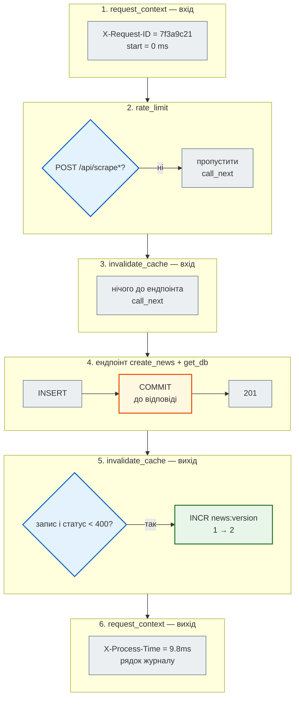
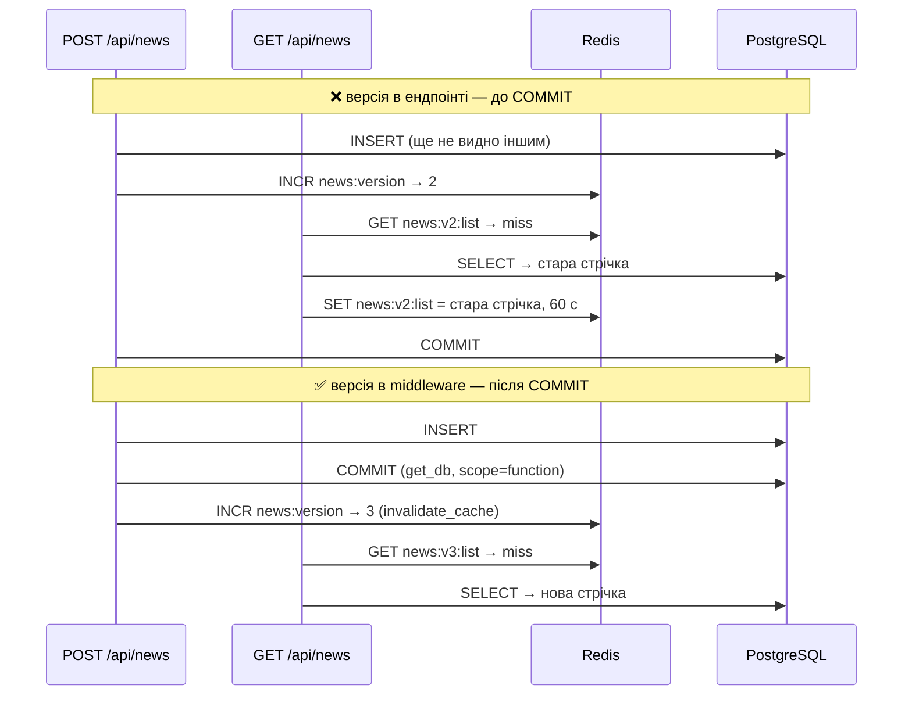
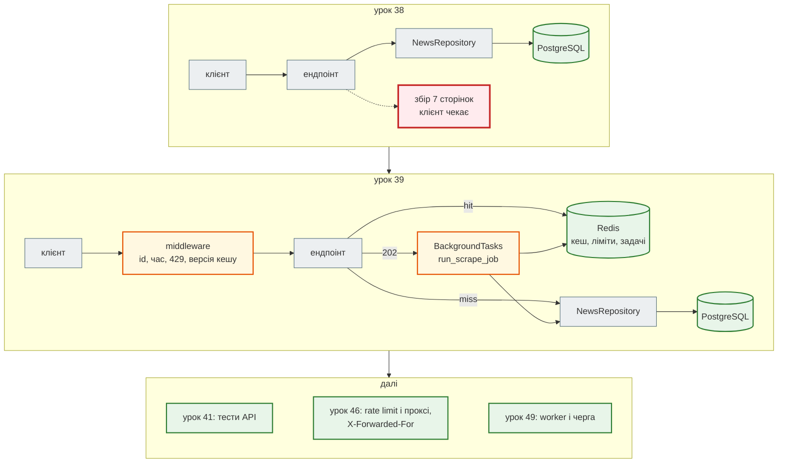

# Урок 39. Middleware і кешування (Redis на практиці)

Після уроку 38 агрегатор зберігає новини в базі, але має три проблеми живого сервісу:

- кожен `GET /api/news` — запит до бази, навіть якщо стрічка не змінювалась;
- `POST /api/scrape` можна смикати без обмежень, і кожен виклик — сім сторінок rbc.ua (урок 37);
- збір триває секунди, а клієнт увесь цей час чекає відповіді.

Сьогодні чотири рефакторинги `news_hub`: **middleware** (код навколо кожного запиту), **кеш** у Redis, **rate limit** і **фоновий збір**. Redis ти вже знаєш з уроку 30 — там були cache-aside, `INCR`/`EXPIRE` і черга. Тепер вони працюють у справжньому API.

| Урок | Крок агрегатора |
|---|---|
| 36 | парсер з типами; `NewsItem` на Pydantic |
| 37 | FastAPI: `GET /api/news`, `POST /api/scrape`, `/docs`, Postman |
| 38 | SQLAlchemy: новини в базі, повний CRUD, Alembic |
| **39** | **middleware, кеш і rate limit на Redis, фоновий збір** |
| 41 | тести API |
| 43 | Gemini: підсумок, категорія, тональність |
| 47 | Telegram-бот |
| 48–50 | Docker, Compose, CI/CD |

Проєкт: [`news_hub`](https://github.com/NikoriakViktot/PY-Course-Victor-Nikoriak-22-09-2026/tree/main/module_4/lessons/lesson_39_middleware_redis/news_hub).

**Що потрібно з попередніх уроків:** Redis — ключі, `INCR`, `EXPIRE`/`TTL`, hash, pipeline, cache-aside (урок 30); декоратори й функції як значення (9, 18); FastAPI, `Depends`, `lifespan` (37); `get_db` і COMMIT до відповіді (38).

**Після уроку ти зможеш:**

- написати HTTP-middleware і пояснити, в якому порядку вони виконуються;
- закешувати відповідь API в Redis і правильно скидати кеш після запису;
- обмежити частоту запитів (`429 Too Many Requests`, `Retry-After`) атомарно;
- винести довгу роботу у фон (`202 Accepted` + статус задачі) і не загубити дані;
- відрізнити фіксоване вікно rate limit від ковзного.

**Ноутбук заняття:** [`note_lesson_39_redis.ipynb`](https://github.com/NikoriakViktot/PY-Course-Victor-Nikoriak-22-09-2026/blob/main/module_4/lessons/lesson_39_middleware_redis/note_lesson_39_redis.ipynb) [](https://colab.research.google.com/github/NikoriakViktot/PY-Course-Victor-Nikoriak-22-09-2026/blob/main/module_4/lessons/lesson_39_middleware_redis/note_lesson_39_redis.ipynb) — без сервера Redis: `fakeredis` у пам'яті.

## Пригадай

1. Що поверне `INCR` для ключа, якого немає, і чи зникне цей ключ сам (урок 30)?
2. Що таке cache-aside і чому кеш завжди має TTL?
3. У який момент `get_db` робить COMMIT — до відповіді клієнту чи після (урок 38)?

??? success "Відповіді"

    1. `1` — Redis створить ключ зі значенням 0 і збільшить. Сам не зникне: TTL треба поставити окремо (`EXPIRE`).
    2. Спершу шукаємо в кеші (hit — віддаємо), немає (miss) — рахуємо, кладемо з TTL, віддаємо. Кеш — копія, вона застаріває; TTL обмежує, наскільки.
    3. До відповіді — завдяки `Depends(get_db, scope="function")`. Сьогодні це знадобиться для кешу.

## Старт: що дає старий курс

| Звідки | Що там | Куди в `news_hub` |
|---|---|---|
| `production_bot/backend/core/redis.py` | `get_redis()` — глобальний клієнт `redis.asyncio`, `close_redis()` | `cache.py`: клієнт у `app.state`, створюється в `lifespan` |
| `ai_bot/app/middlewares/rate_limit.py`, `repositories/rate_limit_repo.py` | middleware aiogram: `INCR`, `EXPIRE` при `count == 1`, відповідь «Забагато запитів» | `middleware.py`: `RateLimiter` + HTTP-middleware → `429` |
| `news_dashboard/app/main.py`, `POST /api/scrape/archive` | `BackgroundTasks`, uuid задачі, статус у MongoDB `scrape_jobs` | `jobs.py`: статус у Redis-hash, `202 Accepted` |
| урок 30 курсу | cache-aside, `INCR`/`EXPIRE`, pipeline | `NewsCache` |

## Рефакторинг 1. Middleware: код навколо кожного запиту { #refactor-1 }

**Middleware** — функція, через яку проходить **кожен** запит до ендпоінта і **кожна** відповідь після нього. Туди виносять те, що стосується всіх ендпоінтів одразу: журнал, час обробки, обмеження частоти, заголовки безпеки. Ендпоінти про це не знають.

```python title="news_hub/middleware.py (фрагмент)"
async def request_context(request: Request, call_next: CallNext) -> Response:
    """Найзовнішній шар: бачить увесь час обробки, зокрема інших middleware."""
    request_id = request.headers.get("X-Request-ID") or uuid.uuid4().hex[:8]
    start = time.perf_counter()
    response = await call_next(request)                 # ← далі: інші middleware і ендпоінт
    elapsed_ms = (time.perf_counter() - start) * 1000
    response.headers["X-Request-ID"] = request_id
    response.headers["X-Process-Time"] = f"{elapsed_ms:.1f}ms"
    logger.info("%s %s %s → %s %.1f ms", request_id, request.method, request.url.path,
                response.status_code, elapsed_ms)
    return response
```

- До `await call_next(request)` — код **до** ендпоінта, після — код **після**, коли відповідь уже є.
- Middleware може й не викликати `call_next` — тоді ендпоінт не виконається (так працює rate limit нижче).
- **X-Request-ID** — позначка запиту: клієнт може передати свою, інакше генеруємо. За нею в журналі знаходять усе, що стосується одного запиту (урок 49).

Реєстрація в `api.py` — порядок має значення:

```python title="news_hub/api.py (фрагмент)"
# Middleware: останній зареєстрований — зовнішній. Запит іде request_context → rate_limit → invalidate_cache
# → ендпоінт, відповідь — у зворотному порядку.
app.middleware("http")(invalidate_cache)
app.middleware("http")(rate_limit)
app.middleware("http")(request_context)
```

Покроково — один `POST /api/news` через три шари («цибуля»; id, час і номер версії — приклад значень):



Запит пішов через шари всередину, відповідь — назовні у зворотному порядку. Тому `request_context` — найзовнішній: його час включає всі інші шари.

```python
import httpx

api = httpx.Client(base_url="http://127.0.0.1:8000")
for headers in ({}, {"X-Request-ID": "lesson-39"}):
    response = api.get("/health", headers=headers)
    print(response.status_code, response.headers["X-Request-ID"], response.headers["X-Process-Time"].endswith("ms"))
```

```text
200 1a1e32f4 True
200 lesson-39 True
```

## Рефакторинг 2. Кеш стрічки в Redis { #refactor-2 }

`GET /api/news` і `/api/news/stats` читають однакові дані сотні разів, а змінюються вони лише під час збору. Це cache-aside з уроку 30:

```diff title="news_hub/api.py: GET /api/news, було (38) → стало (39)"
-async def list_news(repo: RepoDep, skip: int = ..., ...) -> list[NewsRow]:
-    return await repo.find(skip=skip, limit=limit, category=category, source=source, lang=lang or "")
+async def list_news(repo: RepoDep, cache: CacheDep, skip: int = ..., ...) -> Response:
+    key = await cache.key("list", {"skip": skip, "limit": limit, "category": category,
+                                   "source": source, "lang": lang or ""})
+    if (cached := await cache.get(key)) is not None:
+        return cached_json(cached, "HIT")                       # база не потрібна
+    rows = await repo.find(skip=skip, limit=limit, category=category, source=source, lang=lang or "")
+    payload = NEWS_LIST.dump_json([NewsOut.model_validate(row) for row in rows]).decode()
+    await cache.set(key, payload)
+    return cached_json(payload, "MISS")
```

- **Ключ залежить від параметрів**: `?lang=uk&limit=3` і `?lang=ru&limit=3` — різні записи кешу. Параметри перетворюємо на JSON з відсортованими ключами й беремо короткий хеш (SHA-1): порядок параметрів у URL не має значення.
- **У кеші — готовий JSON.** При hit повертаємо `Response` з цим рядком: ні бази, ні Pydantic.
- **`X-Cache: HIT | MISS`** — заголовок для людей і тестів: видно, звідки відповідь.

Сервер з кроку уроку 38 (PostgreSQL) + Redis (`REDIS_URL`), база й кеш порожні:

```python
import time

api.post("/api/scrape", json={"source": "snapshot"})
for attempt in (1, 2, 3):
    response = api.get("/api/news", params={"lang": "uk", "limit": 3})
    print(attempt, response.headers["X-Cache"], len(response.json()), "новини")
print("інші параметри:", api.get("/api/news", params={"lang": "ru", "limit": 3}).headers["X-Cache"])
```

```text
1 MISS 3 новини
2 HIT 3 новини
3 HIT 3 новини
інші параметри: MISS
```

Що лежить у Redis:

```python
import asyncio

from redis.asyncio import Redis


async def show_cache_keys() -> None:
    redis = Redis.from_url("redis://localhost:6379/0", decode_responses=True)
    print("news:version =", await redis.get("news:version"))
    for key in sorted(await redis.keys("news:v[0-9]*")):
        print(key, "TTL", await redis.ttl(key), "с")
    await redis.aclose()


asyncio.run(show_cache_keys())
```

```text
news:version = 1
news:v1:list:c2e167a04a88 TTL 60 с
news:v1:list:f0f06916a656 TTL 60 с
```

`KEYS` — лише для навчання: на великій базі Redis вона блокує сервер, поки перебирає всі ключі.

### Інвалідація: версія кешу і COMMIT

Після запису кеш має «забути» стару стрічку. Можна видаляти ключі за шаблоном (`KEYS news:*` → `DEL`), але це повільно й небезпечно. Натомість ключ містить **версію**: `news:v1:list:…`. Запис → `INCR news:version` → нові запити будують ключі `news:v2:…`, старі просто ніхто не читає, і TTL їх прибере.

Але **коли** збільшувати версію? Інтуїтивно — в ендпоінті, одразу після запису. Проблема: COMMIT робить `get_db` **після** ендпоінта (урок 38). Між «версія +1» і COMMIT паралельний `GET` встигне прочитати ще **старі** дані з бази й покласти їх у кеш під **новою** версією — і 60 секунд усі отримуватимуть застарілу стрічку:



Тому версію збільшує middleware `invalidate_cache`: він отримує відповідь, коли COMMIT уже відбувся. Правило: **успішний** запит `POST`/`PATCH`/`DELETE` до `/api/news…` чи `/api/scrape` → нова версія; `409` чи `422` кеш не чіпають.

```python
print("до:   ", api.get("/api/news/stats").headers["X-Cache"], api.get("/api/news/stats").headers["X-Cache"])
created = api.post("/api/news", json={"title": "НБУ залишив облікову ставку без змін",
                                      "url": "https://www.rbc.ua/ukr/news/nbu-rate-778.html"})
stats = api.get("/api/news/stats")
print("після:", created.status_code, stats.headers["X-Cache"], "total =", stats.json()["total"])
again = api.post("/api/news", json={"title": "НБУ залишив облікову ставку без змін",
                                    "url": "https://www.rbc.ua/ukr/news/nbu-rate-778.html"})
print("409:  ", again.status_code, api.get("/api/news/stats").headers["X-Cache"])
```

```text
до:    MISS HIT
після: 201 MISS total = 169
409:   409 HIT
```

## Рефакторинг 3. Rate limit: 429 і `Retry-After` { #refactor-3 }

`RateLimitMiddleware` з `ai_bot` рахував повідомлення користувача Telegram. Переносимо ту саму ідею на HTTP: не більше 5 `POST /api/scrape*` за 60 секунд з однієї адреси.

```diff title="rate limit: ai_bot (було) → news_hub (стало)"
-count = await self._redis.incr(key)
-if count == 1:
-    await self._redis.expire(key, config.RATE_LIMIT_WINDOW)
-is_allowed = count <= config.RATE_LIMIT_REQUESTS
+async with self._redis.pipeline(transaction=True) as pipe:      # MULTI … EXEC: разом або ніяк
+    pipe.incr(key)
+    pipe.expire(key, self.window, nx=True)                        # TTL лише новому ключу
+    pipe.ttl(key)
+    count, _, ttl = await pipe.execute()
+return count <= self.limit, count, max(ttl, 0)
```

Навіщо: якщо `INCR` і `EXPIRE` — **два окремі** запити, і процес упаде (перезапуск, обрив з'єднання) між ними, ключ залишиться **без TTL**: наступні `INCR` дадуть 2, 3, 4… — і умова `count == 1` більше ніколи не спрацює. Користувача заблоковано назавжди. Перевіримо — «падіння» імітуємо, просто не викликаючи `EXPIRE`:

```python
from news_hub.middleware import RateLimiter


async def old_vs_new() -> None:
    redis = Redis.from_url("redis://localhost:6379/0", decode_responses=True)
    await redis.delete("rate:old", "rate:scrape:crashed")

    await redis.incr("rate:old")                   # INCR… і процес «упав» до EXPIRE
    for _ in range(3):
        count = await redis.incr("rate:old")
        if count == 1:                             # ніколи не виконається
            await redis.expire("rate:old", 60)
    print("окремо:     count =", await redis.get("rate:old"), "| TTL =", await redis.ttl("rate:old"))

    await redis.set("rate:scrape:crashed", 99)     # той самий «залишок» без TTL
    allowed, count, ttl = await RateLimiter(redis).hit("crashed", "scrape")
    print("транзакція: count =", count, "| дозволено:", allowed, "| TTL =", ttl)
    await redis.aclose()


asyncio.run(old_vs_new())
```

```text
окремо:     count = 4 | TTL = -1
транзакція: count = 100 | дозволено: False | TTL = 60
```

`TTL = -1` — ключ без часу життя: блокування назавжди. `EXPIRE … NX` ставить TTL, **якщо його немає**, і робить це в тій самій транзакції, що `INCR`, — навіть «залишок» після збою сам зникне за хвилину.

Відповідь при перевищенні — `429 Too Many Requests` з `Retry-After` (скільки секунд чекати) і `X-RateLimit-*`:

```python
for attempt in range(1, 7):
    response = api.post("/api/scrape", json={"source": "snapshot"})
    print(attempt, response.status_code, "залишилось:", response.headers.get("X-RateLimit-Remaining"),
          "| Retry-After:", response.headers.get("Retry-After"))
print(response.json()["detail"])
print("GET не обмежується:", api.get("/api/news/count").status_code)
```

Приклад виводу (`Retry-After` залежить від того, скільки секунд минуло від першого запиту у вікні):

```text
1 200 залишилось: 3 | Retry-After: None
2 200 залишилось: 2 | Retry-After: None
3 200 залишилось: 1 | Retry-After: None
4 200 залишилось: 0 | Retry-After: None
5 429 залишилось: 0 | Retry-After: 59
6 429 залишилось: 0 | Retry-After: 59
забагато запитів: 5 за 60 с; спробуй через 59 с
GET не обмежується: 200
```

Перший `POST /api/scrape` був ще в рефакторингу 2 — тому `Remaining` уже на старті 3.

### Фіксоване вікно: межа

У docstring `ai_bot` алгоритм названо «Sliding Window Counter», але це **фіксоване вікно**: лічильник живе, поки живе ключ, і обнуляється разом із ним. На межі двох вікон можна пройти майже вдвічі більше запитів. Ліміт 3 за 2 секунди:

```python
async def window_edge() -> None:
    redis = Redis.from_url("redis://localhost:6379/0", decode_responses=True)
    await redis.delete("rate:edge:demo")
    limiter = RateLimiter(redis, limit=3, window=2)
    await limiter.hit("demo", "edge")                                  # 1-й запит відкрив вікно
    while await redis.pttl("rate:edge:demo") > 150:                    # чекаємо кінця вікна
        await asyncio.sleep(0.05)
    start, allowed = time.perf_counter(), 0
    while time.perf_counter() - start < 0.5:                           # пів секунди — запит кожні 50 мс
        allowed += (await limiter.hit("demo", "edge"))[0]
        await asyncio.sleep(0.05)
    print(f"за 0.5 с пройшло {allowed} запитів при ліміті 3 за 2 с")
    await redis.aclose()


asyncio.run(window_edge())
```

```text
за 0.5 с пройшло 5 запитів при ліміті 3 за 2 с
```

Для захисту від спаму зборами цього досить — простота важить більше. Де потрібна точність (платне API), беруть **ковзне вікно** — див. «Спробуй самостійно».

## Рефакторинг 4. Фоновий збір: 202 і статус задачі { #refactor-4 }

Живий збір — сім сторінок rbc.ua з тайм-аутом 15 с кожна (урок 37). Тримати HTTP-запит відкритим стільки часу погано: клієнт може відвалитись за тайм-аутом, проксі — обірвати з'єднання. Рішення зі старого `news_dashboard` (`/api/scrape/archive`): відповісти **одразу** і працювати у фоні.

```python title="news_hub/api.py (фрагмент)"
@app.post("/api/scrape/jobs", response_model=JobStatus, status_code=status.HTTP_202_ACCEPTED, ...)
async def start_scrape_job(request: ScrapeRequest, background: BackgroundTasks, redis: RedisDep,
                           scrapers: ScrapersDep, session_factory: ...) -> JobStatus:
    job = await JobStore(redis).create(request.source, request.mode)            # status = queued
    background.add_task(run_scrape_job, job.job_id, lambda: collect(request, scrapers), redis, session_factory)
    return job                                                                  # 202 — одразу
```

```python title="news_hub/jobs.py (фрагмент)"
async def run_scrape_job(job_id, collect, redis, session_factory) -> None:
    """Виконується ПІСЛЯ відповіді клієнту (BackgroundTasks)."""
    jobs = JobStore(redis)
    await jobs.update(job_id, status="running")
    try:
        outcome = await collect()
        valid, _ = validate_news(outcome.news)
        async with session_factory() as session:          # своя сесія: сесія запиту вже закрита
            saved = await NewsRepository(session).add_many(valid)
            await session.commit()
        await NewsCache(redis).invalidate()                # після COMMIT
        await jobs.update(job_id, status="done", news_found=len(outcome.news), news_saved=saved, ...)
    except Exception as error:                             # задачу ніхто не чекає — фіксуємо помилку в статусі
        await jobs.update(job_id, status="failed", error=f"{type(error).__name__}: {error}", ...)
```

- **`202 Accepted`** — «прийнято до роботи», а не «готово» (урок 32). У відповіді — `job_id`; стан — `GET /api/scrape/jobs/{job_id}`.
- **Статус — hash у Redis** `job:<id>` з TTL на добу: `status`, `news_found`, `news_saved`, `error`, час. Старий код тримав його в MongoDB поруч із новинами.
- **Своя сесія бази.** Сесія запиту (`get_db`) закривається до того, як почнеться фонова задача, — див. «Знайди помилку».
- **Помилка не губиться**: у фоні її ніхто не побачить, тож вона стає статусом `failed` з текстом.

Клієнт **опитує** статус (polling), поки задача не завершиться:

Ліміт з рефакторингу 3 ще діє (ми вичерпали 5 запитів за хвилину), тож для демонстрації скинемо лічильник цієї адреси:

```python
import redis as redis_sync

redis_sync.Redis(decode_responses=True).delete("rate:scrape:127.0.0.1")
api.delete("/api/news")
job = api.post("/api/scrape/jobs", json={"source": "snapshot"})
print(job.status_code, {key: job.json()[key] for key in ("status", "news_saved")})
job_id = job.json()["job_id"]

seen = []
while (state := api.get(f"/api/scrape/jobs/{job_id}").json())["status"] in ("queued", "running"):
    seen.append(state["status"])
    time.sleep(0.05)
print("поки чекали:", sorted(set(seen)))
print({key: state[key] for key in ("status", "news_found", "news_saved", "error")})
print("у базі:", api.get("/api/news/count").json())
```

Приклад виводу (що встигнемо побачити до завершення — `queued`, `running` чи нічого — залежить від швидкості машини):

```text
202 {'status': 'queued', 'news_saved': 0}
поки чекали: ['running']
{'status': 'done', 'news_found': 168, 'news_saved': 168, 'error': None}
у базі: {'count': 168}
```

`BackgroundTasks` виконуються в тому самому процесі після відповіді: задача пропаде, якщо процес перезапуститься. Для надійних черг — окремий worker і черга в Redis (Celery, RQ, arq; довідник уроку 48–49). Для кроку «зібрати зараз» агрегатору цього досить.

## Архітектура: було → стало { #architecture }



- **Middleware — наскрізне.** Журнал, час, ліміт, інвалідація кешу стосуються всіх ендпоінтів — їх не копіюють у кожен.
- **Redis — не основне сховище.** Кеш, лічильники лімітів, статуси задач можна втратити без шкоди: кеш перерахується, ліміт почнеться з нуля, статус задачі — лише для зручності. Новини — лише в PostgreSQL.
- **Порядок подій важливий.** Інвалідація кешу — після COMMIT; фонова задача — після відповіді й зі своєю сесією.
- **Адреса клієнта.** `request.client.host` — адреса того, хто підключився. За проксі (nginx, урок 49) це буде адреса проксі, і всі клієнти ділитимуть один ліміт; тоді адресу беруть з `X-Forwarded-For`, але лише від довіреного проксі — урок 46.

### Тести і mypy

Приклад виводу (час залежить від машини):

```text
$ pytest -q -p no:cacheprovider
.........................................                                                    [100%]
41 passed in 1.93s
$ mypy --strict news_hub
Success: no issues found in 12 source files
```

Додалось 9 тестів у `tests/test_redis.py`: hit/miss, інвалідація після запису і її відсутність після `409`, заголовки middleware, `429` з `Retry-After`, «ключ без TTL лікується» (зі старою логікою `ai_bot` цей тест падає), фоновий збір — `done`, `failed` з текстом помилки, `404` невідомої задачі. Redis у тестах — `fakeredis`; ті самі тести на справжніх серверах: `TEST_DATABASE_URL=… TEST_REDIS_URL=redis://localhost:6379/15 pytest`.

## Практика { #practice }

### Розібраний приклад: кеш для `GET /api/news/{news_id}`

Картку новини відкривають частіше, ніж стрічку. Закешуємо і її:

1. **Ключ** — `await cache.key("item", {"id": news_id})`: версія спільна, тож будь-який запис у новини скидає й картки.
2. **Hit** — `cached_json(cached, "HIT")`.
3. **Miss** — прочитати з репозиторію; **немає — `404`, і `404` не кешуємо**: інакше новина, створена за секунду, 60 секунд виглядатиме відсутньою.
4. **Запис** — `NewsOut.model_validate(row).model_dump_json()` → `cache.set`.

```python title="news_hub/api.py (розв'язок)"
@app.get("/api/news/{news_id}", response_model=NewsOut, ...)
async def get_news(news_id: int, repo: RepoDep, cache: CacheDep) -> Response:
    key = await cache.key("item", {"id": news_id})
    if (cached := await cache.get(key)) is not None:
        return cached_json(cached, "HIT")
    row = await repo.get(news_id)
    if row is None:
        raise HTTPException(404, detail=f"новини {news_id} немає")
    payload = NewsOut.model_validate(row).model_dump_json()
    await cache.set(key, payload)
    return cached_json(payload, "MISS")
```

`RowDep` тут не підходить: він читає базу **до** перевірки кешу.

### Зміни приклад

1. Зроби TTL налаштовуваним: `NEWS_CACHE_TTL` зі змінної середовища, за замовчуванням 60.
2. Додай ліміт для `POST /api/news`: 30 за хвилину, дія `"create"` — окремий лічильник від `"scrape"`.

### Спробуй самостійно: ковзне вікно

Напиши `SlidingRateLimiter.hit(client, action)` на **sorted set** (урок 30):

- ключ `rate:sliding:<action>:<client>`, елемент — унікальний id запиту, бал — час у мілісекундах;
- в одній транзакції: `ZREMRANGEBYSCORE` (прибрати старші за `now - window`), `ZADD` (додати поточний), `ZCARD` (скільки у вікні), `PEXPIRE` (ключ зникне, коли все застаріє);
- дозволено, якщо `ZCARD <= limit`.

**Критерії перевірки:** демонстрація «межі вікна» з рефакторингу 3 пропускає не більше 3 запитів за будь-які 2 секунди; тест з `fakeredis`; `mypy --strict` чистий.

### Знайди помилку { #find-bug }

Колега вирішив, що окрема `session_factory` для фону — зайве ускладнення, і передав у задачу **репозиторій запиту**, як старий `news_dashboard` передавав `db`. Перевіримо в процесі, через `TestClient`:

```python
from fastapi import BackgroundTasks

from news_hub.api import JobStore, RedisDep, RepoDep, app
from news_hub.models import validate_news
from news_hub.repository import NewsRepository
from news_hub.snapshot import load_snapshot
from fastapi.testclient import TestClient


async def scrape_in_background(repo: NewsRepository, jobs: JobStore, job_id: str) -> None:
    valid, _ = validate_news(load_snapshot())
    saved = await repo.add_many(valid)
    await jobs.update(job_id, status="done", news_saved=saved)


@app.post("/api/scrape/jobs-buggy", status_code=202)
async def start_buggy(background: BackgroundTasks, repo: RepoDep, redis: RedisDep) -> dict[str, str]:
    job = await JobStore(redis).create("snapshot", "async")
    background.add_task(scrape_in_background, repo, JobStore(redis), job.job_id)
    return {"job_id": job.job_id}


with TestClient(app) as client:
    client.delete("/api/news")
    job_id = client.post("/api/scrape/jobs-buggy").json()["job_id"]
    job = client.get(f"/api/scrape/jobs/{job_id}").json()
    print("задача:", {key: job[key] for key in ("status", "news_saved")})
    print("у базі:", client.get("/api/news/count").json())
```

```text
задача: {'status': 'done', 'news_saved': 168}
у базі: {'count': 0}
```

Задача звітує «збережено 168», а в базі порожньо. Чому, і чому це найгірший вид помилки?

??? success "Відповідь"

    Фонова задача виконується **після** відповіді. На той момент `get_db` уже зробив COMMIT своєї транзакції і закрив сесію. `AsyncSession` після закриття можна використати знову: вона тихо відкриває **нову** транзакцію, `INSERT` виконується, `RETURNING` повертає 168 id… але COMMIT цієї нової транзакції ніхто не робить — `get_db` уже завершився. Поки збирач сміття не прибере сесію, її з'єднання висить з **відкритою транзакцією**: у PostgreSQL — «idle in transaction» з блокуваннями рядків, у SQLite — блокування всієї бази на запис (у ноутбуці заняття наступний `INSERT` падав з `database is locked`). Потім транзакція відкочується.

    Найгірший вид помилки: **жодного винятку**, статус `done`, `news_saved: 168` — а даних немає. Помилку побачать лише користувачі, коли стрічка лишиться порожньою.

    Правило: фонова задача живе довше за запит, тож не бере в нього **нічого з часом життя запиту** — сесію бази, відкриті файли, об'єкт `Request`. Вона створює свої ресурси (`session_factory()`) і сама робить COMMIT — як `run_scrape_job`. Незмінні дані (id, параметри, JSON) передавати можна.

## Підсумок

| Поняття | Що запам'ятати |
|---|---|
| Middleware | код до й після кожного запиту; `call_next` — далі по ланцюгу; можна не викликати й відповісти самому |
| Порядок middleware | останній зареєстрований — зовнішній; запит — всередину, відповідь — назовні |
| `X-Request-ID`, `X-Process-Time` | позначка запиту і час обробки — для журналу й пошуку проблем |
| Cache-aside в API | ключ з параметрів запиту; у кеші — готовий JSON; `X-Cache: HIT/MISS` |
| Версія кешу | `INCR news:version` замість видалення ключів за шаблоном; збільшувати **після COMMIT** |
| Rate limit | `INCR` + `EXPIRE … NX` однією транзакцією; `429`, `Retry-After`, `X-RateLimit-*` |
| Фіксоване vs ковзне вікно | фіксоване — простіше, на межі пропускає до 2× ліміту; ковзне — точніше, sorted set |
| `202 Accepted` + `BackgroundTasks` | відповісти одразу, працювати після відповіді; статус — polling |
| Фонова задача | своя сесія бази й свій COMMIT; помилку — у статус |
| Redis vs PostgreSQL | Redis — те, що можна втратити (кеш, ліміти, статуси); дані — в базі |

### Самоперевірка

1. У якому порядку виконаються три middleware з `api.py` для запиту і для відповіді?
2. Чому в кеші зберігаємо готовий JSON, а не об'єкти `NewsRow`?
3. Чому версію кешу збільшує middleware, а не ендпоінт?
4. Що станеться зі старим rate limit, якщо процес упаде між `INCR` і `EXPIRE`?
5. Скільки запитів може пройти фіксоване вікно «3 за 2 с» за пів секунди на межі?
6. Чому фонова задача не може використати сесію бази з запиту?

??? success "Відповіді"

    1. Запит: `request_context` → `rate_limit` → `invalidate_cache` → ендпоінт. Відповідь — навпаки: `invalidate_cache` → `rate_limit` → `request_context`.
    2. Redis зберігає рядки; об'єкти SQLAlchemy прив'язані до сесії й не серіалізуються. Готовий JSON при hit віддаємо як є — ні бази, ні Pydantic.
    3. COMMIT робить `get_db` після ендпоінта. Версія, збільшена до COMMIT, дозволяє паралельному GET закешувати старі дані під новою версією. Middleware бачить відповідь уже після COMMIT.
    4. Ключ лишиться без TTL, `count == 1` більше не трапиться — клієнта заблоковано назавжди.
    5. До 5: залишок старого вікна (2) + нове вікно (3). На сторінці виміряли саме це.
    6. Задача виконується після відповіді, коли `get_db` уже зробив COMMIT і закрив сесію. Записи у «воскреслій» сесії ніхто не закомітить — дані тихо пропадуть.

### Що далі

- Ноутбук заняття: [`note_lesson_39_redis.ipynb`](https://github.com/NikoriakViktot/PY-Course-Victor-Nikoriak-22-09-2026/blob/main/module_4/lessons/lesson_39_middleware_redis/note_lesson_39_redis.ipynb) [](https://colab.research.google.com/github/NikoriakViktot/PY-Course-Victor-Nikoriak-22-09-2026/blob/main/module_4/lessons/lesson_39_middleware_redis/note_lesson_39_redis.ipynb).
- Урок 40 — автентифікація й безпека (Django-гілка, нотатки). Агрегатор повернеться в уроці 41: тести API на тестовій базі й з підміною мережі.

## Документація і джерела

- Код: [`news_hub`](https://github.com/NikoriakViktot/PY-Course-Victor-Nikoriak-22-09-2026/tree/main/module_4/lessons/lesson_39_middleware_redis/news_hub) — Redis-клієнт з `production_bot/backend/core/redis.py`, rate limit з `ai_bot/app/middlewares/rate_limit.py` і `repositories/rate_limit_repo.py` (старий курс, `module_5/lesson_46_Telegram_API`), фоновий збір — з `news_dashboard/app/main.py` (`module_4/lessons/lesson_34_asyncio`).
- Урок 30 курсу — [Redis overview](../m3/lesson_30.md): cache-aside, `INCR`/`EXPIRE`, pipeline, sorted set.
- FastAPI: [Middleware](https://fastapi.tiangolo.com/tutorial/middleware/), [Background Tasks](https://fastapi.tiangolo.com/tutorial/background-tasks/), [Custom Response](https://fastapi.tiangolo.com/advanced/custom-response/)
- Redis: [INCR — pattern: rate limiter](https://redis.io/docs/latest/commands/incr/), [EXPIRE (опції NX/XX/GT/LT)](https://redis.io/docs/latest/commands/expire/), [Transactions](https://redis.io/docs/latest/develop/interact/transactions/), [KEYS — не для продакшену](https://redis.io/docs/latest/commands/keys/)
- redis-py: [asyncio](https://redis.readthedocs.io/en/stable/examples/asyncio_examples.html); [fakeredis](https://fakeredis.readthedocs.io/)
- HTTP: [429 Too Many Requests](https://developer.mozilla.org/en-US/docs/Web/HTTP/Status/429), [Retry-After](https://developer.mozilla.org/en-US/docs/Web/HTTP/Headers/Retry-After), [202 Accepted](https://developer.mozilla.org/en-US/docs/Web/HTTP/Status/202)
