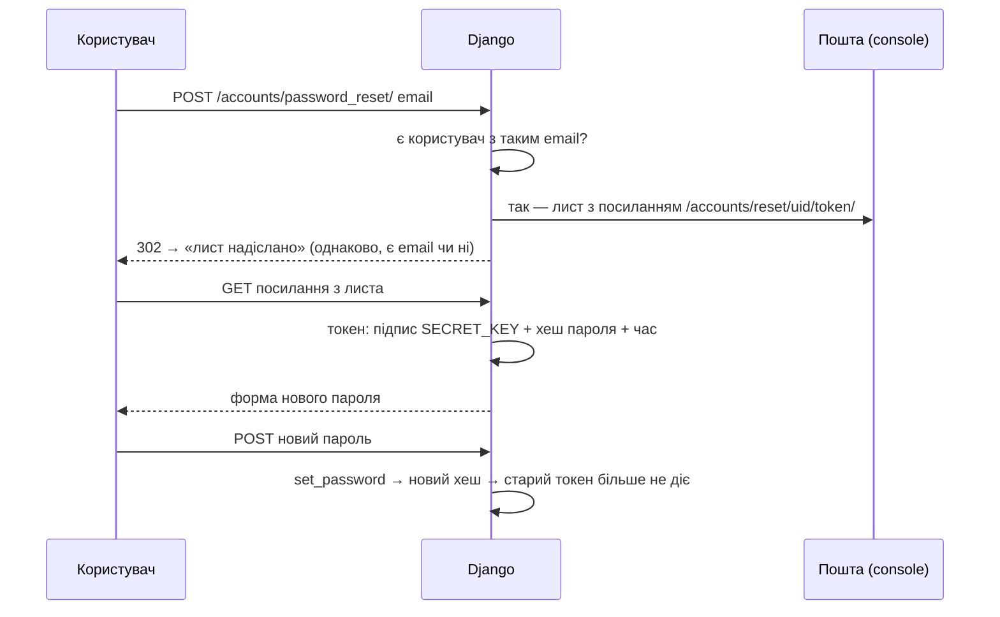
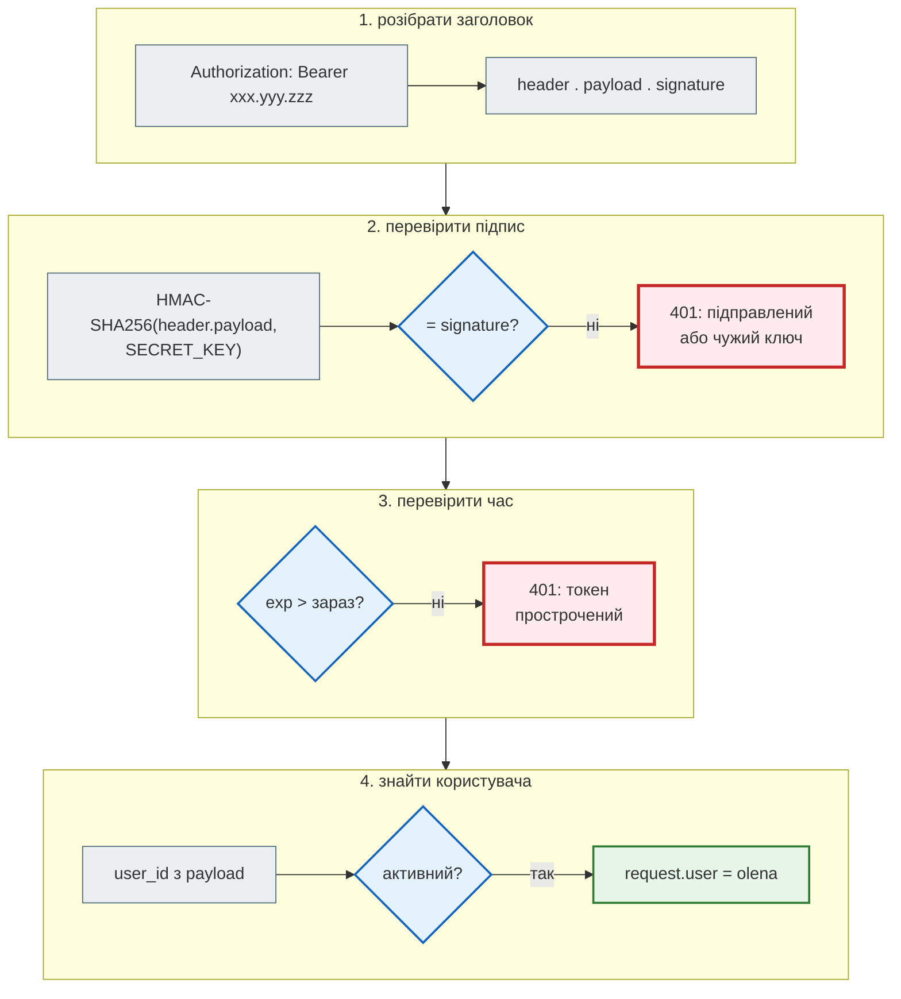
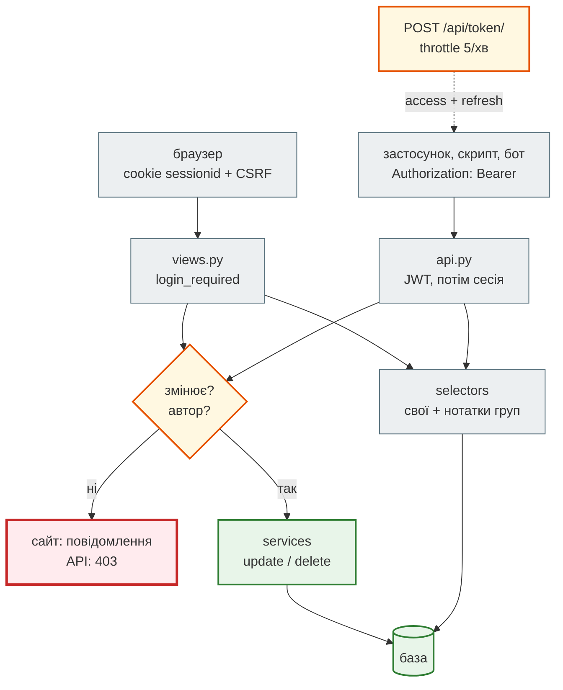

# Урок 40. Автентифікація та security basics (JWT, hashing, OWASP)

Django-гілка курсу веде той самий застосунок нотаток з уроку 33: сторінки з формами (34), JSON API на DRF (35). Вхід на сайт і правило «кожен бачить лише свої нотатки» вже є — `login_required`, `user=request.user`, чужа нотатка → `404`. Сьогодні **рефакторинг 4** — безпека:

- **спільний доступ**: нотатка належить групі («Сім'я», «Команда») — і тоді вже не можна просто писати `user=request.user`;
- **паролі**: як Django їх зберігає, зміна й скидання пароля листом;
- **JWT** для API — вхід для програм, яким не підходить cookie браузера;
- **налаштування безпеки** і `check --deploy`; карта ризиків OWASP Top 10 на нашому коді.

Код — урок `lesson_Django_authentication_and_security` старого курсу: той самий `crispy_notes_project`, до якого додано групи, скидання пароля й блок налаштувань безпеки. Теорія — [частина VII Django-книги](https://nikoriakviktot.github.io/notes_chat_app/07_auth_and_security/): тут лише зміни в коді й те, що знайшли, коли зібрали все разом.

| Урок | Django-гілка: застосунок нотаток | Проєкт |
|---|---|---|
| 33 | MVT, ORM, admin | `hello_project` |
| 34 | форми, Bootstrap, crispy | `crispy_notes_project` |
| 35 | REST API на DRF | + `api.py` |
| **40** | **групи, паролі, JWT, налаштування безпеки** | **+ групи, `/api/token/`** |
| 44 | архітектура: services і selectors | — |
| 45 | чат на WebSocket | — |

Проєкт: [`crispy_notes_project`](https://github.com/NikoriakViktot/PY-Course-Victor-Nikoriak-22-09-2026/tree/main/module_4/lessons/lesson_40_auth_security/crispy_notes_project).

**Що потрібно з попередніх уроків:** застосунок нотаток і його `services`/`selectors` (33–35), DRF-серіалізатори й `ViewSet` (35), HTTP-заголовки й статус-коди (31–32), хеш-функції (урок 16).

**Після уроку ти зможеш:**

- відрізнити автентифікацію («хто ти») від авторизації («що тобі можна») і перевірити обидві на кожному вході в застосунок;
- дати доступ до об'єкта групі користувачів і розділити права «читати» і «змінювати»;
- пояснити, як Django зберігає пароль і чому той самий пароль дає різні хеші;
- видати й перевірити JWT, пояснити, з чого складається токен і чому його не можна «підправити»;
- прочитати `manage.py check --deploy` і зв'язати знахідки з OWASP Top 10.

**Ноутбук заняття:** [`note_lesson_40_auth.ipynb`](https://github.com/NikoriakViktot/PY-Course-Victor-Nikoriak-22-09-2026/blob/main/module_4/lessons/lesson_40_auth_security/note_lesson_40_auth.ipynb) [](https://colab.research.google.com/github/NikoriakViktot/PY-Course-Victor-Nikoriak-22-09-2026/blob/main/module_4/lessons/lesson_40_auth_security/note_lesson_40_auth.ipynb) — хеші паролів, JWT по частинах, групи й права в API.

## Пригадай

1. Що поверне API уроку 35 на запит чужої нотатки і чому не `403`?
2. Хеш-функція з уроку 16: чи можна з хешу отримати вхідні дані?
3. Де браузер зберігає «я увійшов» між запитами до Django?

??? success "Відповіді"

    1. `404`: для чужого користувача нотатки «немає». `403` підтвердив би, що нотатка з таким id існує, — це вже витік.
    2. Ні: хеш — односторонній. Можна лише порахувати хеш іншого рядка й порівняти.
    3. У cookie `sessionid`: у ній лише випадковий ключ, а дані сесії (хто увійшов) — на сервері, в таблиці `django_session`. Детально — [Сесії в Django-книзі](https://nikoriakviktot.github.io/notes_chat_app/07_auth_and_security/sessions_flow_full/).

## Старт: що дає старий курс

`lesson_Django_authentication_and_security/crispy_notes_project` — той самий проєкт, що в уроці 34, плюс:

| Файл | Що змінилось у старому курсі |
|---|---|
| `models.py`, міграція `0003` | `Note.group`, `ShoppingList.group` → `ForeignKey(Group, SET_NULL, null=True)` |
| `selectors.py` | нотатки й списки: `Q(user=user) \| Q(group__in=user.groups.all())`; вибір груп користувача |
| `views.py` | редагувати й видаляти — лише автор (повідомлення й redirect для учасника групи); сторінки груп |
| `forms.py` | поле `group` — лише **свої** групи (`user.groups.all()`); форми створення групи й додавання учасника |
| `services.py` | `create_group`, `add_user_to_group`, `remove_user_from_group`; `group` у create/update |
| `templates/registration/` | 7 шаблонів зміни й скидання пароля |
| `settings.py` | `EMAIL_BACKEND` (console), `SESSION_COOKIE_HTTPONLY`, `SAMESITE`, `X_FRAME_OPTIONS`, `SECURE_CONTENT_TYPE_NOSNIFF` |

Ці зміни перенесені на проєкт уроку 35 (з API) без змін логіки; конфлікт був лише в `create_note` — там наш параметр `is_pinned` з уроку 34.

## Рефакторинг 4a. Нотатки групи { #groups }

Коли нотатку бачить не лише автор, правило «`user=request.user`» розпадається на два:

| Хто | Бачить | Змінює й видаляє |
|---|---|---|
| автор | так | так |
| учасник групи нотатки | так | ні |
| інший користувач | ні — `404` | ні — `404` |

```diff title="hello_app/selectors.py (з уроку старого курсу)"
 def get_user_notes(user, archived=False, notebook=None, search=None):
+    user_groups = user.groups.all()
     qs = Note.objects.filter(
-        user=user, is_archived=archived
-    ).select_related('notebook').prefetch_related('tags')
+        Q(user=user) | Q(group__in=user_groups), is_archived=archived
+    ).select_related('notebook', 'group').prefetch_related('tags')
```

```diff title="hello_app/views.py, note_edit і note_delete (з уроку старого курсу)"
-    note = get_object_or_404(Note, pk=pk, user=request.user)
+    user_groups = request.user.groups.all()
+    note = get_object_or_404(
+        Note.objects.filter(Q(user=request.user) | Q(group__in=user_groups)),
+        pk=pk,
+    )
+    if note.user != request.user:
+        messages.error(request, 'Ти не можеш редагувати нотатку іншого користувача.')
+        return redirect('hello_app:note_detail', pk=pk)
```

Перевіримо в `manage.py shell` (у папці `crispy_notes_project`): Олена ділиться нотаткою з сім'єю, Тарас — у сім'ї, Іван — ні.

```text
$ python manage.py migrate -v 0
```

```python
from django.contrib.auth.models import User
from django.test.utils import setup_test_environment
from rest_framework.test import APIClient

from hello_app import services
from hello_app.models import Note

setup_test_environment()
olena = User.objects.create_user("olena", email="olena@example.com", password="Sup3r-secret!")
taras = User.objects.create_user("taras", password="Sup3r-secret!")
ivan = User.objects.create_user("ivan", password="Sup3r-secret!")
family = services.create_group(name="Сім'я", creator=olena)
family.user_set.add(taras)
wifi = services.create_note(user=olena, title="Пароль від Wi-Fi", group=family)
services.create_note(user=olena, title="Подарунок Тарасу")          # особиста

from django.test import Client
for user in (olena, taras, ivan):
    browser = Client()
    browser.force_login(user)
    page = browser.get("/notes/").content.decode()
    visible = [title for title in ("Пароль від Wi-Fi", "Подарунок Тарасу") if title in page]
    print(f"{user.username:6} бачить {visible}; сторінка нотатки → {browser.get(f'/notes/{wifi.pk}/').status_code}")

browser = Client()
browser.force_login(taras)
browser.post(f"/notes/{wifi.pk}/delete/")
print("Тарас видаляє на сайті → нотатка на місці:", Note.objects.filter(pk=wifi.pk).exists())
```

```text
olena  бачить ['Пароль від Wi-Fi', 'Подарунок Тарасу']; сторінка нотатки → 200
taras  бачить ['Пароль від Wi-Fi']; сторінка нотатки → 200
Not Found: /notes/1/
ivan   бачить []; сторінка нотатки → 404
Тарас видаляє на сайті → нотатка на місці: True
```

### Права в API: групи відкривають ще один вхід { #api-bypass }

Сторінки перевіряють `note.user != request.user`. А API уроку 35 бере нотатку тим самим селектором `get_note_detail`, який тепер **віддає й нотатки групи**. Якщо в API не додати перевірку автора, та сама спроба, що вище, через API дає:

```text
Тарас через API: PATCH → 200, заголовок став «Зламано учасником групи»
Тарас через API: DELETE → 204, нотатки більше немає
```

Класична **Broken Access Control** (OWASP A01, перше місце в рейтингу): доступ розширили, а один із входів у застосунок забули оновити. HTML і API — два входи до тих самих даних, і перевіряти права треба на **кожному**.

```python title="hello_app/api.py (фрагмент)"
    def _get_note(self, request, pk):
        """Читати: свою нотатку або нотатку своєї групи (урок 40). Чужа — 404, ніби її немає."""
        try:
            return selectors.get_note_detail(request.user, pk)
        except Note.DoesNotExist:
            raise NotFound("Нотатку не знайдено.")

    def _get_own_note(self, request, pk):
        """Змінювати й видаляти: лише автор. Нотатка групи видима учаснику, але не його — 403."""
        note = self._get_note(request, pk)
        if note.user_id != request.user.id:
            raise PermissionDenied("Змінювати й видаляти нотатку може лише її автор.")
        return note
```

`partial_update`, `destroy` і `pin` тепер беруть `_get_own_note`:

```python
api = APIClient()
api.force_authenticate(taras)
print("Тарас читає       →", api.get(f"/api/notes/{wifi.pk}/").status_code)
print("Тарас змінює      →", api.patch(f"/api/notes/{wifi.pk}/", {"title": "Зламано учасником групи"}, format="json").status_code)
print("Тарас видаляє     →", api.delete(f"/api/notes/{wifi.pk}/").status_code, api.delete(f"/api/notes/{wifi.pk}/").data["detail"])
api.force_authenticate(ivan)
print("Іван читає        →", api.get(f"/api/notes/{wifi.pk}/").status_code)
api.force_authenticate(olena)
print("Олена змінює      →", api.patch(f"/api/notes/{wifi.pk}/", {"title": "Пароль від Wi-Fi (новий)"}, format="json").status_code)
```

```text
Тарас читає       → 200
Forbidden: /api/notes/1/
Тарас змінює      → 403
Forbidden: /api/notes/1/
Forbidden: /api/notes/1/
Тарас видаляє     → 403 Змінювати й видаляти нотатку може лише її автор.
Not Found: /api/notes/1/
Іван читає        → 404
Олена змінює      → 200
```

`403` для учасника групи чесний: нотатку він і так бачить, приховувати нічого. Для Івана — `404`, як і в уроці 35. Тест `test_api_member_reads_but_cannot_write` закріплює правило: без `_get_own_note` він падає.

Поглиблено: [Права доступу](https://nikoriakviktot.github.io/notes_chat_app/07_auth_and_security/permissions_full/), [Автентифікація, сесії й права: IDOR](https://nikoriakviktot.github.io/notes_chat_app/07_auth_and_security/auth_sessions_permissions/).

## Паролі { #passwords }

Django **ніколи не зберігає пароль**. У полі `password` — рядок `алгоритм$ітерації$сіль$хеш`:

```python
from django.contrib.auth.hashers import check_password, make_password
import time

print(olena.password)
print(taras.password)
start = time.perf_counter()
make_password("Sup3r-secret!")
print(f"один хеш: {time.perf_counter() - start:.2f} с")
print(check_password("Sup3r-secret!", olena.password), check_password("sup3r-secret!", olena.password))
```

Приклад виводу (сіль і хеш — випадкові, час залежить від машини):

```text
pbkdf2_sha256$1000000$gr731R4wX4noyVbhCAb0FV$mFZOgLHmvZIKdBWR/2EiLKZJQglRYEYI14GH5U5w+XU=
pbkdf2_sha256$1000000$p5KcrASXd5UWpKxRZmsqbM$NLrWG1boJBX2fr7diWhStJRxl38NP2qG+zl5Mxez92Y=
один хеш: 0.79 с
True False
```

- **Той самий пароль — різні рядки.** Сіль — випадкова для кожного користувача, тож однакові паролі не видно з бази, а заздалегідь пораховані таблиці хешів (rainbow tables) марні.
- **Навмисно повільно.** PBKDF2 повторює хеш-функцію мільйон разів (у Django 5.2 — `1000000`, число записане в рядку, тож його можна збільшувати з версіями). Для входу одна перевірка — непомітно, для перебору мільйонів паролів після витоку бази — роки.
- **`check_password`** рахує хеш введеного пароля з тією ж сіллю й порівнює. Зворотного шляху немає.

### Зміна й скидання пароля

`path("accounts/", include("django.contrib.auth.urls"))` уже дає всі сторінки; урок старого курсу додав 7 шаблонів у `templates/registration/` і `EMAIL_BACKEND = "…console.EmailBackend"` — лист друкується в термінал `runserver` замість справжньої пошти.



```python
from django.core import mail

for email in ("olena@example.com", "nobody@example.com"):
    response = Client().post("/accounts/password_reset/", {"email": email})
    print(f"{email:20} → {response.status_code} {response['Location']}")
print("листів:", len(mail.outbox), "| кому:", mail.outbox[0].to)
link = next(line for line in mail.outbox[0].body.splitlines() if "/accounts/reset/" in line)
print("посилання:", link.strip().rsplit("/", 3)[0] + "/…/")
```

```text
olena@example.com    → 302 /accounts/password_reset/done/
nobody@example.com   → 302 /accounts/password_reset/done/
листів: 1 | кому: ['olena@example.com']
посилання: http://testserver/accounts/reset/…/
```

Однакова відповідь для відомого й невідомого email — не випадковість: інакше форма скидання стала б способом **перевіряти, хто зареєстрований** (user enumeration, OWASP A07). Токен у посиланні одноразовий: він залежить від хешу пароля, тож після зміни пароля старе посилання не спрацює.

Поглиблено: [Автентифікація](https://nikoriakviktot.github.io/notes_chat_app/07_auth_and_security/auth_basics_full/), [Основи безпеки](https://nikoriakviktot.github.io/notes_chat_app/07_auth_and_security/security_foundations_full/).

## Рефакторинг 4b. JWT для API { #jwt }

Сесія (cookie + CSRF) зручна браузеру на тому самому сайті. Мобільному застосунку, скрипту чи Telegram-боту (урок 47) потрібне інше: отримати **токен** і надсилати його в заголовку `Authorization: Bearer …`. У `production_bot` старого курсу токени видавались вручну через PyJWT; у Django — готовий пакет `djangorestframework-simplejwt`.

| | Сесія (cookie) | JWT (Bearer) |
|---|---|---|
| Де «я увійшов» | ключ у cookie, дані — на сервері (`django_session`) | усе в самому токені, підписаному `SECRET_KEY` |
| Хто надсилає | браузер сам, з кожним запитом | клієнт явно, в заголовку |
| CSRF | потрібен захист | не потрібен (браузер сам заголовок не додає) |
| Вийти / відкликати | видалити сесію на сервері | токен діє до `exp`; тому access-токен короткий |
| Кому | сайт | мобільний застосунок, скрипт, бот, інший сервіс |

```diff title="hello_project/settings.py (урок 40)"
 REST_FRAMEWORK = {
+    # Порядок важливий: без облікових даних DRF відповідає за ПЕРШИМ класом. JWT першим → 401 з
+    # WWW-Authenticate: Bearer; сесія першою → 403 (у неї немає заголовка WWW-Authenticate).
     "DEFAULT_AUTHENTICATION_CLASSES": [
+        "rest_framework_simplejwt.authentication.JWTAuthentication",
         "rest_framework.authentication.SessionAuthentication",
-        "rest_framework.authentication.BasicAuthentication",
     ],
     ...
+    "DEFAULT_THROTTLE_RATES": {"login": "5/min"},
 }
+
+SIMPLE_JWT = {
+    "ACCESS_TOKEN_LIFETIME": timedelta(minutes=5),
+    "REFRESH_TOKEN_LIFETIME": timedelta(days=1),
+    "ROTATE_REFRESH_TOKENS": True,
+    "AUTH_HEADER_TYPES": ("Bearer",),
+}
```

- `BasicAuthentication` прибрано: вона надсилає логін і пароль **з кожним** запитом.
- **Access** живе 5 хвилин — викрадений токен швидко «згорає»; **refresh** (доба) обмінюють на новий access без пароля.
- `/api/token/` — видача пари токенів, з throttle 5 спроб за хвилину (`ScopedRateThrottle`, файл `hello_app/auth_api.py`); `/api/token/refresh/` — оновлення.

```python
import base64
import json

api = APIClient()
r = api.get("/api/notes/")
print("без токена        →", r.status_code, r["WWW-Authenticate"])

tokens = api.post("/api/token/", {"username": "olena", "password": "Sup3r-secret!"}, format="json").json()
access = tokens["access"]
print("токен             →", access[:40] + "…", "| частин:", len(access.split(".")))

header, payload, signature = access.split(".")
decode = lambda part: json.loads(base64.urlsafe_b64decode(part + "=" * (-len(part) % 4)))
print("header            →", decode(header))
claims = decode(payload)
print("payload           →", {key: claims[key] for key in ("token_type", "user_id")}, "| живе", claims["exp"] - claims["iat"], "с")

api.credentials(HTTP_AUTHORIZATION=f"Bearer {access}")
print("з токеном         →", api.get("/api/notes/").status_code, [n["title"] for n in api.get("/api/notes/").json()])
```

```text
Unauthorized: /api/notes/
без токена        → 401 Bearer realm="api"
токен             → eyJhbGciOiJIUzI1NiIsInR5cCI6IkpXVCJ9.eyJ… | частин: 3
header            → {'alg': 'HS256', 'typ': 'JWT'}
payload           → {'token_type': 'access', 'user_id': '1'} | живе 300 с
з токеном         → 200 ['Пароль від Wi-Fi (новий)', 'Подарунок Тарасу']
```

Payload **не зашифрований** — його прочитає будь-хто (ми щойно прочитали без жодного ключа). Тому в токен не кладуть нічого секретного. Захищає його **підпис**.

### Як сервер перевіряє токен — покроково



Перевіримо кожну гілку: підправлений підпис, підпис чужим ключем, прострочений токен і оновлення через refresh:

```python
from datetime import timedelta

import jwt
from rest_framework_simplejwt.tokens import AccessToken

tampered = f"{header}.{payload}.{signature[:-4]}AAAA"
foreign = jwt.encode({**claims, "user_id": str(ivan.id)}, "зовсім-інший-ключ-підпису-довжиною-понад-32-байти",
                     algorithm="HS256")
expired = AccessToken.for_user(olena)
expired.set_exp(lifetime=-timedelta(seconds=1))
for name, token in (("підправлений", tampered), ("чужий ключ", foreign), ("прострочений", str(expired))):
    api.credentials(HTTP_AUTHORIZATION=f"Bearer {token}")
    response = api.get("/api/notes/")
    print(f"{name:13} → {response.status_code} {response.json()['detail']}")

api.credentials()
fresh = api.post("/api/token/refresh/", {"refresh": tokens["refresh"]}, format="json").json()
print("refresh       →", sorted(fresh), "| новий refresh:", fresh["refresh"] != tokens["refresh"])
```

```text
Unauthorized: /api/notes/
підправлений  → 401 Given token not valid for any token type
Unauthorized: /api/notes/
чужий ключ    → 401 Given token not valid for any token type
Unauthorized: /api/notes/
прострочений  → 401 Given token not valid for any token type
refresh       → ['access', 'refresh'] | новий refresh: True
```

Усі три відмови — з тим самим повідомленням: сервер не підказує, яка саме перевірка не пройшла. `ROTATE_REFRESH_TOKENS` — з кожним оновленням новий refresh-токен. Відкликати вже видані токени (кнопка «вийти на всіх пристроях») дає додаток `token_blacklist` — див. «Спробуй самостійно».

### Перебір паролів: throttle

```python
from django.core.cache import cache

cache.clear()                     # лічильник спроб живе в кеші; вхід з попереднього кроку теж рахувався
api = APIClient()
statuses = [api.post("/api/token/", {"username": "olena", "password": f"guess-{n}"}, format="json").status_code
            for n in range(6)]
print("6 невдалих спроб →", statuses)
right = api.post("/api/token/", {"username": "olena", "password": "Sup3r-secret!"}, format="json")
print("правильний пароль →", right.status_code, right["Retry-After"], "с")
```

```text
Unauthorized: /api/token/
Unauthorized: /api/token/
Unauthorized: /api/token/
Unauthorized: /api/token/
Unauthorized: /api/token/
Too Many Requests: /api/token/
6 невдалих спроб → [401, 401, 401, 401, 401, 429]
Too Many Requests: /api/token/
правильний пароль → 429 57 с
```

Після 5 спроб за хвилину — `429`, навіть з правильним паролем: зловмисник не може перебирати швидко, а справжній користувач чекає хвилину. Той самий принцип, що rate limit агрегатора в уроці 39, — тут готовий `ScopedRateThrottle` DRF.

Поглиблено: [DRF: автентифікація й permissions у Django-книзі](https://nikoriakviktot.github.io/notes_chat_app/06_application_architecture/drf_rest_api_full/).

## Налаштування безпеки і `check --deploy` { #settings }

Урок старого курсу додав блок налаштувань; урок 40 — `SECRET_KEY`, `DEBUG` і `ALLOWED_HOSTS` зі змінних середовища:

```python title="hello_project/settings.py (фрагмент)"
# Цим ключем підписуються сесії, токени скидання пароля і JWT. Хто його знає — підробить будь-який токен.
SECRET_KEY = os.environ.get("DJANGO_SECRET_KEY", "django-insecure-crispy-notes-dev-key-change-in-production")
DEBUG = os.environ.get("DJANGO_DEBUG", "1") == "1"
ALLOWED_HOSTS = [host for host in os.environ.get("DJANGO_ALLOWED_HOSTS", "").split(",") if host]

SESSION_COOKIE_HTTPONLY = True        # JavaScript не прочитає cookie сесії (XSS не вкраде вхід)
SESSION_COOKIE_SAMESITE = "Lax"       # cookie не йде з чужих сайтів (частина захисту від CSRF)
X_FRAME_OPTIONS = "DENY"              # сторінку не вставиш в <iframe> (clickjacking)
SECURE_CONTENT_TYPE_NOSNIFF = True    # браузер не вгадує тип файлу
```

Django сам перевіряє, що ще не готово до сервера:

```text
$ python manage.py check --deploy
System check identified some issues:

WARNINGS:
?: (security.W004) You have not set a value for the SECURE_HSTS_SECONDS setting. If your entire site is served only over SSL, you may want to consider setting a value and enabling HTTP Strict Transport Security. Be sure to read the documentation first; enabling HSTS carelessly can cause serious, irreversible problems.
?: (security.W008) Your SECURE_SSL_REDIRECT setting is not set to True. Unless your site should be available over both SSL and non-SSL connections, you may want to either set this setting True or configure a load balancer or reverse-proxy server to redirect all connections to HTTPS.
?: (security.W009) Your SECRET_KEY has less than 50 characters, less than 5 unique characters, or it's prefixed with 'django-insecure-' indicating that it was generated automatically by Django. Please generate a long and random value, otherwise many of Django's security-critical features will be vulnerable to attack.
?: (security.W012) SESSION_COOKIE_SECURE is not set to True. Using a secure-only session cookie makes it more difficult for network traffic sniffers to hijack user sessions.
?: (security.W016) You have 'django.middleware.csrf.CsrfViewMiddleware' in your MIDDLEWARE, but you have not set CSRF_COOKIE_SECURE to True. Using a secure-only CSRF cookie makes it more difficult for network traffic sniffers to steal the CSRF token.
?: (security.W018) You should not have DEBUG set to True in deployment.
?: (security.W020) ALLOWED_HOSTS must not be empty in deployment.

System check identified 7 issues (0 silenced).
```

Кожен рядок — готовий пункт списку перед деплоєм: `W009` — ключ з префіксом `django-insecure-`, `W018` — `DEBUG = True`, `W020` — порожній `ALLOWED_HOSTS`, решта — HTTPS (`SECURE_HSTS_SECONDS`, `SECURE_SSL_REDIRECT`, `*_COOKIE_SECURE`), які вмикають на сервері з сертифікатом (урок 49). Ті самі налаштування через змінні середовища:

```text
$ DJANGO_SECRET_KEY="$(python -c 'import secrets; print(secrets.token_urlsafe(50))')" DJANGO_DEBUG=0 DJANGO_ALLOWED_HOSTS=notes.example.com python manage.py check --deploy
System check identified some issues:

WARNINGS:
?: (security.W004) You have not set a value for the SECURE_HSTS_SECONDS setting. If your entire site is served only over SSL, you may want to consider setting a value and enabling HTTP Strict Transport Security. Be sure to read the documentation first; enabling HSTS carelessly can cause serious, irreversible problems.
?: (security.W008) Your SECURE_SSL_REDIRECT setting is not set to True. Unless your site should be available over both SSL and non-SSL connections, you may want to either set this setting True or configure a load balancer or reverse-proxy server to redirect all connections to HTTPS.
?: (security.W012) SESSION_COOKIE_SECURE is not set to True. Using a secure-only session cookie makes it more difficult for network traffic sniffers to hijack user sessions.
?: (security.W016) You have 'django.middleware.csrf.CsrfViewMiddleware' in your MIDDLEWARE, but you have not set CSRF_COOKIE_SECURE to True. Using a secure-only CSRF cookie makes it more difficult for network traffic sniffers to steal the CSRF token.

System check identified 4 issues (0 silenced).
```

Лишились лише попередження про HTTPS — їх закриває урок 49.

## OWASP Top 10 на нашому коді { #owasp }

[OWASP Top 10](https://owasp.org/Top10/) — рейтинг найпоширеніших ризиків вебзастосунків. Де вони в застосунку нотаток:

| Ризик | Де в проєкті | Що захищає |
|---|---|---|
| **A01** Broken Access Control | чужа нотатка; нотатка групи в API | `404` для чужих (35), `_get_own_note` → `403` для учасників (40), групи у формі — лише свої |
| **A02** Cryptographic Failures | паролі, `SECRET_KEY` | PBKDF2 з сіллю; ключ зі змінної середовища |
| **A03** Injection | фільтри й пошук | ORM передає значення параметрами (урок 29); автоекранування шаблонів |
| **A05** Security Misconfiguration | `DEBUG`, `ALLOWED_HOSTS`, заголовки | `check --deploy`, блок налаштувань безпеки |
| **A07** Identification and Authentication Failures | вхід, скидання пароля, API | throttle на `/api/token/`, однакова відповідь для невідомого email, короткий access-токен, валідатори пароля |

Решта пунктів (A04, A06, A08–A10) і розбір кожного — [OWASP Top 10 у Django-книзі](https://nikoriakviktot.github.io/notes_chat_app/07_auth_and_security/owasp_top_10_full/), а поглиблено — урок 46.

## Архітектура: два входи, одні правила { #architecture }



- **Автентифікація ≠ авторизація.** Сесія чи JWT відповідають лише на «хто ти». «Що тобі можна» вирішує код: selectors (що бачиш) і перевірка автора (що змінюєш).
- **Правила — на кожному вході.** Сайт і API читають тими самими selectors, тож перевірка автора потрібна на обох. Правило, яке треба пам'ятати у двох місцях, колись забудуть — у практиці його винесемо в один DRF-permission.
- **Секрет — один.** `SECRET_KEY` підписує сесії, токени скидання й JWT. Він — у змінній середовища, не в git.

### Тести

Приклад виводу (час залежить від машини; хешування паролів навмисно повільне):

```text
$ python manage.py test
Found 29 test(s).
System check identified no issues (0 silenced).
Creating test database for alias 'default'...
.............................
----------------------------------------------------------------------
Ran 29 tests in 51.170s

OK
Destroying test database for alias 'default'...
```

`hello_app/tests_auth.py` — 13 тестів: видимість нотаток групи на сайті, заборона змін для учасника на сайті й в API (`403`) і `404` для стороннього, групи у формі — лише свої; JWT: видача, `401` + `WWW-Authenticate` без токена, неправильний пароль, refresh, підправлений / чужий / прострочений токен, токен, підписаний `SECRET_KEY`, приймається (тому ключ — секрет), throttle `429`; хеш з сіллю, скидання пароля без розкриття акаунтів.

## Практика { #practice }

### Розібраний приклад: правило автора в одному місці

Правило «змінює лише автор», записане в кількох місцях, легко забути в одному з них. У DRF для цього є **permission-клас** з методом `has_object_permission`:

1. **Безпечні методи** (`GET`, `HEAD`, `OPTIONS` — `permissions.SAFE_METHODS`) дозволено всім, хто бачить об'єкт: видимість уже вирішили selectors.
2. **Решта** — лише якщо `obj.user_id == request.user.id`.
3. **У ViewSet** — `permission_classes = [IsAuthenticated, IsAuthorOrReadOnly]` і виклик `self.check_object_permissions(request, note)` після того, як нотатку знайдено: у `ViewSet` без `get_object()` DRF сам його не викликає.

```python title="hello_app/permissions.py (розв'язок)"
from rest_framework import permissions


class IsAuthorOrReadOnly(permissions.BasePermission):
    message = "Змінювати й видаляти нотатку може лише її автор."

    def has_object_permission(self, request, view, obj):
        if request.method in permissions.SAFE_METHODS:
            return True
        return obj.user_id == request.user.id
```

Тоді `_get_own_note` не потрібен: `_get_note` + `self.check_object_permissions(request, note)` у кожній дії. Той самий клас можна повісити на майбутній API списків покупок — правило одне.

### Зміни приклад

1. Дозволь учасникам групи **закріплювати** нотатку групи (`pin`), але не змінювати й не видаляти.
2. Зменш `ACCESS_TOKEN_LIFETIME` до 1 хвилини й переконайся (тестом із `set_exp`), що клієнт отримує `401` і має використати refresh.

### Спробуй самостійно: «вийти на всіх пристроях»

Додай `rest_framework_simplejwt.token_blacklist` в `INSTALLED_APPS`, `"BLACKLIST_AFTER_ROTATION": True` у `SIMPLE_JWT` і ендпоінт `POST /api/token/logout/` (`TokenBlacklistView`).

**Критерії перевірки:** після logout той самий refresh-токен на `/api/token/refresh/` дає `401`; `migrate` створює таблиці чорного списку; тест у `tests_auth.py`.

### Знайди помилку { #find-bug }

Проєкт уроку лежить у публічному репозиторії на GitHub, а на сервері його запустили як є — без `DJANGO_SECRET_KEY`. Хтось прочитав `settings.py`:

```python
import jwt
from django.conf import settings

print("ключ з репозиторію:", settings.SECRET_KEY[:20] + "…")
forged = jwt.encode({"token_type": "access", "user_id": str(olena.id), "exp": 4102444800, "jti": "x"},
                    settings.SECRET_KEY, algorithm="HS256")
api = APIClient()
api.credentials(HTTP_AUTHORIZATION=f"Bearer {forged}")
response = api.get("/api/notes/")
print("підроблений токен →", response.status_code, [note["title"] for note in response.json()])
```

```text
ключ з репозиторію: django-insecure-cris…
підроблений токен → 200 ['Пароль від Wi-Fi (новий)', 'Подарунок Тарасу']
```

Жодного пароля, жодного виклику `/api/token/` — а доступ до всіх нотаток Олени до 2100 року. Що пішло не так і що робити, якщо це вже сталося?

??? success "Відповідь"

    `SECRET_KEY` — єдиний секрет, яким підписано JWT (а ще сесії й посилання скидання пароля). Хто його знає, той **сам випускає** «справжні» токени для будь-якого `user_id` з будь-яким `exp`: перевірка підпису на сервері пройде, бо підпис правильний. Тому ключ не можна тримати в коді, який бачать інші.

    Що робити:

    1. **Зараз** — новий ключ (`secrets.token_urlsafe(50)`) у змінну середовища `DJANGO_SECRET_KEY` на сервері й перезапуск: усі токени, сесії й посилання скидання, підписані старим ключем, стають недійсними — користувачі входять знову.
    2. **Назавжди** — ключ лише в оточенні сервера (урок 49); `check --deploy` попереджає про ключ з префіксом `django-insecure-`; у репозиторій — лише значення для навчання.
    3. Ключ, що потрапив у git, вважається **скомпрометованим назавжди**: видалення коміту не допомагає, історію вже могли скопіювати.

## Підсумок

| Поняття | Що запам'ятати |
|---|---|
| Автентифікація / авторизація | «хто ти» (сесія, JWT) / «що тобі можна» (selectors, перевірка автора, permissions) |
| Нотатки групи | `Q(user=…) \| Q(group__in=user.groups.all())`; читати — учасникам, змінювати — автору |
| `404` / `403` | не бачиш об'єкт — `404`; бачиш, але дія заборонена — `403` |
| Хеш пароля | `pbkdf2_sha256$ітерації$сіль$хеш`; сіль — випадкова, хешування — навмисно повільне |
| Скидання пароля | однакова відповідь для будь-якого email; токен залежить від хешу пароля — одноразовий |
| JWT | `header.payload.signature`; payload читає будь-хто, підробити без `SECRET_KEY` не можна |
| Access / refresh | короткий для запитів / довгий для оновлення; `401` — оновити токен |
| Порядок автентифікаторів DRF | перший визначає `401` (+ `WWW-Authenticate`) чи `403` |
| Throttle | обмеження спроб входу: `429`, `Retry-After` |
| `check --deploy` | список того, що змінити в налаштуваннях перед сервером |
| OWASP Top 10 | A01 доступ, A02 криптографія, A03 ін'єкції, A05 налаштування, A07 автентифікація |

### Самоперевірка

1. Чому після додавання груп не можна просто залишити `user=request.user` у selectors?
2. Чому учасник групи на `DELETE` отримує `403`, а сторонній — `404`?
3. Що буде в базі, якщо двоє користувачів мають однаковий пароль?
4. Що можна прочитати з JWT без ключа і що без ключа зробити неможливо?
5. Навіщо access-токен живе лише 5 хвилин, якщо є refresh?
6. Чому неавтентифікований запит до API тепер отримує `401`, а в уроці 35 отримував `403`?
7. Що робити, якщо `SECRET_KEY` потрапив у публічний репозиторій?

??? success "Відповіді"

    1. Учасники групи мають бачити її нотатки; фільтр лише за автором їх сховає. Видимість — `Q(user) | Q(group__in=…)`, а зміни — окрема перевірка автора.
    2. Учасник і так бачить нотатку — приховувати нічого, чесна відповідь «заборонено». Сторонньому `403` підтвердив би, що нотатка з таким id існує.
    3. Два різні рядки: сіль випадкова, тож хеші різні. З бази не видно, що паролі однакові.
    4. Прочитати — header і payload (це base64). Змінити їх і отримати правильний підпис без `SECRET_KEY` — неможливо; сервер відхилить з `401`.
    5. Викрадений access діє максимум 5 хвилин. Refresh використовується рідко й лише на одному ендпоінті, тож його важче перехопити; з ротацією він ще й змінюється щоразу.
    6. Першим тепер `JWTAuthentication`, у нього є `WWW-Authenticate: Bearer` — DRF відповідає `401`. У уроці 35 першою була сесія без такого заголовка — `403`.
    7. Негайно згенерувати новий ключ у змінну середовища й перезапустити сервер (усі токени й сесії стануть недійсними); ключ з git вважати скомпрометованим назавжди.

### Що далі

- Ноутбук заняття: [`note_lesson_40_auth.ipynb`](https://github.com/NikoriakViktot/PY-Course-Victor-Nikoriak-22-09-2026/blob/main/module_4/lessons/lesson_40_auth_security/note_lesson_40_auth.ipynb) [](https://colab.research.google.com/github/NikoriakViktot/PY-Course-Victor-Nikoriak-22-09-2026/blob/main/module_4/lessons/lesson_40_auth_security/note_lesson_40_auth.ipynb).
- Урок 41 — тестування API на агрегаторі новин: тестова база, підміна мережі, моки.
- Урок 46 — security advanced: SSRF, секрети, заголовки, JWT для адмін-ендпоінтів агрегатора.

## Документація і джерела

- Код: [`crispy_notes_project`](https://github.com/NikoriakViktot/PY-Course-Victor-Nikoriak-22-09-2026/tree/main/module_4/lessons/lesson_40_auth_security/crispy_notes_project) — проєкт уроку 35 + `lesson_Django_authentication_and_security/crispy_notes_project` старого курсу (`module_5`).
- Django-книга, частина VII: [огляд](https://nikoriakviktot.github.io/notes_chat_app/07_auth_and_security/), [автентифікація](https://nikoriakviktot.github.io/notes_chat_app/07_auth_and_security/auth_basics_full/), [сесії](https://nikoriakviktot.github.io/notes_chat_app/07_auth_and_security/sessions_flow_full/), [права доступу](https://nikoriakviktot.github.io/notes_chat_app/07_auth_and_security/permissions_full/), [архітектура безпеки Django](https://nikoriakviktot.github.io/notes_chat_app/07_auth_and_security/django_security_architecture_full/), [типові помилки](https://nikoriakviktot.github.io/notes_chat_app/07_auth_and_security/security_misconceptions_full/), [OWASP Top 10](https://nikoriakviktot.github.io/notes_chat_app/07_auth_and_security/owasp_top_10_full/).
- Django: [Password management](https://docs.djangoproject.com/en/5.2/topics/auth/passwords/), [Using the authentication system](https://docs.djangoproject.com/en/5.2/topics/auth/default/), [Deployment checklist](https://docs.djangoproject.com/en/5.2/howto/deployment/checklist/), [Security in Django](https://docs.djangoproject.com/en/5.2/topics/security/)
- DRF: [Authentication](https://www.django-rest-framework.org/api-guide/authentication/), [Permissions](https://www.django-rest-framework.org/api-guide/permissions/), [Throttling](https://www.django-rest-framework.org/api-guide/throttling/); [Simple JWT](https://django-rest-framework-simplejwt.readthedocs.io/)
- [RFC 7519 — JSON Web Token](https://datatracker.ietf.org/doc/html/rfc7519), [jwt.io](https://jwt.io/) — розібрати токен
- [OWASP Top 10](https://owasp.org/Top10/), [OWASP Password Storage Cheat Sheet](https://cheatsheetseries.owasp.org/cheatsheets/Password_Storage_Cheat_Sheet.html)
