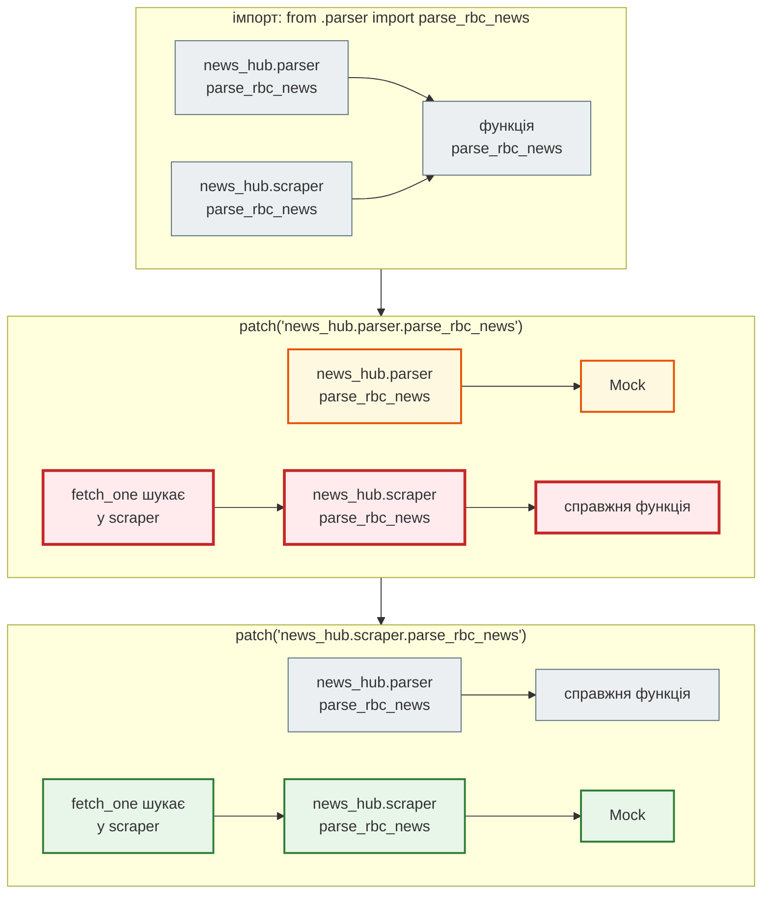
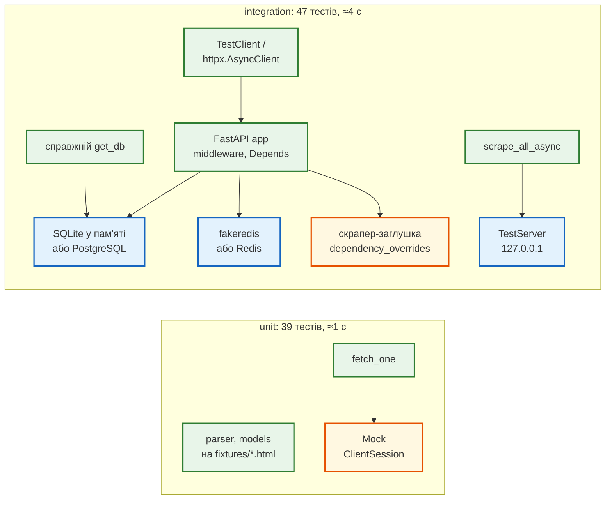
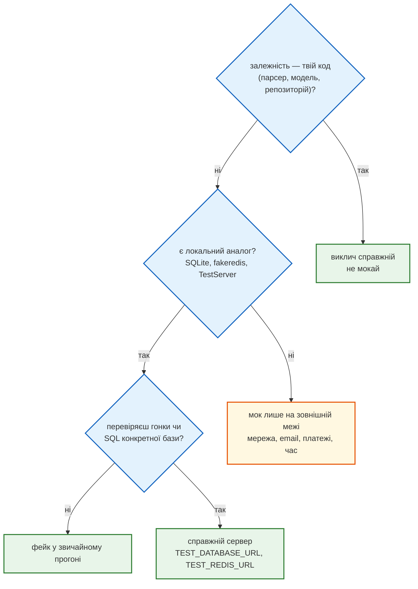

# Урок 41. Тестування API (pytest + httpx)

Після уроку 39 в агрегатора 41 зелений тест. Здається, все перевірено. Але подивимось, що ці тести **не** роблять:

- код, який ходить у мережу (`scraper.fetch_one`), не виконується жодного разу: API-тести підміняють скрапер заглушкою;
- справжній `get_db` теж не виконується: його підміняє тестова версія з `conftest.py`;
- парсер і модель перевірено окремо, кожен на своїх даних, — а разом їх не запускав ніхто;
- звіт покриття показує 88%, і навіть ця цифра неточна.

Сьогодні `news_hub` не змінюється ззовні — змінюються його **тести**: шість рефакторингів папки `tests/`. Нові тести знаходять у коді уроків 36–39 **чотири помилки**, які старі тести пропускали, — кожну розберемо нижче.

| Урок | Крок агрегатора |
|---|---|
| 36 | парсер з типами; `NewsItem` на Pydantic |
| 37 | FastAPI: `GET /api/news`, `POST /api/scrape`, `/docs`, Postman |
| 38 | SQLAlchemy: новини в базі, повний CRUD, Alembic |
| 39 | middleware, кеш і rate limit на Redis, фоновий збір |
| **41** | **тести: unit / integration, HTML-фікстури, мок і фейк мережі, httpx, покриття** |
| 43 | Gemini: підсумок, категорія, тональність |
| 47 | Telegram-бот |
| 48–50 | Docker, Compose, CI/CD |

Проєкт: [`news_hub`](https://github.com/NikoriakViktot/PY-Course-Victor-Nikoriak-22-09-2026/tree/main/module_4/lessons/lesson_41_api_testing/news_hub).

**Що потрібно з попередніх уроків:** pytest, fixtures, `parametrize`, mock і правило «patch where used», покриття, піраміда тестів (урок 25); `asyncio.gather` (27); `TestClient` і `dependency_overrides` (37); `get_db` і COMMIT (38); `fakeredis` і rate limit (39).

**Після уроку ти зможеш:**

- розкласти тести на unit та integration і запускати їх окремо;
- тестувати парсер на збережених сторінках, а не на рядках у коді тесту;
- замокати мережу в правильному місці — і пояснити, чого мок не побачить;
- підняти фейковий HTTP-сервер для тесту та тестувати API асинхронно через `httpx.AsyncClient`;
- читати звіт покриття гілок і перетворювати червоні рядки на тести.

**Ноутбук заняття:** [`note_lesson_41_testing.ipynb`](https://github.com/NikoriakViktot/PY-Course-Victor-Nikoriak-22-09-2026/blob/main/module_4/lessons/lesson_41_api_testing/note_lesson_41_testing.ipynb) [](https://colab.research.google.com/github/NikoriakViktot/PY-Course-Victor-Nikoriak-22-09-2026/blob/main/module_4/lessons/lesson_41_api_testing/note_lesson_41_testing.ipynb) — pytest запускається з ноутбука, без серверів.

## Пригадай

1. Що дає `@pytest.mark.parametrize` і чим fixture відрізняється від звичайної функції (урок 25)?
2. Модуль `a` робить `from b import f`. Що треба патчити, щоб підмінити `f` для коду з `a`?
3. Що робить `app.dependency_overrides[get_db] = test_db` (урок 37)?

??? success "Відповіді"

    1. `parametrize` запускає один тест на кожному рядку таблиці випадків. Fixture pytest викликає сам — за іменем параметра тесту — і дає кожному тесту свіжий результат; код після `yield` прибирає.
    2. `a.f`. Після `from b import f` у модулі `a` є власне ім'я `f`; код з `a` шукає саме його. Патч `b.f` змінить лише ім'я в `b`.
    3. Щоразу, коли ендпоінт просить `get_db`, FastAPI викликає `test_db`. Сам `get_db` при цьому не виконується — це стане важливим сьогодні.

## Старт: що дає старий курс

| Звідки | Що там | Куди в `news_hub` |
|---|---|---|
| `lesson_Django_Testing/TESTING_FOUNDATIONS.md` | піраміда тестів: багато швидких unit, менше integration | `tests/unit/` і `tests/integration/`, маркери |
| `lesson_Django_Testing/MOCKING_AND_PATCHING.md` | «patch where used»; «мокай зовнішні межі, а не всю систему» | `tests/unit/test_scraper.py` — мок мережі |
| `lesson_Django_Testing/TEST_DATA_AND_FIXTURES.md` | фабрики: у тесті видно лише важливі поля | `tests/factories.py` → `make_raw(...)` |
| ноутбук `note_lesson_31_web_scraping.ipynb` (урок 31 старого курсу) | справжній фрагмент стрічки rbc.ua (клітинка 44), демо-розмітка (клітинка 12) | `tests/fixtures/*.html` |
| урок 39 курсу | 41 тест у трьох файлах, `TestClient`, fakeredis | основа; нічого не видалено |

Теорію тестування з цих файлів тепер містить частина VIII [Django-книги](https://nikoriakviktot.github.io/notes_chat_app/08_testing_and_quality/). Тут — лише те, що з'являється в проєкті.

## Рефакторинг 1. Шари тестів: unit і integration { #refactor-1 }

Було — три файли поруч: `test_models.py`, `test_api.py`, `test_redis.py`. Щоб перевірити одну функцію парсера, pytest однаково збирав тести, які піднімають застосунок, базу й Redis.

```text title="tests/: було (39) → стало (41)"
tests/                              tests/
├── conftest.py                     ├── conftest.py        ← фікстура html(), маркер за папкою
├── test_models.py                  ├── factories.py       ← make_raw(**зміни)
├── test_api.py                     ├── fixtures/          ← збережені сторінки *.html
└── test_redis.py                   ├── unit/              ← без бази, Redis і мережі
                                    │   ├── test_parser.py, test_models.py
                                    │   ├── test_pipeline.py    ← парсер → модель
                                    │   └── test_scraper.py     ← мережа під моком
                                    └── integration/       ← застосунок цілком
                                        ├── conftest.py    ← client, aclient, тестова база
                                        ├── test_api.py, test_crud.py, test_redis.py
                                        ├── test_async_api.py   ← httpx.AsyncClient
                                        ├── test_db.py          ← справжній get_db
                                        └── test_scraper_server.py  ← локальний HTTP-сервер
```

Маркер ставить сама папка — не треба пам'ятати про `@pytest.mark.unit` у кожному файлі:

```python title="tests/conftest.py (фрагмент)"
def pytest_collection_modifyitems(items: list[pytest.Item]) -> None:
    """Маркер з назви папки: не треба пам'ятати про @pytest.mark.unit у кожному файлі."""
    for item in items:
        for layer in ("unit", "integration"):
            if f"{Path('tests') / layer}" in str(item.path):
                item.add_marker(getattr(pytest.mark, layer))
```

`pytest_collection_modifyitems` — **хук** pytest: функція з цим ім'ям у `conftest.py` отримує всі зібрані тести до запуску. Маркери оголошено в `pytest.ini` — інакше pytest попередить про невідомий маркер:

```ini title="pytest.ini"
[pytest]
testpaths = tests
pythonpath = .
markers =
    unit: швидкі тести однієї функції чи класу — без бази, Redis і мережі
    integration: API разом з базою й Redis
asyncio_default_fixture_loop_scope = function
```

Приклад виводу (час залежить від машини):

```text
$ pytest -q -p no:cacheprovider -m unit
.......................................                                                      [100%]
39 passed, 47 deselected in 0.85s
```

Unit-тести ганяють після кожної зміни — вони йдуть близько секунди. Повний набір — перед комітом і в CI (урок 50).

Поглиблено: [піраміда тестів](https://nikoriakviktot.github.io/notes_chat_app/08_testing_and_quality/testing_foundations_full/), [маркери й конфігурація pytest](https://nikoriakviktot.github.io/notes_chat_app/08_testing_and_quality/pytest_basics_full/).

## Рефакторинг 2. Збережені сторінки замість рядків у тесті { #refactor-2 }

Тести парсера в уроці 36 містили HTML прямо в коді — рядки, які автор тесту придумав сам. Тепер розмітка лежить у файлах `tests/fixtures/`:

- `rbc_newsline_item.html` — **справжній** фрагмент стрічки rbc.ua з ноутбука web scraping старого курсу: `div.item > a > span.time`, контейнерів `newsline__item` немає;
- `demo_newsline.html` — демо-розмітка з того ж ноутбука: контейнери `newsline__item`, час в атрибуті `<time datetime="…">`.

Файл видно в браузері; коли сайт змінить розмітку, його оновлюють збереженою сторінкою — і тести показують, що зламалось. Фікстура віддає вміст за назвою:

```python title="tests/conftest.py і tests/unit/test_parser.py (фрагменти)"
@pytest.fixture
def html() -> Callable[[str], str]:
    """html("demo_newsline") → вміст tests/fixtures/demo_newsline.html."""
    return lambda name: (FIXTURES / f"{name}.html").read_text(encoding="utf-8")


def test_real_rbc_markup_links_strategy(html: Callable[[str], str]) -> None:
    """Справжній фрагмент стрічки: div.item > a > span.time — контейнерів newsline__item немає."""
    assert parse_rbc_news(html("rbc_newsline_item")) == [{
        "title": "США хочуть підкупити кубинців безплатним інтернетом, - AP",
        "url": "https://www.rbc.ua/rus/news/ssha-hochut-pidkupiti-kubintsiv-bezpaltnim-1778194920.html",
        "category": "", "description": "", "datetime": "02:06"}]
```

Фабрика з `TEST_DATA_AND_FIXTURES.md` прибирає однакові словники з тестів моделі — у тесті видно лише поле, яке він перевіряє:

```python title="tests/factories.py"
def make_raw(**overrides: str) -> RawNews:
    """make_raw(title="Коротко") — сира новина, як її дає парсер, з одним зміненим полем."""
    item: RawNews = {"title": "Уряд затвердив новий бюджет", "url": "https://www.rbc.ua/ukr/news/budget-1.html",
                     "category": "", "description": "", "datetime": "14:19"}
    return {**item, **overrides}  # type: ignore[typeddict-item]
```

Найважливіший новий тест — **конвеєр**: те, що дає парсер на збереженій сторінці, модель має прийняти.

```python title="tests/unit/test_pipeline.py (фрагмент)"
@pytest.mark.parametrize(("page", "expected"), [
    ("rbc_newsline_item", [("США хочуть підкупити кубинців безплатним інтернетом, - AP", "ru", "02:06:00")]),
    ("demo_newsline", [("Уряд затвердив новий бюджет на 2024 рік", "uk", "10:30:00"),
                       ("Збірна України перемогла у фіналі", "uk", "09:15:00")]),
])
def test_every_parsed_item_passes_the_model(html, page, expected) -> None:
    valid, rejected = validate_news(parse_rbc_news(html(page)))
    assert rejected == []
```

На коді уроку 39 цей тест упав: обидві новини з `demo_newsline` модель **відхилила**. Тести парсера й моделі при цьому були зелені. Чому так сталося — розбір у «[Знайди помилку](#find-bug)»; правильне рішення — `field_validator` у `models.py`.

## Рефакторинг 3. Мок мережі: patch where used { #refactor-3 }

`fetch_one` робить HTTP-запит. У тесті інтернету може не бути, а rbc.ua може відповісти 403 — тест залежав би від погоди. **Мок** замінює `aiohttp.ClientSession` об'єктом, який відповідає так, як скаже тест: 200 з HTML, 403, тайм-аут, обрив з'єднання.

```python title="tests/unit/test_scraper.py (фрагмент)"
def fake_session(html: str = "", error: BaseException | None = None) -> mock.MagicMock:
    """Замість aiohttp.ClientSession: session.get(...) — async-контекст, що віддає відповідь з html."""
    response = mock.MagicMock()
    response.text = mock.AsyncMock(return_value=html)
    session = mock.MagicMock()
    if isinstance(error, aiohttp.ClientResponseError):
        response.raise_for_status.side_effect = error       # статус 4xx/5xx
    elif error is not None:
        session.get.side_effect = error                     # мережа впала до відповіді
    session.get.return_value.__aenter__.return_value = response
    return session


@pytest.mark.asyncio
@pytest.mark.parametrize(("error", "expected"), [
    (http_error(403), "ClientResponseError: 403"),
    (asyncio.TimeoutError(), "TimeoutError"),
    (aiohttp.ClientConnectionError("Connection reset by peer"), "ClientConnectionError: Connection reset"),
], ids=["403", "timeout", "connection-reset"])
async def test_network_errors_become_page_error(error, expected) -> None:
    """Сторінка з помилкою — не виняток на весь збір, а PageResult з error і нулем новин."""
    page, items = await scraper.fetch_one(fake_session(error=error), URL, t0=0.0)
    assert (page.count, items) == (0, [])
    assert page.error is not None and page.error.startswith(expected)
```

`MagicMock` підтримує `async with`: `__aenter__` у нього — `AsyncMock`. `@pytest.mark.asyncio` (пакет `pytest-asyncio`) запускає тест-корутину в циклі подій. Ті самі три помилки — поза pytest:

```python
import asyncio

import aiohttp

from news_hub import scraper
from tests.unit.test_scraper import URL, fake_session, http_error

for error in (http_error(403), asyncio.TimeoutError(), aiohttp.ClientConnectionError("Connection reset by peer")):
    page, items = asyncio.run(scraper.fetch_one(fake_session(error=error), URL, t0=0.0))
    print(f"{page.count} новин, error = {page.error!r}")
```

```text
0 новин, error = "ClientResponseError: 403, message='Forbidden', url='https://www.rbc.ua/ukr/news/'"
0 новин, error = 'TimeoutError: '
0 новин, error = 'ClientConnectionError: Connection reset by peer'
```

Тепер — правило з уроку 25 на справжньому проєкті. `scraper.py` робить `from .parser import parse_rbc_news`: у модулі `scraper` з'являється **власне** ім'я, що вказує на ту саму функцію. `mock.patch` міняє ім'я лише в одному модулі:

```python
from unittest import mock

from news_hub import parser, scraper

print("одна функція, два імена:", scraper.parse_rbc_news is parser.parse_rbc_news)
with mock.patch("news_hub.parser.parse_rbc_news") as fake:
    print("patch news_hub.parser  → scraper бачить мок:", scraper.parse_rbc_news is fake)
with mock.patch("news_hub.scraper.parse_rbc_news") as fake:
    print("patch news_hub.scraper → scraper бачить мок:", scraper.parse_rbc_news is fake)
print("після with — знову справжня:", scraper.parse_rbc_news is parser.parse_rbc_news)
```

```text
одна функція, два імена: True
patch news_hub.parser  → scraper бачить мок: False
patch news_hub.scraper → scraper бачить мок: True
після with — знову справжня: True
```



Тест `test_patch_where_used` робить те саме з `fetch_one`: після патча `news_hub.parser` мок не викликано жодного разу, і `fetch_one` розібрав сторінку справжнім парсером.

Поглиблено: [Mock і patch](https://nikoriakviktot.github.io/notes_chat_app/08_testing_and_quality/mocking_and_patching_full/).

## Рефакторинг 4. Фейк замість моку: локальний HTTP-сервер { #refactor-4 }

Мок відповідає тим, що йому сказали. Код, що стоїть **між** запитом і рядком HTML, — з'єднання, заголовки, статус, **декодування байтів**, тайм-аут — під моком не виконується. **Фейк** — справжня, але спрощена реалізація: тут це HTTP-сервер на `127.0.0.1` з `aiohttp.test_utils`, який віддає сторінки з `tests/fixtures/`. `fetch_one` працює проти нього без жодної підміни:

```python title="tests/integration/test_scraper_server.py (фрагмент)"
@pytest_asyncio.fixture
async def site(html: Callable[[str], str]) -> AsyncIterator[TestServer]:
    ...
    async def broken_bytes(request: web.Request) -> web.Response:       # сервер обіцяє UTF-8, а байт 0xff — ні
        body = html("rbc_newsline_item").encode() + b"<p>\xff</p>"
        return web.Response(body=body, content_type="text/html", charset="utf-8")

    app = web.Application()
    app.router.add_get("/ukr/news/", feed)
    app.router.add_get("/slow-1/", slow)          # asyncio.sleep(0.3) — для gather проти черги
    app.router.add_get("/forbidden/", forbidden)  # 403
    app.router.add_get("/broken/", broken_bytes)
    async with TestServer(app) as server:         # вільний порт на 127.0.0.1
        yield server
```

Перший же прогін знайшов помилку, якої мок не бачив. Сторінка з одним невалідним байтом UTF-8 — і **весь** збір падає:

```python
import asyncio
from pathlib import Path
from urllib.parse import urlsplit

import aiohttp
from aiohttp import web
from aiohttp.test_utils import TestServer

from news_hub import scraper

FEED = Path("tests/fixtures/rbc_newsline_item.html").read_bytes()


async def good(request: web.Request) -> web.Response:
    return web.Response(body=FEED, content_type="text/html", charset="utf-8")


async def broken(request: web.Request) -> web.Response:
    return web.Response(body=FEED + b"<p>\xff</p>", content_type="text/html", charset="utf-8")


async def main() -> None:
    app = web.Application()
    app.router.add_get("/good/", good)
    app.router.add_get("/broken/", broken)
    async with TestServer(app) as server:
        async with aiohttp.ClientSession() as session, session.get(server.make_url("/broken/")) as resp:
            try:
                await resp.text()                                   # так було в уроках 37–39
            except UnicodeDecodeError as error:
                print(f"resp.text(): {type(error).__name__}; це aiohttp.ClientError? "
                      f"{isinstance(error, aiohttp.ClientError)}")
        outcome = await scraper.scrape_all_async([str(server.make_url(p)) for p in ("/broken/", "/good/")])
        print("урок 41:", [(urlsplit(p.url).path, p.count, p.error) for p in outcome.pages])

asyncio.run(main())
```

```text
resp.text(): UnicodeDecodeError; це aiohttp.ClientError? False
урок 41: [('/broken/', 1, None), ('/good/', 1, None)]
```

`fetch_one` ловить лише `aiohttp.ClientError` і `asyncio.TimeoutError`. `UnicodeDecodeError` пролітав повз, `asyncio.gather` передавав його нагору, і `POST /api/scrape` відповідав `500`: новини **решти шести** сторінок губилися через один байт. Правильно — один аргумент:

```diff title="news_hub/scraper.py: fetch_one"
-            html = await resp.text()
+            html = await resp.text(errors="replace")   # один битий байт ≠ втрачена сторінка
```

Під моком цієї помилки не видно в принципі: `response.text` там — `AsyncMock(return_value=html)`, готовий рядок, декодування немає. Без `errors="replace"` тест `test_undecodable_page_does_not_kill_scrape` падає, а всі шість мок-тестів — зелені.

Ще два тести на фейковому сервері, неможливі з моком: заголовок `User-Agent` справді дійшов до сервера; `scrape_all_async` дві «повільні» сторінки бере за ~0,3 с, а `scrape_sequential` — за ~0,6 с (урок 27 — тепер як тест).

### Межа фейку: fakeredis і гонка

Фейк теж щось спрощує. `fakeredis` виконує команду одразу і **не віддає керування** циклу подій — тож одночасні корутини на ньому ніколи не перемежовуються. Ось лічильник «прочитати → +1 → записати» (дві команди) і `INCR` (одна), по 10 одночасних викликів:

```python
import asyncio

import fakeredis
from redis.asyncio import Redis


async def naive_hit(redis: Redis, key: str) -> None:     # прочитати → +1 → записати
    count = int(await redis.get(key) or 0) + 1
    await redis.set(key, count)


async def run(redis: Redis) -> tuple[str, str]:
    await redis.delete("naive", "atomic")
    await asyncio.gather(*(naive_hit(redis, "naive") for _ in range(10)))
    await asyncio.gather(*(redis.incr("atomic") for _ in range(10)))
    result = (await redis.get("naive"), await redis.get("atomic"))
    await redis.aclose()
    return result

print("fakeredis:     naive, atomic =", asyncio.run(run(fakeredis.FakeAsyncRedis(decode_responses=True))))
print("Redis-сервер:  naive, atomic =", asyncio.run(run(Redis.from_url("redis://localhost:6379/15",
                                                                        decode_responses=True))))
```

```text
fakeredis:     naive, atomic = ('10', '10')
Redis-сервер:  naive, atomic = ('2', '10')
```

На fakeredis «наївний» лічильник дорахував до 10 — гонки не видно. На справжньому Redis — далеко не 10 (у цьому прогоні 2, щоразу по-різному): поки одна корутина чекала відповіді на `GET`, інші прочитали те саме значення — і записали те саме. Тому `test_concurrent_requests_hit_rate_limit_exactly` (рефакторинг 5) доводить атомарність rate limit **лише** з `TEST_REDIS_URL`; з fakeredis він проходить і з «наївним» `RateLimiter` — ми перевірили, підставивши такий. Про це сказано в docstring тесту.

## Рефакторинг 5. API асинхронно: `httpx.AsyncClient` { #refactor-5 }

`TestClient` синхронний: застосунок крутиться в окремому потоці, запити йдуть по одному, а до Redis чи бази тест дістається через `client.portal.call(...)`. `httpx.AsyncClient` з `ASGITransport` викликає застосунок **напряму**, в тому ж циклі подій, що й тест:

```diff title="tests/integration/conftest.py: client (39) → client + aclient (41)"
-@pytest.fixture
-def client() -> Iterator[TestClient]:
-    extra = {"poolclass": StaticPool} if TEST_DATABASE_URL.startswith("sqlite") else {}
-    engine = make_engine(TEST_DATABASE_URL, **extra)
-    ...
-    app.dependency_overrides[get_db] = test_db
+class TestDatabase:
+    """Тестова база + підміна залежностей застосунку. Спільне для `client` (sync) і `aclient` (async)."""
+    def __init__(self) -> None: ...                  # engine і фабрика сесій
+    async def create_tables(self) -> None: ...
+    async def get_db(self) -> AsyncIterator[AsyncSession]: ...
+    def install(self) -> None: ...                   # dependency_overrides
+
+@pytest.fixture
+def client() -> Iterator[TestClient]: ...           # як і було, через TestDatabase
+
+@pytest_asyncio.fixture
+async def aclient() -> AsyncIterator[httpx.AsyncClient]:
+    db = TestDatabase()
+    db.install()
+    async with app.router.lifespan_context(app):    # ASGITransport lifespan не запускає
+        await db.create_tables()
+        await app.state.redis.flushdb()
+        transport = httpx.ASGITransport(app=app)
+        async with httpx.AsyncClient(transport=transport, base_url="http://test") as c:
+            yield c
+        await db.engine.dispose()
+    app.dependency_overrides.clear()
```

Що це дає — два тести з `test_async_api.py`:

```python title="tests/integration/test_async_api.py (фрагмент)"
async def test_cache_state_is_awaited_directly(aclient: httpx.AsyncClient) -> None:
    """Без portal: той самий Redis-клієнт, що в застосунку, — просто await."""
    assert (await aclient.get("/api/news")).headers["X-Cache"] == "MISS"
    assert (await aclient.get("/api/news")).headers["X-Cache"] == "HIT"
    assert await app.state.redis.get("news:version") is None                  # записів ще не було
    await aclient.post("/api/scrape", json={"source": "snapshot"})
    assert await app.state.redis.get("news:version") == "1"


async def test_concurrent_requests_hit_rate_limit_exactly(aclient: httpx.AsyncClient) -> None:
    total = RATE_LIMIT_REQUESTS * 2
    responses = await asyncio.gather(*(aclient.post("/api/scrape", json={"source": "ftp"}) for _ in range(total)))
    statuses = sorted(r.status_code for r in responses)
    assert statuses == [422] * RATE_LIMIT_REQUESTS + [429] * RATE_LIMIT_REQUESTS
```

Тіло `{"source": "ftp"}` навмисно неправильне: відповідь `422` показує, що rate limit рахує запит **до** перевірки тіла. Інакше сервер можна було б засипати помилковими запитами без обмежень.

Коли що брати:

| | `TestClient` | `httpx.AsyncClient` + `ASGITransport` |
|---|---|---|
| тест | звичайна функція | корутина, `@pytest.mark.asyncio` |
| `lifespan` | запускає сам (`with TestClient(app)`) | запускаєш сам (`app.router.lifespan_context`) |
| Redis / база в тесті | `client.portal.call(redis.get, …)` | `await redis.get(…)` |
| одночасні запити | ні, по одному | `asyncio.gather` |
| коли | більшість тестів API | конкурентність, async-стан застосунку |

Поглиблено: [async-тести й клієнти](https://nikoriakviktot.github.io/notes_chat_app/08_testing_and_quality/pytest_basics_full/); FastAPI — [Async Tests](https://fastapi.tiangolo.com/advanced/async-tests/).

## Рефакторинг 6. Покриття: що тести не зачепили { #refactor-6 }

Покриття тестів уроку 39 — стандартний звіт `pytest-cov`:

```text
$ cd ../../lesson_39_middleware_redis/news_hub && pytest -q -p no:cacheprovider --cov=news_hub --cov-report=term:skip-covered tests | tail -n 12
news_hub/cache.py           33      1    97%
news_hub/db.py              26      8    69%
news_hub/jobs.py            58      1    98%
news_hub/parser.py          75     10    87%
news_hub/repository.py      58      6    90%
news_hub/scraper.py         49     28    43%
news_hub/tables.py          16      1    94%
--------------------------------------------
TOTAL                      596     70    88%

4 files skipped due to complete coverage.
41 passed in 2.41s
```

Перше: 88% — **занижена** цифра. Async SQLAlchemy виконує роботу з базою в greenlet (урок 38), а coverage за замовчуванням стежить лише за звичайними потоками. Рядки сесії, `flush`, `commit` насправді виконуються, але у звіт не потрапляють. Тому в проєкті тепер `.coveragerc`:

```ini title=".coveragerc"
[run]
source = news_hub
branch = true
# Без greenlet coverage не бачить рядків, які async SQLAlchemy виконує в greenlet
# (сесія, flush, commit) — і показує занижене покриття.
concurrency = thread,greenlet

[report]
show_missing = true
```

`branch = true` рахує ще й **гілки**: чи виконувались обидва виходи кожного `if` і `for`. Ті самі тести уроку 39 з цими налаштуваннями:

```text
$ cd ../../lesson_39_middleware_redis/news_hub && pytest -q -p no:cacheprovider --cov=news_hub --cov-config=../../lesson_41_api_testing/news_hub/.coveragerc --cov-report=term:skip-covered tests | tail -n 12
news_hub/api.py            170      3     18      2    97%   97, 110, 160->159, 162
news_hub/cache.py           33      1      2      1    94%   28
news_hub/db.py              26      8      2      1    68%   26, 54-60
news_hub/parser.py          75     10     26      9    81%   69, 73, 78, 89, 95-96, 108, 111, 116, 120
news_hub/repository.py      58      3     10      3    91%   57, 71, 73
news_hub/scraper.py         49     28      6      0    38%   50-61, 65-72, 78-81, 86-89
news_hub/tables.py          16      1      0      0    94%   28
--------------------------------------------------------------------
TOTAL                      596     54     80     16    89%

5 files skipped due to complete coverage.
41 passed in 3.25s
```

Непокритих рядків стало 54 замість 70: ці 16 рядків виконувались і раніше, звіт їх просто не бачив. Загальна цифра — 89%, бо тепер рахуються ще й гілки (16 частково пройдених).

Червоні рядки — це список питань «а що тут має статися?». Чотири з них стали тестами уроку:

| Непокрите (урок 39) | Новий тест | Знайшов |
|---|---|---|
| `scraper.py` 43%: `fetch_one`, `scrape_*` | `unit/test_scraper.py` (мок), `integration/test_scraper_server.py` (фейк) | битий байт валить увесь збір |
| `db.py` 54–60: справжній `get_db` | `integration/test_db.py` | — (працює; тепер це доведено) |
| `api.py`: `pages` з правильними адресами | `test_custom_pages_reach_scraper_as_strings`, `test_is_rbc_host` | `fakerbc.ua` проходить перевірку |
| `repository.py` 71, 73: фільтри `category`, `source` | `test_filters_combine` | — |
| `parser.py`: гілки `continue` | `test_what_parser_skips` | — |

### Справжній `get_db`

API-тести підміняють `get_db` копією з `conftest.py`. Копія може розійтися з оригіналом, і ніхто не помітить. `test_db.py` викликає **оригінал** так, як це робить FastAPI, а патчить лише фабрику сесій, яку `get_db` шукає в модулі `db`:

```python title="tests/integration/test_db.py (фрагмент)"
@pytest_asyncio.fixture
async def factory(monkeypatch):
    engine = db.make_engine("sqlite+aiosqlite://", poolclass=StaticPool)
    ...
    monkeypatch.setattr(db, "SessionFactory", test_factory)    # patch where used


async def test_exception_rolls_back_and_propagates(factory) -> None:
    dependency = db.get_db()
    session = await anext(dependency)              # FastAPI: код до yield
    session.add(row(1))
    await session.flush()                          # INSERT уже в базі, але в незавершеній транзакції
    with pytest.raises(RuntimeError, match="ендпоінт упав"):
        await dependency.athrow(RuntimeError("ендпоінт упав"))    # так FastAPI передає виняток у залежність
    assert await count(factory) == 0
```

### `fakerbc.ua`

Червона гілка в `ScrapeRequest.only_rbc`: жоден тест не передавав **правильний** список `pages`. Тест з межовими значеннями знайшов, що перевірка пропускає не лише rbc.ua:

```python
from news_hub.models import is_rbc_host

for host in ("rbc.ua", "www.rbc.ua", "auto.rbc.ua", "fakerbc.ua", "rbc.ua.evil.com"):
    print(f"{host:16} endswith('rbc.ua'): {host.endswith('rbc.ua')!s:5}  is_rbc_host: {is_rbc_host(host)}")
```

```text
rbc.ua           endswith('rbc.ua'): True   is_rbc_host: True
www.rbc.ua       endswith('rbc.ua'): True   is_rbc_host: True
auto.rbc.ua      endswith('rbc.ua'): True   is_rbc_host: True
fakerbc.ua       endswith('rbc.ua'): True   is_rbc_host: False
rbc.ua.evil.com  endswith('rbc.ua'): False  is_rbc_host: False
```

`POST /api/scrape` з `{"pages": ["https://fakerbc.ua/"]}` змушував сервер завантажити чужий сайт на прохання будь-кого — і те саме пропускала модель `NewsItem`. Правильно — одна функція для обох місць:

```diff title="news_hub/models.py"
+def is_rbc_host(host: str | None) -> bool:
+    """rbc.ua або його піддомен (www., auto.). Не endswith("rbc.ua"): тоді пройшов би і fakerbc.ua."""
+    return host == "rbc.ua" or (host or "").endswith(".rbc.ua")
 ...
-        if not (url.host or "").endswith("rbc.ua"):
+        if not is_rbc_host(url.host):
```

Після всіх рефакторингів:

```text
$ pytest -q -p no:cacheprovider --cov=news_hub --cov-report=term:skip-covered | tail -n 10
Name                 Stmts   Miss Branch BrPart  Cover   Missing
----------------------------------------------------------------
news_hub/cache.py       33      1      2      1    94%   28
news_hub/parser.py      75      1     26      1    98%   111
news_hub/tables.py      16      1      0      0    94%   28
----------------------------------------------------------------
TOTAL                  607      3     82      2    99%

9 files skipped due to complete coverage.
86 passed in 6.72s
```

Лишились три рядки — і їх свідомо не покрито: `cache.py:28` — гілка справжнього Redis (її покриває прогін з `TEST_REDIS_URL`), `parser.py:111` — перевірка типу для mypy (`find_all(href=True)` дає лише `Tag`), `tables.py:28` — `__repr__`. **100% — не мета**; мета — щоб кожен червоний рядок був рішенням, а не випадком.

## Мінімальні версії залежностей { #min-versions }

`requirements.txt` обіцяє, що проєкт працює з `beautifulsoup4>=4.12`, `fastapi>=0.121`, `aiohttp>=3.10`… Перевіряли досі лише найновіші версії. Прогін тих самих тестів на **мінімальних** версіях (Python 3.10) знайшов четверту помилку:

```text
# Python 3.10, beautifulsoup4 4.12.3, парсер уроку 39
$ pytest -q -p no:cacheprovider tests/unit/test_parser.py
FAILED tests/unit/test_parser.py::test_description_equal_to_title_is_dropped_time_from_class
E       TypeError: sequence item 0: expected str instance, NoneType found
```

Для тегу без атрибута `class` bs4 4.12 повертає `get_attribute_list("class") == [None]`, новіші версії — `[]`. `" ".join([None])` падає — а `_classes` викликається для кожного тегу всередині контейнера новини. На справжній сторінці з тегом `<p>` без класу парсер падав би з bs4 4.12. Тести на новій bs4 цього не бачили:

```diff title="news_hub/parser.py"
 def _classes(tag: Tag) -> str:
-    return " ".join(tag.get_attribute_list("class"))
+    # Тег без class: beautifulsoup4 4.12 дає [None] (join падав з TypeError), новіші — [] (урок 41)
+    return " ".join(cls for cls in tag.get_attribute_list("class") if cls)
```

Тепер `news_hub` перевірено на трьох наборах: Python 3.10 з мінімальними версіями, Python 3.10 і 3.13 з найновішими. Окремо — на PostgreSQL 16 і Redis 7 (`TEST_DATABASE_URL`, `TEST_REDIS_URL`). У CI (урок 50) ці набори стануть матрицею.

## Архітектура: що справжнє, а що підмінене { #architecture }

Кожен шар тестів відповідає на своє питання. Різниця — в тому, що справжнє, а що підмінене:



- **зелене** — справжній код застосунку, який тест виконує;
- **жовте** — мок або заглушка: тест вирішує, що вона відповість;
- **синє** — фейк або справжній сервер: поводиться як реальний (SQL, команди Redis, HTTP), лише локальний.

Як обрати підміну для залежності:



### Тести і mypy

Приклад виводу (час залежить від машини):

```text
$ pytest -q -p no:cacheprovider
......................................................................................       [100%]
86 passed in 3.85s
$ mypy --strict news_hub
Success: no issues found in 12 source files
```

Було 41 тест у трьох файлах, стало 86 у десяти; покриття 88% (рядки, без greenlet) → 99% (рядки й гілки).

## Практика { #practice }

### Розібраний приклад: тест ключа кешу

`NewsCache.key` (урок 39) будує ключ з параметрів запиту. Що має бути правдою?

1. Той самий набір параметрів у **іншому порядку** — той самий ключ: `?lang=uk&limit=5` і `?limit=5&lang=uk` — один запит.
2. Інші параметри — інший ключ.
3. Після `invalidate()` ключ змінюється — старий кеш більше не читається.

Шар — unit: потрібен лише Redis, і fakeredis тут достатньо (гонок у тесті немає).

```python title="tests/unit/test_cache.py (розв'язок)"
import fakeredis
import pytest

from news_hub.cache import NewsCache


@pytest.mark.asyncio
async def test_key_depends_on_params_not_order_and_changes_after_invalidate() -> None:
    cache = NewsCache(fakeredis.FakeAsyncRedis(decode_responses=True))
    first = await cache.key("list", {"lang": "uk", "limit": 5})
    assert first == await cache.key("list", {"limit": 5, "lang": "uk"})
    assert first != await cache.key("list", {"lang": "ru", "limit": 5})
    await cache.invalidate()
    assert first != await cache.key("list", {"lang": "uk", "limit": 5})
```

Перевір, що тест ловить помилку: прибери `sort_keys=True` у `NewsCache.key` — перший `assert` має впасти.

### Зміни приклад

1. Додай до тесту випадок з кирилицею в параметрах (`{"category": "Економіка"}`) — ключ має бути ASCII, бо це хеш.
2. Перепиши тест через `parametrize`: пари параметрів і очікування «ключі рівні / різні».

### Спробуй самостійно: фоновий збір проти фейкового сайту

Напиши інтеграційний тест, у якому `POST /api/scrape/jobs` збирає новини з `TestServer`, а не із заглушки:

- підміни `get_scrapers` так, щоб `"async"` викликав справжній `scrape_all_async` з адресами фейкового сервера;
- але `ScrapeRequest` пропускає лише rbc.ua — тож адреси задай у самій підміні, а не в тілі запиту;
- тест — через `aclient` (тоді `TestServer` і застосунок в одному циклі подій).

**Критерії перевірки:** статус задачі `done`, `news_saved == 1`, у базі — новина «США хочуть підкупити кубинців…»; тест проходить без інтернету; `pytest -m integration` зелений.

### Знайди помилку { #find-bug }

Ось два тести з уроків 36–39 — вони справді були в проєкті, скорочено — і модель тих уроків (лише поле часу). Обидва тести зелені:

```python
from datetime import time
from pathlib import Path

from pydantic import BaseModel, ValidationError

from news_hub.parser import parse_rbc_news


class NewsTime39(BaseModel):                  # поле published_time моделі уроків 36–39
    published_time: time | None = None


def test_parser_reads_time_attribute() -> None:
    page = ('<div class="newsline__item"><a class="title" href="/ukr/news/1/">Уряд затвердив новий бюджет</a>'
            '<time datetime="2024-05-08T10:30:00">10:30</time></div>')
    assert parse_rbc_news(page)[0]["datetime"] == "2024-05-08T10:30:00"


def test_model_parses_time() -> None:
    assert NewsTime39(published_time="14:19").published_time == time(14, 19)


test_parser_reads_time_attribute()
test_model_parses_time()
print("обидва тести зелені")

raw = parse_rbc_news(Path("tests/fixtures/demo_newsline.html").read_text(encoding="utf-8"))
for item in raw:
    try:
        NewsTime39(published_time=item["datetime"])
    except ValidationError as error:
        print(f"{item['datetime']!r} → {error.errors()[0]['msg']}")
```

```text
обидва тести зелені
'2024-05-08T10:30:00' → Input should be in a valid time format, invalid time separator, expected `:`
'2024-05-08T09:15:00' → Input should be in a valid time format, invalid time separator, expected `:`
```

Кожен тест правильний. Чому разом вони пропустили помилку, і який тест її ловить?

??? success "Відповідь"

    Кожен тест перевіряє свою половину **на своїх даних**: тест парсера — що він віддає ISO-рядок, тест моделі — що вона приймає «14:19». Ніхто не перевіряв **контракт між ними**: чи приймає модель те, що віддає парсер. Парсер віддає `"2024-05-08T10:30:00"`, а Pydantic для поля `time` приймає лише час — `"Input should be in a valid time format"`. На сайті з контейнерами `newsline__item` модель відхиляла б **кожну** новину з атрибутом `<time datetime>`. `validate_news` не губить їх мовчки, а кладе в `rejected`. Але звіт `POST /api/scrape` показував би «знайдено N, збережено 0».

    Ловить **тест конвеєра** (`tests/unit/test_pipeline.py`): вихід парсера на збереженій сторінці → модель, `rejected == []`. Правило: коли дві частини з'єднані даними, потрібен хоча б один тест, у якому дані з однієї справді йдуть у другу. Спільна фікстура (`demo_newsline.html`) для обох тестів дала б те саме.

    Правильно — `field_validator("published_time", mode="before")` у `NewsItem`: з ISO-рядка береться час.

## Підсумок

| Поняття | Що запам'ятати |
|---|---|
| unit / integration | папки + маркери з `conftest.py`; `pytest -m unit` — секунди, після кожної зміни |
| Збережені сторінки | `tests/fixtures/*.html`: справжня розмітка, спільна для кількох тестів |
| Тест конвеєра | дані з однієї частини — справді в другу; ловить помилки контракту |
| Мок | лише зовнішня межа; patch **where used**; не бачить коду між запитом і рядком |
| Фейк | справжня поведінка локально: `TestServer`, SQLite, fakeredis; має свої межі (гонки) |
| `httpx.AsyncClient` + `ASGITransport` | тест і застосунок в одному циклі; `await` Redis напряму; `asyncio.gather` |
| Покриття | `concurrency = thread,greenlet` для async SQLAlchemy; `branch = true`; червоне — питання, не мета |
| Мінімальні версії | те, що обіцяє `requirements.txt`, теж треба перевірити |

### Самоперевірка

1. Чим unit-тест відрізняється від інтеграційного в цьому проєкті? Назви по одному прикладу.
2. Чому патч `news_hub.parser.parse_rbc_news` не впливає на `fetch_one`?
3. Яку помилку знайшов фейковий сервер і чому мок її не бачив?
4. Чому тест одночасних запитів на fakeredis не доводить атомарність rate limit?
5. Що змінює `concurrency = thread,greenlet` у звіті покриття?
6. Навіщо тестувати справжній `get_db`, якщо API-тести працюють?

??? success "Відповіді"

    1. Unit — одна функція чи клас без бази, Redis і мережі: `test_parser.py`, `test_scraper.py` (мережа під моком). Integration — застосунок цілком або з реальним ресурсом: `test_crud.py` (API + база), `test_scraper_server.py` (справжній aiohttp + локальний сервер).
    2. `scraper.py` імпортував функцію до себе (`from .parser import …`), і `fetch_one` шукає ім'я в модулі `scraper`. Патч замінив ім'я лише в модулі `parser`.
    3. Сторінка з невалідним байтом UTF-8: `resp.text()` кидав `UnicodeDecodeError`, який `fetch_one` не ловив, — і `gather` губив усі сторінки. У мока `text()` повертає готовий рядок, декодування не відбувається.
    4. fakeredis не віддає керування циклу подій між командами — одночасні корутини не перемежовуються, гонки не буває. «Наївний» лічильник на ньому теж проходить. Доводить лише прогін зі справжнім Redis.
    5. coverage починає бачити рядки, виконані в greenlet, — так async SQLAlchemy працює з базою. Без цього звіт занижений: на тестах уроку 39 — 70 непокритих рядків замість 54 (88% замість 91%).
    6. API-тести підміняють `get_db` копією з `conftest.py`, тож оригінал не виконується ніколи. Копія може розійтися з оригіналом, а тести лишаться зеленими.

### Що далі

- Ноутбук заняття: [`note_lesson_41_testing.ipynb`](https://github.com/NikoriakViktot/PY-Course-Victor-Nikoriak-22-09-2026/blob/main/module_4/lessons/lesson_41_api_testing/note_lesson_41_testing.ipynb) [](https://colab.research.google.com/github/NikoriakViktot/PY-Course-Victor-Nikoriak-22-09-2026/blob/main/module_4/lessons/lesson_41_api_testing/note_lesson_41_testing.ipynb).
- Урок 42 — AI-інструменти розробника і як перевіряти згенерований код. Тести цього уроку — перший інструмент такої перевірки.
- Урок 43 — Gemini в агрегаторі; виклик LLM API — ще одна зовнішня межа, яку мокатимемо за сьогоднішніми правилами.

## Документація і джерела

- Код: [`news_hub`](https://github.com/NikoriakViktot/PY-Course-Victor-Nikoriak-22-09-2026/tree/main/module_4/lessons/lesson_41_api_testing/news_hub) — тести уроку 39, перебудовані за `lesson_Django_Testing/` старого курсу (`TESTING_FOUNDATIONS.md`, `MOCKING_AND_PATCHING.md`, `TEST_DATA_AND_FIXTURES.md`); HTML-фікстури — з `module_4/lessons/lesson_31_http_requests/note_lesson_31_web_scraping.ipynb` старого курсу.
- Урок 25 курсу — [pytest і тестування](../m2/lesson_25.md): fixtures, `parametrize`, mock, покриття, піраміда тестів.
- Django-книга, частина VIII: [основи тестування](https://nikoriakviktot.github.io/notes_chat_app/08_testing_and_quality/testing_foundations_full/), [pytest](https://nikoriakviktot.github.io/notes_chat_app/08_testing_and_quality/pytest_basics_full/), [Mock і patch](https://nikoriakviktot.github.io/notes_chat_app/08_testing_and_quality/mocking_and_patching_full/), [тестові дані й фікстури](https://nikoriakviktot.github.io/notes_chat_app/08_testing_and_quality/test_data_and_fixtures_full/), [практика](https://nikoriakviktot.github.io/notes_chat_app/08_testing_and_quality/testing_practice_project_full/).
- pytest: [markers](https://docs.pytest.org/en/stable/how-to/mark.html), [hooks: pytest_collection_modifyitems](https://docs.pytest.org/en/stable/reference/reference.html#pytest.hookspec.pytest_collection_modifyitems), [monkeypatch](https://docs.pytest.org/en/stable/how-to/monkeypatch.html); [pytest-asyncio](https://pytest-asyncio.readthedocs.io/); [pytest-cov](https://pytest-cov.readthedocs.io/).
- Python: [unittest.mock — where to patch](https://docs.python.org/3/library/unittest.mock.html#where-to-patch), [AsyncMock](https://docs.python.org/3/library/unittest.mock.html#unittest.mock.AsyncMock).
- FastAPI: [Testing](https://fastapi.tiangolo.com/tutorial/testing/), [Async Tests](https://fastapi.tiangolo.com/advanced/async-tests/), [Testing Dependencies with Overrides](https://fastapi.tiangolo.com/advanced/testing-dependencies/); HTTPX: [ASGI transport](https://www.python-httpx.org/advanced/transports/#asgi-transport).
- aiohttp: [Testing — TestServer](https://docs.aiohttp.org/en/stable/testing.html); coverage.py: [branch coverage](https://coverage.readthedocs.io/en/latest/branch.html), [concurrency](https://coverage.readthedocs.io/en/latest/config.html#run-concurrency).
