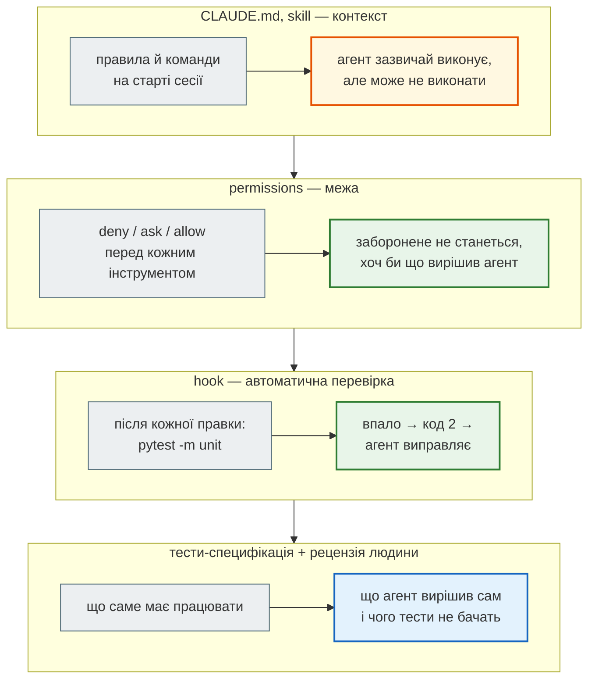
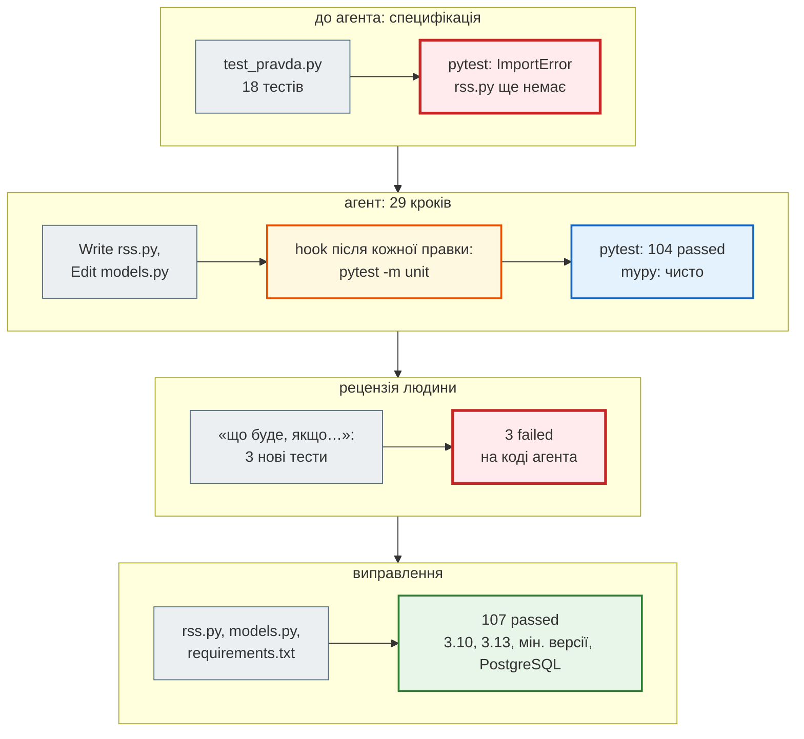
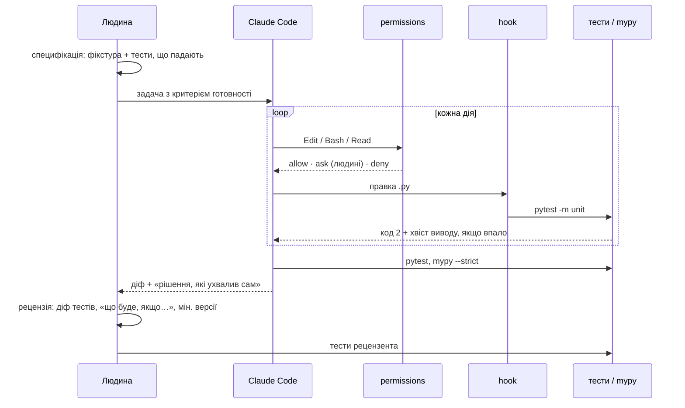

# Урок 42. AI-інструменти розробника: ризики й валідація

Урок 25 дав чекліст: код від AI приймаємо лише після перевірки. Урок 41 дав агрегатору `news_hub` 86 тестів. Сьогодні в проєкт приходить **AI-агент** — Claude Code, який сам редагує файли й запускає команди. Два питання уроку:

- як налаштувати проєкт, щоб агент працював за його правилами, а не за своїми здогадками;
- як перевірити те, що агент написав, — навіть коли всі його тести зелені.

Відповіді — на двох справжніх експериментах. Перший: Claude Code **двічі** додає в `news_hub` нове джерело новин — з голим запитом і з налаштованим проєктом та тестами-специфікацією; обидва результати перевіряємо. Другий: проєкт `depression_dashboard`, який AI згенерував у старому курсі, рецензуємо тестами — і знаходимо десять вад у застосунку, що «працював».

| Урок | Крок агрегатора |
|---|---|
| 36–39 | парсер і модель, FastAPI, база, Redis |
| 41 | тести: unit / integration, мок і фейк мережі, покриття |
| **42** | **Claude Code у проєкті: CLAUDE.md, дозволи, hook; друге джерело (RSS) — написане AI за тестами** |
| 43 | Gemini: підсумок, категорія, тональність |
| 47 | Telegram-бот |

Проєкти: [`news_hub`](https://github.com/NikoriakViktot/PY-Course-Victor-Nikoriak-22-09-2026/tree/main/module_4/lessons/lesson_42_ai_dev_tools/news_hub), [`depression_dashboard`](https://github.com/NikoriakViktot/PY-Course-Victor-Nikoriak-22-09-2026/tree/main/module_4/lessons/lesson_42_ai_dev_tools/depression_dashboard). Довідник: [Claude Code](ai/claude_code.md) — встановлення, CLAUDE.md, skills, MCP, hooks, дозволи.

**Що потрібно з попередніх уроків:** чекліст валідації AI-коду й тести властивостей (урок 25); тест конвеєра, мок і фейк, покриття, мінімальні версії (41); Pydantic (36); FastAPI, `Depends` (37).

**Після уроку ти зможеш:**

- налаштувати проєкт для AI-агента: `CLAUDE.md`, дозволи, hook, skill;
- ставити агентові задачу як специфікацію, яку можна перевірити;
- рецензувати результат агента: діф, тести, які він змінив, рішення, які він ухвалив сам;
- знаходити в «робочому» AI-коді вади, яких не видно на скриншоті.

**Ноутбук заняття:** [`note_lesson_42_ai_review.ipynb`](https://github.com/NikoriakViktot/PY-Course-Victor-Nikoriak-22-09-2026/blob/main/module_4/lessons/lesson_42_ai_dev_tools/note_lesson_42_ai_review.ipynb) [](https://colab.research.google.com/github/NikoriakViktot/PY-Course-Victor-Nikoriak-22-09-2026/blob/main/module_4/lessons/lesson_42_ai_dev_tools/note_lesson_42_ai_review.ipynb) — ключ AI не потрібен: вправи на справжньому результаті агента.

## Пригадай

1. Чому тест, що повторює формулу реалізації, нічого не перевіряє (урок 25)?
2. Тести парсера й тести моделі зелені — чому це ще не означає, що новини зберігаються (урок 41)?
3. Що перевіряє прогін тестів на мінімальних версіях залежностей?

??? success "Відповіді"

    1. Якщо формула хибна, очікуване значення хибне так само — тест проходить. Очікування беруть з вимог, а не з коду.
    2. Кожен перевіряв свою половину на своїх даних. Контракт між ними (формат часу) перевіряє лише тест конвеєра на спільній фікстурі.
    3. Що `requirements.txt` каже правду: проєкт працює з найстарішими версіями, які він дозволяє. В уроці 41 так знайшли падіння парсера з beautifulsoup4 4.12.

## Старт: що дає старий курс

| Звідки | Що там | Куди |
|---|---|---|
| `module_5/lesson_53_claude_code/CLAUDE_DOC.md` | довідник Claude Code (2025-05, 1153 рядки) | [довідник книги](ai/claude_code.md): звірено з документацією |
| той самий урок: `IDEA.md`, `ROADMAP.md`, `Prompts_Roadmap.md` + `depression_dashboard/` | промпти й проєкт Flask + Streamlit + scikit-learn, який AI за ними згенерував | `lesson_42_ai_dev_tools/depression_dashboard/` — кейс рецензії (рефакторинг 3) |
| `Data_Science_Course_SSWU/task_11/analysis_tonality_2.py` | розбір RSS «Української правди» через `feedparser` | нове джерело `news_hub` — його пише AI (рефакторинг 2) |
| урок 25 курсу | чекліст валідації AI-коду | розширюємо для агентів |

## Рефакторинг 1. Проєкт, у якому AI може працювати { #refactor-1 }

Агент бачить лише те, що є в репозиторії та в запиті. Він не знає, що в `news_hub` домени перевіряють без `endswith`, що тести не ходять у мережу, що `pytest -m unit` треба запускати після кожної зміни. Усе це треба **записати**.

### CLAUDE.md

Старий довідник мав приклад `CLAUDE.md` саме для нашого агрегатора — ще з тих часів, коли проєкт був `news_dashboard`:

```diff title="CLAUDE.md: приклад старого курсу → news_hub (урок 42)"
-# Проект: News Dashboard API
-## Технологічний стек
-- Python 3.12, FastAPI 0.115, MongoDB (motor 3.7)
-## Команди розробки
-- `docker compose up --build` — запустити всі сервіси
-- `pytest tests/ -v` — запустити тести
-## Структура проекту
-- `app/main.py` — FastAPI ендпоінти
-- `app/nlp.py` — NLP pipeline (pymorphy3 + spaCy)
-## Важливі правила
-- Завжди використовуй async/await для MongoDB (motor)
+# news_hub — новинний агрегатор курсу
+## Команди
+- `pytest -m unit` — швидкі тести без бази, Redis і мережі; запускати після кожної зміни
+- `mypy --strict news_hub` — типи; має бути чисто
+## Структура
+- `news_hub/parser.py` — HTML rbc.ua → `list[RawNews]` (лише рядки, без перевірок)
+- `news_hub/models.py` — `NewsItem`, `validate_news`, перевірка доменів
+## Правила
+- Будь-яке джерело новин повертає `list[RawNews]`; перевіряє лише `NewsItem`.
+- Домени — лише точний збіг або піддомен, ніколи `endswith(d)`.
+- Тести не ходять у мережу: нова розмітка → файл у `tests/fixtures/` + тест конвеєра.
+- Не змінюй наявні тести, щоб вони пройшли. Якщо тест здається хибним — зупинись і поясни.
+- Нових залежностей не додавай; якщо без неї ніяк — зупинись і поясни.
```

Старий приклад описує MongoDB, `app/nlp.py` і Streamlit — нічого з цього в `news_hub` немає. Застарілий `CLAUDE.md` гірший за відсутній: агент упевнено піде шукати `motor`. Новий файл містить **команди перевірки** і **правила, яких не видно з коду**: кожне з них — урок попередніх занять (`endswith` — урок 41, мережа в тестах — урок 41, «не змінюй тести» — урок 25). Повний файл — [`news_hub/CLAUDE.md`](https://github.com/NikoriakViktot/PY-Course-Victor-Nikoriak-22-09-2026/blob/main/module_4/lessons/lesson_42_ai_dev_tools/news_hub/CLAUDE.md).

### Дозволи, hook, skill

`CLAUDE.md` — **контекст**: агент зазвичай його виконує, але не гарантовано. Те, що мусить виконатися, живе в `.claude/settings.json`:

```json title="news_hub/.claude/settings.json"
{
  "permissions": {
    "allow": ["Bash(pytest *)", "Bash(python -m pytest *)", "Bash(mypy *)",
              "Bash(git diff *)", "Bash(git status *)"],
    "ask": ["Edit(./tests/**)"],
    "deny": ["Read(./.env)", "Read(./.env.*)", "Bash(pip install *)", "Bash(git push *)",
             "Bash(alembic downgrade *)", "WebFetch"]
  },
  "hooks": {
    "PostToolUse": [
      {"matcher": "Edit|Write",
       "hooks": [{"type": "command", "command": "python \"$CLAUDE_PROJECT_DIR/.claude/hooks/unit_tests.py\""}]}
    ]
  }
}
```

| Рядок | Навіщо |
|---|---|
| `allow: pytest, mypy` | агент сам перевіряє себе без запиту до людини |
| `ask: Edit(./tests/**)` | зміна тестів — лише з твого дозволу: «тести проходять, бо їх змінили» — найчастіший обман |
| `deny: Read(./.env)` | секрети не потрапляють у контекст, а отже й у код чи журнал |
| `deny: pip install` | жодних нових (або вигаданих) пакетів без людини |
| `deny: WebFetch` | чужі сторінки — джерело промпт-ін'єкцій |
| hook `PostToolUse` | після **кожної** правки `.py` — `pytest -m unit`; впав → код 2, агент бачить помилку й мусить виправити |

Hook — `.claude/hooks/unit_tests.py`, 20 рядків Python: читає з stdin JSON події, запускає тести, а при падінні пише хвіст виводу в stderr і завершується з кодом 2. Skill `/add-news-source` записує порядок роботи з новим джерелом (фікстура → тести, що падають → парсер → домени → перевірка). Обидва — у довіднику: [hooks](ai/claude_code.md#hooks), [skills](ai/claude_code.md#skills).



### Знахідка: `allow` з репозиторію не діє без довіри

Перший запуск агента в налаштованій папці закінчився несподівано: жодного разу не вдалося запустити `pytest` — «This command requires approval», хоча `Bash(pytest *)` стоїть в `allow`. Hook при цьому працював. Причина — у повідомленні Claude Code, яке видно в stderr запуску:

```text
Ignoring 5 permissions.allow entries from .claude/settings.json: this workspace has not been trusted.
Run Claude Code interactively here once and accept the trust dialog, …
```

Так і задумано: `allow`-правила з `.claude/settings.json` діють лише після того, як ти **довірив папку** (діалог при першому інтерактивному запуску). Інакше будь-який клонований репозиторій сам собі дозволив би команди. `deny` і `ask` діють одразу. `claude -p` діалог пропускає, тому в недовіреній папці «мовчки» ігнорує `allow` з файлу. Для чесного порівняння обидва експериментальні запуски нижче отримали однакові дозволи прапорцем `--allowedTools`. Поглиблено: [довідник, розділ 11](ai/claude_code.md#settings).

## Рефакторинг 2. Експеримент: одне завдання — два запити { #refactor-2 }

Задача: додати друге джерело — RSS «Української правди». Ідея — зі скрипта `task_11` курсу SSWU (`feedparser`). Сама стрічка з середовища, де писався урок, недоступна (мережева політика). Тому зразок — `tests/fixtures/pravda_rss.xml`, **навчальний знімок у форматі RSS 2.0** з вигаданими заголовками. У ньому навмисно є те, що буває в справжніх стрічках: `pubDate` з `+0300` і в GMT, `&quot;` у заголовку, `<p>` в описі, дубль, закороткий заголовок, новина з сестринського сайту `epravda.com.ua`.

Два запуски Claude Code в режимі `claude -p` на двох копіях проєкту зі станом уроку 41:

| | Запуск A | Запуск B |
|---|---|---|
| Запит | «Додай у news_hub нове джерело новин — Українська правда, RSS https://www.pravda.com.ua/rss/view_news/. Новини з нього мають зберігатися так само, як з rbc.ua.» | «Додай у news_hub джерело «Українська правда» (RSS). Специфікація — `tests/unit/test_pravda.py`, зразок стрічки — `tests/fixtures/pravda_rss.xml`. Зроби так, щоб проходили всі тести (pytest) і `mypy --strict news_hub`, не змінюючи тестів. Наприкінці коротко перелічи рішення, які ти ухвалив сам.» |
| У проєкті | стан уроку 41 | + `CLAUDE.md`, `.claude/` (hook), фікстура, 18 тестів-специфікація (падають: коду ще немає) |
| Дозволи | `--allowedTools "Bash(pytest *)" "Bash(python -m pytest *)" "Bash(mypy *)" "Bash(git diff *)" "Bash(git status *)"` — однакові |
| Кроків агента | 54 | 29 |
| Час | 9 хв | 5 хв |
| Вартість (з JSON запуску) | 1,54 $ | 0,75 $ |
| Змінено файлів | 10, з них 6 — наявні тести | 2 (`models.py`) + новий `rss.py`; тести не змінено |
| Звіт агента | «Test suite passes (101/101)» | «усі тести (pytest — 104 passed) і mypy --strict проходять» |

Обидва звіти правдиві: тести справді зелені. Питання в тому, **чиї** тести.

### Запуск A: зелений на власних тестах

Стрічка недоступна — агент спробував `curl` і `WebFetch`, отримав відмову, **вигадав** власний зразок RSS і написав тести на ньому. У його фікстурі — правдоподібні заголовки на кшталт «Зеленський підписав новий закон про бюджет», без позначки, що це вигадка, і лише час з `+0300`. Прогін коду A на нашій специфікаційній стрічці (якої агент не бачив):

```text
21:40:00 www.pravda.com.ua/news/2026/09/2 Уряд оновив правила вступу до університе
17:05:00 www.epravda.com.ua/news/2026/09/ НБУ залишив облікову ставку без змін
20:15:00 www.pravda.com.ua/news/2026/09/2 Синоптики: "Перші заморозки прийдуть у ж
valid [('pravda.com.ua', 'Суспільство', '21:40:00'), ('pravda.com.ua', 'Новини', '20:15:00')]
rejected [('www.epravda.com.ua/new', ['url: Value error, очікуємо новину з rbc.ua або pravda.com.ua', 'lang: Field required'])]
broken xml -> []
html error page -> []
```

| Знахідка | Чому тести агента її не бачили |
|---|---|
| `17:05` для `pubDate` у GMT — час Лондона, а не Києва (має бути `20:05`) | у його фікстурі всі дати з `+0300` |
| новину з `epravda.com.ua` відхилено | стрічки не бачив — не знав, що там бувають сестринські сайти |
| битий XML і HTML-сторінка помилки замість RSS → `[]`, без жодної помилки | **тест агента закріплює це як правильну поведінку**: `assert parse_pravda_rss("не xml") == []` |
| вигадані «новини» реального видання у фікстурі без позначки | — |
| `pravda.com.ua` дописано в список сторінок для `POST /api/scrape` і в стандартний збір | запит «зберігати так само» агент прочитав як «збирати так само» |
| змінено 6 файлів наявних тестів | — (нічого не послаблено, але рецензувати треба кожен рядок) |

### Запуск B: специфікація, яку не можна обійти

Специфікація — [`tests/unit/test_pravda.py`](https://github.com/NikoriakViktot/PY-Course-Victor-Nikoriak-22-09-2026/blob/main/module_4/lessons/lesson_42_ai_dev_tools/news_hub/tests/unit/test_pravda.py). Написано **до** коду, 18 тестів: порядок і дублікати, чисті поля, київський час для обох форматів `pubDate`, конвеєр «RSS → `validate_news`» з очікуваним `rejected`, межові домени (`fakepravda.com.ua`, `pravda.com.ua.evil.com`), `POST /api/scrape` лишається лише для rbc.ua, заборона мережі, битий XML → `ValueError`.

Агент B прочитав специфікацію, `CLAUDE.md`, наявні `parser.py` і `models.py`. Написав `rss.py` лише на стандартній бібліотеці (`xml.etree`, `email.utils`, `zoneinfo`) і додав `is_allowed_host` з правилом «точний збіг або піддомен». `is_rbc_host` лишив окремо — для `POST /api/scrape`. Наприкінці перелічив свої рішення: нових залежностей немає, битий XML → `ValueError`, `lang = "uk"` для доменів без `/ukr/` у шляху, категорія — з `<category>`.

```python
from pathlib import Path

from news_hub.models import validate_news
from news_hub.rss import parse_pravda_rss

feed = Path("tests/fixtures/pravda_rss.xml").read_text(encoding="utf-8")
valid, rejected = validate_news(parse_pravda_rss(feed))
for item in valid:
    print(item.source, item.lang, item.category, item.published_time, "|", item.title)
print("відхилено:", [(r.raw["title"], r.errors) for r in rejected])
```

```text
pravda.com.ua uk Суспільство 21:40:00 | Уряд оновив правила вступу до університетів
epravda.com.ua uk Економіка 20:05:00 | НБУ залишив облікову ставку без змін
pravda.com.ua uk Новини 20:15:00 | Синоптики: "Перші заморозки прийдуть у жовтні"
відхилено: [('Відео дня', ['title: String should have at least 10 characters'])]
```

### Рецензія запуску B: три випадки поза специфікацією

Зелена специфікація — не кінець роботи. Рецензія коду B, рядок за рядком, з питанням «що буде, якщо…»:

| Що буде, якщо… | Код агента | Має бути |
|---|---|---|
| у новини немає `<category>` | категорія з URL: `/news/2026/09/26/…` → **«2026»** (для rbc.ua розділ — другий сегмент шляху, для правди — перший) | «Новини» |
| у новини немає `<pubDate>` або він битий | `ValueError` — і **вся стрічка** губиться через одну новину | ця новина без часу, решта — як є |
| Windows без пакета `tzdata` | `ZoneInfoNotFoundError` під час `import news_hub.rss`: у Windows немає системної бази часових поясів | `tzdata` у `requirements.txt` |

Кожен випадок — тест у [`tests/unit/test_pravda_review.py`](https://github.com/NikoriakViktot/PY-Course-Victor-Nikoriak-22-09-2026/blob/main/module_4/lessons/lesson_42_ai_dev_tools/news_hub/tests/unit/test_pravda_review.py). На коді агента всі три падали:

```text
FAILED tests/unit/test_pravda_review.py::test_item_without_category_is_not_named_after_year
FAILED tests/unit/test_pravda_review.py::test_item_without_pub_date_does_not_break_feed
FAILED tests/unit/test_pravda_review.py::test_rss_module_imports_without_system_tz_database
3 failed, 18 passed in 0.34s
```

Правильний варіант — кілька рядків, позначених у коді «Рецензія»:

```diff title="news_hub/rss.py і models.py: код агента → після рецензії"
 def _kyiv_datetime(pub_date: str) -> str:
-    parsed = parsedate_to_datetime(pub_date)
+    try:
+        parsed = parsedate_to_datetime(pub_date)
+    except (TypeError, ValueError):
+        return ""                                   # новина без часу, а не втрачена стрічка
+    if parsed.tzinfo is None:
+        parsed = parsed.replace(tzinfo=timezone.utc)  # «-0000» — це UTC, а не час сервера
     return parsed.astimezone(KYIV).replace(tzinfo=None).isoformat()
 ...
-        if len(path) > 1:
-            derived["category"] = CATEGORIES.get(path[1], path[1].capitalize())
+        section = path[1] if is_rbc_host(parts.hostname) and len(path) > 1 else (path[0] if path else "")
+        if section:
+            derived["category"] = CATEGORIES.get(section, section.capitalize())
```

```text title="requirements.txt"
tzdata>=2024.1          # урок 42: ZoneInfo("Europe/Kyiv") у Windows (немає системної бази поясів)
```

Після рецензії:

```text
$ pytest -q -p no:cacheprovider
............................................................................................ [ 85%]
...............                                                                              [100%]
107 passed in 3.98s
$ mypy --strict news_hub
Success: no issues found in 13 source files
```

Ті самі 107 тестів проходять на Python 3.10 з мінімальними версіями залежностей і на PostgreSQL 16 + Redis 7 (`TEST_DATABASE_URL`, `TEST_REDIS_URL`).



### Що показав експеримент

- **Без специфікації агент пише тести під свій код.** Запуск A — 101 зелений тест, помилка з часовим поясом і тест, що закріплює «тиху» відмову. Тести, що їх агент написав сам, перевіряють його ж припущення.
- **Специфікація робить результат перевірним.** Запуск B — удвічі швидше, 2 файли замість 10, тести не змінено. Кожне рішення агента або перевірене тестом, або назване у звіті.
- **Специфікація не замінює рецензію.** Три вади B — саме там, де специфікація мовчала. Рецензент шукає не «чи проходять тести», а «що тести не питали».
- **Однаковий запит не дає однакового коду.** Інший запуск може помилитися інакше. Тому перевіряємо кожен результат, а не «модель загалом».

Поглиблено: [Best practices](https://code.claude.com/docs/en/best-practices), [Common workflows](https://code.claude.com/docs/en/common-workflows).

## Рефакторинг 3. Рецензія AI-проєкту тестами: `depression_dashboard` { #refactor-3 }

У старому курсі AI отримав рольові промпти («You are a Senior Python Architect and Data Scientist…», 12 етапів від EDA до Docker) і згенерував **Depression Analytics Platform**: Flask API, Streamlit-дашборд, RandomForest, KMeans, IsolationForest, 57-мегабайтний pickle моделі. Застосунок запускався, усі ендпоінти відповідали `200`, дашборд малював графіки. У промптах жодного разу не попрошено тестів чи критеріїв прийняття; про витік даних сказано одним рядком — і він у коді є.

!!! warning "Чутлива тема"
    Застосунок оцінює ризик депресії й питає про суїцидальні думки. У курсі це **кейс рецензії коду**, а не інструмент. Застосунок показує застереження й номер лінії підтримки. Модель на відкритому датасеті не є діагнозом.

Рецензія — тестами на синтетичних даних з колонками справжнього датасету (сам датасет у репозиторій не входить). Кожен тест — одна знахідка. На коді старого курсу:

```text
FAILED tests/test_review.py::test_feature_importance_keeps_descending_order
FAILED tests/test_review.py::test_correlations_keep_order_by_strength
FAILED tests/test_review.py::test_cluster_names_agree_with_profiles
FAILED tests/test_review.py::test_predict_accepts_raw_profile
FAILED tests/test_review.py::test_predict_rejects_bad_input[change0-age]
FAILED tests/test_review.py::test_predict_rejects_bad_input[change1-financial_stress]
FAILED tests/test_review.py::test_predict_rejects_bad_input[change2-sleep_duration]
FAILED tests/test_review.py::test_predict_rejects_bad_input[change3-Risk_Score]
FAILED tests/test_review.py::test_predict_rejects_bad_input[change4-CGPA]
FAILED tests/test_review.py::test_predict_missing_field_is_422_without_internals
FAILED tests/test_review.py::test_predict_list_body_is_422
FAILED tests/test_review.py::test_train_requires_admin_token
FAILED tests/test_review.py::test_train_disabled_without_configured_token
FAILED tests/test_review.py::test_imputer_fitted_on_train_split_only
FAILED tests/test_review.py::test_model_loaded_from_disk_once
FAILED tests/test_review.py::test_groups_does_not_change_cached_data
FAILED tests/test_review.py::test_unknown_sleep_values_give_valid_json
17 failed in 12.88s
```

У копії уроку:

```text
$ cd ../depression_dashboard && pytest -q -p no:cacheprovider -p no:logging
.................                                                                            [100%]
17 passed in 6.80s
```

### Вада, яку не видно на скриншоті: порядок ключів JSON

Сервіс повертав важливість ознак, відсортовану за спаданням, а дашборд брав перші 12. Але `jsonify` у Flask за замовчуванням **сортує ключі за алфавітом**:

```python
from flask import Flask, jsonify

importance = {"Suicidal_enc": 0.27, "Risk_Score": 0.14, "Academic Pressure": 0.11, "Age": 0.03}   # як віддає сервіс
app = Flask("demo")
with app.app_context():
    print("Flask за замовчуванням:", jsonify(importance).get_data(as_text=True).strip())
    app.json.sort_keys = False
    print("sort_keys = False:     ", jsonify(importance).get_data(as_text=True).strip())
```

```text
Flask за замовчуванням: {"Academic Pressure":0.11,"Age":0.03,"Risk_Score":0.14,"Suicidal_enc":0.27}
sort_keys = False:      {"Suicidal_enc":0.27,"Risk_Score":0.14,"Academic Pressure":0.11,"Age":0.03}
```

Графік «Top Feature Importances» показував перші 12 ознак **за абеткою**. Блок «Strongest positive predictors» — `Academic Pressure`, `Age`, `CGPA`. Жодної помилки, жодного попередження, гарний графік. Правильно — `sort_keys = False` у власному JSON-провайдері, а UI сортує сам, не покладаючись на порядок ключів.

### Усі знахідки

| # | Знахідка | Як доведено | Як правильно |
|---|---|---|---|
| 1 | «топ-ознаки» й «найсильніші предиктори» — за абеткою | тест порядку після `jsonify` | `StrictJSONProvider(sort_keys=False)`, сортування в UI |
| 2 | назви кластерів вшиті в UI: «Sleep Deprived» — кластер, що спить **найбільше** (8,15 год), «Financially Stressed» — кластер з 2 людей | центроїди моделі старого курсу; тест «назва відповідає профілю» | назву дає профіль кластера порівняно з середнім |
| 3 | `/api/predict` приймав похідні ознаки від клієнта: `Risk_Score=-100` змінював прогноз; `Age=-500` → `200`; пропущене поле → `500` з текстом pandas | тести з поганими даними | `StudentProfile` (Pydantic, `extra="forbid"`) → `422`; похідні ознаки — `add_features` на сервері, одна функція для навчання й прогнозу |
| 4 | повзунок CGPA ні на що не впливав: CGPA немає в ознаках моделі | прогноз з CGPA 0,1 і 10 однаковий | повзунок прибрано; невідоме поле → `422` |
| 5 | `POST /api/train` без захисту перезаписував модель | тест: без токена → `403` | `X-Admin-Token` = `ADMIN_TOKEN` (`hmac.compare_digest`); без змінної — вимкнено |
| 6 | витік даних: імпутер і скейлер навчались на всіх рядках до `train_test_split` | тест: медіани імпутера = медіани навчальної вибірки | `Pipeline`, навчений лише на навчальній частині; скейлер для лісу прибрано |
| 7 | pickle на 57 МБ читався з диска на кожен запит; перезапис на місці | тест: 3 прогнози — 0 читань з диска | кеш у пам'яті, атомарна заміна файлу, версія scikit-learn у файлі |
| 8 | `/api/groups` дописував колонку в кешований DataFrame | тест: після `/api/groups` у `/api/summary` є чужа колонка | `.copy()` |
| 9 | невідоме значення у стовпці → `NaN` у відповіді — невалідний JSON | тест зі строгим парсером JSON | `null`, `allow_nan=False` |
| 10 | папка `ui/pages/` — Streamlit автоматично додає 5 порожніх сторінок у меню | Streamlit AppTest | `ui/views/` |

А ще: пороги ризику в UI (0,3 / 0,5) не збігались з бекендом (0,5 / 0,75); `delta="vs overall"` — підпис без порівняння; `requirements.txt` з `==` під Python 3.11, без колес для 3.13. Streamlit-дашборд після змін пройдено через `streamlit.testing.AppTest` проти живого бекенду: 5 розділів, форма прогнозу, жодного винятку.

Жодна з десяти вад не падає з помилкою. Кожна дає **правдоподібну неправду**: відсортований не за тим графік, упевнену назву кластера, прогноз, що реагує на підроблене поле. Це головний ризик AI-коду.

## Архітектура: де людина, де агент, де перевірки { #architecture }



Агент працює всередині циклу «дія → перевірка», але **на вході** (що вважати готовим) і **на виході** (що тести не питали) стоїть людина. Жоден шар не замінює інший: `CLAUDE.md` агент може не виконати, `deny` не знає про логіку, тести не бачать того, про що їх не питали.

### Чекліст рецензії AI-коду (доповнення до уроку 25)

1. **Спершу специфікація** — тести й фікстура до коду. Запусти: вони мають впасти.
2. **Діф тестів окремо.** Чи змінено наявні тести? Чи не закріплює новий тест «тиху» помилку (`== []` на битих даних)?
3. **Дані агента — під підозрою.** Фікстури, яких ти не давав, — вигадані. Чи позначено це?
4. **«Рішення, які ухвалив сам»** — кожне перевір: чи не розширено доступ (домени, ендпоінти), чи не додано залежність.
5. **«Що буде, якщо…»** — порожнє, відсутнє, битий формат, інший часовий пояс, інша ОС.
6. **Мінімальні версії й інші платформи** — `requirements.txt` мусить казати правду.
7. **Нічого не пропадає мовчки** — кожна відмова видна: `rejected`, `422`, запис у журналі.

## Практика { #practice }

### Розібраний приклад: HTML-сторінка замість RSS

Сайт іноді віддає замість стрічки сторінку помилки чи капчі — з кодом 200. Що зробить `parse_pravda_rss`?

```python
from news_hub.rss import parse_pravda_rss

print(parse_pravda_rss("<html><body><h1>403 Forbidden</h1></body></html>"))
print(parse_pravda_rss("<rss><channel></channel></rss>"))
```

```text
[]
[]
```

Порожня стрічка й сторінка помилки дають однаковий результат — `[]`. Помилку ніхто не побачить: збір «успішний», новин 0. Правильна XML-сторінка — не обов'язково RSS. Специфікація й виправлення:

1. **Тест:** `parse_pravda_rss("<html>…</html>")` → `ValueError`; `<rss><channel></channel></rss>` → `[]` (порожня стрічка — легальний стан).
2. **Код:** після `ET.fromstring` перевірити корінь:

```python title="news_hub/rss.py (розв'язок)"
    if root.tag != "rss" or root.find("channel") is None:
        raise ValueError(f"очікуємо RSS (<rss><channel>), а отримали <{root.tag}>")
```

3. **Перевір, що тест ловить помилку:** прибери перевірку — тест має впасти.

### Зміни приклад

1. Додай до перевірки Atom-стрічки (`<feed xmlns="http://www.w3.org/2005/Atom">`): зараз їх теж відхилено б — чи це правильно для «Української правди»?
2. Додай у `CLAUDE.md` правило про такі випадки, щоб наступне джерело агент писав одразу з цією перевіркою.

### Спробуй самостійно: третє джерело через skill

Додай третє джерело RSS (наприклад, «Суспільне») за skill `/add-news-source`, з Claude Code або без нього:

- збережи зразок стрічки в `tests/fixtures/` (якщо стрічка недоступна — навчальний знімок з позначкою в коментарі, як `pravda_rss.xml`);
- спершу тести-специфікація: порядок, дублікати, час, конвеєр, межові домени; переконайся, що вони падають;
- якщо код пише агент — збережи його звіт «рішення, які ухвалив сам» і перевір кожне.

**Критерії перевірки:** `pytest` і `mypy --strict news_hub` чисті; жоден наявний тест не змінено; `POST /api/scrape` досі лише для rbc.ua; окремий тест рецензента на випадок, якого немає в специфікації.

### Знайди помилку { #find-bug }

Код і тест із запуску A — агент написав їх разом, тест зелений:

```python title="запуск A: parser.py і tests/unit/test_parser.py (фрагменти)"
def parse_pravda_rss(xml: str) -> list[RawNews]:
    """RSS-стрічка Української правди (`/rss/view_news/`) → список сирих новин у форматі RawNews."""
    try:
        root = ET.fromstring(xml)
    except ET.ParseError:
        return []
    ...


def test_pravda_rss_broken_xml_is_empty_list() -> None:
    assert parse_pravda_rss("не xml") == []
```

Тест проходить і покриває гілку `except` — покриття 100%. Що не так і з кодом, і з тестом?

??? success "Відповідь"

    Код ковтає помилку: зламана стрічка, обрізана відповідь, HTML замість XML — усе стає «порожньою стрічкою». У `scraper.py` це `PageResult(count=0, error=None)`: сторінка нібито завантажилась, новин просто немає. Сигналу, що джерело зламалось, не буде ніколи. Це «Errors should never pass silently» з Zen of Python навпаки.

    Тест це **закріплює**: агент написав його з тим самим припущенням, що й код, тож тест перевіряє реалізацію, а не вимогу. Урок 25 про це й попереджав: очікуване значення має братися з вимог. Специфікація запуску B вимагала `ValueError` — і агент B зробив саме так. Висока цифра покриття тут нічого не означає: рядок виконано, але правильність не перевірено.

## Підсумок

| Поняття | Що запам'ятати |
|---|---|
| AI-агент | сам редагує й запускає команди в циклі «дія → перевірка»; якість залежить від того, чим він може себе перевірити |
| `CLAUDE.md` | команди перевірки й правила, яких не видно з коду; контекст, а не гарантія; застарілий — шкодить |
| permissions | `deny` > `ask` > `allow`; `allow` з репозиторію — лише після довіри до папки |
| hook | перевірка, яку агент не може «забути»; код 2 — агент мусить виправити |
| специфікація | фікстура + тести до коду; «не змінюй тести»; «перелічи рішення, які ухвалив сам» |
| рецензія | діф тестів, дані агента, «що буде, якщо…», мінімальні версії й інші ОС |
| ризик AI-коду | не падіння, а правдоподібна неправда: зелені тести, гарний графік, неправильні дані |

### Самоперевірка

1. Чим `CLAUDE.md` відрізняється від `permissions.deny`? Наведи правило, яке має бути в `deny`, а не лише в `CLAUDE.md`.
2. Чому `allow` з `.claude/settings.json` не діяв у першому запуску, а `hook` — діяв?
3. Запуск A — 101 зелений тест. Чому це не доводить, що код правильний?
4. Що дала специфікація запуску B і чого вона не дала?
5. Чому `jsonify` зіпсував «топ-ознаки» без жодної помилки?
6. Що об'єднує всі десять вад `depression_dashboard`?

??? success "Відповіді"

    1. `CLAUDE.md` — контекст: агент зазвичай виконує, але може не виконати. `deny` — межа: дію не буде виконано. `Read(./.env)`, `Bash(git push *)` — у `deny`.
    2. `allow`-правила з файлу репозиторію діють лише після того, як людина довірила папку; `claude -p` діалог довіри пропускає. `deny`, `ask` і hooks діють без цього кроку.
    3. Тести написав той самий агент на вигаданих ним даних: вони перевіряють його припущення (лише `+0300`, `[]` на битих даних), а не вимоги.
    4. Дала: перевірний критерій готовності, 2 файли замість 10, незмінені тести, названі рішення. Не дала: випадків, про які специфікація мовчала, — їх знайшла рецензія.
    5. Flask за замовчуванням сортує ключі JSON за алфавітом; словник, відсортований за важливістю, приходив у клієнт за абеткою, а UI брав перші 12.
    6. Жодна не падає з помилкою: застосунок працює й показує правдоподібний, але неправильний результат.

### Що далі

- Ноутбук заняття: [`note_lesson_42_ai_review.ipynb`](https://github.com/NikoriakViktot/PY-Course-Victor-Nikoriak-22-09-2026/blob/main/module_4/lessons/lesson_42_ai_dev_tools/note_lesson_42_ai_review.ipynb) [](https://colab.research.google.com/github/NikoriakViktot/PY-Course-Victor-Nikoriak-22-09-2026/blob/main/module_4/lessons/lesson_42_ai_dev_tools/note_lesson_42_ai_review.ipynb).
- Урок 43 — LLM усередині агрегатора: Gemini дає підсумок і категорію новини. Відповідь моделі — теж «дані від AI»: її перевірятиме Pydantic, а виклик API мокатимемо за правилами уроку 41.

## Документація і джерела

- Код: [`news_hub`](https://github.com/NikoriakViktot/PY-Course-Victor-Nikoriak-22-09-2026/tree/main/module_4/lessons/lesson_42_ai_dev_tools/news_hub) — `rss.py` і зміни `models.py` написав Claude Code за специфікацією, правки рецензента позначено; ідея RSS-джерела — `task_11/analysis_tonality_2.py` з `Data_Science_Course_SSWU`. [`depression_dashboard`](https://github.com/NikoriakViktot/PY-Course-Victor-Nikoriak-22-09-2026/tree/main/module_4/lessons/lesson_42_ai_dev_tools/depression_dashboard) — з `module_5/lesson_53_claude_code/` старого курсу, разом з промптами (`prompts/`).
- [Довідник: Claude Code](ai/claude_code.md) — з `CLAUDE_DOC.md` старого курсу, звірений з документацією.
- Урок 25 — [валідація AI-коду](../m2/lesson_25.md); урок 41 — [тест конвеєра, мок і фейк, мінімальні версії](lesson_41.md).
- Claude Code: [Best practices](https://code.claude.com/docs/en/best-practices), [Memory (CLAUDE.md)](https://code.claude.com/docs/en/memory), [Permissions](https://code.claude.com/docs/en/permissions), [Hooks](https://code.claude.com/docs/en/hooks), [Headless (`-p`)](https://code.claude.com/docs/en/headless), [Security](https://code.claude.com/docs/en/security).
- Flask: [JSON provider, `sort_keys`](https://flask.palletsprojects.com/en/stable/api/#flask.json.provider.DefaultJSONProvider.sort_keys); scikit-learn: [Common pitfalls — data leakage](https://scikit-learn.org/stable/common_pitfalls.html#data-leakage); Python: [`zoneinfo` і пакет `tzdata`](https://docs.python.org/3/library/zoneinfo.html#data-sources); Streamlit: [AppTest](https://docs.streamlit.io/develop/api-reference/app-testing).
- OWASP: [Top 10 for LLM Applications](https://owasp.org/www-project-top-10-for-large-language-model-applications/) — промпт-ін'єкції, надмірні повноваження агента.
